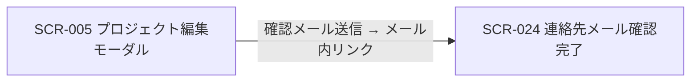

| 画面 ID | 画面名 | トレーサビリティID |
|----|----|----|
| SCR-024 | プロジェクト連絡先メール確認完了 | [TR-007](../../00_traceability/index.md#TR-007) |

| ステークホルダ           | 対象 |
|--------------------------|------|
| 対象ユーザー(トークン) | ◯    |

## 1. 画面概要

プロジェクト連絡先メールの確認リンクからトークン認証で到達する確認完了ページです。トークン検証成功時に連絡先メールアドレスの所有権を確定し、結果(完了 / 期限切れ / 既使用)を表示するのみで、入力フォームは持ちません。

> [!NOTE]
> **補足** 本画面は認証前(連絡先確認トークンによる本人確認)に表示されるため権限は不要です。到達者は連絡先メールアドレスの所有者であり、オーナーやメンバーである必要はなく、第三者(共有メールアドレス担当者など)でも構いません。アカウント作成は不要で、未認証画面のためサイドメニューには表示しません。確認リンクの有効期限は 24 時間です。

## 2. 画面遷移図

本画面への流入と本画面からの遷移を、画面 ID・画面名とイベント(操作)で示します。

## 3. 画面レイアウト

本画面の各状態(確認完了 / トークン期限切れ / 既使用)を示します。各状態は相互排他で、トークン検証の結果に応じていずれか 1 つを表示します。

## 4. 画面項目

本画面が各状態で表示する項目を定義します。`表示条件` は項目が表示される状態を示します。確認専用ページのため入力フォームはなく、操作は「閉じる」のみです。

| # | 項目 | 種類 | 必須 | 最大長 | 初期値 | 表示条件 |
|----|----|----|----|----|----|----|
| 1 | 確認完了メッセージ | alert | — | — | — | トークン検証成功時 |
| 2 | 閉じるボタン | button | — | — | — | トークン検証成功時 |
| 3 | トークン期限切れ / 無効メッセージ | alert | — | — | — | トークン期限切れ・無効時 |
| 4 | 既使用メッセージ | alert | — | — | — | トークン使用済み時 |

## 5. バリデーション

本画面は入力フォームを持たない確認専用ページです(本画面に入力検証はありません)。

## 6. イベント

本画面のイベント(初期表示・各操作)ごとに、対象の画面項目を定義します。各イベントの処理内容は [7. 画面イベント詳細](#7-画面イベント詳細) で定義します。

<table>
<colgroup>
<col style="width: 18%" />
<col style="width: 22%" />
<col style="width: 60%" />
</colgroup>
<thead>
<tr>
<th>EVT-ID</th>
<th>画面項目</th>
<th>イベント</th>
</tr>
</thead>
<tbody>
<tr>
<td>EVT-172</td>
<td>—</td>
<td>初期表示(トークン検証)</td>
</tr>
<tr>
<td>EVT-173</td>
<td>#2</td>
<td>「閉じる」を押下</td>
</tr>
</tbody>
</table>

## 7. 画面イベント詳細

各イベントの処理内容を定義します。

<table>
<colgroup>
<col style="width: 14%" />
<col style="width: 86%" />
</colgroup>
<thead>
<tr>
<th>EVT-ID</th>
<th>処理</th>
</tr>
</thead>
<tbody>
<tr>
<td>EVT-172</td>
<td>初期表示時に URL のトークンを取得し、<a href="../../02_backend/03_apis/API-009.md#API-009">プロジェクト連絡先メール確認</a> API(POST /auth/contact-verifications/{token})を呼び出して結果で分岐する:<pre>
 ┣ 成功(200): 確認完了メッセージ(#1)と閉じるボタン(#2)を表示する
 ┣ 期限切れ / 無効(410 TOKEN_EXPIRED): トークン期限切れ / 無効メッセージ(#3)を表示する
 ┗ 使用済み(410 TOKEN_USED): 既使用メッセージ(#4)を表示する
</pre>サーバ側では確認トークンの検証 → 連絡先メールの確認状態を「確認済み」に更新 → トークンの使用済み化 → 監査記録 を同一トランザクションで一括実行する</td>
</tr>
<tr>
<td>EVT-173</td>
<td>「閉じる」押下時にタブ / ウィンドウを閉じる。閉じる操作が無効な場合(直接 URL アクセス等)は完了メッセージ(#1)をそのまま表示し続け、認証コンソールへの遷移は行わない</td>
</tr>
</tbody>
</table>

## 8. エラーメッセージ

本画面はエラー・警告メッセージを表示しません。
