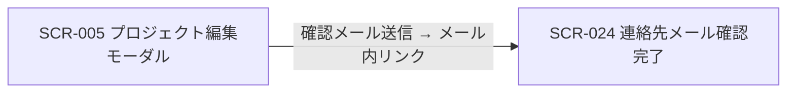
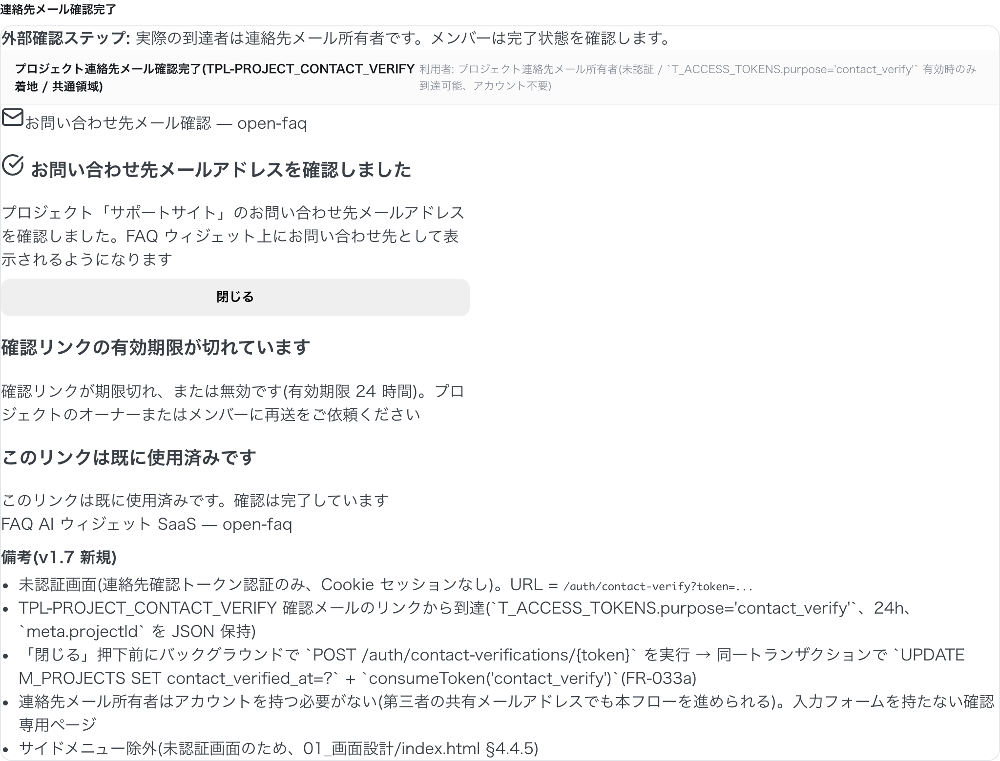

| 画面 ID | 画面名 | トレーサビリティID |
|----|----|----|
| SCR-024 | プロジェクト連絡先メール確認完了 | [TR-007](../../00_traceability/index.md#TR-007) |

| ステークホルダ           | 対象 |
|--------------------------|------|
| 対象ユーザー(トークン) | ◯    |

## 1. 画面概要

- プロジェクト連絡先メールの確認リンクからトークン認証で到達する確認完了ページである(確認リンクの有効期限は 24 時間)。
- トークン検証成功時に連絡先メールアドレスの所有権を確定し、結果を表示するのみで入力フォームは持たない。
- 認証前(連絡先確認トークンによる本人確認)に表示されるため権限は不要で、到達者は連絡先メールアドレスの所有者であればオーナー / メンバーや第三者(共有メールアドレス担当者など)でもよい。
- 主要な表示状態は確認完了 / トークン期限切れ・無効 / 既使用の 3 状態(相互排他)。

## 2. 画面遷移図

本画面への流入と本画面からの遷移を示す。

## 3. 画面レイアウト

本画面の代表状態(確認完了)を示す。

## 4. 画面項目

本画面が表示する項目を定義する。

| # | 項目 | 種類 | 必須 | 最大長 | 初期値 | 表示条件 |
|----|----|----|----|----|----|----|
| 1 | 確認完了メッセージ | alert | — | — | — | トークン検証成功時 |
| 2 | 閉じるボタン | button | — | — | — | トークン検証成功時 |
| 3 | トークン期限切れ / 無効メッセージ | alert | — | — | — | トークン期限切れ・無効時 |
| 4 | 既使用メッセージ | alert | — | — | — | トークン使用済み時 |

## 5. バリデーション

本画面は入力項目を持たないため入力検証はない。

## 6. イベント

本画面のイベントごとに対象の画面項目を示す。

<table>
<colgroup>
<col style="width: 18%" />
<col style="width: 22%" />
<col style="width: 60%" />
</colgroup>
<thead>
<tr>
<th>EVT-ID</th>
<th>画面項目</th>
<th>イベント</th>
</tr>
</thead>
<tbody>
<tr>
<td>EVT-01</td>
<td>—</td>
<td>初期表示(トークン検証)</td>
</tr>
<tr>
<td>EVT-02</td>
<td>#2</td>
<td>「閉じる」を押下</td>
</tr>
</tbody>
</table>

## 7. 画面イベント詳細

各イベントの処理内容を定義します。

<table>
<colgroup>
<col style="width: 14%" />
<col style="width: 86%" />
</colgroup>
<thead>
<tr>
<th>EVT-ID</th>
<th>処理</th>
</tr>
</thead>
<tbody>
<tr>
<td>EVT-01</td>
<td>初期表示時に確認トークンを検証し、連絡先メールアドレスの所有権を確定する(<a href="../../02_backend/03_apis/API-009.md#API-009">プロジェクト連絡先メール確認(API-009)</a>):<pre>
 ┣ 成功: 確認完了メッセージ(#1)と閉じるボタン(#2)を表示する
 ┣ 期限切れ / 無効: トークン期限切れ / 無効メッセージ(#3)を表示する
 ┗ 使用済み: 既使用メッセージ(#4)を表示する
</pre></td>
</tr>
<tr>
<td>EVT-02</td>
<td>「閉じる」押下時にタブ / ウィンドウを閉じる。閉じられない場合は確認完了メッセージ(#1)を表示し続ける</td>
</tr>
</tbody>
</table>

## 8. エラーメッセージ

本画面はエラー・警告メッセージを表示しません。
