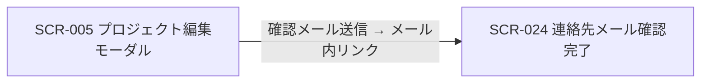

# SCR-024 プロジェクト連絡先メール確認完了

> **このページは、プロジェクト連絡先メールの確認リンク(トークン)から到達する確認完了ページ SCR-024 を定義します。** 画面概要 / 画面遷移図 / 画面レイアウト / 画面項目定義 / 入出力一覧 / 画面イベント一覧 の 6 セクションで記述します。

## 1. 画面概要

プロジェクト連絡先メールの確認リンクからトークン認証で到達する確認完了ページです。トークン検証成功時に連絡先メールアドレスの所有権を確定し、結果(完了 / 期限切れ / 既使用)を表示するのみで、入力フォームは持ちません。

| 画面 ID | 画面名 | 機能概要 |
|----|----|----|
| `SCR-024` | プロジェクト連絡先メール確認完了 | 連絡先メールの確認トークンを検証し、完了 / 期限切れ / 既使用の結果を表示する |

| 項目 | 内容 |
|----|----|
| トレーサビリティID | [TR-007](../../00_traceability/index.md#TR-007) |

| ステークホルダ         | 対象 |
|------------------------|------|
| 対象ユーザー(トークン) | ◯    |

> [!NOTE]
> **補足** 本画面は認証前(連絡先確認トークンによる本人確認)に表示されるため権限は不要です。到達者は連絡先メールアドレスの所有者であり、オーナーやメンバーである必要はなく、第三者(共有メールアドレス担当者など)でも構いません。アカウント作成は不要で、未認証画面のためサイドメニューには表示しません。確認リンクの有効期限は 24 時間です。

## 2. 画面遷移図

本画面への流入と本画面からの遷移を、画面 ID・画面名とイベント(操作)で示します。

## 3. 画面レイアウト

## 4. 画面項目定義

本画面の表示項目を定義します。項目の正本は本表です。確認専用ページのため入力フォームはなく、操作は「閉じる」のみです。

| 項目 ID | 項目 | 説明 | 種類 | 表示条件 | 表示 |
|----|----|----|----|----|----|
| `IT-01` | 確認完了画面 | 連絡先メール確認の完了をチェックマーク付きで表示する | 空状態表示 | トークン検証成功時に表示 | 「プロジェクト「{プロジェクト名}」のお問い合わせ先メールアドレスを確認しました。FAQ ウィジェット上にお問い合わせ先として表示されるようになります」 |
| `IT-02` | トークン期限切れ画面 | 確認リンクが期限切れ・無効の旨と再送依頼を表示する | 空状態表示 | 確認トークンが期限切れの場合に表示 | 「確認リンクが期限切れ、または無効です(有効期限 24 時間)。プロジェクトのオーナーまたはメンバーに再送をご依頼ください」 |
| `IT-03` | 既使用画面 | 確認が既に完了済みである旨を表示する | 空状態表示 | 確認トークンが使用済みの場合に表示 | 「このリンクは既に使用済みです。確認は完了しています」 |
| `IT-04` | 閉じる | 確認完了画面を閉じる | ボタン | トークン検証成功時(IT-01 表示時) | 「閉じる」 |

## 5. 入出力一覧

本画面が更新するテーブルと、呼び出す API の一覧です。テーブルの正本は [データベース設計](../../02_backend/04_database/index.md)、API の正本は [API設計](../../02_backend/03_apis/index.md) です。

<table>
<thead>
<tr>
<th rowspan="2">入出力名</th>
<th rowspan="2">説明</th>
<th rowspan="2">種別</th>
<th rowspan="2">I/O</th>
<th colspan="4">アクセス種別(CRUD)</th>
<th rowspan="2">備考</th>
</tr>
<tr>
<th>C</th>
<th>R</th>
<th>U</th>
<th>D</th>
</tr>
</thead>
<tbody>
<tr>
<td>プロジェクト</td>
<td>連絡先メール確認日時を設定する(<code>contact_verified_at</code>)</td>
<td>テーブル</td>
<td>出力</td>
<td>—</td>
<td>—</td>
<td>◯</td>
<td>—</td>
<td><code>M_PROJECTS</code>(<a href="../../02_backend/04_database/index.md#TBL-004">TBL-004</a>)</td>
</tr>
<tr>
<td>アクセストークン</td>
<td>確認トークンを検証・消費する(<code>purpose='contact_verify'</code>、<code>used_at</code> セット)</td>
<td>テーブル</td>
<td>入力 / 出力</td>
<td>—</td>
<td>◯</td>
<td>◯</td>
<td>—</td>
<td><code>T_ACCESS_TOKENS</code>(<a href="../../02_backend/04_database/index.md#TBL-014">TBL-014</a>)</td>
</tr>
<tr>
<td>連絡先メール確認</td>
<td>トークンを検証して連絡先メール確認日時をセットする</td>
<td>API</td>
<td>入力 / 出力</td>
<td>—</td>
<td>—</td>
<td>—</td>
<td>—</td>
<td><a href="../../02_backend/03_apis/API-009.md#API-009">プロジェクト連絡先メール確認</a>(API-009)</td>
</tr>
</tbody>
</table>

## 6. 画面イベント一覧

本画面のイベント(初期表示・各操作)ごとに、対象の項目 ID と処理内容を定義します。

<table>
<colgroup>
<col style="width: 10%" />
<col style="width: 12%" />
<col style="width: 12%" />
<col style="width: 30%" />
<col style="width: 46%" />
</colgroup>
<thead>
<tr>
<th>EVT-ID</th>
<th>イベント ID</th>
<th>項目 ID</th>
<th>イベント</th>
<th>処理</th>
</tr>
</thead>
<tbody>
<tr>
<td>EVT-194</td>
<td><code>EV-01</code></td>
<td>—</td>
<td>初期表示</td>
<td><ul>
<li>URL パスパラメータのトークンを取得し、<a href="../../02_backend/03_apis/API-009.md#API-009">プロジェクト連絡先メール確認</a> API (POST /auth/contact-verifications/{token}) を呼び出す</li>
<li>成功(200): <a href="#IT-01">IT-01</a> 確認完了画面を表示する</li>
<li>期限切れ / 無効(410): <a href="#IT-02">IT-02</a> トークン期限切れ画面を表示する</li>
<li>使用済み(409): <a href="#IT-03">IT-03</a> 既使用画面を表示する</li>
</ul></td>
</tr>
<tr>
<td>EVT-195</td>
<td><code>EV-02</code></td>
<td><a href="#IT-04">IT-04</a></td>
<td>「閉じる」を押下</td>
<td><ul>
<li>window.close() を実行してタブ / ウィンドウを閉じる</li>
<li>close() が無効な場合(直接 URL アクセス等)は静的な完了メッセージをそのまま表示し続ける(認証コンソールへの遷移は行わない)</li>
</ul></td>
</tr>
</tbody>
</table>

> [!IMPORTANT]
> **サーバ側処理** 確認操作は、確認トークンの検証 → 連絡先メールの確認状態を「確認済み」に更新 → トークンの使用済み化 → 監査記録 を一括(同一トランザクション)で行います。トークン検証の正本は [権限設計](../../04_permissions/index.md)、メールテンプレート・メッセージの正本は [メッセージ設計](../../06_messages/index.md)。
