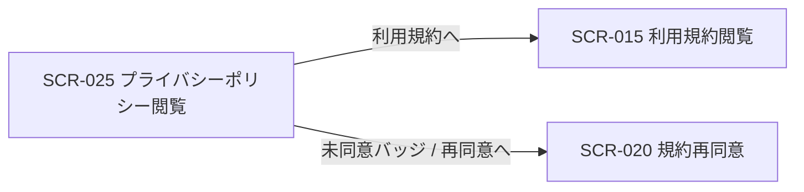
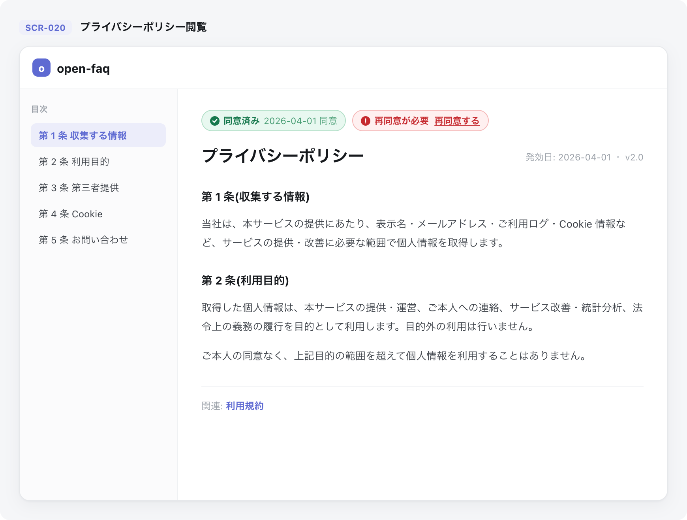

| 画面 ID | 画面名 | トレーサビリティID |
|----|----|----|
| SCR-025 | プライバシーポリシー閲覧 | [TR-011](../../00_traceability/index.md#TR-011) ・ [TR-012](../../00_traceability/index.md#TR-012) |

| ステークホルダ     | 対象 |
|--------------------|------|
| 全利用者(認証前可) | ◯    |

## 1. 画面概要

- プライバシーポリシーの最新版のみを 1 枚のページとして表示する閲覧専用画面である。
- 認証不要 URL を提供し認証前でも閲覧できる(権限は不要)。
- 上部に同意状態バッジ(ログイン済み時のみ)を置き、その下に全文を連続表示する。
- 利用規約は本画面に含めず利用規約閲覧(SCR-015)へ分離する。
- ウィジェット内には表示せず、ウィジェット利用者向けの画面図・導線には含めない。
- 主要な表示状態はログイン済み・同意済み / ログイン済み・未同意 / 未ログイン(バッジ非表示)。

## 2. 画面遷移図

本画面からの画面遷移を示す。

## 3. 画面レイアウト

本画面の代表状態(ログイン済み・同意状態バッジ表示)を示す。

## 4. 画面項目

本画面が表示する表示項目を定義する。

| # | 項目 | 種類 | 必須 | 最大長 | 初期値 | 表示条件 |
|----|----|----|----|----|----|----|
| 1 | 目次(章ナビ) | label | — | — | — | 常時 |
| 2 | 同意状態バッジ(同意済み) | label | — | — | — | ログイン済み・同意済み時 |
| 3 | 同意状態バッジ(再同意が必要) | label | — | — | — | ログイン済み・未同意時 |
| 4 | 再同意するリンク | link | — | — | — | ログイン済み・未同意時 |
| 5 | プライバシーポリシー本文(最新版全文) | label | — | — | — | 常時 |
| 6 | 利用規約リンク | link | — | — | — | 常時 |

データパターン(同意状態バッジが取る値のパターン)を定義する。

| 画面項目 | 表示名 | 補足 |
|----|----|----|
| #2 | 同意済み | 緑バッジ。同意日を併記。色のみに依存せずテキストラベルを併記 |
| #3 | 再同意が必要 | 赤バッジ。色のみに依存せずテキストラベルを併記 |

## 5. バリデーション

本画面は入力項目を持たないため入力検証はない。

## 6. イベント

本画面のイベントごとに対象の画面項目を示す。

<table>
<colgroup>
<col style="width: 18%" />
<col style="width: 22%" />
<col style="width: 60%" />
</colgroup>
<thead>
<tr>
<th>EVT-ID</th>
<th>画面項目</th>
<th>イベント</th>
</tr>
</thead>
<tbody>
<tr>
<td>EVT-01</td>
<td>—</td>
<td>初期表示</td>
</tr>
<tr>
<td>EVT-02</td>
<td>#4</td>
<td>「再同意する」を押下(未同意バッジのリンク)</td>
</tr>
<tr>
<td>EVT-03</td>
<td>#6</td>
<td>「利用規約」を押下</td>
</tr>
</tbody>
</table>

## 7. 画面イベント詳細

各イベントの処理内容を定義します。

<table>
<colgroup>
<col style="width: 14%" />
<col style="width: 86%" />
</colgroup>
<thead>
<tr>
<th>EVT-ID</th>
<th>処理</th>
</tr>
</thead>
<tbody>
<tr>
<td>EVT-01</td>
<td>初期表示時にプライバシーポリシー最新版の全文(#5)と目次(#1)を表示する(<a href="../../02_backend/03_apis/API-053.md#API-053">プライバシーポリシー 最新版取得(API-053)</a>):<pre>
┣ ログイン済み・同意済み: 同意済みバッジ(同意日付き、#2)を表示する
┣ ログイン済み・未同意: 再同意が必要バッジ(#3)と再同意するリンク(#4)を表示する
┗ 未ログイン: 同意状態バッジを表示しない
</pre></td>
</tr>
<tr>
<td>EVT-02</td>
<td>「再同意する」押下時に SCR-020 規約再同意へ遷移する</td>
</tr>
<tr>
<td>EVT-03</td>
<td>「利用規約」押下時に SCR-015 利用規約閲覧へ遷移する</td>
</tr>
</tbody>
</table>

## 8. エラーメッセージ

本画面はエラー・警告メッセージを表示しません。
