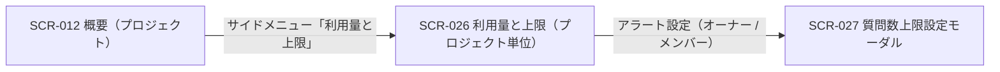
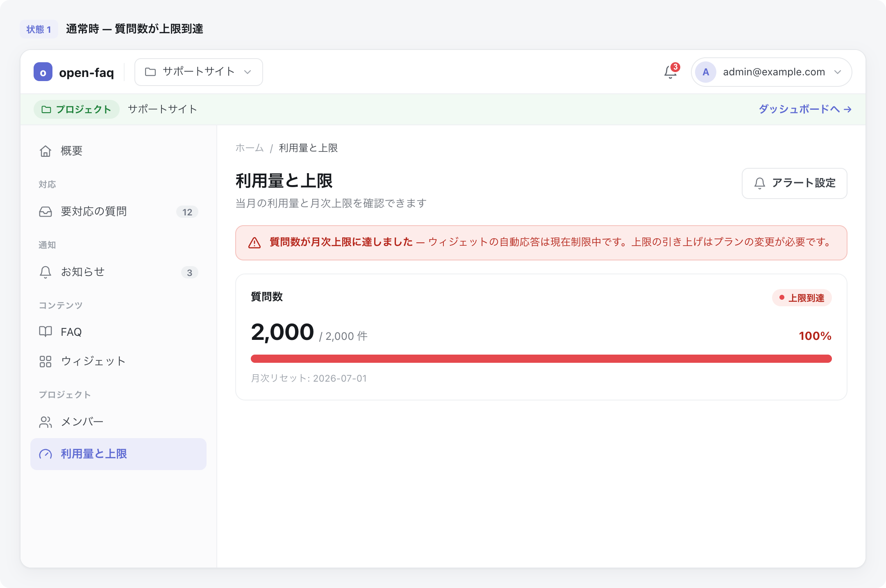

# SCR-026: 利用量と上限

| ID | 業務ユースケースID | API ID |
|----|----|----|
| SCR-026 | [UC-033](../../../01_requirements/04_business_usecases/UC-033.md#UC-033) | [API-041](../../02_backend/03_apis/API-041.md#API-041) ・ [API-046](../../02_backend/03_apis/API-046.md#API-046) |

| ステークホルダ | 対象 |
|----------------|------|
| オーナー       | ◯    |
| メンバー       | ◯    |

## 1. 画面概要

- 当該プロジェクトの質問数について、当月利用・今月の利用上限・消化率を確認する画面である。
- 表示範囲は常に当該プロジェクト 1 件で、無料利用枠・アラート状態・設定元・FAQ 件数は表示しない。
- オーナー / 当該プロジェクトのメンバーが、閲覧と「アラート設定」操作の双方を行える。
- 主要な表示状態は、上限 ON(消化率・状態バッジを表示)・上限 OFF・集計前 / 取得失敗の空状態である。

## 2. 画面遷移図

本画面からの画面遷移を、画面 ID・画面名とイベント(操作)で示します。

## 3. 画面レイアウト

本画面の代表状態(上限 ON・質問数が月次上限到達)を示します。

## 4. 画面項目

本画面が表示する表示・操作項目を定義します。

| # | 項目 | 種類 | 必須 | 最大長 | 初期値 | 表示条件 |
|----|----|----|----|----|----|----|
| 1 | 画面見出し(利用量と上限) | label | — | — | — | — |
| 2 | 集計対象期間・最終更新 | label | — | — | — | — |
| 3 | アラート設定ボタン | button | — | — | — | — |
| 4 | 上限到達警告バナー | alert | — | — | — | 上限 ON かつ消化率 100% 以上 |
| 5 | 質問数サマリー(当月利用 / 今月の利用上限) | label | — | — | — | — |
| 6 | 状態バッジ | label | — | — | — | 上限 ON 時 |
| 7 | 消化率(プログレスバー・N / M 件) | label | — | — | — | 上限 ON 時 |
| 8 | 月次リセット日 | label | — | — | — | 上限 ON 時 |
| 9 | 上限 OFF 説明 | label | — | — | — | 上限 OFF 時 |
| 10 | 空状態 | label | — | — | — | 集計前 / 取得失敗時 |

データパターン(選択肢・状態値など値のパターンを持つ項目)を定義する。

| 画面項目 | 表示名 | 補足 |
|----|----|----|
| #6 | 無バッジ(緑系) | 消化率 80% 未満 |
| #6 | 注意(黄) | 消化率 80% 以上 100% 未満 |
| #6 | 上限到達(赤) | 消化率 100% 以上 |

## 5. バリデーション

本画面は表示専用で、入力フォームを持たないため入力検証はありません。

## 6. イベント

本画面のイベント(初期表示・各操作)ごとに、対象の画面項目を定義します。各イベントの処理内容は [7. 画面イベント詳細](#7-画面イベント詳細) で定義します。

<table>
<colgroup>
<col style="width: 18%" />
<col style="width: 22%" />
<col style="width: 60%" />
</colgroup>
<thead>
<tr>
<th>EVT-ID</th>
<th>画面項目</th>
<th>イベント</th>
</tr>
</thead>
<tbody>
<tr>
<td>EVT-01</td>
<td>—</td>
<td>初期表示</td>
</tr>
<tr>
<td>EVT-02</td>
<td>#3</td>
<td>「アラート設定」を押下</td>
</tr>
</tbody>
</table>

## 7. 画面イベント詳細

各イベントの処理内容を定義します。

<table>
<colgroup>
<col style="width: 14%" />
<col style="width: 86%" />
</colgroup>
<thead>
<tr>
<th>EVT-ID</th>
<th>処理</th>
</tr>
</thead>
<tbody>
<tr>
<td>EVT-01</td>
<td>初期表示時に当該プロジェクトの当月利用量と月次上限を取得して表示する。取得結果で分岐する:<pre>
┣ 成功・上限 ON
┃  ┣ 質問数サマリー(#5)・状態バッジ(#6)・消化率(#7)・月次リセット日(#8)を表示する
┃  ┗ 消化率 100% 以上: 上限到達警告バナー(#4)を表示する
┣ 成功・上限 OFF: 上限 OFF 説明(#9)を表示する
┗ 集計前 / 取得失敗: 空状態(#10)を表示する
</pre>利用量は <a href="../../02_backend/03_apis/API-041.md#API-041">利用量サマリ(プロジェクト)(API-041)</a>・上限は <a href="../../02_backend/03_apis/API-046.md#API-046">プロジェクト上限・アラート取得(API-046)</a> による</td>
</tr>
<tr>
<td>EVT-02</td>
<td>「アラート設定」押下時に <a href="SCR-027.md">SCR-027 質問数上限設定モーダル</a>を開く</td>
</tr>
</tbody>
</table>

## 8. エラーメッセージ

本画面はエラー・警告メッセージを表示しません。
