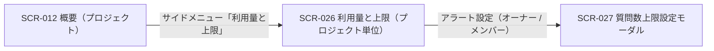

| 画面 ID | 画面名 | トレーサビリティID |
|----|----|----|
| SCR-026 | 利用量と上限(プロジェクト単位) | [TR-034](../../00_traceability/index.md#TR-034) ・ [TR-047](../../00_traceability/index.md#TR-047) |

| ステークホルダ | 対象 |
|----------------|------|
| オーナー       | ◯    |
| メンバー       | ◯    |

## 1. 画面概要

当該プロジェクトの質問数について、当月利用・今月の利用上限・消化率を簡潔に確認し、上限・アラート設定モーダル(SCR-027)へ着地する画面です。無料利用枠・アラート状態・設定元・FAQ 件数は表示しません。

> [!NOTE]
> **補足** 閲覧・変更とも、オーナー / 当該プロジェクトのメンバーが操作できます(「アラート設定」ボタンも表示します)。表示ルール(数値・期間・最終更新・色語彙・状態表現)は §1.5 ダッシュボード / KPI 共通表示ルールに従います。当該 PJ に割当のないユーザーの URL 直アクセスは 403 → ダッシュボードへリダイレクトします。

## 2. 画面遷移図

本画面からの画面遷移を、画面 ID・画面名とイベント(操作)で示します。

## 3. 画面レイアウト

本画面の代表状態(上限 ON・質問数が月次上限到達)を示します。上限 OFF・集計前・取得失敗の各状態は §4 の `表示条件` で定義します。

## 4. 画面項目

本画面が各状態で表示する表示・操作項目を定義します。`表示条件` は項目が表示される状態を示します。

| # | 項目 | 種類 | 必須 | 最大長 | 初期値 | 表示条件 |
|----|----|----|----|----|----|----|
| 1 | 画面見出し(利用量と上限) | div | — | — | — | — |
| 2 | 集計対象期間・最終更新 | div | — | — | — | — |
| 3 | アラート設定ボタン | button | — | — | — | — |
| 4 | 上限到達警告バナー | alert | — | — | — | 上限 ON かつ消化率 100% 以上 |
| 5 | 質問数サマリー(当月利用 / 今月の利用上限) | div | — | — | — | — |
| 6 | 状態バッジ | div | — | — | — | 上限 ON 時 |
| 7 | 消化率(プログレスバー・N / M 件) | div | — | — | — | 上限 ON 時 |
| 8 | 月次リセット日 | div | — | — | — | 上限 ON 時 |
| 9 | 上限 OFF 説明 | div | — | — | — | 上限 OFF 時 |
| 10 | 空状態 | div | — | — | — | 集計前 / 取得失敗時 |

- **#6 状態バッジの値(消化率→表示)**: 80% 未満=通常(無バッジ / 緑系)、80% 以上 100% 未満=注意(黄)、100% 以上=上限到達(赤)。
- **#5 質問数サマリーの計算式併記(上限 ON 時)**: 「{上限件数}件 - {無料枠件数}件(無料枠) = {課金対象件数}件 (¥{金額} / 月)」を併記する。OFF 時は値を「OFF」とし計算式を表示しない。

## 5. バリデーション

本画面は表示専用で、入力フォームを持ちません。(本画面に入力検証はありません)

## 6. イベント

本画面のイベント(初期表示・各操作)ごとに、対象の画面項目を定義します。各イベントの処理内容は [7. 画面イベント詳細](#7-画面イベント詳細) で定義します。

<table>
<colgroup>
<col style="width: 18%" />
<col style="width: 22%" />
<col style="width: 60%" />
</colgroup>
<thead>
<tr>
<th>EVT-ID</th>
<th>画面項目</th>
<th>イベント</th>
</tr>
</thead>
<tbody>
<tr>
<td>EVT-177</td>
<td>—</td>
<td>初期表示</td>
</tr>
<tr>
<td>EVT-178</td>
<td>#3</td>
<td>「アラート設定」を押下</td>
</tr>
<tr>
<td>EVT-179</td>
<td>—</td>
<td>URL へ直接アクセス(権限不足)</td>
</tr>
</tbody>
</table>

## 7. 画面イベント詳細

各イベントの処理内容を定義します。

<table>
<colgroup>
<col style="width: 14%" />
<col style="width: 86%" />
</colgroup>
<thead>
<tr>
<th>EVT-ID</th>
<th>処理</th>
</tr>
</thead>
<tbody>
<tr>
<td>EVT-177</td>
<td>初期表示時に当該プロジェクトの利用量・上限を取得して表示する:<pre>
1. <a href="../../02_backend/03_apis/API-041.md#API-041">利用量サマリ(プロジェクト)</a> API(GET /usage?period=current_month&amp;viewMode=project&amp;projectId={id})で当月利用を取得し #2・#5・#7 に表示する
2. <a href="../../02_backend/03_apis/API-046.md#API-046">プロジェクト上限・アラート取得</a> API(GET /projects/{id}/quota-limits)で月次上限設定を取得し #5 に反映する
3. 取得結果で分岐する
   ┣ 成功・上限 ON
   ┃  ┣ 質問数サマリー(#5・計算式併記)・状態バッジ(#6)・消化率プログレスバー(#7・N / M 件)・月次リセット日(#8)を表示する
   ┃  ┗ 消化率 100% 以上: 上限到達警告バナー(#4)を表示する
   ┣ 成功・上限 OFF: #5 の値を「OFF」とし、上限 OFF 説明(#9)のみ表示する(#4・#6・#7・#8 は非表示)
   ┗ 集計前 / 取得失敗: 空状態(#10)を表示する(集計前は「集計中です」、取得失敗は §1.5.3 のフォールバック表示)
</pre></td>
</tr>
<tr>
<td>EVT-178</td>
<td>「アラート設定」押下時に <a href="SCR-027.md">SCR-027 質問数上限設定モーダル</a>を開く</td>
</tr>
<tr>
<td>EVT-179</td>
<td>当該 PJ に割当のないユーザーが URL に直接アクセスした場合、403 を返しダッシュボードへリダイレクトする</td>
</tr>
</tbody>
</table>

## 8. エラーメッセージ

本画面はエラー・警告メッセージを表示しません。
