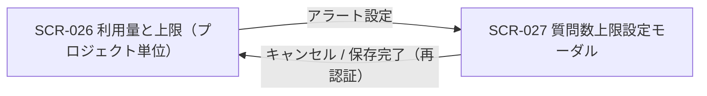

# SCR-027: 質問数上限設定(モーダル)

| ID | 業務ユースケースID | API ID |
|----|----|----|
| SCR-027 | [UC-034](../../../01_requirements/04_business_usecases/UC-034.md#UC-034) | [API-046](../../02_backend/03_apis/API-046.md#API-046) ・ [API-047](../../02_backend/03_apis/API-047.md#API-047) |

| ステークホルダ | 対象 |
|----------------|------|
| オーナー       | ◯    |
| メンバー       | ◯    |

## 1. 画面概要

- 当該プロジェクトの質問数の月次上限件数とアラート閾値を設定する、全画面割込みモーダルである。
- 操作できるのはオーナー / 当該プロジェクトのメンバーである。
- 保存時に再認証(パスワード再入力)を要求する(対象名タイプ確認は課さない)。
- 質問数の無料利用枠は独立項目として表示せず、課金計算式内のみで表示する。
- 主要な表示状態は、上限 ON(件数入力が可能・課金額を併記)・上限 OFF(件数入力とアラート設定が入力不可)・範囲外エラーである。

## 2. 画面遷移図

本モーダルの呼出元・遷移先を、画面 ID・画面名とイベント(操作)で示します。

## 3. 画面レイアウト

本モーダルの代表状態(上限 ON / 上限 OFF / 範囲外エラー)と保存時の再認証モーダルを示します。

## 4. 画面項目

本モーダルが表示する入出力項目を定義します。

| # | 項目 | 種類 | 必須 | 最大長 | 初期値 | 表示条件 |
|----|----|----|----|----|----|----|
| 1 | 上限設定(ON / OFF) | radio | ◯ | — | 現在値(未設定時 OFF) | — |
| 2 | 今月の利用上限(件数) | input(text) | ◯ | 動的(maxLimit依存) | 現在値 | 上限 ON 時に入力可能(OFF 時は入力不可) |
| 3 | 課金計算式の併記 | label | — | — | — | 上限 ON 時 |
| 4 | 件数エラー(範囲外) | alert | — | — | — | 件数が許容範囲外のとき |
| 5 | アラート設定(閾値) | checkbox | — | — | 現在値(未設定時 未チェック) | 上限 ON 時に入力可能(OFF 時は全未選択・入力不可) |
| 6 | アラート設定の説明文 | label | — | — | — | — |
| 7 | キャンセルボタン | button | — | — | — | — |
| 8 | 保存ボタン | button | — | — | — | — |
| 9 | 再認証 現パスワード | input(password) | ◯ | 128 | — | 再認証モーダル表示時 |
| 10 | 再認証 保存(確認)ボタン | button | — | — | — | 再認証モーダル表示時 |
| 11 | 再認証 キャンセルボタン | button | — | — | — | 再認証モーダル表示時 |

データパターン(選択肢・状態値など値のパターンを持つ項目)を定義する。

| 画面項目 | 表示名 | 補足 |
|----|----|----|
| #5 | 25% | 複数選択可 |
| #5 | 50% | 複数選択可 |
| #5 | 80% | 複数選択可 |
| #5 | 90% | 複数選択可 |
| #5 | 100% | 複数選択可。全未選択は通知なし |

## 5. バリデーション

本モーダルの入力項目に対する検証ルールを定義します。

| 画面項目 | タイミング | ルール | エラーコード |
|----|----|----|----|
| #2 | 入力時・保存時 | 未入力チェック(上限 ON 時) | EM-01 |
| #2 | 入力時・保存時 | 整数値チェック(1 件刻み) | EM-02 |
| #2 | 入力時・保存時 | 件数範囲チェック(API-046で取得した最小〜最大件数の範囲内) | EM-03 |
| #5 | 保存時 | アラート閾値値チェック(25 / 50 / 80 / 90 / 100 のみ・重複不可) | EM-04 |

## 6. イベント

本モーダルのイベント(初期表示・各操作)ごとに、対象の画面項目を定義します。

<table>
<colgroup>
<col style="width: 18%" />
<col style="width: 22%" />
<col style="width: 60%" />
</colgroup>
<thead>
<tr>
<th>EVT-ID</th>
<th>画面項目</th>
<th>イベント</th>
</tr>
</thead>
<tbody>
<tr>
<td>EVT-01</td>
<td>—</td>
<td>初期表示</td>
</tr>
<tr>
<td>EVT-02</td>
<td>#1</td>
<td>上限設定(ON / OFF)を切り替え</td>
</tr>
<tr>
<td>EVT-03</td>
<td>#2</td>
<td>「今月の利用上限」を入力</td>
</tr>
<tr>
<td>EVT-04</td>
<td>#5</td>
<td>アラート閾値をチェック / 解除</td>
</tr>
<tr>
<td>EVT-05</td>
<td>#8</td>
<td>「保存」を押下</td>
</tr>
<tr>
<td>EVT-06</td>
<td>#7</td>
<td>「キャンセル」を押下</td>
</tr>
</tbody>
</table>

## 7. 画面イベント詳細

各イベントの処理内容を定義します。

<table>
<colgroup>
<col style="width: 14%" />
<col style="width: 86%" />
</colgroup>
<thead>
<tr>
<th>EVT-ID</th>
<th>処理</th>
</tr>
</thead>
<tbody>
<tr>
<td>EVT-01</td>
<td>初期表示時に現在の上限設定(ON / OFF・件数・アラート閾値)および許容範囲(最小・最大件数)を <a href="../../02_backend/03_apis/API-046.md#API-046">プロジェクト上限・アラート取得(API-046)</a> で取得し、表示・保持する:<pre>
 ┣ 上限 ON: 今月の利用上限(#2)・アラート設定(#5)を入力可能とし、課金計算式(#3)を表示する。入力バリデーションには取得した最小・最大件数を用いる
 ┗ 上限 OFF: 今月の利用上限(#2)・アラート設定(#5)を入力不可とする
</pre></td>
</tr>
<tr>
<td>EVT-02</td>
<td>上限設定(#1)の ON / OFF を切り替える<pre>
 ┣ OFF へ切替: 今月の利用上限(#2)・アラート設定(#5)を入力不可とする(保存時は上限なし)
 ┗ ON へ切替: 今月の利用上限(#2)・アラート設定(#5)を入力可能とし、課金計算式(#3)を表示する
</pre></td>
</tr>
<tr>
<td>EVT-03</td>
<td>「今月の利用上限」(#2)入力時に §5 のバリデーションを評価する:<pre>
   ┣ 成功: 入力した上限件数に応じた課金対象件数・月額を課金計算式(#3)に表示する
   ┗ 失敗(範囲外・非整数): 件数エラー(#4)にエラー(EM-02 / EM-03)を表示し、保存(#8)できない状態とする
</pre></td>
</tr>
<tr>
<td>EVT-04</td>
<td>アラート閾値(#5)を選択 / 解除する(全未選択はアラート通知なし)</td>
</tr>
<tr>
<td>EVT-05</td>
<td>「保存」(#8)押下時に、入力に不備があればエラー(EM-01〜EM-04)を表示して中止し、不備がなければ再認証(パスワード再入力)を求めて上限・アラート設定を保存する:<pre>
   ┣ 成功: <a href="../../02_backend/03_apis/API-047.md#API-047">プロジェクト上限・アラート更新(API-047)</a> で保存し、完了を通知してモーダルを閉じ、利用量と上限(SCR-026)へ戻る
   ┣ 失敗(上限ONだが支払方法未登録): 支払方法登録が必要な旨のエラー(EM-06)を表示し保存を中断、支払方法登録(<a href="SCR-028.md#SCR-028">SCR-028</a>)へ誘導する
   ┗ 失敗(再認証失敗): エラー(EM-05)を表示し保存を中断する
</pre></td>
</tr>
<tr>
<td>EVT-06</td>
<td>「キャンセル」(#7)押下時に変更を破棄してモーダルを閉じ、利用量と上限(SCR-026)へ戻る(未保存の変更があるときは破棄の確認を経て閉じる)</td>
</tr>
</tbody>
</table>

## 8. エラーメッセージ

本モーダルが表示するエラー・警告メッセージを定義します。

| エラーコード | エラーメッセージ |
|----|----|
| EM-01 | 今月の利用上限を入力してください |
| EM-02 | 上限件数は整数で入力してください(1 件刻み) |
| EM-03 | 上限件数は許容範囲(最小〜最大件数)内で入力してください |
| EM-04 | アラート閾値が不正です。25 / 50 / 80 / 90 / 100 から選択してください |
| EM-05 | 再認証に失敗しました。パスワードを確認して再度お試しください |
| EM-06 | 利用上限を設定するには支払方法の登録が必要です。支払方法を登録してください |
