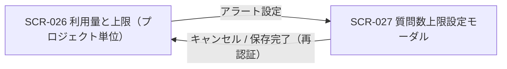
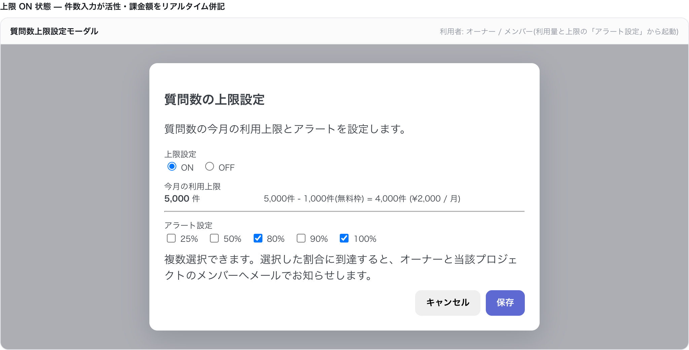
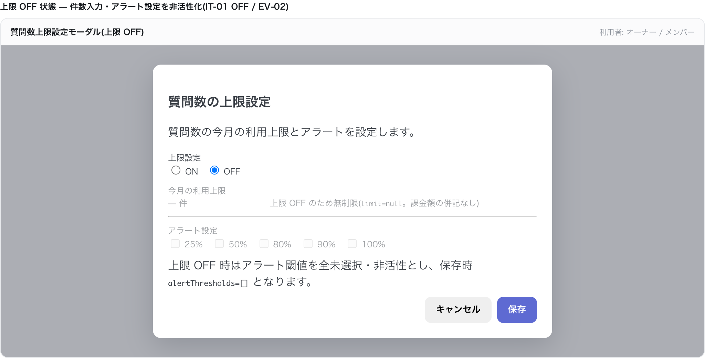
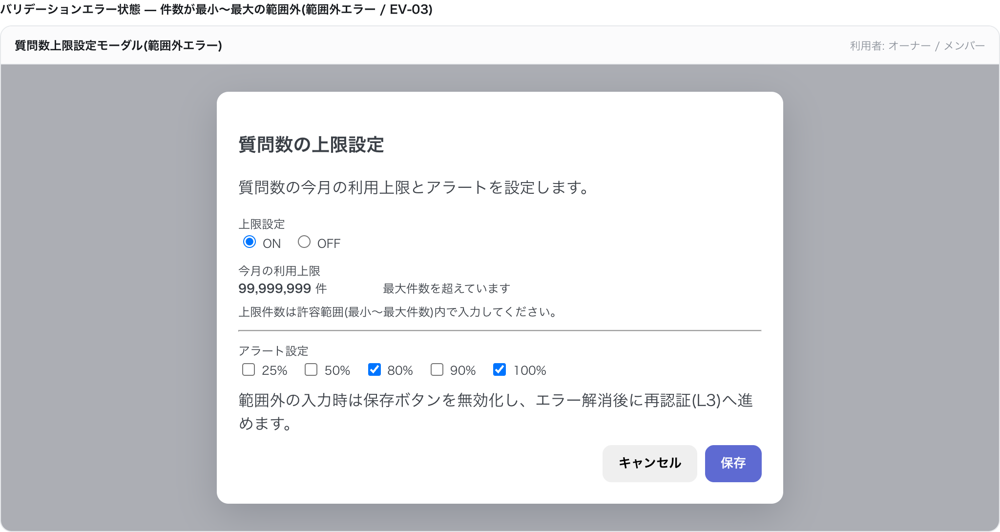

# SCR-027 質問数上限設定モーダル

> **このページは、SCR-026 から開く当該プロジェクトの質問数上限とアラート閾値を設定するモーダル SCR-027 を定義します。** 画面概要 / 画面遷移図 / 画面レイアウト / 画面項目定義 / 入出力一覧 / 画面イベント一覧 の 6 セクションで記述します。

## 1. 画面概要

SCR-026 の「アラート設定」から開く、当該プロジェクトの質問数の月次上限件数とアラート閾値を全画面割込みモーダルで設定する画面です。保存時に L3(再認証)を要求します。

| 画面 ID | 画面名 | 機能概要 |
|----|----|----|
| `SCR-027` | 質問数上限設定モーダル | 当該プロジェクトの質問数の月次上限件数・アラート閾値を全画面割込みモーダルで設定する |

| 関連     | 内容                                                             |
|----------|------------------------------------------------------------------|
| FR / BR  | FR-088, FR-089, FR-092, FR-094, FR-005(再認証) / BR-061, BR-062  |
| 関連画面 | [`SCR-026` 利用量と上限(プロジェクト単位)](SCR-026.md)(呼出元) |
| 対応業務UC | [UC-035](../../../01_requirements/04_business_usecases/UC-035.md#UC-035) |

| ステークホルダ | 対象 |
|----------------|------|
| オーナー       | ◯    |
| メンバー       | ◯    |

> [!IMPORTANT]
> **重要** 操作できるのはオーナー / 当該プロジェクトのメンバーです。保存は **L3 = 再認証(パスワード再入力。FR-005)** を要求します(プロジェクト削除のような対象名タイプ確認は課しません)。質問数の無料利用枠は本モーダルに独立項目として表示せず、計算式内のみで表示します。

## 2. 画面遷移図

本モーダルの呼出元・遷移先を、画面 ID・画面名とイベント(操作)で示します。

## 3. 画面レイアウト

## 4. 画面項目定義

本モーダルの上限設定・アラート設定・操作項目と各バリデーションを定義します。項目の正本は本表です。上限 OFF 時に無効化される項目は備考に明記します。

| 項目 ID | 項目 | 説明 | 種類 | 表示条件 | 表示 |
|----|----|----|----|----|----|
| `IT-01` | 上限設定 | 質問数の月次上限を ON / OFF で切り替える。OFF 時は IT-02 / IT-04 を無効化する | トグル | — | ON / OFF |
| `IT-02` | 今月の利用上限 | 月次上限件数を入力し、課金計算式をリアルタイム併記する。1 件刻み、上限 ON 時必須、最小〜最大件数の範囲内 | テキストボックス | 上限 ON 時のみ表示・活性 | 件数(件)、併記式「{上限件数}件 - {無料枠件数}件(無料枠) = {課金対象件数}件 (¥{金額} / 月)」 |
| `IT-03` | 設定適用の説明 | 未設定時にデフォルト推奨値が適用される旨を説明する。無料利用枠は本モーダルに表示せず更新対象にも含めない | ラベル | — | 未設定時はデフォルト推奨値が適用される旨の説明文 |
| `IT-04` | アラート設定 | 通知するアラート閾値(複数選択可)を選択する。当月初回到達時にメール送信、全未選択は通知なし | チェックボックス | 上限 OFF 時は全未選択・非活性 | 25% / 50% / 80% / 90% / 100% |
| `IT-05` | アラートメール送信(動作) | 選択閾値到達時にオーナーと当該 PJ の有効なメンバーへアラートメールを送信する。正規化メールで重複排除(オーナーが両方に出るため)。送信先の表示・編集項目は設けない | システム動作(UI なし) | — | — |
| `IT-06` | キャンセル | 変更を破棄してモーダルを閉じる | ボタン | — | キャンセル |
| `IT-07` | 保存 | 再認証(パスワード再入力)後に上限・アラート設定を保存する | ボタン | — | 保存 |

> [!WARNING]
> **注意** バリデーション(エラーメッセージの正本は [メッセージ設計](../../06_messages/index.md)): 上限件数は上限 ON 時のみ必須・1 件刻み・最小〜最大件数の範囲内、OFF 時は上限なし。アラート閾値は `25` / `50` / `80` / `90` / `100` から選び、重複値・許可値以外は受け付けない(上限 OFF 時はアラートなし)。課金対象件数・最大課金額はサーバ側で算出して表示します。保存は再認証(パスワード再入力)成功が前提で、失敗時は保存を中断します。

## 5. 入出力一覧

本モーダルが読み書きするテーブルと、呼び出す API の一覧です。テーブルの正本は [データベース設計](../../02_backend/04_database/index.md)、API の正本は [API設計](../../02_backend/03_apis/API-047.md#API-047) です。

<table>
<thead>
<tr>
<th rowspan="2">入出力名</th>
<th rowspan="2">説明</th>
<th rowspan="2">種別</th>
<th rowspan="2">I/O</th>
<th colspan="4">アクセス種別(CRUD)</th>
<th rowspan="2">備考</th>
</tr>
<tr>
<th>C</th>
<th>R</th>
<th>U</th>
<th>D</th>
</tr>
</thead>
<tbody>
<tr>
<td>プロジェクト上限</td>
<td>現値をロードし、月次上限件数 / アラート閾値を更新する</td>
<td>テーブル</td>
<td>入力 / 出力</td>
<td>—</td>
<td>◯</td>
<td>◯</td>
<td>—</td>
<td><code>M_PRJ_QUOTA_LIMITS</code>(<a href="../../02_backend/04_database/index.md#TBL-009">テーブル設計 3.24</a>)</td>
</tr>
<tr>
<td>上限取得</td>
<td>モーダル起動時に現在の上限設定を取得する</td>
<td>API</td>
<td>入力</td>
<td>—</td>
<td>—</td>
<td>—</td>
<td>—</td>
<td><code>GET /projects/{id}/quota-limits</code>(<a href="../../02_backend/03_apis/API-046.md#API-046">API 設計 5.7.5</a>)</td>
</tr>
<tr>
<td>上限更新</td>
<td>上限件数・アラート閾値を保存する(再認証必須)</td>
<td>API</td>
<td>入力 / 出力</td>
<td>—</td>
<td>—</td>
<td>—</td>
<td>—</td>
<td><code>PATCH /projects/{id}/quota-limits/questions</code>(<a href="../../02_backend/03_apis/API-047.md#API-047">API 設計 5.7.6</a>)</td>
</tr>
</tbody>
</table>

## 6. 画面イベント一覧

本モーダルのイベント(初期表示・各操作)ごとに、対象の項目 ID と処理内容を定義します。

<table>
<colgroup>
<col style="width: 10%" />
<col style="width: 12%" />
<col style="width: 12%" />
<col style="width: 30%" />
<col style="width: 46%" />
</colgroup>
<thead>
<tr>
<th>EVT-ID</th>
<th>イベント ID</th>
<th>項目 ID</th>
<th>イベント</th>
<th>処理</th>
</tr>
</thead>
<tbody>
<tr>
<td>EVT-202</td>
<td><code>EV-01</code></td>
<td>—</td>
<td>初期表示</td>
<td><a href="../../02_backend/03_apis/API-046.md#API-046">プロジェクト上限・アラート取得</a> API で現在の上限 ON/OFF・件数・アラート閾値を取得し、各項目の初期値・活性状態を設定して表示する</td>
</tr>
<tr>
<td>EVT-203</td>
<td><code>EV-02</code></td>
<td><a href="#IT-01">IT-01</a></td>
<td>上限設定トグルを切り替え</td>
<td><ul>
<li>OFF に切り替え: IT-02(件数入力)・IT-04(アラート設定)を非活性化し、全アラート閾値を未選択状態にする</li>
<li>ON に切り替え: IT-02・IT-04 を活性化し、課金計算式を再描画する</li>
</ul></td>
</tr>
<tr>
<td>EVT-204</td>
<td><code>EV-03</code></td>
<td><a href="#IT-02">IT-02</a></td>
<td>「今月の利用上限」を入力</td>
<td><ul>
<li>成功: 入力値をもとに課金対象件数・最大課金額をリアルタイムで計算し計算式に反映する</li>
<li>失敗(範囲外・非整数): 入力欄にエラーを表示し保存ボタンを無効化する</li>
</ul></td>
</tr>
<tr>
<td>EVT-205</td>
<td><code>EV-04</code></td>
<td><a href="#IT-04">IT-04</a></td>
<td>アラート閾値をチェック</td>
<td><ul>
<li>選択: 対象の閾値(25% / 50% / 80% / 90% / 100% のいずれか)にチェックを入れる</li>
<li>解除: 対象の閾値のチェックを外す(全未選択はアラート通知なし)</li>
</ul></td>
</tr>
<tr>
<td>EVT-206</td>
<td><code>EV-05</code></td>
<td><a href="#IT-07">IT-07</a></td>
<td>「保存」を押下</td>
<td><ul>
<li>バリデーション失敗: エラーを表示し処理を中断する</li>
<li>バリデーション成功: L3 再認証(パスワード再入力)を要求する</li>
<li>再認証成功: <a href="../../02_backend/03_apis/API-047.md#API-047">プロジェクト上限・アラート更新</a> API を呼び出し、成功時は TOAST を表示してモーダルを閉じる</li>
<li>再認証失敗: エラーを表示し保存を中断する(E-AUTH-REAUTH-FAILED)</li>
</ul></td>
</tr>
<tr>
<td>EVT-207</td>
<td><code>EV-06</code></td>
<td><a href="#IT-06">IT-06</a></td>
<td>「キャンセル」を押下</td>
<td><ul>
<li>未保存変更なし: 変更を破棄してモーダルを閉じ、SCR-026 へ戻る</li>
<li>未保存変更あり: UnsavedChangesGuard で確認を促し、破棄確定でモーダルを閉じる</li>
</ul></td>
</tr>
</tbody>
</table>
