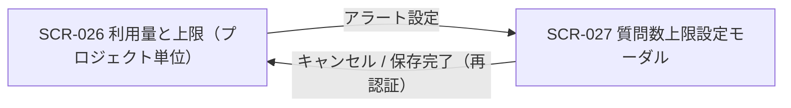

| 画面 ID | 画面名 | トレーサビリティID |
|----|----|----|
| SCR-027 | 質問数上限設定モーダル | [TR-035](../../00_traceability/index.md#TR-035) |

| ステークホルダ | 対象 |
|----------------|------|
| オーナー       | ◯    |
| メンバー       | ◯    |

## 1. 画面概要

SCR-026「利用量と上限(プロジェクト単位)」の「アラート設定」から開く、当該プロジェクトの質問数の月次上限件数とアラート閾値を全画面割込みモーダルで設定する画面です。保存時に再認証(パスワード再入力)を要求します。

> [!IMPORTANT]
> **補足** 操作できるのはオーナー / 当該プロジェクトのメンバーです。保存は再認証(パスワード再入力)を要求します(プロジェクト削除のような対象名タイプ確認は課しません)。質問数の無料利用枠は本モーダルに独立項目として表示せず、課金計算式内のみで表示します。

## 2. 画面遷移図

本モーダルの呼出元・遷移先を、画面 ID・画面名とイベント(操作)で示します。

## 3. 画面レイアウト

本モーダルの代表状態を示します。上限 ON(件数入力が活性・課金額をリアルタイム併記)・上限 OFF(件数入力とアラート設定を非活性)・範囲外エラー(件数が許容範囲外)の各状態を §4 の `表示条件`、§5 のバリデーションで定義します。保存時の再認証モーダルを下図に示します。

## 4. 画面項目

本モーダルが各状態で表示する入出力項目を定義します。`表示条件` は項目が表示・活性となる状態を示します。

| # | 項目 | 種類 | 必須 | 最大長 | 初期値 | 表示条件 |
|----|----|----|----|----|----|----|
| 1 | 上限設定(ON / OFF) | radio | ◯ | — | 現在値(未設定時 OFF) | — |
| 2 | 今月の利用上限(件数) | input(text) | ◯ | 9 | 現在値 | 上限 ON 時に活性(OFF 時は非活性) |
| 3 | 課金計算式の併記 | div | — | — | — | 上限 ON 時 |
| 4 | 件数エラー(範囲外) | alert | — | — | — | 件数が許容範囲外のとき |
| 5 | アラート設定(閾値) | checkbox | — | — | 現在値(未設定時 未チェック) | 上限 ON 時に活性(OFF 時は全未選択・非活性) |
| 6 | アラート設定の説明文 | label | — | — | — | — |
| 7 | キャンセルボタン | button | — | — | — | — |
| 8 | 保存ボタン | button | — | — | — | — |
| 9 | 再認証 現パスワード | input(password) | ◯ | 128 | — | 再認証モーダル表示時 |
| 10 | 再認証 保存(確認)ボタン | button | — | — | — | 再認証モーダル表示時 |
| 11 | 再認証 キャンセルボタン | button | — | — | — | 再認証モーダル表示時 |

- **#5 アラート設定の選択肢(コード値=表示名)**: `25`=25% ・ `50`=50% ・ `80`=80% ・ `90`=90% ・ `100`=100%(複数選択可。全未選択は通知なし)。

## 5. バリデーション

本モーダルの入力項目に対する検証ルールを定義します。違反がある場合は保存を中止し、保存ボタンを無効化します。課金対象件数・最大課金額はサーバ側で算出して併記します。

| 画面項目 | タイミング | ルール | エラーコード |
|----|----|----|----|
| #2 | 入力時・保存時 | 未入力チェック(上限 ON 時) | EM-01 |
| #2 | 入力時・保存時 | 整数値チェック(1 件刻み) | EM-02 |
| #2 | 入力時・保存時 | 件数範囲チェック(最小〜最大件数) | EM-03 |
| #5 | 保存時 | アラート閾値値チェック(25 / 50 / 80 / 90 / 100 のみ・重複不可) | EM-04 |

## 6. イベント

本モーダルのイベント(初期表示・各操作)ごとに、対象の画面項目を定義します。各イベントの処理内容は [7. 画面イベント詳細](#7-画面イベント詳細) で定義します。

<table>
<colgroup>
<col style="width: 18%" />
<col style="width: 22%" />
<col style="width: 60%" />
</colgroup>
<thead>
<tr>
<th>EVT-ID</th>
<th>画面項目</th>
<th>イベント</th>
</tr>
</thead>
<tbody>
<tr>
<td>EVT-179</td>
<td>—</td>
<td>初期表示</td>
</tr>
<tr>
<td>EVT-180</td>
<td>#1</td>
<td>上限設定(ON / OFF)を切り替え</td>
</tr>
<tr>
<td>EVT-181</td>
<td>#2</td>
<td>「今月の利用上限」を入力</td>
</tr>
<tr>
<td>EVT-182</td>
<td>#5</td>
<td>アラート閾値をチェック / 解除</td>
</tr>
<tr>
<td>EVT-183</td>
<td>#8</td>
<td>「保存」を押下</td>
</tr>
<tr>
<td>EVT-184</td>
<td>#7</td>
<td>「キャンセル」を押下</td>
</tr>
</tbody>
</table>

## 7. 画面イベント詳細

各イベントの処理内容を定義します。

<table>
<colgroup>
<col style="width: 14%" />
<col style="width: 86%" />
</colgroup>
<thead>
<tr>
<th>EVT-ID</th>
<th>処理</th>
</tr>
</thead>
<tbody>
<tr>
<td>EVT-179</td>
<td>初期表示時に <a href="../../02_backend/03_apis/API-046.md#API-046">プロジェクト上限・アラート取得</a> API で現在の上限 ON/OFF・件数・アラート閾値を取得し、各項目の初期値・活性状態を設定して表示する<pre>
 ┣ 上限 ON: 今月の利用上限(#2)・アラート設定(#5)を活性化し、課金計算式(#3)を描画する
 ┗ 上限 OFF: 今月の利用上限(#2)・アラート設定(#5)を非活性化し、アラート閾値を全未選択にする
</pre></td>
</tr>
<tr>
<td>EVT-180</td>
<td>上限設定(#1)の ON / OFF を切り替える<pre>
 ┣ OFF へ切替: 今月の利用上限(#2)・アラート設定(#5)を非活性化し、全アラート閾値を未選択にする(保存時は上限なし)
 ┗ ON へ切替: 今月の利用上限(#2)・アラート設定(#5)を活性化し、課金計算式(#3)を再描画する
</pre></td>
</tr>
<tr>
<td>EVT-181</td>
<td>「今月の利用上限」(#2)入力時に次を行う:<pre>
1. §5 のバリデーション(整数値・件数範囲)を評価する
2. 結果で分岐する
   ┣ 成功: 入力値をもとに課金対象件数・最大課金額をサーバ側で算出し、課金計算式(#3)「{上限件数}件 - {無料枠件数}件(無料枠) = {課金対象件数}件 (¥{金額} / 月)」へ反映する
   ┗ 失敗(範囲外・非整数): 件数エラー(#4)にエラー(EM-02 / EM-03)を表示し、保存ボタン(#8)を無効化する
</pre></td>
</tr>
<tr>
<td>EVT-182</td>
<td>アラート閾値(#5)のチェック / 解除を行う<pre>
 ┣ 選択: 対象の閾値(25 / 50 / 80 / 90 / 100 のいずれか)にチェックを入れる
 ┗ 解除: 対象の閾値のチェックを外す(全未選択はアラート通知なし)
</pre></td>
</tr>
<tr>
<td>EVT-183</td>
<td>「保存」(#8)押下時に次を行う:<pre>
1. §5 のバリデーションを評価し、違反時はエラー(EM-01〜EM-04)を表示して中止する
2. 再認証(パスワード再入力)を要求する
3. 再認証の結果で分岐する
   ┣ 成功: <a href="../../02_backend/03_apis/API-047.md#API-047">プロジェクト上限・アラート更新</a> API を呼び出し、成功時は TOAST を表示してモーダルを閉じ、SCR-026 へ戻る
   ┗ 失敗: エラー(EM-05)を表示し保存を中断する
</pre></td>
</tr>
<tr>
<td>EVT-184</td>
<td>「キャンセル」(#7)押下時に変更を破棄してモーダルを閉じ、SCR-026 へ戻る<pre>
 ┣ 未保存変更なし: そのままモーダルを閉じる
 ┗ 未保存変更あり: 変更破棄の確認を促し、破棄確定でモーダルを閉じる
</pre></td>
</tr>
</tbody>
</table>

## 8. エラーメッセージ

本モーダルが表示するエラー・警告メッセージを定義します。

| エラーコード | エラーメッセージ |
|----|----|
| EM-01 | 今月の利用上限を入力してください |
| EM-02 | 上限件数は整数で入力してください(1 件刻み) |
| EM-03 | 上限件数は許容範囲(最小〜最大件数)内で入力してください |
| EM-04 | アラート閾値が不正です。25 / 50 / 80 / 90 / 100 から選択してください |
| EM-05 | 再認証に失敗しました。パスワードを確認して再度お試しください |
