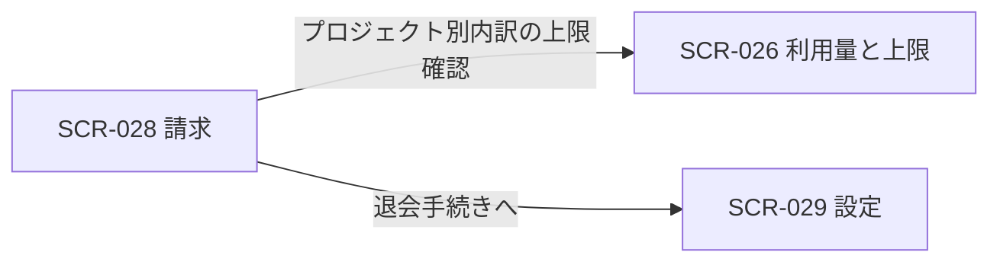

# SCR-028: 請求管理

| ID | 画面名 |
|----|----|
| SCR-028 | 請求管理 |

| 関連項目 | 内容 |
|----|----| 
| 業務ユースケース | [UC-036](../../../01_requirements/04_business_usecases/UC-036.md#UC-036) / [UC-037](../../../01_requirements/04_business_usecases/UC-037.md#UC-037) / [UC-081](../../../01_requirements/04_business_usecases/UC-081.md#UC-081) |
| API | [API-043](../../02_backend/03_apis/API-043.md#API-043) / [API-044](../../02_backend/03_apis/API-044.md#API-044) / [API-005](../../02_backend/03_apis/API-005.md#API-005) |

| ステークホルダ | 対象 |
|----------------|------|
| オーナー       | ◯    |
| メンバー       | —    |

## 1. 画面概要

- オーナーが自分の課金状況(当月請求見込み・次回請求日・請求状態)と支払方法・請求履歴を確認・管理する画面である。
- 対象はプロジェクトを 1 つ以上作成したオーナーで、課金が発生しないメンバー専有ユーザーには課金対象がない旨を表示する。
- 本サービスは完全従量課金 + 月次無料枠の単一モデルで固定額プランを持たず、請求はオーナー宛にまとめた 1 通(作成プロジェクトごとの内訳明細 + 合計)である。
- 支払方法はユーザー(アカウント)単位で 1 つ登録し、自分が作成した全プロジェクトの請求に共通で用いる。
- 支払方法の登録・変更は設定画面([SCR-029](SCR-029.md#SCR-029))で行い、本画面では現在の支払方法の状態表示と、登録・変更が必要な場合の設定画面への導線を提供する。
- 主要な表示状態は、支払方法登録済み・支払方法未登録 / 支払い失敗(復旧バナー)・退会済み(請求情報のみの閲覧専用)である。

## 2. 画面遷移図

本画面からの画面遷移を、画面 ID・画面名とイベント(操作)で示します。

## 3. 画面レイアウト

本画面の代表状態(支払方法未登録時)を示します。

## 4. 画面項目

本画面が表示する入出力項目を定義します。

| # | 項目 | 種類 | 必須 | 最大長 | 初期値 | 表示条件 |
|----|----|----|----|----|----|----|
| 1 | 支払い失敗・未登録バナー | alert | — | — | — | 支払い失敗時 / 支払方法未登録時(退会済み時を除く) |
| 2 | 支払い方法の設定へ(バナー CTA) | button | — | — | — | 支払い失敗時 / 支払方法未登録時(退会済み時を除く) |
| 3 | 当月請求見込み(合計・次回請求日・プロジェクト別内訳) | label | — | — | — | — |
| 4 | 支払方法 | label | — | — | — | — |
| 5 | 支払い方法の設定へ | button | — | — | — | 退会済み時を除く |
| 6 | 請求履歴(請求日 / 内容 / 金額 / 状態 / 領収書) | table | — | — | — | — |
| 7 | 領収書(請求書 PDF) | link | — | — | — | — |
| 8 | 退会手続きへ | button | — | — | — | 退会済み時を除く |

データパターン(選択肢・状態値など値のパターンを持つ項目)を定義する。

| 画面項目 | 表示名 | 補足 |
|----|----|----|
| #6 | 支払済 | 請求行の状態 |
| #6 | 失敗 | 請求行の状態 |
| #6 | 下書き | 請求行の状態 |

## 5. バリデーション

本画面は照会・操作起点の画面で、入力フォームに対する入力検証はありません。

## 6. イベント

本画面のイベント(初期表示・各操作)ごとに、対象の画面項目を定義します。各イベントの処理内容は [7. 画面イベント詳細](#7-画面イベント詳細) で定義します。

<table>
<colgroup>
<col style="width: 18%" />
<col style="width: 22%" />
<col style="width: 60%" />
</colgroup>
<thead>
<tr>
<th>EVT-ID</th>
<th>画面項目</th>
<th>イベント</th>
</tr>
</thead>
<tbody>
<tr>
<td>EVT-01</td>
<td>—</td>
<td>初期表示</td>
</tr>
<tr>
<td>EVT-02</td>
<td>#5</td>
<td>「支払い方法の設定へ」を押下</td>
</tr>
<tr>
<td>EVT-03</td>
<td>#7</td>
<td>「領収書」リンクを押下</td>
</tr>
<tr>
<td>EVT-04</td>
<td>—</td>
<td>「利用量と上限を確認」を押下</td>
</tr>
<tr>
<td>EVT-05</td>
<td>#8</td>
<td>「退会手続きへ」を押下</td>
</tr>
<tr>
<td>EVT-06</td>
<td>#2</td>
<td>「支払い方法の設定へ」を押下(バナー CTA)</td>
</tr>
</tbody>
</table>

## 7. 画面イベント詳細

各イベントの処理内容を定義します。

<table>
<colgroup>
<col style="width: 14%" />
<col style="width: 86%" />
</colgroup>
<thead>
<tr>
<th>EVT-ID</th>
<th>処理</th>
</tr>
</thead>
<tbody>
<tr>
<td>EVT-01</td>
<td>初期表示時に当月請求見込み(合計・次回請求日・プロジェクト別内訳)・支払方法・請求履歴を取得して #3・#4・#6 へ表示する。アカウント状態・請求状態で分岐する:<pre>
   ┣ 退会済み: 請求情報を閲覧専用で表示し、支払い方法の設定への導線(#1・#2・#5)と退会手続きへの導線(#8)は表示しない
   ┗ 利用中
      ┣ 支払い失敗または支払方法未登録: バナー(#1)に原因・影響・復旧手順・復旧 CTA(#2)を表示する
      ┗ 正常: バナー(#1)を表示しない
</pre>請求見込み・支払方法は <a href="../../02_backend/03_apis/API-043.md#API-043">請求サマリ取得(API-043)</a>・請求履歴は <a href="../../02_backend/03_apis/API-044.md#API-044">請求履歴取得(API-044)</a> による</td>
</tr>
<tr>
<td>EVT-02</td>
<td>「支払い方法の設定へ」押下時に <a href="SCR-029.md#SCR-029">SCR-029 設定</a>(支払い方法セクション)へ遷移する</td>
</tr>
<tr>
<td>EVT-03</td>
<td>「領収書」リンク押下時に該当請求行の明細 PDF を別タブで表示またはダウンロードする(取得失敗時は EM-01 を表示する)</td>
</tr>
<tr>
<td>EVT-04</td>
<td>「利用量と上限を確認」押下時に SCR-026 利用量と上限へ遷移する</td>
</tr>
<tr>
<td>EVT-05</td>
<td>「退会手続きへ」押下時に SCR-029 設定へ遷移する(設定画面の危険な操作セクションから即時退会フロー SCR-019 退会へ進む)。退会済み時は本導線(#8)を表示しないため遷移は発生しない</td>
</tr>
<tr>
<td>EVT-06</td>
<td>「支払い方法の設定へ」押下(バナー CTA)時に <a href="SCR-029.md#SCR-029">SCR-029 設定</a>(支払い方法セクション)へ遷移する</td>
</tr>
</tbody>
</table>

## 8. エラーメッセージ

本画面が表示するエラー・警告メッセージを定義します。

| エラーコード | エラーメッセージ |
|----|----|
| EM-01 | 領収書を取得できませんでした。しばらく経ってからお試しください |
