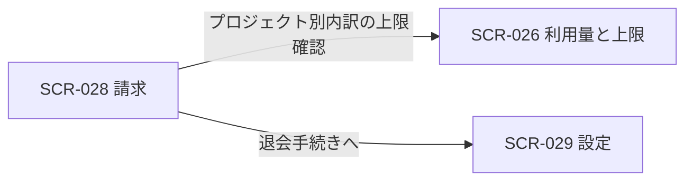
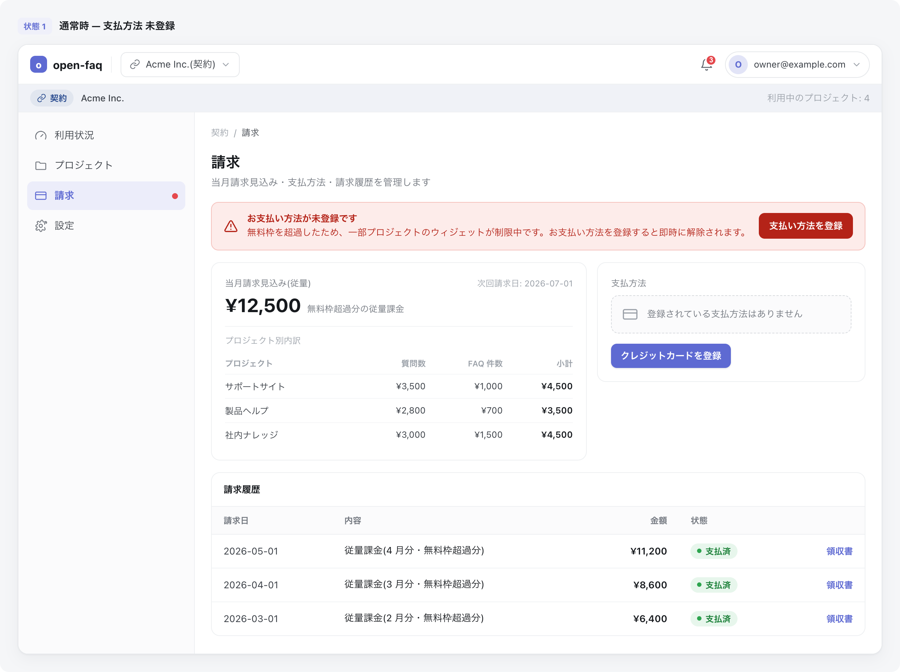
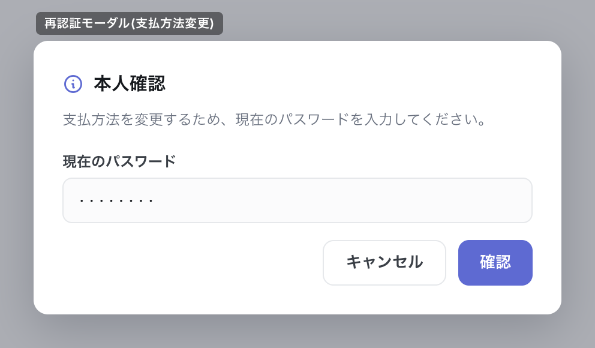

| 画面 ID | 画面名 | トレーサビリティID |
|----|----|----|
| SCR-028 | 請求 | [TR-037](../../00_traceability/index.md#TR-037) ・ [TR-038](../../00_traceability/index.md#TR-038) ・ [TR-088](../../00_traceability/index.md#TR-088) |

| ステークホルダ | 対象 |
|----------------|------|
| オーナー       | ◯    |
| メンバー       | —    |

## 1. 画面概要

オーナーが契約全体の請求状況(当月請求見込み・次回請求日・請求状態)と、支払方法・請求履歴を確認・管理する画面です(オーナー専有)。本サービスは完全従量課金 + 月次無料枠の単一モデルで、固定額プランの概念は持ちません。退会済み(契約状態=退会済み)のオーナーも、退会後の請求限定アクセスとして本画面にログインして請求情報を閲覧できます(閲覧専用)。

> [!NOTE]
> **補足** 本画面はオーナー専有です。メンバーは利用できず、URL 直アクセスは権限不足表示となります。支払い失敗・支払方法未登録時は、原因・影響・復旧手順・復旧 CTA を同一バナーに表示します。利用契約の退会は本画面ではなく SCR-029 設定に配置します。

> [!IMPORTANT]
> **退会済み時は閲覧専用です。** 退会済みのオーナーは本画面で請求情報(当月請求見込み・支払方法・請求履歴・領収書)の閲覧のみが可能で、支払方法の登録・変更などの書き込み操作はできません。退会済み時は支払方法の登録・変更 CTA と退会手続きへの導線を非表示にし、請求情報のみを表示します。

## 2. 画面遷移図

本画面からの画面遷移を、画面 ID・画面名とイベント(操作)で示します。

## 3. 画面レイアウト

本画面の代表状態(支払方法未登録時)を示します。支払方法登録済み・支払い失敗の各状態は §4 の `表示条件` で定義します。支払方法変更時の再認証モーダルを下図に示します。

## 4. 画面項目

本画面が各状態で表示する入出力項目(請求状態バナー・当月請求見込み・支払方法・請求履歴)を定義します。`表示条件` は項目が表示される状態を示します。

| # | 項目 | 種類 | 必須 | 最大長 | 初期値 | 表示条件 |
|----|----|----|----|----|----|----|
| 1 | 支払い失敗・未登録バナー | alert | — | — | — | 支払い失敗時 / 支払方法未登録時(退会済み時を除く) |
| 2 | 支払い方法を登録(バナー CTA) | button | — | — | — | 支払い失敗時 / 支払方法未登録時(退会済み時を除く) |
| 3 | 当月請求見込み | div | — | — | — | — |
| 4 | 支払方法 | div | — | — | — | — |
| 5 | 支払方法を変更 | button | — | — | — | 退会済み時を除く |
| 6 | 請求履歴 | table | — | — | — | — |
| 7 | 領収書(請求書 PDF) | link | — | — | — | — |
| 8 | 再認証 現パスワード | input(password) | ◯ | 128 | — | 再認証モーダル表示時 |
| 9 | 再認証 確認ボタン | button | — | — | — | 再認証モーダル表示時 |
| 10 | 再認証 キャンセルボタン | button | — | — | — | 再認証モーダル表示時 |
| 11 | 退会手続きへ | button | — | — | — | 退会済み時を除く |

- **#3 当月請求見込み**: 完全従量課金 + 月次無料枠モデルにおける当月の請求見込み合計(無料枠超過分の従量計算結果)と次回請求日を表示する。あわせてプロジェクト別の課金内訳(プロジェクト名 / 質問数の課金額 / FAQ 件数の課金額 / 小計)を一覧表示する。
- **#6 請求履歴の列**: 請求日 / 内容 / 金額 / 状態(支払済・失敗・下書き) / 領収書(行ごとの請求書 PDF リンク=#7)。
- **#5 支払方法を変更**: 支払方法が未登録のときは「クレジットカードを登録」、登録済みのときは「支払方法を変更」のラベルで表示する。退会済み時は非表示とし、書き込み操作はできない。
- **退会済み時の表示**: 退会済み(契約状態=退会済み)のオーナーがログインした場合は、当月請求見込み(#3)・支払方法(#4・閲覧のみ)・請求履歴(#6)・領収書(#7)のみを表示し、支払方法の登録・変更 CTA(#1・#2・#5)および退会手続きへの導線(#11)は表示しない。

## 5. バリデーション

本画面は照会・操作起点の画面であり、画面上の入力フォームに対する入力検証はありません(支払方法の登録・更新時の再認証は [7. 画面イベント詳細](#7-画面イベント詳細) で定義します)。退会済み時は閲覧専用であり、支払方法の登録・変更などの書き込み操作は受け付けません(操作 CTA は §4 の `表示条件` により非表示)。

(本画面に入力検証はありません)

## 6. イベント

本画面のイベント(初期表示・各操作)ごとに、対象の画面項目を定義します。各イベントの処理内容は [7. 画面イベント詳細](#7-画面イベント詳細) で定義します。

<table>
<colgroup>
<col style="width: 18%" />
<col style="width: 22%" />
<col style="width: 60%" />
</colgroup>
<thead>
<tr>
<th>EVT-ID</th>
<th>画面項目</th>
<th>イベント</th>
</tr>
</thead>
<tbody>
<tr>
<td>EVT-186</td>
<td>—</td>
<td>初期表示</td>
</tr>
<tr>
<td>EVT-187</td>
<td>#5</td>
<td>「支払方法を変更」を押下</td>
</tr>
<tr>
<td>EVT-188</td>
<td>#7</td>
<td>「領収書」リンクを押下</td>
</tr>
<tr>
<td>EVT-189</td>
<td>—</td>
<td>「利用量と上限を確認」を押下</td>
</tr>
<tr>
<td>EVT-190</td>
<td>#11</td>
<td>「退会手続きへ」を押下</td>
</tr>
<tr>
<td>EVT-191</td>
<td>#2</td>
<td>「支払い方法を登録」を押下(バナー CTA)</td>
</tr>
</tbody>
</table>

## 7. 画面イベント詳細

各イベントの処理内容を定義します。

<table>
<colgroup>
<col style="width: 14%" />
<col style="width: 86%" />
</colgroup>
<thead>
<tr>
<th>EVT-ID</th>
<th>処理</th>
</tr>
</thead>
<tbody>
<tr>
<td>EVT-186</td>
<td>初期表示時に次を行う:<pre>
1. <a href="../../02_backend/03_apis/API-043.md#API-043">請求サマリ取得</a> API(GET /billing/summary)で当月請求見込み合計(estimatedTotal)・次回請求日・請求状態・プロジェクト別内訳(projects[])・支払方法登録状態を取得する
2. 当月請求見込み合計と次回請求日を #3 へ表示し、プロジェクト別内訳(プロジェクト名 / 質問数の課金額 / FAQ 件数の課金額 / 小計)を #3 内の内訳一覧へ表示する。支払方法登録状態を #4 へ表示する
3. <a href="../../02_backend/03_apis/API-044.md#API-044">請求履歴取得</a> API(GET /billing/invoices)で請求日・内容・金額・状態・領収書リンクを取得し #6 へ表示する
4. 契約状態で分岐する
   ┣ 退会済み: 請求情報を閲覧専用で表示する。支払方法の登録・変更 CTA(#1・#2・#5)と退会手続きへの導線(#11)は表示しない
   ┗ 利用中: 請求状態でさらに分岐する
      ┣ 支払い失敗または支払方法未登録: #1 バナーに原因・影響・復旧手順・復旧 CTA(#2)を表示する
      ┗ 正常: #1 バナーを表示しない
</pre></td>
</tr>
<tr>
<td>EVT-187</td>
<td>「支払方法を変更」押下時に次を行う:<pre>
1. 課金情報変更につき再認証(現パスワード再入力)を求める
2. 結果で分岐する
   ┣ 再認証成功: <a href="../../02_backend/03_apis/API-045.md#API-045">支払方法取得・更新</a> API(PUT /billing/payment-method)で支払方法を登録・更新し #4 を最新の情報へ更新する
   ┗ 再認証失敗: エラー(EM-01)を表示し操作を中断する
</pre></td>
</tr>
<tr>
<td>EVT-188</td>
<td>「領収書」リンク押下時に該当請求行の明細 PDF を別タブで表示またはダウンロードする(取得失敗時は EM-02 を表示する)</td>
</tr>
<tr>
<td>EVT-189</td>
<td>「利用量と上限を確認」押下時に SCR-026 利用量と上限へ遷移する</td>
</tr>
<tr>
<td>EVT-190</td>
<td>「退会手続きへ」押下時に SCR-029 設定へ遷移する(設定画面の危険な操作セクションから即時退会フロー SCR-019 退会へ進む)。退会済み時は本導線(#11)を表示しないため遷移は発生しない</td>
</tr>
<tr>
<td>EVT-191</td>
<td>「支払い方法を登録」押下(バナー CTA)時に次を行う:<pre>
1. 課金情報変更につき再認証(現パスワード再入力)を求める
2. 結果で分岐する
   ┣ 再認証成功: <a href="../../02_backend/03_apis/API-045.md#API-045">支払方法取得・更新</a> API(PUT /billing/payment-method)で支払方法を登録し、#4 を最新の情報へ更新し、#1 バナーを非表示にする
   ┗ 再認証失敗: エラー(EM-01)を表示し操作を中断する
</pre></td>
</tr>
</tbody>
</table>

## 8. エラーメッセージ

本画面が表示するエラー・警告メッセージを定義します。

| エラーコード | エラーメッセージ |
|----|----|
| EM-01 | 再認証に失敗しました。現在のパスワードを確認してください |
| EM-02 | 領収書を取得できませんでした。しばらく経ってからお試しください |
