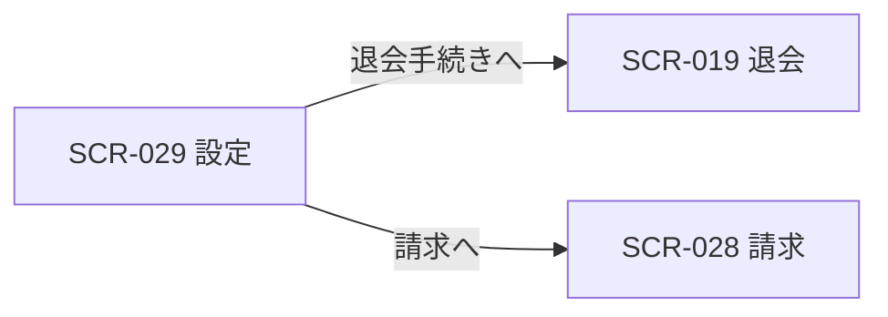

| 画面 ID | 画面名 | トレーサビリティID |
|----|----|----|
| SCR-029 | 設定 | [TR-022](../../00_traceability/index.md#TR-022) ・ [TR-037](../../00_traceability/index.md#TR-037) |

| ステークホルダ | 対象 |
|----------------|------|
| オーナー       | ◯    |
| メンバー       | —    |

## 1. 画面概要

オーナーが契約の組織名と連絡先メール(オーナーのアカウントメールを参照・読み取り専用)を確認・管理し、退会手続きへ進む画面です(オーナー専有)。退会は通常設定と視覚的に分離した危険な操作セクションを画面最下部に配置します。

> [!NOTE]
> **補足** 本画面はオーナー専有です。メンバーは利用できず、URL 直アクセスは権限不足表示となります。退会操作は画面最下部の危険な操作セクション(見出し「危険な操作」)に配置し、通常設定と視覚的に分離します。退会の入力・再認証・確定は SCR-019 退会に集約します。連絡先メールの変更は個人設定(プロフィール)で行います。契約全データのエクスポートは MVP 対象外(将来対応)。プロジェクトの編集・削除は SCR-005 に集約します。

## 2. 画面遷移図

本画面からの画面遷移を、画面 ID・画面名とイベント(操作)で示します。

## 3. 画面レイアウト

本画面の通常時(契約設定)を示します。

## 4. 画面項目

本画面の入出力項目(契約情報フォーム・退会導線)を定義します。項目の正本は本表です。

| # | 項目 | 種類 | 必須 | 最大長 | 初期値 | 表示条件 |
|----|----|----|----|----|----|----|
| 1 | 組織名 | input(text) | ◯ | 100 | 現在の組織名 | — |
| 2 | 請求・重要通知メール(読み取り専用) | input(text) | — | — | オーナーのアカウントメール | — |
| 3 | 変更を保存ボタン | button | — | — | — | — |
| 4 | 変更を破棄ボタン | button | — | — | — | — |
| 5 | 危険な操作セクション(退会の影響説明) | div | — | — | — | — |
| 6 | 退会手続きへボタン | button | — | — | — | — |

## 5. バリデーション

本画面の入力項目に対する検証ルールを定義します。違反がある場合は送信を中止します。

| 画面項目 | タイミング | ルール | エラーコード |
|----|----|----|----|
| #1 | 入力時・送信時 | 未入力チェック | EM-01 |
| #1 | 入力時・送信時 | 文字数チェック | EM-02 |

## 6. イベント

本画面のイベント(初期表示・各操作)ごとに、対象の画面項目を定義します。各イベントの処理内容は [7. 画面イベント詳細](#7-画面イベント詳細) で定義します。

<table>
<colgroup>
<col style="width: 18%" />
<col style="width: 22%" />
<col style="width: 60%" />
</colgroup>
<thead>
<tr>
<th>EVT-ID</th>
<th>画面項目</th>
<th>イベント</th>
</tr>
</thead>
<tbody>
<tr>
<td>EVT-192</td>
<td>—</td>
<td>初期表示</td>
</tr>
<tr>
<td>EVT-193</td>
<td>#3</td>
<td>「変更を保存」を押下</td>
</tr>
<tr>
<td>EVT-194</td>
<td>#6</td>
<td>「退会手続きへ」を押下</td>
</tr>
<tr>
<td>EVT-195</td>
<td>—</td>
<td>「請求」を押下</td>
</tr>
<tr>
<td>EVT-196</td>
<td>#4</td>
<td>「変更を破棄」を押下</td>
</tr>
</tbody>
</table>

## 7. 画面イベント詳細

各イベントの処理内容を定義します。

<table>
<colgroup>
<col style="width: 14%" />
<col style="width: 86%" />
</colgroup>
<thead>
<tr>
<th>EVT-ID</th>
<th>処理</th>
</tr>
</thead>
<tbody>
<tr>
<td>EVT-192</td>
<td>初期表示時にアクセス権限で分岐する:<pre>
 ┣ オーナー: <a href="../../02_backend/03_apis/API-014.md#API-014">契約設定取得</a> API を呼び出し、組織名(#1)・請求・重要通知メール(#2)を取得して各項目へ表示する
 ┗ オーナー以外(URL 直アクセス): 権限不足を表示し本画面を描画しない
</pre></td>
</tr>
<tr>
<td>EVT-193</td>
<td>「変更を保存」押下時に次を行う:<pre>
1. §5 のバリデーションを評価し、違反時は #1 直下にエラーを表示して中止する
2. <a href="../../02_backend/03_apis/API-015.md#API-015">契約設定更新</a> API を発行して組織名を更新する
3. 結果で分岐する
   ┣ 成功: 成功トースト(「設定を更新しました」)を表示し、#1 を更新後の値で再描画する
   ┗ 失敗: エラートーストを表示し、入力値を保持する
</pre></td>
</tr>
<tr>
<td>EVT-194</td>
<td>「退会手続きへ」押下時に SCR-019 退会へ遷移する</td>
</tr>
<tr>
<td>EVT-195</td>
<td>「請求」押下時に SCR-028 請求へ遷移する</td>
</tr>
<tr>
<td>EVT-196</td>
<td>「変更を破棄」押下時に #1(組織名)の入力内容を破棄し、初期表示時に取得した値へリセットする</td>
</tr>
</tbody>
</table>

## 8. エラーメッセージ

本画面が表示するエラー・警告メッセージを定義します。

| エラーコード | エラーメッセージ |
|----|----|
| EM-01 | 組織名を入力してください |
| EM-02 | 組織名は 1〜100 文字で入力してください |
