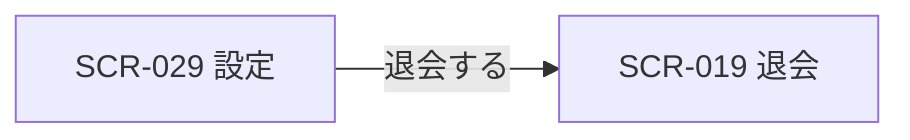

# SCR-029: 設定

| ID | 業務ユースケースID | API ID |
|----|----|----|
| SCR-029 | [UC-009](../../../01_requirements/04_business_usecases/UC-009.md#UC-009) ・ [UC-022](../../../01_requirements/04_business_usecases/UC-022.md#UC-022) ・ [UC-036](../../../01_requirements/04_business_usecases/UC-036.md#UC-036) | [API-005](../../02_backend/03_apis/API-005.md#API-005) ・ [API-012](../../02_backend/03_apis/API-012.md#API-012) ・ [API-014](../../02_backend/03_apis/API-014.md#API-014) ・ [API-015](../../02_backend/03_apis/API-015.md#API-015) ・ [API-056](../../02_backend/03_apis/API-056.md#API-056) ・ [API-043](../../02_backend/03_apis/API-043.md#API-043) ・ [API-044](../../02_backend/03_apis/API-044.md#API-044) |

| ステークホルダ | 対象 |
|----------------|------|
| オーナー       | ◯    |
| メンバー       | ◯    |

## 1. 画面概要

- 認証済みユーザーが支払い方法と退会(口座・アカウントまわり)を管理する設定画面である。
- 支払い方法・危険な操作(退会)の 2 セクションで構成し、支払い方法セクションはオーナーにのみ表示する。
- 表示名・メールアドレス・パスワードの編集は[個人設定(SCR-022)](SCR-022.md#SCR-022)で行う。
- 主要な表示状態は、利用中・退会済み(設定変更不可で閲覧専用)である。

## 2. 画面遷移図

本画面からの画面遷移を、画面 ID・画面名とイベント(操作)で示します。

## 3. 画面レイアウト

本画面の代表状態(設定ハブ)を示します。

## 4. 画面項目

本画面が表示する入出力項目を定義します。

| # | 項目 | 種類 | 必須 | 最大長 | 初期値 | 表示条件 |
|----|----|----|----|----|----|----|
| 1 | 支払い方法の表示(ブランド・下 4 桁・未登録の別) | label | — | — | 現在の支払い方法 | 支払い方法セクション(オーナーのみ) |
| 2 | 支払い方法を登録・変更ボタン | button | — | — | — | 支払い方法セクション(オーナーのみ)・退会済み時を除く |
| 3 | 危険な操作セクション(即時退会・取り消し不可の影響説明) | label | — | — | — | 退会済み時を除く |
| 4 | 退会するボタン | button | — | — | — | 退会済み時を除く |
| IT-01 | 現パスワード(再認証用) | input(password) | ◯ | 128 | — | 再認証ダイアログ表示時 |

データパターン(選択肢・状態値など値のパターンを持つ項目)を定義する。

| 画面項目 | 表示名 | 補足 |
|----|----|----|
| #1 | ブランド・下 4 桁 | 支払い方法が登録済みのときの表示 |
| #1 | 未登録 | 支払い方法が未登録のときの表示 |

## 5. バリデーション

本画面の入力項目に対する検証ルールを定義します。違反がある場合は送信を中止します。

| 画面項目 | タイミング | ルール | エラーコード |
|----|----|----|----|
| IT-01 | 送信時 | 未入力チェック | EM-01 |

## 6. イベント

本画面のイベント(初期表示・各操作)ごとに、対象の画面項目を定義します。各イベントの処理内容は [7. 画面イベント詳細](#7-画面イベント詳細) で定義します。

<table>
<colgroup>
<col style="width: 18%" />
<col style="width: 22%" />
<col style="width: 60%" />
</colgroup>
<thead>
<tr>
<th>EVT-ID</th>
<th>画面項目</th>
<th>イベント</th>
</tr>
</thead>
<tbody>
<tr>
<td>EVT-01</td>
<td>—</td>
<td>初期表示</td>
</tr>
<tr>
<td>EVT-02</td>
<td>#2</td>
<td>「支払い方法を登録・変更」を押下</td>
</tr>
<tr>
<td>EVT-03</td>
<td>#4</td>
<td>「退会する」を押下</td>
</tr>
</tbody>
</table>

## 7. 画面イベント詳細

各イベントの処理内容を定義します。

<table>
<colgroup>
<col style="width: 14%" />
<col style="width: 86%" />
</colgroup>
<thead>
<tr>
<th>EVT-ID</th>
<th>処理</th>
</tr>
</thead>
<tbody>
<tr>
<td>EVT-01</td>
<td>初期表示時に、オーナーには支払い方法(#1)を取得して支払い方法セクションを表示し、メンバー専有のユーザーには支払い方法セクションを表示しない。アカウント状態で分岐する:<pre>
   ┣ 利用中: 支払い方法変更(#2)・危険な操作セクション(#3・#4)を表示する
   ┗ 退会済み: 支払い方法(#1)を閲覧専用で表示し、支払い方法変更(#2)・危険な操作セクション(#3・#4)を表示しない
</pre>支払い方法は <a href="../../02_backend/03_apis/API-045.md#API-045">支払方法 取得(API-045)</a> による</td>
</tr>
<tr>
<td>EVT-02</td>
<td>「支払い方法を登録・変更」(#2)押下時に再認証(現パスワード再入力。<a href="../../02_backend/03_apis/API-005.md#API-005">再認証(API-005)</a>)を求めて支払い方法を登録 / 変更する(<a href="../../02_backend/03_apis/API-045.md#API-045">支払方法 登録・更新(API-045)</a>):<pre>
   ┣ 再認証成功
   ┃   ┣ 成功: 成功トースト(EM-02)を表示し、支払い方法(#1)を更新後の値で表示する
   ┃   ┗ 失敗: エラートースト(EM-04)を表示し、登録 / 変更しない
   ┗ 再認証失敗: エラー(EM-03)を表示し、登録 / 変更しない
</pre>支払い方法はユーザー単位で、自分が作成した全プロジェクトの請求に用いる。本導線は支払い方法セクションを表示するオーナーのみで発生する</td>
</tr>
<tr>
<td>EVT-03</td>
<td>「退会する」(#4)押下時に SCR-019 退会へ遷移する(即時退会フロー。退会の影響説明・登録メールアドレス入力・再認証・確定は SCR-019 で行う)。退会済み時は本導線(#4)を表示しないため遷移は発生しない</td>
</tr>
</tbody>
</table>

## 8. エラーメッセージ

本画面が表示するエラー・案内メッセージを定義します。

| エラーコード | エラーメッセージ |
|----|----|
| EM-01 | 現在のパスワードを入力してください |
| EM-02 | 支払い方法を保存しました |
| EM-03 | 現在のパスワードが正しくありません |
| EM-04 | 保存に失敗しました。時間をおいて再度お試しください |
