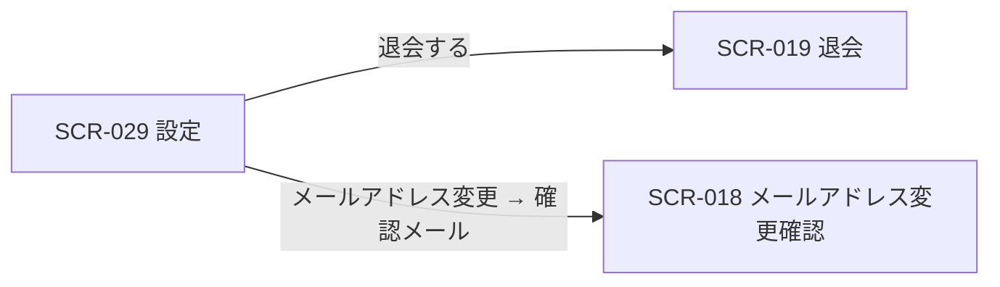
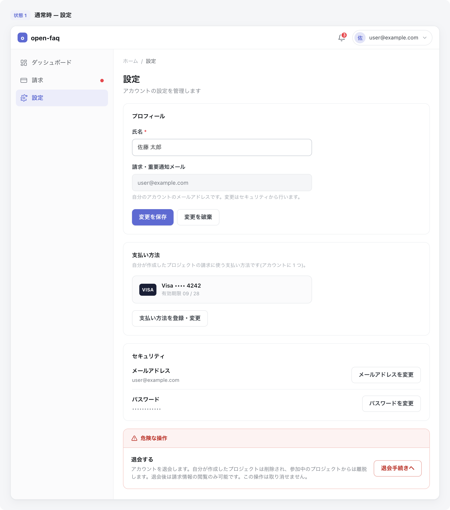

# SCR-029: 設定

| ID | 画面名 |
|----|----|
| SCR-029 | 設定 |

| 関連項目 | 内容 |
|----|----| 
| 業務ユースケース | [UC-022](../../../01_requirements/04_business_usecases/UC-022.md#UC-022) / [UC-023](../../../01_requirements/04_business_usecases/UC-023.md#UC-023) / [UC-037](../../../01_requirements/04_business_usecases/UC-037.md#UC-037) |
| API | [API-014](../../02_backend/03_apis/API-014.md#API-014) / [API-015](../../02_backend/03_apis/API-015.md#API-015) / [API-005](../../02_backend/03_apis/API-005.md#API-005) / [API-056](../../02_backend/03_apis/API-056.md#API-056) / [API-043](../../02_backend/03_apis/API-043.md#API-043) / [API-044](../../02_backend/03_apis/API-044.md#API-044) |

| ステークホルダ | 対象 |
|----------------|------|
| オーナー       | ◯    |
| メンバー       | ◯    |

## 1. 画面概要

- 認証済みユーザーが自分のアカウント設定を一元管理する設定ハブ画面である。
- プロフィール・支払い方法・セキュリティ・危険な操作の 4 セクションで構成する。
- 設定はアカウント単位で、立場(オーナー / メンバー)に関わらず自分の情報のみを編集でき、支払い方法セクションはオーナーにのみ表示する。
- 主要な表示状態は、利用中・退会済み(設定変更不可で閲覧専用)である。

## 2. 画面遷移図

本画面からの画面遷移を、画面 ID・画面名とイベント(操作)で示します。

## 3. 画面レイアウト

本画面の代表状態(設定ハブ)を示します。

## 4. 画面項目

本画面が表示する入出力項目を定義します。

| # | 項目 | 種類 | 必須 | 最大長 | 初期値 | 表示条件 |
|----|----|----|----|----|----|----|
| 1 | 氏名 | input(text) | ◯ | 100 | 現在の氏名 | プロフィールセクション |
| 2 | 請求・重要通知メール(読み取り専用) | input(text) | — | — | 自分のアカウントのメールアドレス | プロフィールセクション |
| 3 | 変更を保存ボタン(プロフィール) | button | — | — | — | プロフィールセクション・退会済み時を除く |
| 4 | 変更を破棄ボタン(プロフィール) | button | — | — | — | プロフィールセクション・退会済み時を除く |
| 5 | 支払い方法の表示(ブランド・下 4 桁・未登録の別) | label | — | — | 現在の支払い方法 | 支払い方法セクション(オーナーのみ) |
| 6 | 支払い方法を登録・変更ボタン | button | — | — | — | 支払い方法セクション(オーナーのみ)・退会済み時を除く |
| 7 | メールアドレスを変更ボタン | button | — | — | — | セキュリティセクション・退会済み時を除く |
| 8 | パスワードを変更ボタン | button | — | — | — | セキュリティセクション・退会済み時を除く |
| 9 | 危険な操作セクション(即時退会・取り消し不可の影響説明) | label | — | — | — | 退会済み時を除く |
| 10 | 退会するボタン | button | — | — | — | 退会済み時を除く |
| IT-01 | 現パスワード(再認証用) | input(password) | ◯ | 128 | — | 再認証ダイアログ表示時 |
| IT-02 | 新しいメールアドレス | input(email) | ◯ | 254 | — | メールアドレス変更フォーム表示時 |
| IT-03 | 新しいパスワード | input(password) | ◯ | 128 | — | パスワード変更フォーム表示時 |
| IT-04 | 新しいパスワード(確認) | input(password) | ◯ | 128 | — | パスワード変更フォーム表示時 |

データパターン(選択肢・状態値など値のパターンを持つ項目)を定義する。

| 画面項目 | 表示名 | 補足 |
|----|----|----|
| #5 | ブランド・下 4 桁 | 支払い方法が登録済みのときの表示 |
| #5 | 未登録 | 支払い方法が未登録のときの表示 |

## 5. バリデーション

本画面の入力項目に対する検証ルールを定義します。違反がある場合は送信を中止します。

| 画面項目 | タイミング | ルール | エラーコード |
|----|----|----|----|
| #1 | 入力時・送信時 | 未入力チェック | EM-01 |
| #1 | 入力時・送信時 | 文字数チェック(1〜100 文字) | EM-02 |
| IT-01 | 送信時 | 未入力チェック | EM-03 |
| IT-02 | 入力時・送信時 | 未入力チェック | EM-04 |
| IT-02 | 入力時・送信時 | メールアドレス形式チェック | EM-05 |
| IT-03 | 入力時・送信時 | 未入力チェック | EM-06 |
| IT-03 | 入力時・送信時 | パスワード強度チェック(12 文字以上・英大小文字 / 数字 / 記号 3 種類以上) | EM-07 |
| IT-04 | 入力時・送信時 | パスワード一致チェック | EM-08 |

## 6. イベント

本画面のイベント(初期表示・各操作)ごとに、対象の画面項目を定義します。各イベントの処理内容は [7. 画面イベント詳細](#7-画面イベント詳細) で定義します。

<table>
<colgroup>
<col style="width: 18%" />
<col style="width: 22%" />
<col style="width: 60%" />
</colgroup>
<thead>
<tr>
<th>EVT-ID</th>
<th>画面項目</th>
<th>イベント</th>
</tr>
</thead>
<tbody>
<tr>
<td>EVT-01</td>
<td>—</td>
<td>初期表示</td>
</tr>
<tr>
<td>EVT-02</td>
<td>#3</td>
<td>「変更を保存」を押下(プロフィール・氏名)</td>
</tr>
<tr>
<td>EVT-03</td>
<td>#10</td>
<td>「退会する」を押下</td>
</tr>
<tr>
<td>EVT-04</td>
<td>#6</td>
<td>「支払い方法を登録・変更」を押下</td>
</tr>
<tr>
<td>EVT-05</td>
<td>#4</td>
<td>「変更を破棄」を押下(プロフィール)</td>
</tr>
<tr>
<td>EVT-06</td>
<td>#7</td>
<td>「メールアドレスを変更」を押下</td>
</tr>
<tr>
<td>EVT-07</td>
<td>#8</td>
<td>「パスワードを変更」を押下</td>
</tr>
</tbody>
</table>

## 7. 画面イベント詳細

各イベントの処理内容を定義します。

<table>
<colgroup>
<col style="width: 14%" />
<col style="width: 86%" />
</colgroup>
<thead>
<tr>
<th>EVT-ID</th>
<th>処理</th>
</tr>
</thead>
<tbody>
<tr>
<td>EVT-01</td>
<td>初期表示時に氏名(#1)・請求・重要通知メール(#2)を取得して表示する。オーナーには支払い方法(#5)を取得して支払い方法セクションを表示し、メンバー専有のユーザーには支払い方法セクションを表示しない。アカウント状態で分岐する:<pre>
   ┣ 利用中: プロフィール保存(#3・#4)・支払い方法変更(#6)・セキュリティ操作(#7・#8)・危険な操作セクション(#9・#10)を表示する
   ┗ 退会済み: 氏名(#1)・請求・重要通知メール(#2)・支払い方法(#5)を閲覧専用で表示し、設定変更(#3・#4・#6・#7・#8)・危険な操作セクション(#9・#10)を表示しない
</pre>氏名は <a href="../../02_backend/03_apis/API-064.md#API-064">自己プロフィール取得(API-064)</a>・メールは <a href="../../02_backend/03_apis/API-014.md#API-014">アカウント設定取得(API-014)</a>・支払い方法は <a href="../../02_backend/03_apis/API-045.md#API-045">支払方法 取得(API-045)</a> による</td>
</tr>
<tr>
<td>EVT-02</td>
<td>「変更を保存」(#3)押下時に、入力に不備があれば #1 直下にエラーを表示して中止し、不備がなければ氏名を保存する(<a href="../../02_backend/03_apis/API-015.md#API-015">プロフィール・セキュリティ設定更新(API-015)</a>):<pre>
   ┣ 成功: 成功トースト(EM-09)を表示し、氏名(#1)を更新後の値で表示する
   ┗ 失敗: エラートースト(EM-12)を表示する
</pre></td>
</tr>
<tr>
<td>EVT-03</td>
<td>「退会する」(#10)押下時に SCR-019 退会へ遷移する(即時退会フロー。退会の影響説明・登録メールアドレス入力・再認証・確定は SCR-019 で行う)。退会済み時は本導線(#10)を表示しないため遷移は発生しない</td>
</tr>
<tr>
<td>EVT-04</td>
<td>「支払い方法を登録・変更」(#6)押下時に再認証(現パスワード再入力。<a href="../../02_backend/03_apis/API-005.md#API-005">再認証(API-005)</a>)を求めて支払い方法を登録 / 変更する(<a href="../../02_backend/03_apis/API-045.md#API-045">支払方法 登録・更新(API-045)</a>):<pre>
   ┣ 再認証成功
   ┃   ┣ 成功: 成功トースト(EM-10)を表示し、支払い方法(#5)を更新後の値で表示する
   ┃   ┗ 失敗: エラートースト(EM-12)を表示し、登録 / 変更しない
   ┗ 再認証失敗: エラー(EM-11)を表示し、登録 / 変更しない
</pre>支払い方法はユーザー単位で、自分が作成した全プロジェクトの請求に用いる。本導線は支払い方法セクションを表示するオーナーのみで発生する</td>
</tr>
<tr>
<td>EVT-05</td>
<td>「変更を破棄」(#4)押下時に #1(氏名)の入力内容を破棄し、初期表示時に取得した値へリセットする</td>
</tr>
<tr>
<td>EVT-06</td>
<td>「メールアドレスを変更」(#7)押下時に再認証(現パスワード再入力。<a href="../../02_backend/03_apis/API-005.md#API-005">再認証(API-005)</a>)を求め、新しいメールアドレス(IT-02)の入力を受け付ける:<pre>
   ┣ 再認証成功: 新アドレスを受け付けて(<a href="../../02_backend/03_apis/API-015.md#API-015">プロフィール・セキュリティ設定更新(API-015)</a>)新アドレスへ確認メールを送信し、メールアドレス変更確認(<a href="SCR-018.md#SCR-018">SCR-018</a>)フローへ引き渡す
   ┗ 再認証失敗: エラー(EM-11)を表示し、変更しない
</pre></td>
</tr>
<tr>
<td>EVT-07</td>
<td>「パスワードを変更」(#8)押下時に再認証(現パスワード再入力。<a href="../../02_backend/03_apis/API-005.md#API-005">再認証(API-005)</a>)を求め、新しいパスワード(IT-03)・確認(IT-04)の入力を受け付けて更新する(<a href="../../02_backend/03_apis/API-013.md#API-013">自己パスワード変更(API-013)</a>):<pre>
   ┣ 再認証成功
   ┃   ┣ 成功: 成功トースト(EM-13)を表示する
   ┃   ┗ 失敗(強度不足 / 不一致): IT-03・IT-04 直下にエラー(EM-07 / EM-08)を表示し、変更しない
   ┗ 再認証失敗: エラー(EM-11)を表示し、変更しない
</pre></td>
</tr>
</tbody>
</table>

## 8. エラーメッセージ

本画面が表示するエラー・案内メッセージを定義します。

| エラーコード | エラーメッセージ |
|----|----|
| EM-01 | 氏名を入力してください |
| EM-02 | 氏名は 1〜100 文字で入力してください |
| EM-03 | 現在のパスワードを入力してください |
| EM-04 | メールアドレスを入力してください |
| EM-05 | メールアドレスの形式が正しくありません |
| EM-06 | 新しいパスワードを入力してください |
| EM-07 | パスワードは 12 文字以上で、英大文字・小文字・数字・記号のうち 3 種類以上を含めてください |
| EM-08 | パスワードが一致しません |
| EM-09 | プロフィールを保存しました |
| EM-10 | 支払い方法を保存しました |
| EM-11 | 現在のパスワードが正しくありません |
| EM-12 | 保存に失敗しました。時間をおいて再度お試しください |
| EM-13 | パスワードを変更しました |
