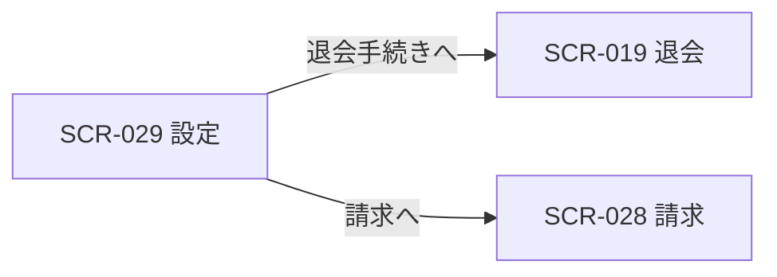

<!-- portal-top -->
[設計ポータル](../../../README.md) ／ [基本設計](../../index.md) ／ [フロントエンド設計](../index.md) ／ [画面設計](index.md) ／ **SCR-029 設定**
<!-- /portal-top -->

# SCR-029 設定

> **このページは、オーナーが契約レベルの連絡先と退会を管理する画面 SCR-029 を定義します(オーナー専有)。** 画面概要 / 画面遷移図 / 画面レイアウト / 画面項目定義 / 入出力一覧 / 画面イベント一覧 の 6 セクションで記述します。

*版数 v1.0 ・ 更新 2026-06-17 ・ 承認済*

## 1. 画面概要

オーナーが契約の連絡先(請求・重要通知メール)を管理し、退会手続きへ進む画面です(オーナー専有)。退会は通常設定と視覚的に分離した DangerSection に配置します。

| 画面 ID | 画面名 | 機能概要 |
|----|----|----|
| `SCR-029` | 設定 | 契約の連絡先メールを管理し、退会手続きへ進む |

| 関連 | 内容 |
|----|----|
| FR / BR | FR-009 / BR(アカウントライフサイクル) |
| 関連画面 | [`SCR-028` 請求](SCR-028.md) / [`SCR-019` 退会](SCR-019.md) / [`SCR-022` 個人設定](SCR-022.md) |
| 対応業務UC | [UC-022](../../../01_requirements/04_business_usecases/UC-022.md#UC-022) ・ [UC-037](../../../01_requirements/04_business_usecases/UC-037.md#UC-037) ・ [UC-022](../../../01_requirements/04_business_usecases/UC-022.md#UC-022) |

| ステークホルダ | 対象 |
|----------------|------|
| オーナー       | ◯    |
| メンバー       | —    |

> [!NOTE]
> **補足** 本画面はオーナー専有です。メンバーは利用できず、URL 直アクセスは権限不足表示となります。退会操作は画面最下部の DangerSection(セクション見出し「退会」)に配置し、通常設定と視覚的に分離します。退会の入力・再認証・確定は SCR-019 退会に集約します。契約全データのエクスポートは MVP 対象外(将来対応)。プロジェクトの編集・削除は SCR-005 に集約します(旧 SCR-024 プロジェクト設定は廃止)。

## 2. 画面遷移図

本画面からの画面遷移を、画面 ID・画面名とイベント(操作)で示します。

## 3. 画面レイアウト

## 4. 画面項目定義

本画面の入出力項目(連絡先メール・退会導線)を定義します。項目の正本は本表です。

| 項目 ID | 項目 | 説明 | 種類 | 表示条件 | 表示 |
|----|----|----|----|----|----|
| `IT-01` | 請求・重要通知メール | 契約の連絡先メールアドレスを入力・表示する | テキストボックス | — | 連絡先メールアドレス |
| `IT-02` | 変更を保存 | 連絡先メールの変更を保存する | ボタン | — | 変更を保存 |
| `IT-03` | 退会 | 退会の影響を説明し通常設定と分離したセクションを画面最下部に表示する | カード | — | 退会の影響の説明文 |
| `IT-04` | 退会手続きへ | 退会画面(SCR-019)へ遷移する | ボタン | — | 退会手続きへ |
| `IT-05` | 契約名 | 契約名を読み取り専用で表示する(変更不可) | テキスト(読み取り専用) | — | 契約名 |
| `IT-06` | タイムゾーン | 契約のタイムゾーンを選択するドロップダウン | ドロップダウン | — | タイムゾーン |
| `IT-07` | 変更を破棄 | 入力中の変更を破棄してフォームを初期値にリセットするボタン | ボタン | — | 変更を破棄 |

## 5. 入出力一覧

本画面が読み書きするテーブルと、呼び出す API の一覧です。テーブルの正本は [データベース設計](../../02_backend/04_database/index.md)、退会 API の正本は [API設計](../../02_backend/03_apis/index.md) です。退会の入力・確定処理は SCR-019 を正本とします。

<table>
<thead>
<tr>
<th rowspan="2">入出力名</th>
<th rowspan="2">説明</th>
<th rowspan="2">種別</th>
<th rowspan="2">I/O</th>
<th colspan="4">アクセス種別(CRUD)</th>
<th rowspan="2">備考</th>
</tr>
<tr>
<th>C</th>
<th>R</th>
<th>U</th>
<th>D</th>
</tr>
</thead>
<tbody>
<tr>
<td>オーナー</td>
<td>契約連絡先メールを取得・更新する</td>
<td>テーブル</td>
<td>入出力</td>
<td>—</td>
<td>◯</td>
<td>◯</td>
<td>—</td>
<td><code>M_CONTRACT</code>(<a href="../../02_backend/04_database/index.md#TBL-001">テーブル設計 3.2</a>)</td>
</tr>
<tr>
<td>契約設定取得</td>
<td>初期表示時に契約名・連絡先メール・タイムゾーンを取得する</td>
<td>API</td>
<td>入力</td>
<td>—</td>
<td>◯</td>
<td>—</td>
<td>—</td>
<td><a href="../../02_backend/03_apis/API-014.md#API-014">契約設定取得</a></td>
</tr>
<tr>
<td>契約設定更新</td>
<td>連絡先メール・タイムゾーンを更新する</td>
<td>API</td>
<td>出力</td>
<td>—</td>
<td>—</td>
<td>◯</td>
<td>—</td>
<td><a href="../../02_backend/03_apis/API-015.md#API-015">契約設定更新</a></td>
</tr>
<tr>
<td>退会申請</td>
<td>退会申請を送信する(再認証必須・SCR-019 が正本)</td>
<td>API</td>
<td>出力</td>
<td>◯</td>
<td>—</td>
<td>—</td>
<td>—</td>
<td><a href="../../02_backend/03_apis/API-056.md#API-056">退会申請</a></td>
</tr>
</tbody>
</table>

## 6. 画面イベント一覧

本画面のイベント(初期表示・各操作)ごとに、対象の項目 ID と処理内容を定義します。

<table>
<thead>
<tr>
<th>EVT-ID</th>
<th>イベント ID</th>
<th>項目 ID</th>
<th>イベント</th>
<th>処理</th>
</tr>
</thead>
<tbody>
<tr>
<td><a href="../02_screen_events/EVT-215.md#EVT-215">EVT-215</a></td>
<td><code>EV-01</code></td>
<td>—</td>
<td>初期表示</td>
<td>
<a href="../../02_backend/03_apis/API-014.md#API-014">契約設定取得</a> を呼び出し、契約名(IT-05)・連絡先メール(IT-01)・タイムゾーン(IT-06)を取得して各項目へ表示する。オーナー以外が URL 直アクセスした場合は権限不足を表示し本画面を描画しない。
</td>
</tr>
<tr>
<td><a href="../02_screen_events/EVT-216.md#EVT-216">EVT-216</a></td>
<td><code>EV-02</code></td>
<td><a href="#IT-01">IT-01</a></td>
<td>請求・重要通知メールを入力</td>
<td>
入力値をリアルタイムでバリデーションする。
<ul>
<li>正常: 入力を受け付ける</li>
<li>エラー: メール形式不正の場合、IT-01 下部にインラインエラーを表示し IT-02 を無効化する</li>
</ul>
</td>
</tr>
<tr>
<td><a href="../02_screen_events/EVT-217.md#EVT-217">EVT-217</a></td>
<td><code>EV-03</code></td>
<td><a href="#IT-02">IT-02</a></td>
<td>「変更を保存」を押下</td>
<td>
入力値を最終バリデーションのうえ、<a href="../../02_backend/03_apis/API-015.md#API-015">契約設定更新</a> を呼び出して連絡先メール・タイムゾーンを更新する。
<ul>
<li>成功: 成功トースト(「設定を更新しました」)を表示し、IT-01・IT-06 を更新後の値で再描画する</li>
<li>エラー(バリデーション): エラー内容を該当項目下部に表示する</li>
<li>エラー(API): エラートーストを表示し、入力値を保持する</li>
</ul>
</td>
</tr>
<tr>
<td><a href="../02_screen_events/EVT-218.md#EVT-218">EVT-218</a></td>
<td><code>EV-04</code></td>
<td><a href="#IT-04">IT-04</a></td>
<td>「退会手続きへ」を押下</td>
<td>
退会画面(SCR-019)へ遷移する。
</td>
</tr>
<tr>
<td><a href="../02_screen_events/EVT-219.md#EVT-219">EVT-219</a></td>
<td><code>EV-05</code></td>
<td>—</td>
<td>「請求」を押下</td>
<td>
ナビゲーションメニューから請求画面(SCR-028)へ遷移する。
</td>
</tr>
<tr>
<td><a href="../02_screen_events/EVT-220.md#EVT-220">EVT-220</a></td>
<td><code>EV-06</code></td>
<td><a href="#IT-06">IT-06</a></td>
<td>タイムゾーンを選択</td>
<td>
ドロップダウンで選択した値を IT-06 に反映する。
<ul>
<li>正常: 選択値を受け付ける</li>
</ul>
</td>
</tr>
<tr>
<td><a href="../02_screen_events/EVT-221.md#EVT-221">EVT-221</a></td>
<td><code>EV-07</code></td>
<td><a href="#IT-07">IT-07</a></td>
<td>「変更を破棄」を押下</td>
<td>
IT-01(連絡先メール)・IT-06(タイムゾーン)の入力内容を破棄し、初期表示時に取得した値へリセットする。
</td>
</tr>
</tbody>
</table>

> [!NOTE]
> **補足** サイドバーのグローバルナビ(「利用状況」「プロジェクト」等)はプロジェクト共通の遷移であり、各 SCR で省略します。本画面固有の遷移である「請求」への導線のみ EV-05 として定義します。

---

<!-- portal-bottom -->
[← 画面設計](index.md) ・ [基本設計](../../index.md) ・ [↑ 設計ポータル](../../../README.md)
<!-- /portal-bottom -->
