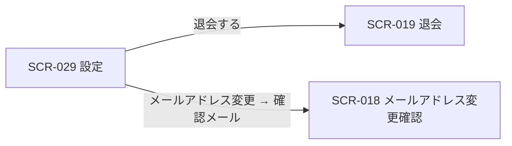

| 画面 ID | 画面名 | トレーサビリティID |
|----|----|----|
| SCR-029 | 設定 | [TR-022](../../00_traceability/index.md#TR-022) ・ [TR-023](../../00_traceability/index.md#TR-023) ・ [TR-037](../../00_traceability/index.md#TR-037) |

| ステークホルダ | 対象 |
|----------------|------|
| オーナー       | ◯    |
| メンバー       | ◯    |

## 1. 画面概要

認証済みユーザーが自分のアカウント設定を一元管理する設定ハブ画面です。プロフィール(氏名の変更)・支払い方法(ユーザー単位の登録 / 変更)・セキュリティ(メールアドレス変更・パスワード変更)・危険な操作(退会)の 4 セクションで構成します。設定はアカウント単位で、自分の情報のみを編集できます。退会は通常設定と視覚的に分離した危険な操作セクションを画面最下部に配置します。退会は即時実行・取り消し不可で、危険な操作セクションから SCR-019 退会へ進みます。

> [!NOTE]
> **補足** 設定はアカウント単位で、立場(オーナー / メンバー)に関わらず認証済みユーザーが自分の設定を編集できます。**支払い方法セクションはユーザー単位の支払い方法を扱い、プロジェクトを 1 つ以上作成した(自分の課金アカウントを持つ)オーナーにのみ表示**します。メンバー専有(どのプロジェクトも作成していない)ユーザーには支払い方法セクションを表示しません。誤操作防止として、メールアドレス変更・パスワード変更・支払い方法の登録 / 変更は再認証(現パスワード再入力)を要し、メールアドレス変更時はさらに新アドレスへの確認メールを要します。連絡先・重要通知メールはアカウントのメールアドレス(自分のメールアドレス)を用い、組織名や別個の連絡先メール設定は持ちません。アカウント全データのエクスポートは MVP 対象外(将来対応)です。プロジェクトの編集・削除は SCR-005 に集約します。

> [!IMPORTANT]
> **退会済み時は設定変更不可・請求のみ閲覧可です。** 退会済み(アカウント状態=退会済み)のユーザーがログインした場合、本画面の設定変更(氏名・支払い方法・メールアドレス・パスワードの保存等)・退会導線は利用できず、利用可能なのは請求情報の閲覧(SCR-028 請求)のみです。退会済み時は本画面を設定変更不可の閲覧状態とし、危険な操作セクション(退会導線)を表示しません。

## 2. 画面遷移図

本画面からの画面遷移を、画面 ID・画面名とイベント(操作)で示します。

## 3. 画面レイアウト

本画面の代表状態(設定ハブ)を示します。各セクション(プロフィール / 支払い方法 / セキュリティ / 危険な操作)の表示条件は §4 の `表示条件` で定義します。

## 4. 画面項目

本画面の入出力項目(プロフィール・支払い方法・セキュリティ・危険な操作)を定義します。項目の正本は本表です。

| # | 項目 | 種類 | 必須 | 最大長 | 初期値 | 表示条件 |
|----|----|----|----|----|----|----|
| 1 | 氏名 | input(text) | ◯ | 100 | 現在の氏名 | プロフィールセクション |
| 2 | 請求・重要通知メール(読み取り専用) | input(text) | — | — | 自分のアカウントのメールアドレス | プロフィールセクション |
| 3 | 変更を保存ボタン(プロフィール) | button | — | — | — | プロフィールセクション・退会済み時を除く |
| 4 | 変更を破棄ボタン(プロフィール) | button | — | — | — | プロフィールセクション・退会済み時を除く |
| 5 | 支払い方法の表示(ブランド・下 4 桁・未登録の別) | div | — | — | 現在の支払い方法 | 支払い方法セクション(オーナーのみ) |
| 6 | 支払い方法を登録・変更ボタン | button | — | — | — | 支払い方法セクション(オーナーのみ)・退会済み時を除く |
| 7 | メールアドレスを変更ボタン | button | — | — | — | セキュリティセクション・退会済み時を除く |
| 8 | パスワードを変更ボタン | button | — | — | — | セキュリティセクション・退会済み時を除く |
| 9 | 危険な操作セクション(即時退会・取り消し不可の影響説明) | div | — | — | — | 退会済み時を除く |
| 10 | 退会するボタン | button | — | — | — | 退会済み時を除く |
| IT-01 | 現パスワード(再認証用) | input(password) | ◯ | 128 | — | 再認証ダイアログ表示時 |
| IT-02 | 新しいメールアドレス | input(email) | ◯ | 254 | — | メールアドレス変更フォーム表示時 |
| IT-03 | 新しいパスワード | input(password) | ◯ | 128 | — | パスワード変更フォーム表示時 |
| IT-04 | 新しいパスワード(確認) | input(password) | ◯ | 128 | — | パスワード変更フォーム表示時 |

- **#5 支払い方法**: 支払い方法はユーザー単位で、自分が作成した(オーナーである)全プロジェクトの請求に用いる。登録済みのときはブランド・下 4 桁を、未登録のときは未登録の旨を表示する。どのプロジェクトも作成していない(メンバー専有の)ユーザーには支払い方法セクションを表示しない。
- **#9 危険な操作セクション**: 退会が即時実行・取り消し不可で、自分が作成したプロジェクトの運用データが削除され、参加中のプロジェクトからは離脱し、退会後は請求情報の閲覧のみが可能である旨の影響説明を表示する。退会の最終的な影響説明・登録メールアドレス入力・再認証・確定は SCR-019 退会で行う。
- **退会済み時の表示**: 退会済み(アカウント状態=退会済み)のユーザーがログインした場合は、氏名(#1)・請求・重要通知メール(#2)・支払い方法(#5)を閲覧専用で表示し、変更保存(#3)・変更破棄(#4)・支払い方法変更(#6)・メールアドレス変更(#7)・パスワード変更(#8)・危険な操作セクション(#9)・退会導線(#10)は表示しない。設定変更はできず、請求情報の閲覧(SCR-028 請求)のみが可能である。

## 5. バリデーション

本画面の入力項目に対する検証ルールを定義します。違反がある場合は送信を中止します。

| 画面項目 | タイミング | ルール | エラーコード |
|----|----|----|----|
| #1 | 入力時・送信時 | 未入力チェック | EM-01 |
| #1 | 入力時・送信時 | 文字数チェック(1〜100 文字) | EM-02 |
| IT-01 | 送信時 | 未入力チェック | EM-03 |
| IT-02 | 入力時・送信時 | 未入力チェック | EM-04 |
| IT-02 | 入力時・送信時 | メールアドレス形式チェック | EM-05 |
| IT-03 | 入力時・送信時 | 未入力チェック | EM-06 |
| IT-03 | 入力時・送信時 | パスワード強度チェック(12 文字以上・英大小文字 / 数字 / 記号 3 種類以上) | EM-07 |
| IT-04 | 入力時・送信時 | パスワード一致チェック | EM-08 |

## 6. イベント

本画面のイベント(初期表示・各操作)ごとに、対象の画面項目を定義します。各イベントの処理内容は [7. 画面イベント詳細](#7-画面イベント詳細) で定義します。

<table>
<colgroup>
<col style="width: 18%" />
<col style="width: 22%" />
<col style="width: 60%" />
</colgroup>
<thead>
<tr>
<th>EVT-ID</th>
<th>画面項目</th>
<th>イベント</th>
</tr>
</thead>
<tbody>
<tr>
<td>EVT-191</td>
<td>—</td>
<td>初期表示</td>
</tr>
<tr>
<td>EVT-192</td>
<td>#3</td>
<td>「変更を保存」を押下(プロフィール・氏名)</td>
</tr>
<tr>
<td>EVT-193</td>
<td>#10</td>
<td>「退会する」を押下</td>
</tr>
<tr>
<td>EVT-194</td>
<td>#6</td>
<td>「支払い方法を登録・変更」を押下</td>
</tr>
<tr>
<td>EVT-195</td>
<td>#4</td>
<td>「変更を破棄」を押下(プロフィール)</td>
</tr>
<tr>
<td>EV-01</td>
<td>#7</td>
<td>「メールアドレスを変更」を押下</td>
</tr>
<tr>
<td>EV-02</td>
<td>#8</td>
<td>「パスワードを変更」を押下</td>
</tr>
</tbody>
</table>

## 7. 画面イベント詳細

各イベントの処理内容を定義します。

<table>
<colgroup>
<col style="width: 14%" />
<col style="width: 86%" />
</colgroup>
<thead>
<tr>
<th>EVT-ID</th>
<th>処理</th>
</tr>
</thead>
<tbody>
<tr>
<td>EVT-191</td>
<td>初期表示時にアクセス権限・アカウント状態で分岐する:<pre>
1. <a href="../../02_backend/03_apis/API-064.md#API-064">自己プロフィール取得</a> API で氏名(#1)を、<a href="../../02_backend/03_apis/API-014.md#API-014">アカウント設定取得</a> API で請求・重要通知メール(#2)を取得して各項目へ表示する
2. オーナー(プロジェクトを 1 つ以上作成したユーザー)の場合は <a href="../../02_backend/03_apis/API-045.md#API-045">支払方法 取得</a> API で支払い方法(#5)を取得して支払い方法セクションを表示する。メンバー専有のユーザーには支払い方法セクションを表示しない
3. アカウント状態で分岐する
   ┣ 利用中: プロフィール保存(#3・#4)・支払い方法変更(#6)・セキュリティ操作(#7・#8)・危険な操作セクション(#9・#10)を表示する
   ┗ 退会済み: 氏名(#1)・請求・重要通知メール(#2)・支払い方法(#5)を閲覧専用で表示し、設定変更(#3・#4・#6・#7・#8)・危険な操作セクション(#9・#10)を表示しない
</pre></td>
</tr>
<tr>
<td>EVT-192</td>
<td>「変更を保存」(#3)押下時に次を行う:<pre>
1. §5 のバリデーション(#1)を評価し、違反時は #1 直下にエラーを表示して中止する
2. <a href="../../02_backend/03_apis/API-015.md#API-015">プロフィール・セキュリティ設定更新</a> API を発行して氏名を更新する
3. 結果で分岐する
   ┣ 成功: 成功トースト(EM-09)を表示し、#1 を更新後の値で再描画する
   ┗ 失敗: エラートースト(EM-12)を表示し、入力値を保持する
</pre></td>
</tr>
<tr>
<td>EVT-193</td>
<td>「退会する」(#10)押下時に SCR-019 退会へ遷移する(即時退会フロー。退会の影響説明・登録メールアドレス入力・再認証・確定は SCR-019 で行う)。退会済み時は本導線(#10)を表示しないため遷移は発生しない</td>
</tr>
<tr>
<td>EVT-194</td>
<td>「支払い方法を登録・変更」(#6)押下時に次を行う:<pre>
1. <a href="../../02_backend/03_apis/API-005.md#API-005">再認証</a> ダイアログを表示し、現パスワード(IT-01)の入力を求める
2. 再認証結果で分岐する
   ┣ 成功: 課金プロバイダの入力フォーム(カード情報)を表示し、送信時に <a href="../../02_backend/03_apis/API-045.md#API-045">支払方法 登録・更新</a> API を発行して支払い方法を登録 / 更新する
   ┃        ┣ 成功: 成功トースト(EM-10)を表示し、支払い方法(#5)を更新後の値で再描画する
   ┃        ┗ 失敗: エラートースト(EM-12)を表示し、登録 / 更新しない
   ┗ 失敗(再認証失敗): 再認証ダイアログにエラー(EM-11)を表示し、登録 / 更新しない
</pre>支払い方法はユーザー単位で、自分が作成した全プロジェクトの請求に用いる。本導線は支払い方法セクションを表示するオーナーのみで発生する</td>
</tr>
<tr>
<td>EVT-195</td>
<td>「変更を破棄」(#4)押下時に #1(氏名)の入力内容を破棄し、初期表示時に取得した値へリセットする</td>
</tr>
<tr>
<td>EV-01</td>
<td>「メールアドレスを変更」(#7)押下時に次を行う:<pre>
1. <a href="../../02_backend/03_apis/API-005.md#API-005">再認証</a> ダイアログを表示し、現パスワード(IT-01)の入力を求める
2. 再認証結果で分岐する
   ┣ 成功: 新しいメールアドレス(IT-02)の入力フォームを表示する。送信時に §5 のバリデーション(形式)を評価し、<a href="../../02_backend/03_apis/API-015.md#API-015">プロフィール・セキュリティ設定更新</a> API を発行する。新アドレスへ確認メールを送信し、<a href="SCR-018.md#SCR-018">SCR-018 メールアドレス変更確認</a>フローへ引き渡す
   ┗ 失敗(再認証失敗): 再認証ダイアログにエラー(EM-11)を表示し、変更しない
</pre></td>
</tr>
<tr>
<td>EV-02</td>
<td>「パスワードを変更」(#8)押下時に次を行う:<pre>
1. <a href="../../02_backend/03_apis/API-005.md#API-005">再認証</a> ダイアログを表示し、現パスワード(IT-01)の入力を求める
2. 再認証結果で分岐する
   ┣ 成功: 新しいパスワード(IT-03)・確認(IT-04)の入力フォームを表示する。送信時に §5 のバリデーション(強度・一致)を評価し、<a href="../../02_backend/03_apis/API-013.md#API-013">自己パスワード変更</a> API を発行して新パスワードへ更新する
   ┃        ┣ 成功: 成功トースト(EM-13)を表示する
   ┃        ┗ 失敗(強度不足 / 不一致): IT-03・IT-04 直下にエラー(EM-07 / EM-08)を表示し、変更しない
   ┗ 失敗(再認証失敗): 再認証ダイアログにエラー(EM-11)を表示し、変更しない
</pre></td>
</tr>
</tbody>
</table>

## 8. エラーメッセージ

本画面が表示するエラー・案内メッセージを定義します。

| エラーコード | エラーメッセージ |
|----|----|
| EM-01 | 氏名を入力してください |
| EM-02 | 氏名は 1〜100 文字で入力してください |
| EM-03 | 現在のパスワードを入力してください |
| EM-04 | メールアドレスを入力してください |
| EM-05 | メールアドレスの形式が正しくありません |
| EM-06 | 新しいパスワードを入力してください |
| EM-07 | パスワードは 12 文字以上で、英大文字・小文字・数字・記号のうち 3 種類以上を含めてください |
| EM-08 | パスワードが一致しません |
| EM-09 | プロフィールを保存しました |
| EM-10 | 支払い方法を保存しました |
| EM-11 | 現在のパスワードが正しくありません |
| EM-12 | 保存に失敗しました。時間をおいて再度お試しください |
| EM-13 | パスワードを変更しました |
