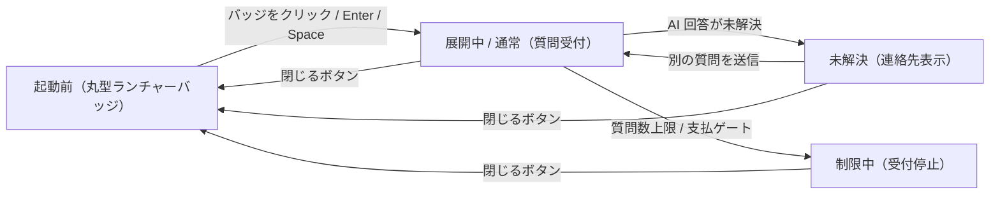

# SCR-030: FAQ ウィジェット

| ID | 画面名 |
|----|----|
| SCR-030 | FAQ ウィジェット |

| 関連項目 | 内容 |
|----|----| 
| 業務ユースケース | [UC-041](../../../01_requirements/04_business_usecases/UC-041.md#UC-041) / [UC-042](../../../01_requirements/04_business_usecases/UC-042.md#UC-042) / [UC-043](../../../01_requirements/04_business_usecases/UC-043.md#UC-043) / [UC-055](../../../01_requirements/04_business_usecases/UC-055.md#UC-055) / [UC-057](../../../01_requirements/04_business_usecases/UC-057.md#UC-057) |
| API | [API-037](../../02_backend/03_apis/API-037.md#API-037) / [API-038](../../02_backend/03_apis/API-038.md#API-038) / [API-039](../../02_backend/03_apis/API-039.md#API-039) / [API-040](../../02_backend/03_apis/API-040.md#API-040) / [API-041](../../02_backend/03_apis/API-041.md#API-041) / [API-046](../../02_backend/03_apis/API-046.md#API-046) |

| ステークホルダ                     | 対象 |
|------------------------------------|------|
| ウィジェット利用者(エンドユーザー) | ◯    |

## 1. 画面概要

- 顧客サイトに埋め込まれたウィジェットから、FAQ 検索・AI 回答の確認・未解決時の連絡先確認を同じ会話欄で行う。
- 対象はウィジェット利用者(エンドユーザー)のみで、管理コンソールではなく顧客サイトへ埋め込まれる UI である。
- 管理用の問い合わせ ID はウィジェットに表示しない。
- 主要な表示状態は通常(質問受付)・未解決(連絡先表示)・受付制限中・処理エラーである。

## 2. 画面遷移図

本ウィジェットの状態遷移を、状態名と契機(操作・結果)で示します。開閉状態と会話状態を遷移ノードとして表します。

## 3. 画面レイアウト

本ウィジェットの代表状態(展開時・最小化時)を示します。

## 4. 画面項目

本ウィジェットが各状態で表示する入出力項目を定義します。

| # | 項目 | 種類 | 必須 | 最大長 | 初期値 | 表示条件 |
|----|----|----|----|----|----|----|
| 1 | 丸型ランチャーバッジ | button | — | — | — | 起動前(最小化時) |
| 2 | 起動前ツールチップ | label | — | — | — | 起動前(最小化時) |
| 3 | ヘッダー(タイトル・状態) | label | — | — | — | 展開時 |
| 4 | 閉じるボタン | button | — | — | — | 展開時 |
| 5 | 会話履歴 | label | — | — | — | 展開時 |
| 6 | AI 回答 | label | — | — | — | 質問送信後 |
| 7 | 回答フィードバック(役に立った / 立たなかった) | button | — | — | — | AI 回答表示時 |
| 8 | 関連質問サジェスト | button | — | — | — | AI 回答表示時 |
| 9 | 質問入力 | textarea | — | 1000 | — | 展開時(受付制限中は無効化) |
| 10 | 送信ボタン | button | — | — | — | 展開時(受付制限中は無効化) |
| 11 | 連絡先メール案内 | label | — | — | — | 未解決・制限中、かつ連絡先設定済み |
| 12 | 受付停止メッセージ | alert | — | — | — | 受付制限中 |
| 13 | エラーメッセージ | alert | — | — | — | 処理エラー発生時 |

## 5. バリデーション

本画面の入力項目に対する検証ルールを定義します。違反がある場合は送信を中止します。

| 画面項目 | タイミング | ルール | エラーコード |
|----|----|----|----|
| #9 | 送信時 | 未入力チェック | EM-01 |
| #9 | 送信時 | 最大長チェック | EM-02 |

## 6. イベント

本画面のイベント(初期表示・各操作・サーバー応答による状態遷移)ごとに、対象の画面項目を定義します。

<table>
<colgroup>
<col style="width: 18%" />
<col style="width: 22%" />
<col style="width: 60%" />
</colgroup>
<thead>
<tr>
<th>EVT-ID</th>
<th>画面項目</th>
<th>イベント</th>
</tr>
</thead>
<tbody>
<tr>
<td>EVT-01</td>
<td>#1</td>
<td>初期表示(ランチャーバッジ)</td>
</tr>
<tr>
<td>EVT-02</td>
<td>#1</td>
<td>ランチャーバッジを押下</td>
</tr>
<tr>
<td>EVT-03</td>
<td>#4</td>
<td>ヘッダーの閉じるボタンを押下</td>
</tr>
<tr>
<td>EVT-04</td>
<td>#10</td>
<td>「送信」を押下</td>
</tr>
<tr>
<td>EVT-05</td>
<td>#11</td>
<td>AI 回答(未解決)を受信</td>
</tr>
<tr>
<td>EVT-06</td>
<td>#12</td>
<td>受付制限を受信</td>
</tr>
<tr>
<td>EVT-07</td>
<td>#13</td>
<td>処理エラーを受信</td>
</tr>
</tbody>
</table>

## 7. 画面イベント詳細

各イベントの処理内容を定義します。

<table>
<colgroup>
<col style="width: 14%" />
<col style="width: 86%" />
</colgroup>
<thead>
<tr>
<th>EVT-ID</th>
<th>処理</th>
</tr>
</thead>
<tbody>
<tr>
<td>EVT-01</td>
<td>顧客サイトに組み込まれると、丸型ランチャーバッジ(#1)と起動前ツールチップ(#2)を右下固定で表示する</td>
</tr>
<tr>
<td>EVT-02</td>
<td>ランチャーバッジ押下時にチャット UI を展開し、<a href="../../02_backend/03_apis/API-037.md#API-037">ウィジェット起動(API-037)</a> を行う:<pre>
┣ 成功: ヘッダー(#3)・会話履歴(#5)・質問入力(#9)・送信ボタン(#10)を表示する
┗ 失敗: エラーメッセージ(#13)を表示する(EM-03)
</pre></td>
</tr>
<tr>
<td>EVT-03</td>
<td>ヘッダーの閉じるボタン(#4)押下時にチャット UI を閉じてランチャーバッジ表示へ戻る</td>
</tr>
<tr>
<td>EVT-04</td>
<td>「送信」押下時に <a href="../../02_backend/03_apis/API-038.md#API-038">ウィジェット質問送信(API-038)</a> を行う(§5 のバリデーション違反時は送信を中止する):<pre>
┣ 回答可能: AI 回答(#6)を会話欄に追加表示し、回答フィードバック(#7)・関連質問サジェスト(#8)を表示する
┣ 未解決: 続けて EVT-05 が発生する
┣ 受付制限: 続けて EVT-06 が発生する
┗ 処理エラー: 続けて EVT-07 が発生する
</pre></td>
</tr>
<tr>
<td>EVT-05</td>
<td>AI 回答が未解決の場合に発生する(EVT-04 から続いて発生):<pre>
┣ 回答できなかった旨を会話欄(#5)に追加表示し、<a href="../../02_backend/03_apis/API-039.md#API-039">ウィジェット未解決質問登録(API-039)</a> で質問ログと未解決質問を登録する
┗ 連絡先メールが設定済みの場合は連絡先メール案内(#11)を表示する
</pre>別の質問の入力・送信は引き続き可能</td>
</tr>
<tr>
<td>EVT-06</td>
<td>質問数上限到達または支払方法ゲートによる受付制限を受信した場合に発生する(EVT-04 から続いて発生):受付停止メッセージ(#12)を会話欄に追加表示し、質問入力(#9)・送信ボタン(#10)を無効化する。連絡先メールが設定済みの場合は連絡先メール案内(#11)を表示する</td>
</tr>
<tr>
<td>EVT-07</td>
<td>ウィジェット起動またはウィジェット質問送信で処理エラーが発生した場合に発生する:エラーメッセージ(#13)を表示する(EM-03)。処理エラーは未解決質問として登録しない</td>
</tr>
</tbody>
</table>

## 8. エラーメッセージ

本画面が表示するエラー・警告メッセージを定義します。

| エラーコード | エラーメッセージ |
|----|----|
| EM-01 | 質問を入力してください |
| EM-02 | 質問は 1000 文字以内で入力してください |
| EM-03 | ただいま接続できませんでした。お手数ですが、しばらく経ってから再度お試しください |
