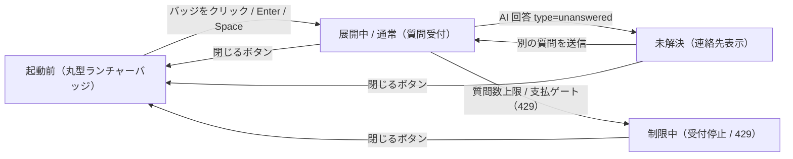

# SCR-030 エンドユーザー向け FAQ ウィジェット

> **このページは、ウィジェット利用者(エンドユーザー)が顧客サイト上で FAQ 検索・AI 回答・問い合わせを行う埋め込み UI を定義します。** 画面概要 / 画面遷移図 / 画面レイアウト / 画面項目定義 / 入出力一覧 / 画面イベント一覧 の 6 セクションで記述します。

## 1. 画面概要

ウィジェット利用者(エンドユーザー)が顧客サイトに埋め込まれたウィジェットから FAQ 検索・AI 回答の確認・未解決時の連絡先確認を、同じ会話欄で行う UI です。初期表示は右下固定の丸型ランチャーバッジで、操作でチャット UI を展開します。

| 画面 ID | 画面名 | 機能概要 |
|----|----|----|
| `SCR-030` | エンドユーザー向け FAQ ウィジェット | エンドユーザーが FAQ 検索・AI 回答・問い合わせを行うウィジェット |

| 関連 | 内容 |
|----|----|
| FR / BR | FR-057〜FR-064, FR-068〜FR-075, FR-089, FR-096, FR-126〜FR-132 / BR(ウィジェット) |
| 関連画面 | [`SCR-011` ウィジェット設定](SCR-011.md)(管理コンソール側でタイトル・連絡先メール等を設定) |
| 対応業務UC | [UC-042](../../../01_requirements/04_business_usecases/UC-042.md#UC-042) ・ [UC-043](../../../01_requirements/04_business_usecases/UC-043.md#UC-043) ・ [UC-044](../../../01_requirements/04_business_usecases/UC-044.md#UC-044) |

| ステークホルダ                     | 対象 |
|------------------------------------|------|
| ウィジェット利用者(エンドユーザー) | ◯    |

> [!NOTE]
> **補足** 本 UI は管理コンソールではなく顧客サイトへ埋め込まれるウィジェットです。開閉状態と会話内容の状態を分けて管理します。管理用の問い合わせ ID はウィジェットに表示しません。

## 2. 画面遷移図

本ウィジェットの状態遷移を、状態名と契機(操作・結果)で示します。開閉状態と会話状態を遷移ノードとして表します。

## 3. 画面レイアウト

## 4. 画面項目定義

本ウィジェットの入出力項目(ランチャーバッジ・ヘッダー・会話履歴・入力・送信・連絡先表示)を定義します。項目の正本は本表です。管理用の問い合わせ ID は描画しません。

| 項目 ID | 項目 | 説明 | 種類 | 表示条件 | 表示 |
|----|----|----|----|----|----|
| `IT-01` | 丸型ランチャーバッジ | 右下固定の丸型バッジでチャット UI を開く。スクリーンリーダー向けに「FAQチャットを開く」を読み上げる | ボタン | — | チャットアイコン |
| `IT-02` | ヘッダー | ウィジェットタイトル・現在状態・閉じるボタンを表示する。利用規約等の導線は表示しない | 見出し | — | タイトル、状態(オンライン / 質問受付中 / 新しい質問の受付を停止中 等) |
| `IT-03` | 閉じるボタン | チャット UI を閉じてバッジ表示へ戻る。`aria-label="FAQチャットを閉じる"` | アイコンボタン | — | 閉じるアイコン |
| `IT-04` | 会話履歴 | 質問・AI 回答・システム返信を時系列で表示する | タイムライン | — | 質問 / AI 回答 / システム返信の時系列 |
| `IT-05` | 質問入力 | FAQ 質問のテキストを入力する。通常状態・未解決表示後は入力可 | テキストエリア | 受付制限中(質問数上限到達または支払方法ゲート)の場合は無効化 | — |
| `IT-06` | 送信 | 入力した質問を送信する。通常状態・未解決表示後は活性 | ボタン | 受付制限中(質問数上限到達または支払方法ゲート)の場合は無効化 | 送信 |
| `IT-07` | AI 回答 | 登録 FAQ に基づく回答を同じ会話欄に追加表示する | ラベル | — | AI 回答文 |
| `IT-08` | 連絡先メール表示 | 未解決・制限中に確認済みプロジェクト連絡先メールを案内表示する | ラベル | 未解決・制限中、かつ連絡先設定済みの場合のみ表示 | 「必要に応じて、下記のお問い合わせ先までメールでご連絡ください。」+ 連絡先メールアドレス |
| `IT-09` | 受付停止メッセージ | 受付停止と問い合わせ先を表示する(連絡先未設定時は再試行案内に差し替え) | アラート | 受付制限中の場合に表示 | 「ただいま新しいご質問をお受けできません。お手数ですが、下記のお問い合わせ先までメールでご連絡ください。」+ 連絡先メールアドレス |
| `IT-10` | エラーメッセージ | 処理エラー発生時(通信障害・上流障害・認可エラー等)にエラー内容と再試行案内を表示するアラート領域 | アラート | 処理エラー発生時に表示 | エラー内容を説明するメッセージ + 再試行案内 |

## 5. 入出力一覧

本ウィジェットが呼び出す公開 API の一覧です。公開 API のベースは `/widget/v1/...`、正本は [API設計(ウィジェット API 群)](../../02_backend/03_apis/index.md)です(各 API の節は下表の行リンク先を正とします)。ウィジェットはサーバ経由でテーブルへアクセスし、直接の永続更新は行いません。

<table>
<thead>
<tr>
<th rowspan="2">入出力名</th>
<th rowspan="2">説明</th>
<th rowspan="2">種別</th>
<th rowspan="2">I/O</th>
<th colspan="4">アクセス種別(CRUD)</th>
<th rowspan="2">備考</th>
</tr>
<tr>
<th>C</th>
<th>R</th>
<th>U</th>
<th>D</th>
</tr>
</thead>
<tbody>
<tr>
<td>ウィジェット起動</td>
<td>セッションを確立しウィジェット設定を取得する</td>
<td>API</td>
<td>入力</td>
<td>—</td>
<td>—</td>
<td>—</td>
<td>—</td>
<td><code>POST /widget/v1/bootstrap</code>(<a href="../../02_backend/03_apis/index.md#API-037">API 設計 5.5.1</a>)</td>
</tr>
<tr>
<td>質問送信</td>
<td>質問を送信し AI 回答を取得する(<code>type=unanswered</code> で未解決遷移)</td>
<td>API</td>
<td>入出力</td>
<td>◯</td>
<td>◯</td>
<td>—</td>
<td>—</td>
<td><code>POST /widget/v1/ask</code>(<a href="../../02_backend/03_apis/API-038.md#API-038">ウィジェット質問送信</a>)</td>
</tr>
<tr>
<td>未解決質問登録</td>
<td>未解決時に質問ログ・未解決質問を登録する(問い合わせ ID は非表示)</td>
<td>API</td>
<td>出力</td>
<td>◯</td>
<td>◯</td>
<td>—</td>
<td>—</td>
<td><code>POST /widget/v1/inquiries</code>(<a href="../../02_backend/03_apis/API-039.md#API-039">ウィジェット未解決質問登録</a>)</td>
</tr>
</tbody>
</table>

## 6. 画面イベント一覧

本画面のイベント(利用者の明示的操作およびサーバー応答による状態遷移)ごとに、対象の項目 ID と処理内容を定義します。

<table>
<colgroup>
<col style="width: 10%" />
<col style="width: 12%" />
<col style="width: 12%" />
<col style="width: 30%" />
<col style="width: 46%" />
</colgroup>
<thead>
<tr>
<th>EVT-ID</th>
<th>イベント ID</th>
<th>項目 ID</th>
<th>イベント</th>
<th>処理</th>
</tr>
</thead>
<tbody>
<tr>
<td>EVT-221</td>
<td><code>EV-01</code></td>
<td>—</td>
<td>初期表示</td>
<td>ウィジェットスクリプトが顧客サイトに組み込まれると、ランチャーバッジ(<a href="#IT-01">IT-01</a>)を右下固定で表示する</td>
</tr>
<tr>
<td>EVT-222</td>
<td><code>EV-02</code></td>
<td><a href="#IT-01">IT-01</a></td>
<td>ランチャーバッジを押下</td>
<td><ul>
<li>バッジを非表示にしチャット UI を展開する(キーボード操作 Enter / Space キーによる起動も同等に扱う)</li>
<li><a href="../../02_backend/03_apis/API-037.md#API-037">ウィジェット起動</a> API でセッションを確立し、ウィジェット設定(タイトル・連絡先メール等)を取得する</li>
<li>失敗時: エラーメッセージを会話欄に表示し、再試行案内を行う(連打防止付き)</li>
</ul></td>
</tr>
<tr>
<td>EVT-223</td>
<td><code>EV-03</code></td>
<td><a href="#IT-03">IT-03</a></td>
<td>ヘッダーの閉じるボタンを押下</td>
<td>チャット UI を閉じてランチャーバッジ表示へ戻る。同一ページ内では会話履歴・入力内容・受付状態を保持する</td>
</tr>
<tr>
<td>EVT-224</td>
<td><code>EV-04</code></td>
<td><a href="#IT-05">IT-05</a></td>
<td>質問を入力</td>
<td>テキストエリアに質問文を入力する。受付制限中(<code>EV-07</code> 後)は入力欄が無効化されているため操作不可</td>
</tr>
<tr>
<td>EVT-225</td>
<td><code>EV-05</code></td>
<td><a href="#IT-06">IT-06</a></td>
<td>「送信」を押下</td>
<td><ul>
<li><a href="../../02_backend/03_apis/API-038.md#API-038">ウィジェット質問送信</a> API で質問を送信し、AI 回答を同じ会話欄に追加表示する</li>
<li>受付制限中は送信ボタンが無効化されているため操作不可</li>
<li>回答結果が未解決(<code>type=unanswered</code>)の場合は続けて EV-06 の処理が発生する</li>
<li>受付制限(429)を受信した場合は続けて EV-07 の処理が発生する</li>
<li>処理エラーの場合は続けて EV-08 の処理が発生する</li>
</ul></td>
</tr>
<tr>
<td>EVT-226</td>
<td><code>EV-06</code></td>
<td><a href="#IT-08">IT-08</a></td>
<td>AI 回答(未解決)を受信</td>
<td><ul>
<li><a href="../../02_backend/03_apis/API-038.md#API-038">ウィジェット質問送信</a> API のレスポンスが <code>type=unanswered</code> の場合に発生する(EV-05 の結果として続いて処理される)</li>
<li>回答できなかった旨をシステム返信として会話欄に追加表示する</li>
<li><a href="../../02_backend/03_apis/API-039.md#API-039">ウィジェット未解決質問登録</a> API を呼び出し、質問ログと未解決質問を登録する</li>
<li>確認済みプロジェクト連絡先メールが設定済みの場合は連絡先メールを案内表示する(<a href="#IT-08">IT-08</a>)</li>
<li>管理用の問い合わせ ID はウィジェットに表示しない</li>
<li>別の質問の入力・送信は引き続き可能(EV-04 / EV-05 へ戻れる)</li>
</ul></td>
</tr>
<tr>
<td>EVT-227</td>
<td><code>EV-07</code></td>
<td><a href="#IT-09">IT-09</a></td>
<td>受付制限(429)を受信</td>
<td><ul>
<li><a href="../../02_backend/03_apis/API-038.md#API-038">ウィジェット質問送信</a> API から質問数上限到達または支払方法ゲートによる 429 を受信した場合に発生する(EV-05 の結果として続いて処理される)</li>
<li>受付停止メッセージをシステム返信として会話欄に追加表示する(<a href="#IT-09">IT-09</a>)</li>
<li>確認済みプロジェクト連絡先メールが設定済みの場合は連絡先メールを案内表示する(<a href="#IT-08">IT-08</a>)</li>
<li>質問入力欄(<a href="#IT-05">IT-05</a>)および送信ボタン(<a href="#IT-06">IT-06</a>)を無効化する</li>
</ul></td>
</tr>
<tr>
<td>EVT-228</td>
<td><code>EV-08</code></td>
<td><a href="#IT-10">IT-10</a></td>
<td>処理エラーを受信</td>
<td><ul>
<li><a href="../../02_backend/03_apis/API-037.md#API-037">ウィジェット起動</a> または <a href="../../02_backend/03_apis/API-038.md#API-038">ウィジェット質問送信</a> API の処理エラー(通信障害・上流障害・認可エラー等)が発生した場合に発生する</li>
<li>エラーメッセージを会話欄または UI 内に表示する(<a href="#IT-10">IT-10</a>)</li>
<li>再試行が妥当な場合は再試行案内を表示する(連打防止付き)</li>
<li>処理エラーは未解決質問として自動登録しない(未解決登録分岐とは区別する)</li>
</ul></td>
</tr>
</tbody>
</table>
