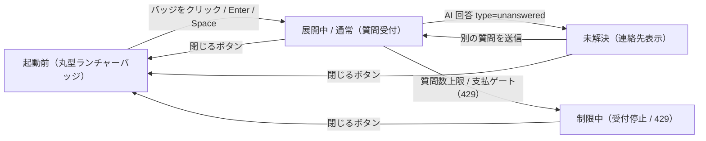
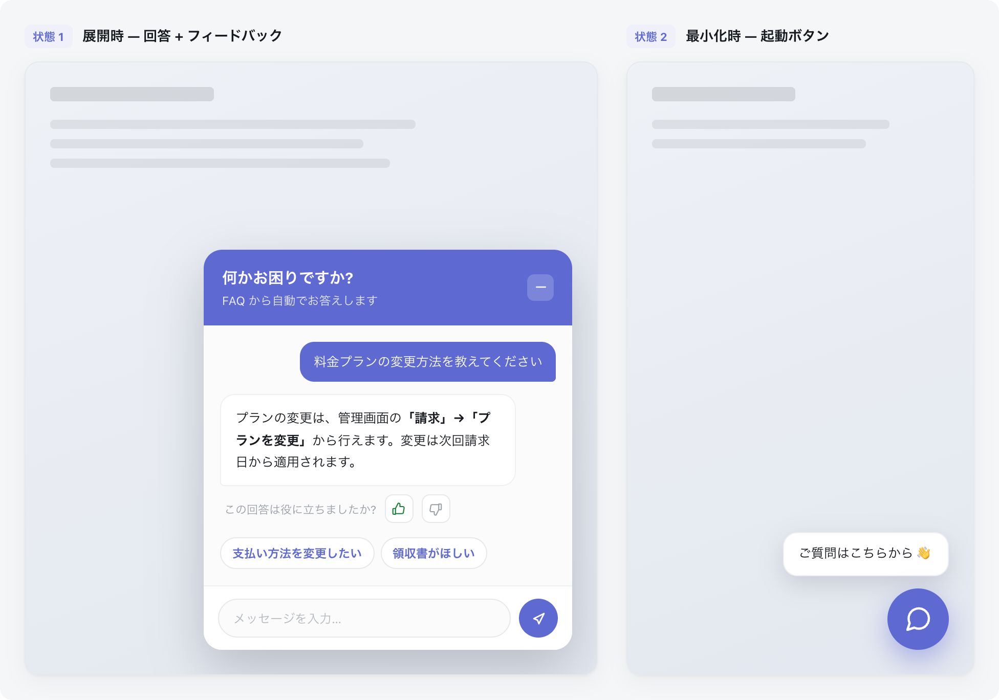

| 画面 ID | 画面名 | トレーサビリティID |
|----|----|----|
| SCR-030 | エンドユーザー向け FAQ ウィジェット | [TR-041](../../00_traceability/index.md#TR-041) ・ [TR-042](../../00_traceability/index.md#TR-042) ・ [TR-043](../../00_traceability/index.md#TR-043) |

| ステークホルダ                     | 対象 |
|------------------------------------|------|
| ウィジェット利用者(エンドユーザー) | ◯    |

## 1. 画面概要

ウィジェット利用者(エンドユーザー)が顧客サイトに埋め込まれたウィジェットから、FAQ 検索・AI 回答の確認・未解決時の連絡先確認を同じ会話欄で行う UI です。初期表示は右下固定の丸型ランチャーバッジで、操作でチャット UI を展開します。

> [!NOTE]
> **補足** 本 UI は管理コンソールではなく顧客サイトへ埋め込まれるウィジェットです。開閉状態と会話内容の状態を分けて管理します。管理用の問い合わせ ID はウィジェットに表示しません。

## 2. 画面遷移図

本ウィジェットの状態遷移を、状態名と契機(操作・結果)で示します。開閉状態と会話状態を遷移ノードとして表します。

## 3. 画面レイアウト

本ウィジェットの代表状態(展開時・最小化時)を示します。未解決・受付制限中・エラーの各状態は §4 の `表示条件` で定義します。

## 4. 画面項目

本ウィジェットが各状態で表示する入出力項目を定義します。`表示条件` は項目が表示される状態を示します。管理用の問い合わせ ID は描画しません。

| # | 項目 | 種類 | 必須 | 最大長 | 初期値 | 表示条件 |
|----|----|----|----|----|----|----|
| 1 | 丸型ランチャーバッジ | button | — | — | — | 起動前(最小化時) |
| 2 | 起動前ツールチップ | div | — | — | — | 起動前(最小化時) |
| 3 | ヘッダー(タイトル・状態) | div | — | — | — | 展開時 |
| 4 | 閉じるボタン | button | — | — | — | 展開時 |
| 5 | 会話履歴 | div | — | — | — | 展開時 |
| 6 | AI 回答 | div | — | — | — | 質問送信後 |
| 7 | 回答フィードバック(役に立った / 立たなかった) | button | — | — | — | AI 回答表示時 |
| 8 | 関連質問サジェスト | button | — | — | — | AI 回答表示時 |
| 9 | 質問入力 | textarea | — | 1000 | — | 展開時(受付制限中は無効化) |
| 10 | 送信ボタン | button | — | — | — | 展開時(受付制限中は無効化) |
| 11 | 連絡先メール案内 | div | — | — | — | 未解決・制限中、かつ連絡先設定済み |
| 12 | 受付停止メッセージ | alert | — | — | — | 受付制限中 |
| 13 | エラーメッセージ | alert | — | — | — | 処理エラー発生時 |

## 5. バリデーション

本画面の入力項目に対する検証ルールを定義します。違反がある場合は送信を中止します。

| 画面項目 | タイミング | ルール | エラーコード |
|----|----|----|----|
| #9 | 送信時 | 未入力チェック | EM-01 |
| #9 | 送信時 | 最大長チェック | EM-02 |

## 6. イベント

本画面のイベント(初期表示・各操作・サーバー応答による状態遷移)ごとに、対象の画面項目を定義します。各イベントの処理内容は [7. 画面イベント詳細](#7-画面イベント詳細) で定義します。

<table>
<colgroup>
<col style="width: 18%" />
<col style="width: 22%" />
<col style="width: 60%" />
</colgroup>
<thead>
<tr>
<th>EVT-ID</th>
<th>画面項目</th>
<th>イベント</th>
</tr>
</thead>
<tbody>
<tr>
<td>EVT-191</td>
<td>#1</td>
<td>初期表示(ランチャーバッジ)</td>
</tr>
<tr>
<td>EVT-192</td>
<td>#1</td>
<td>ランチャーバッジを押下</td>
</tr>
<tr>
<td>EVT-193</td>
<td>#4</td>
<td>ヘッダーの閉じるボタンを押下</td>
</tr>
<tr>
<td>EVT-194</td>
<td>#10</td>
<td>「送信」を押下</td>
</tr>
<tr>
<td>EVT-195</td>
<td>#11</td>
<td>AI 回答(未解決)を受信</td>
</tr>
<tr>
<td>EVT-196</td>
<td>#12</td>
<td>受付制限(429)を受信</td>
</tr>
<tr>
<td>EVT-197</td>
<td>#13</td>
<td>処理エラーを受信</td>
</tr>
</tbody>
</table>

## 7. 画面イベント詳細

各イベントの処理内容を定義します。

<table>
<colgroup>
<col style="width: 14%" />
<col style="width: 86%" />
</colgroup>
<thead>
<tr>
<th>EVT-ID</th>
<th>処理</th>
</tr>
</thead>
<tbody>
<tr>
<td>EVT-191</td>
<td>ウィジェットスクリプトが顧客サイトに組み込まれると、丸型ランチャーバッジ(#1)と起動前ツールチップ(#2)を右下固定で表示する。スクリーンリーダー向けに「FAQチャットを開く」を読み上げる</td>
</tr>
<tr>
<td>EVT-192</td>
<td>ランチャーバッジ押下時に次を行う(キーボード操作 Enter / Space キーによる起動も同等に扱う):<pre>
1. バッジ(#1)を非表示にしチャット UI を展開する
2. <a href="../../02_backend/03_apis/API-037.md#API-037">ウィジェット起動</a> API(POST /widget/v1/bootstrap)でセッションを確立し、ウィジェット設定(タイトル・連絡先メール等)を取得する
3. 結果で分岐する
   ┣ 成功: ヘッダー(#3)・会話履歴(#5)・質問入力(#9)・送信ボタン(#10)を表示する
   ┗ 失敗: エラーメッセージ(#13)を会話欄に表示し、再試行案内を行う(連打防止付き)(EM-03)
</pre></td>
</tr>
<tr>
<td>EVT-193</td>
<td>ヘッダーの閉じるボタン(#4)押下時にチャット UI を閉じてランチャーバッジ表示へ戻る。同一ページ内では会話履歴・入力内容・受付状態を保持する</td>
</tr>
<tr>
<td>EVT-194</td>
<td>「送信」押下時に次を行う:<pre>
1. §5 のバリデーションを評価し、違反時は #9 直下にエラーを表示して中止する(EM-01 / EM-02)
2. <a href="../../02_backend/03_apis/API-038.md#API-038">ウィジェット質問送信</a> API(POST /widget/v1/ask)で質問を送信する
3. 結果で分岐する
   ┣ 回答可能: AI 回答(#6)を同じ会話欄に追加表示し、回答フィードバック(#7)・関連質問サジェスト(#8)を表示する
   ┣ 未解決(type=unanswered): 続けて EVT-195 の処理が発生する
   ┣ 受付制限(429): 続けて EVT-196 の処理が発生する
   ┗ 処理エラー: 続けて EVT-197 の処理が発生する
</pre>受付制限中は送信ボタン(#10)が無効化されているため操作不可</td>
</tr>
<tr>
<td>EVT-195</td>
<td>AI 回答が未解決(type=unanswered)の場合に発生する(EVT-194 の結果として続いて処理される):<pre>
1. 回答できなかった旨をシステム返信として会話欄(#5)に追加表示する
2. <a href="../../02_backend/03_apis/API-039.md#API-039">ウィジェット未解決質問登録</a> API(POST /widget/v1/inquiries)を呼び出し、質問ログと未解決質問を登録する
3. 確認済みプロジェクト連絡先メールが設定済みの場合は連絡先メール案内(#11)を表示する
</pre>管理用の問い合わせ ID はウィジェットに表示しない。別の質問の入力・送信は引き続き可能</td>
</tr>
<tr>
<td>EVT-196</td>
<td>ウィジェット質問送信 API から質問数上限到達または支払方法ゲートによる 429 を受信した場合に発生する(EVT-194 の結果として続いて処理される):<pre>
1. 受付停止メッセージ(#12)をシステム返信として会話欄に追加表示する
   ┣ 連絡先設定済み: 連絡先メール案内(#11)を表示する
   ┗ 連絡先未設定: 再試行案内へ差し替える
2. 質問入力(#9)および送信ボタン(#10)を無効化する
</pre></td>
</tr>
<tr>
<td>EVT-197</td>
<td>ウィジェット起動またはウィジェット質問送信 API の処理エラー(通信障害・上流障害・認可エラー等)が発生した場合に発生する:<pre>
1. エラーメッセージ(#13)を会話欄または UI 内に表示する(EM-03)
2. 再試行が妥当な場合は再試行案内を表示する(連打防止付き)
</pre>処理エラーは未解決質問として自動登録しない(未解決登録分岐とは区別する)</td>
</tr>
</tbody>
</table>

## 8. エラーメッセージ

本画面が表示するエラー・警告メッセージを定義します。

| エラーコード | エラーメッセージ |
|----|----|
| EM-01 | 質問を入力してください |
| EM-02 | 質問は 1000 文字以内で入力してください |
| EM-03 | ただいま接続できませんでした。お手数ですが、しばらく経ってから再度お試しください |
