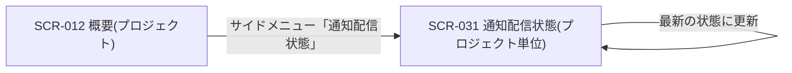

| 画面 ID | 画面名 | トレーサビリティID |
|----|----|----|
| SCR-031 | 通知配信状態(プロジェクト単位) | [TR-082](../../00_traceability/index.md#TR-082) ・ [TR-083](../../00_traceability/index.md#TR-083) |

| ステークホルダ | 対象 |
|----------------|------|
| オーナー       | ◯    |
| メンバー       | ◯    |

## 1. 画面概要

当該プロジェクトのメール通知について、各通知が相手に届いたか・失敗や停止が起きていないかを配信状態として確認し、失敗件数・バウンス件数を把握する画面です。配信状態は通知種別ごとに区分して一覧表示します。

> [!NOTE]
> **補足** 閲覧は、オーナー / 当該プロジェクトのメンバーが行えます。本画面は配信状態の確認(参照)のみを扱い、再送・抑制解除などの操作は持ちません。配信状態の集計は準リアルタイムです。当該プロジェクトに割当のないユーザーの URL 直アクセスは権限不足表示とします。

## 2. 画面遷移図

本画面からの画面遷移を、画面 ID・画面名とイベント(操作)で示します。

## 3. 画面レイアウト

本画面の代表状態(通常時)を示します。集計前 / 取得失敗時の空状態・権限不足ガードは §4 の `表示条件` で定義します。

## 4. 画面項目

本画面が各状態で表示する表示・操作項目を定義します。`表示条件` は項目が表示される状態を示します。

| # | 項目 | 種類 | 必須 | 最大長 | 初期値 | 表示条件 |
|----|----|----|----|----|----|----|
| 1 | 画面見出し(通知配信状態) | div | — | — | — | — |
| 2 | 集計対象期間・最終更新日時 | div | — | — | — | — |
| 3 | 最新の状態に更新ボタン | button | — | — | — | — |
| 4 | 送信済み件数カード | div | — | — | — | — |
| 5 | 配信済み件数カード | div | — | — | — | — |
| 6 | 失敗件数カード | div | — | — | — | — |
| 7 | バウンス件数カード | div | — | — | — | — |
| 8 | 配信状態の内訳テーブル | div | — | — | — | — |
| 9 | 空状態表示 | div | — | — | — | 集計前 / 取得失敗時 |
| 10 | 権限不足ガード | div | — | — | — | 当該プロジェクトに割当のないユーザーが URL に直接アクセスした場合 |

**#8 配信状態の内訳テーブルの列**: 通知種別 / 送信待ち / 送信済み / 配信済み / 失敗 / バウンス / 苦情 / 送信停止(通知種別ごとに各状態の件数を行表示)

## 5. バリデーション

本画面は配信状態の確認(参照)のみを扱い、入力項目を持ちません。(本画面に入力検証はありません)

## 6. イベント

本画面のイベント(初期表示・各操作)ごとに、対象の画面項目を定義します。各イベントの処理内容は [7. 画面イベント詳細](#7-画面イベント詳細) で定義します。

<table>
<colgroup>
<col style="width: 18%" />
<col style="width: 22%" />
<col style="width: 60%" />
</colgroup>
<thead>
<tr>
<th>EVT-ID</th>
<th>画面項目</th>
<th>イベント</th>
</tr>
</thead>
<tbody>
<tr>
<td>EVT-203</td>
<td>—</td>
<td>初期表示</td>
</tr>
<tr>
<td>EVT-204</td>
<td>#3</td>
<td>「最新の状態に更新」を押下</td>
</tr>
<tr>
<td>EVT-205</td>
<td>#10</td>
<td>URL へ直接アクセス(権限不足)</td>
</tr>
</tbody>
</table>

## 7. 画面イベント詳細

各イベントの処理内容を定義します。

<table>
<colgroup>
<col style="width: 14%" />
<col style="width: 86%" />
</colgroup>
<thead>
<tr>
<th>EVT-ID</th>
<th>処理</th>
</tr>
</thead>
<tbody>
<tr>
<td>EVT-203</td>
<td>初期表示時に <a href="../../02_backend/03_apis/API-061.md#API-061">通知配信状態サマリ</a> API(GET /notifications/delivery-status?projectId={id})で当該プロジェクトの配信実績を集計し、結果で分岐する<pre>
 ┣ 取得成功: 集計対象期間・最終更新(#2)・件数カード(#4・#5・#6・#7)・配信状態の内訳テーブル(#8)を表示する
 ┗ 集計前 / 取得失敗: 空状態表示(#9)を表示する(集計前は「集計中です」、取得失敗はフォールバック表示)
</pre></td>
</tr>
<tr>
<td>EVT-204</td>
<td>「最新の状態に更新」押下時に <a href="../../02_backend/03_apis/API-061.md#API-061">通知配信状態サマリ</a> API を再取得し、集計対象期間・最終更新(#2)・件数カード(#4・#5・#6・#7)・配信状態の内訳テーブル(#8)を最新化する</td>
</tr>
<tr>
<td>EVT-205</td>
<td>当該プロジェクトに割当のないユーザーが URL へ直接アクセスした場合は権限不足ガード(#10)で権限不足表示とし、ダッシュボードへ誘導する</td>
</tr>
</tbody>
</table>

## 8. エラーメッセージ

本画面はエラー・警告メッセージを表示しません。
