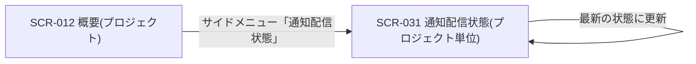
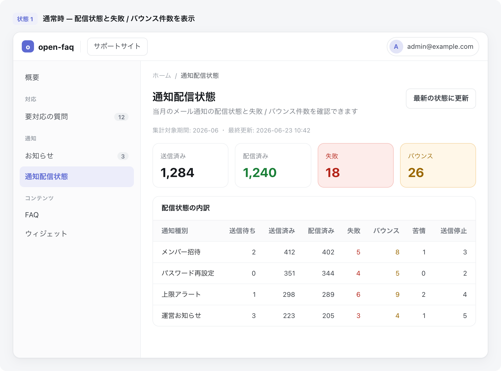

# SCR-031 通知配信状態(プロジェクト単位)

> **このページは、当該プロジェクトのメール通知について、配信状態の内訳と失敗・バウンス件数を確認する画面 SCR-031 を定義します。** 画面概要 / 画面遷移図 / 画面レイアウト / 画面項目定義 / 入出力一覧 / 画面イベント一覧 の 6 セクションで記述します。

## 1. 画面概要

当該プロジェクトのメール通知について、各通知が相手に届いたか・失敗や停止が起きていないかを配信状態として確認し、失敗件数・バウンス件数を把握する画面です。配信状態は通知種別ごとに区分して一覧表示します。

| 画面 ID | 画面名 | 機能概要 |
|----|----|----|
| `SCR-031` | 通知配信状態(プロジェクト単位) | 当該プロジェクトの通知配信実績を集計し、配信状態の内訳と失敗・バウンス件数を表示する |

| 項目 | 内容 |
|----|----|
| トレーサビリティID | [TR-083](../../00_traceability/index.md#TR-083) ・ [TR-084](../../00_traceability/index.md#TR-084) |

| ステークホルダ | 対象 |
|----------------|------|
| オーナー       | ◯    |
| メンバー       | ◯    |

> [!NOTE]
> **補足** 閲覧は、オーナー / 当該プロジェクトのメンバーが行えます。本画面は配信状態の確認(参照)のみを扱い、再送・抑制解除などの操作は持ちません。配信状態の集計は準リアルタイムです。当該プロジェクトに割当のないユーザーの URL 直アクセスは権限不足表示とします。

## 2. 画面遷移図

本画面からの画面遷移を、画面 ID・画面名とイベント(操作)で示します。

## 3. 画面レイアウト

## 4. 画面項目定義

本画面の表示・操作項目を定義します。項目の正本は本表です。

| 項目 ID | 項目 | 説明 | 種類 | 表示条件 | 表示 |
|----|----|----|----|----|----|
| `IT-01` | PageHeader | 画面見出しと集計対象期間・最終更新を表示する | 見出し | — | 通知配信状態、集計対象期間、最終更新日時 |
| `IT-02` | 件数サマリー | 送信済み・配信済み・失敗・バウンスの件数を表示する | カード | — | 送信済み / 配信済み / 失敗 / バウンスの各件数 |
| `IT-03` | 配信状態内訳 | 通知種別ごとに配信状態(送信待ち・送信済み・配信済み・失敗・バウンス・苦情・送信停止)を区分して一覧表示する | テーブル | — | 通知種別別の各状態件数 |
| `IT-04` | 更新 | 配信実績を再集計して最新の状態に更新する | ボタン | — | 最新の状態に更新 |
| `IT-05` | 空状態 | 集計前・取得失敗時の空状態を表示する | 空状態表示 | 集計前 / 取得失敗時 | 集計前は「集計中です」、取得失敗はフォールバック表示 |
| `IT-06` | 権限不足ガード | 当該プロジェクトに割当のないユーザーは閲覧不可とし、URL 直アクセス時に権限不足表示とする | 権限ガード | 当該プロジェクトに割当のないユーザーが URL に直接アクセスした場合 | — |

## 5. 入出力一覧

本画面が読み書きするテーブルと、呼び出す API の一覧です。テーブルの正本は [データベース設計](../../02_backend/04_database/index.md)、API の正本は [通知配信状態サマリ](../../02_backend/03_apis/API-061.md#API-061) です。

<table>
<thead>
<tr>
<th rowspan="2">入出力名</th>
<th rowspan="2">説明</th>
<th rowspan="2">種別</th>
<th rowspan="2">I/O</th>
<th colspan="4">アクセス種別(CRUD)</th>
<th rowspan="2">備考</th>
</tr>
<tr>
<th>C</th>
<th>R</th>
<th>U</th>
<th>D</th>
</tr>
</thead>
<tbody>
<tr>
<td>通知ログ</td>
<td>通知の送信・配信状態の実績を取得する</td>
<td>テーブル</td>
<td>入力</td>
<td>—</td>
<td>◯</td>
<td>—</td>
<td>—</td>
<td><code>H_NOTIF_LOGS</code>(<a href="../../02_backend/04_database/index.md#TBL-026">テーブル設計</a>)</td>
</tr>
<tr>
<td>メールサプレスリスト</td>
<td>送信停止(抑制)対象を取得する</td>
<td>テーブル</td>
<td>入力</td>
<td>—</td>
<td>◯</td>
<td>—</td>
<td>—</td>
<td><code>M_EMAIL_SUPPRESS</code>(<a href="../../02_backend/04_database/index.md#TBL-007">テーブル設計</a>)</td>
</tr>
<tr>
<td>配信状態取得</td>
<td>当該プロジェクトの通知配信状態を集計して取得する</td>
<td>API</td>
<td>入力</td>
<td>—</td>
<td>—</td>
<td>—</td>
<td>—</td>
<td><code>GET /notifications/delivery-status?projectId={id}</code>(<a href="../../02_backend/03_apis/API-061.md#API-061">通知配信状態サマリ</a>)</td>
</tr>
</tbody>
</table>

## 6. 画面イベント一覧

本画面のイベント(初期表示・各操作)ごとに、対象の項目 ID と処理内容を定義します。

<table>
<colgroup>
<col style="width: 10%" />
<col style="width: 12%" />
<col style="width: 12%" />
<col style="width: 30%" />
<col style="width: 46%" />
</colgroup>
<thead>
<tr>
<th>EVT-ID</th>
<th>イベント ID</th>
<th>項目 ID</th>
<th>イベント</th>
<th>処理</th>
</tr>
</thead>
<tbody>
<tr>
<td>EVT-228</td>
<td><code>EV-01</code></td>
<td>—</td>
<td>初期表示</td>
<td><ul>
<li><a href="../../02_backend/03_apis/API-061.md#API-061">通知配信状態サマリ</a> で当該プロジェクトの配信実績を集計し <a href="#IT-02">IT-02</a>・<a href="#IT-03">IT-03</a> に表示する</li>
<li>集計前 / 取得失敗時: <a href="#IT-05">IT-05</a> 空状態を表示する</li>
</ul></td>
</tr>
<tr>
<td>EVT-229</td>
<td><code>EV-02</code></td>
<td><a href="#IT-04">IT-04</a></td>
<td>「最新の状態に更新」を押下</td>
<td><a href="../../02_backend/03_apis/API-061.md#API-061">通知配信状態サマリ</a> を再取得し <a href="#IT-02">IT-02</a>・<a href="#IT-03">IT-03</a> を最新化する</td>
</tr>
<tr>
<td>EVT-230</td>
<td><code>EV-03</code></td>
<td><a href="#IT-06">IT-06</a></td>
<td>URL へ直接アクセス(権限不足)</td>
<td>権限不足表示とし、ダッシュボードへ誘導する</td>
</tr>
</tbody>
</table>
