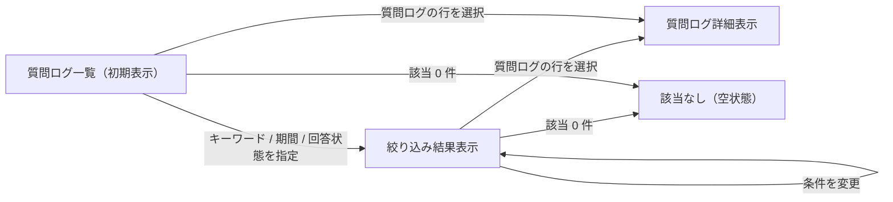

# SCR-032 質問ログ

> **このページは、プロジェクトの質問ログをキーワード・対象期間・回答状態で検索し、作成日時の新しい順に一覧表示する画面 SCR-032 を定義します。** 画面概要 / 画面遷移図 / 画面レイアウト / 画面項目定義 / 入出力一覧 / 画面イベント一覧 の 6 セクションで記述します。

## 1. 画面概要

現在開いているプロジェクトの質問ログを、キーワード・対象期間・回答状態の条件で絞り込み、作成日時の新しい順に一覧表示する画面です。過去の問い合わせ内容の確認や未解決質問の傾向把握に用います。

| 画面 ID | 画面名 | 機能概要 |
|----|----|----|
| `SCR-032` | 質問ログ | 質問ログをキーワード・期間・回答状態で検索し、作成日時降順で一覧表示する |

| 関連 | 内容 |
|----|----|
| FR / BR | FR-168 / BR-116, BR-117, BR-118, BR-119 |
| 関連画面 | — |
| 対応業務UC | [UC-083](../../../01_requirements/04_business_usecases/UC-083.md#UC-083) |

| ステークホルダ | 対象 |
|----------------|------|
| オーナー       | ◯    |
| メンバー       | ◯    |

> [!NOTE]
> **補足** 各ステークホルダとも当該プロジェクトへの割当が前提です。検索範囲は現在開いているプロジェクトの質問ログに限定されます。一覧表に行内の「操作」列は設けず、行の選択で詳細を確認します。

## 2. 画面遷移図

本画面内の状態遷移を、状態名と契機(操作・結果)で示します。検索条件の指定と行選択による詳細表示を遷移として表します。

## 3. 画面レイアウト

## 4. 画面項目定義

本画面の入出力項目(検索条件・一覧の列・件数表示・詳細表示・空状態を含む)を定義します。項目の正本は本表です。一覧表に「操作」列は設けず、詳細確認は行の選択に集約します。

| 項目 ID | 項目 | 説明 | 種類 | 表示条件 | 表示 |
|----|----|----|----|----|----|
| `IT-01` | キーワード検索 | 質問本文をキーワードで絞り込む | テキストボックス | — | プレースホルダ「質問を検索」 |
| `IT-02` | 対象期間(開始) | 検索対象期間の開始日時を指定する | 日付入力 | — | 開始日(空のとき下限なし) |
| `IT-03` | 対象期間(終了) | 検索対象期間の終了日時を指定する | 日付入力 | — | 終了日(空のとき上限なし) |
| `IT-04` | 回答状態フィルタ | 回答有無で一覧を絞り込む | ドロップダウン | — | 「すべて」/「回答あり」/「該当なし」 |
| `IT-05` | 質問本文 | 質問ログの質問文を先頭から表示する | ラベル | — | 質問文 |
| `IT-06` | 回答有無バッジ | 回答有無を色とラベルで表示する(色のみ依存禁止) | バッジ | — | 「回答あり」/「該当なし」 |
| `IT-07` | 確信度 | 回答の確信度スコアを表示する | ラベル | — | 確信度スコア |
| `IT-08` | 問い合わせ ID | 関連する未解決質問の ID を表示する(無い場合は非表示) | ラベル | 関連する未解決質問がある場合のみ表示 | 問い合わせ ID(`inq_…` 形式) |
| `IT-09` | 作成日時 | 質問の作成日時を表示する | ラベル | — | 作成日時 |
| `IT-10` | 件数表示 | 表示中の件数を表示する | ラベル | — | 「全 NN 件」形式 |
| `IT-11` | もっと見る | カーソルで次ページの質問ログを追加取得する | ボタン | 次ページがある場合のみ表示 | 「もっと見る」 |
| `IT-12` | 空状態 | 条件に合致する質問ログが 0 件のとき該当なしを表示する | 空状態表示 | 検索結果 0 件時のみ表示 | 「条件に一致する質問ログはありません。」 |

## 5. 入出力一覧

本画面が読み書きするテーブルと、呼び出す API の一覧です。テーブルの正本は [データベース設計](../../02_backend/04_database/index.md)、API の正本は [API設計](../../02_backend/03_apis/index.md#API-032) です。

<table>
<thead>
<tr>
<th rowspan="2">入出力名</th>
<th rowspan="2">説明</th>
<th rowspan="2">種別</th>
<th rowspan="2">I/O</th>
<th colspan="4">アクセス種別(CRUD)</th>
<th rowspan="2">備考</th>
</tr>
<tr>
<th>C</th>
<th>R</th>
<th>U</th>
<th>D</th>
</tr>
</thead>
<tbody>
<tr>
<td>質問ログ</td>
<td>検索条件に一致する質問ログを取得する</td>
<td>テーブル</td>
<td>入力</td>
<td>—</td>
<td>◯</td>
<td>—</td>
<td>—</td>
<td><code>H_QUESTION_LOGS</code>(<a href="../../02_backend/04_database/index.md#TBL-025">質問ログ</a>)</td>
</tr>
<tr>
<td>質問ログ検索</td>
<td>キーワード・期間・回答有無の条件で質問ログを検索し、作成日時降順で取得する</td>
<td>API</td>
<td>入力</td>
<td>—</td>
<td>—</td>
<td>—</td>
<td>—</td>
<td><code>GET /projects/{id}/question-logs/search</code>(<code>keyword</code> / <code>from</code> / <code>to</code> / <code>answerType</code> / <code>cursor</code>)(<a href="../../02_backend/03_apis/API-032.md#API-032">質問ログ検索</a>)</td>
</tr>
</tbody>
</table>

## 6. 画面イベント一覧

本画面のイベント(初期表示・各検索操作・行選択)ごとに、対象の項目 ID と処理内容を定義します。

<table>
<colgroup>
<col style="width: 10%" />
<col style="width: 12%" />
<col style="width: 12%" />
<col style="width: 30%" />
<col style="width: 46%" />
</colgroup>
<thead>
<tr>
<th>EVT-ID</th>
<th>イベント ID</th>
<th>項目 ID</th>
<th>イベント</th>
<th>処理</th>
</tr>
</thead>
<tbody>
<tr>
<td><a href="../02_screen_events/EVT-232.md#EVT-232">EVT-232</a></td>
<td><code>EV-01</code></td>
<td>—</td>
<td>初期表示</td>
<td><ul>
<li><a href="../../02_backend/03_apis/API-032.md#API-032">質問ログ検索</a> API を条件なしで実行し、作成日時の新しい順に質問ログを一覧表示する</li>
<li>件数(IT-10)を表示し、次ページがある場合は「もっと見る」(IT-11)を表示する</li>
<li>0 件時: IT-12 の空状態を表示する</li>
</ul></td>
</tr>
<tr>
<td><a href="../02_screen_events/EVT-233.md#EVT-233">EVT-233</a></td>
<td><code>EV-02</code></td>
<td><a href="#IT-01">IT-01</a></td>
<td>キーワードを入力</td>
<td><ul>
<li>キーワードを条件に付与して <a href="../../02_backend/03_apis/API-032.md#API-032">質問ログ検索</a> API を実行し、一覧と件数を更新する</li>
<li>0 件時: IT-12 の空状態を表示する</li>
</ul></td>
</tr>
<tr>
<td><a href="../02_screen_events/EVT-234.md#EVT-234">EVT-234</a></td>
<td><code>EV-03</code></td>
<td><a href="#IT-02">IT-02</a> / <a href="#IT-03">IT-03</a></td>
<td>対象期間を指定</td>
<td><ul>
<li>開始・終了の期間を条件に付与して <a href="../../02_backend/03_apis/API-032.md#API-032">質問ログ検索</a> API を実行し、一覧と件数を更新する</li>
<li>0 件時: IT-12 の空状態を表示する</li>
</ul></td>
</tr>
<tr>
<td><a href="../02_screen_events/EVT-235.md#EVT-235">EVT-235</a></td>
<td><code>EV-04</code></td>
<td><a href="#IT-04">IT-04</a></td>
<td>回答状態を選択</td>
<td><ul>
<li>回答有無(回答あり / 該当なし)を条件に付与して <a href="../../02_backend/03_apis/API-032.md#API-032">質問ログ検索</a> API を実行し、一覧と件数を更新する</li>
<li>0 件時: IT-12 の空状態を表示する</li>
</ul></td>
</tr>
<tr>
<td><a href="../02_screen_events/EVT-236.md#EVT-236">EVT-236</a></td>
<td><code>EV-05</code></td>
<td><a href="#IT-05">IT-05</a></td>
<td>質問ログの行を選択</td>
<td>選択した質問ログの質問本文・回答有無・確信度・問い合わせ ID・作成日時の詳細を表示する</td>
</tr>
</tbody>
</table>
