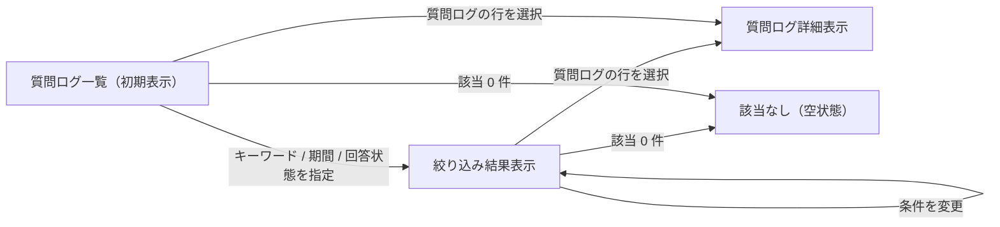
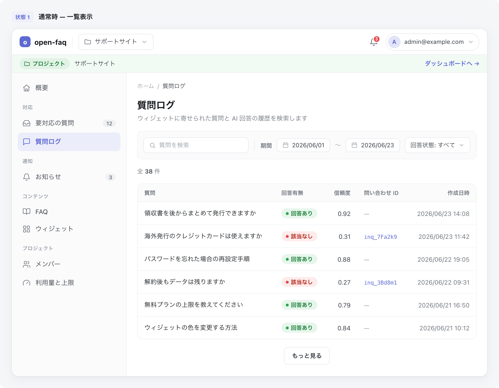

# SCR-032: 質問ログ

| ID | 業務ユースケースID | API ID |
|----|----|----|
| SCR-032 | [UC-076](../../../01_requirements/04_business_usecases/UC-076.md#UC-076) | [API-031](../../02_backend/03_apis/API-031.md#API-031) ・ [API-032](../../02_backend/03_apis/API-032.md#API-032) |

| ステークホルダ | 対象 |
|----------------|------|
| オーナー       | ◯    |
| メンバー       | ◯    |

## 1. 画面概要

- 現在開いているプロジェクトの質問ログを、キーワード・対象期間・回答状態の条件で絞り込み、作成日時の新しい順に一覧表示する。
- 過去の問い合わせ内容の確認や未解決質問の傾向把握に用いる。
- 対象はオーナーとメンバーで、いずれも当該プロジェクトへの割当が前提である。
- 検索範囲は現在開いているプロジェクトの質問ログに限定される。
- 一覧表に「操作」列は設けない。
- 主要な表示状態は一覧表示・絞り込み結果・該当なし(空状態)である。

## 2. 画面遷移図

本画面内の状態遷移を、状態名と契機(操作・結果)で示します。検索条件の指定と行選択による詳細表示を遷移として表します。

## 3. 画面レイアウト

本画面の代表状態(通常時 — 一覧表示)を示します。

## 4. 画面項目

本画面が各状態で表示する入出力項目を定義します。

| # | 項目 | 種類 | 必須 | 最大長 | 初期値 | 表示条件 |
|----|----|----|----|----|----|----|
| 1 | キーワード検索 | input(text) | — | 256 | — | — |
| 2 | 対象期間(開始) | input(date) | — | — | — | — |
| 3 | 対象期間(終了) | input(date) | — | — | — | — |
| 4 | 回答状態フィルタ | select | — | — | すべて | — |
| 5 | 件数表示 | label | — | — | — | — |
| 6 | 質問本文 | label | — | — | — | — |
| 7 | 回答有無バッジ | label | — | — | — | — |
| 8 | 確信度 | label | — | — | — | — |
| 9 | 問い合わせ ID | label | — | — | — | 関連する未解決質問がある行のみ表示 |
| 10 | 作成日時 | label | — | — | — | — |
| 11 | もっと見る | button | — | — | — | 次ページがある場合のみ表示 |
| 12 | 空状態 | label | — | — | — | 検索結果 0 件時のみ表示 |

データパターン(回答状態フィルタ・回答有無バッジの値)を定義する。

| 画面項目 | 表示名 | 補足 |
|----|----|----|
| #4 | すべて | 既定値 |
| #4 | 回答あり | — |
| #4 | 該当なし | — |
| #7 | 回答あり | 緑。色のみに依存せずテキストラベルを併記 |
| #7 | 該当なし | 赤。色のみに依存せずテキストラベルを併記 |

## 5. バリデーション

本画面に入力検証はありません。

## 6. イベント

本画面のイベント(初期表示・各検索操作・行選択・追加読み込み)ごとに、対象の画面項目を定義します。

<table>
<colgroup>
<col style="width: 18%" />
<col style="width: 22%" />
<col style="width: 60%" />
</colgroup>
<thead>
<tr>
<th>EVT-ID</th>
<th>画面項目</th>
<th>イベント</th>
</tr>
</thead>
<tbody>
<tr>
<td>EVT-01</td>
<td>—</td>
<td>初期表示</td>
</tr>
<tr>
<td>EVT-02</td>
<td>#1</td>
<td>キーワードを入力</td>
</tr>
<tr>
<td>EVT-03</td>
<td>#2 / #3</td>
<td>対象期間を指定</td>
</tr>
<tr>
<td>EVT-04</td>
<td>#4</td>
<td>回答状態を選択</td>
</tr>
<tr>
<td>EVT-05</td>
<td>#6</td>
<td>質問ログの行を選択</td>
</tr>
<tr>
<td>EVT-06</td>
<td>#11</td>
<td>「もっと見る」を押下</td>
</tr>
</tbody>
</table>

## 7. 画面イベント詳細

各イベントの処理内容を定義します。

<table>
<colgroup>
<col style="width: 14%" />
<col style="width: 86%" />
</colgroup>
<thead>
<tr>
<th>EVT-ID</th>
<th>処理</th>
</tr>
</thead>
<tbody>
<tr>
<td>EVT-01</td>
<td>初期表示時に <a href="../../02_backend/03_apis/API-032.md#API-032">質問ログ検索(API-032)</a> を実行し、作成日時の新しい順に一覧表示する。件数(#5)を表示する:<pre>
   ┣ 1 件以上: 一覧を表示する
   ┗ 0 件: 空状態(#12)を表示する
</pre></td>
</tr>
<tr>
<td>EVT-02</td>
<td>キーワード(#1)で <a href="../../02_backend/03_apis/API-032.md#API-032">質問ログ検索(API-032)</a> を実行し、一覧と件数(#5)を更新する。0 件時は空状態(#12)を表示する</td>
</tr>
<tr>
<td>EVT-03</td>
<td>対象期間(#2・#3)で <a href="../../02_backend/03_apis/API-032.md#API-032">質問ログ検索(API-032)</a> を実行し、一覧と件数(#5)を更新する。0 件時は空状態(#12)を表示する</td>
</tr>
<tr>
<td>EVT-04</td>
<td>回答状態(#4)で <a href="../../02_backend/03_apis/API-032.md#API-032">質問ログ検索(API-032)</a> を実行し、一覧と件数(#5)を更新する。0 件時は空状態(#12)を表示する</td>
</tr>
<tr>
<td>EVT-05</td>
<td>質問ログの行(#6)を選択時に、選択した質問ログの質問本文・回答有無・確信度・問い合わせ ID・作成日時の詳細を表示する</td>
</tr>
<tr>
<td>EVT-06</td>
<td>「もっと見る」(#11)押下時に <a href="../../02_backend/03_apis/API-032.md#API-032">質問ログ検索(API-032)</a> で続きの質問ログを取得し、一覧の末尾に追加表示する</td>
</tr>
</tbody>
</table>

## 8. エラーメッセージ

本画面はエラー・警告メッセージを表示しません。
