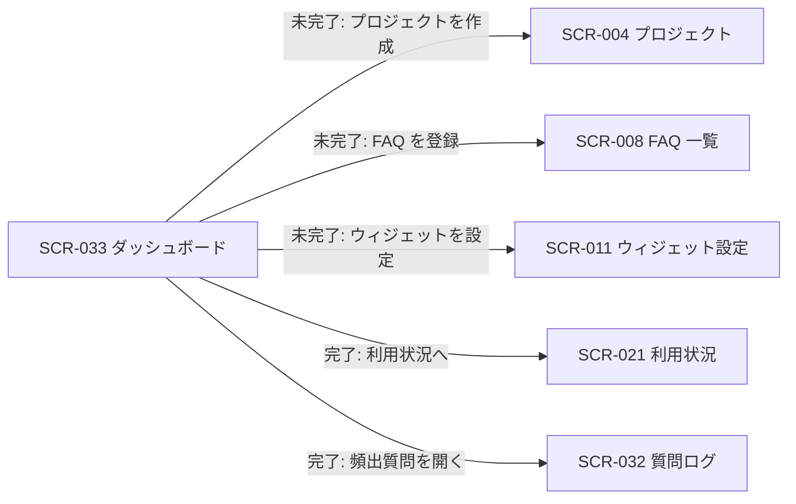

# SCR-033 ダッシュボード

> **このページは、オーナー / メンバーが「ダッシュボード」メニューから契約全体の状況を把握する画面 SCR-033 を定義します。** セットアップ完了状態に応じて 2 つの表示パターン(セットアップ未完了時=セットアップ進捗 / 完了時=KPI 表示)を切り替えます。画面概要 / 画面遷移図 / 画面レイアウト / 画面項目定義 / 入出力一覧 / 画面イベント一覧 の 6 セクションで記述します。

## 1. 画面概要

「ダッシュボード」メニューの単一画面で、ウィジェットの利用準備状態に応じて表示パターンを切り替えます。**セットアップ未完了時はセットアップ進捗パターン**(設定3ステップのチェックリスト)を表示し、**全ステップ完了後は KPI 表示パターン**(質問数・未解決数・公開 FAQ 数・利用率)を表示します。KPI 表示はダッシュボードの一表示パターンであり、独立した画面・メニューとしては設けません。

| 画面 ID | 画面名 | 機能概要 |
|----|----|----|
| `SCR-033` | ダッシュボード | セットアップ未完了時は設定進捗を、完了後は契約全体の KPI 数値を同一画面で表示する |

| 関連 | 内容 |
|----|----|
| FR / BR | FR-195, FR-109, FR-187 / BR-069, BR-071(管理ダッシュボード) |
| 関連画面 | [`SCR-004` プロジェクト](SCR-004.md) / [`SCR-008` FAQ 一覧](SCR-008.md) / [`SCR-011` ウィジェット設定](SCR-011.md) / [`SCR-021` 利用状況](SCR-021.md) / [`SCR-032` 質問ログ](SCR-032.md) |
| 対応業務UC | [UC-036](../../../01_requirements/04_business_usecases/UC-036.md#UC-036) ・ [UC-033](../../../01_requirements/04_business_usecases/UC-033.md#UC-033) |

| ステークホルダ | 対象 |
|----------------|------|
| オーナー       | ◯    |
| メンバー       | ◯(`projectId` 必須) |

> [!NOTE]
> **補足** 本画面は「ダッシュボード」メニューの単一エントリです。初期表示でセットアップ進捗(API-063)を確認し、未完了なら**セットアップ進捗パターン**、完了なら**KPI 表示パターン**を同一画面内で表示します(別メニュー・別画面は設けません)。KPI 表示パターンでは、オーナーは契約全体(プロジェクト未指定)も閲覧でき、メンバーは自身が所属するプロジェクトを `projectId` で指定して閲覧します。表示ルール(数値・色語彙・状態表現)は 画面設計 ダッシュボード / KPI 共通表示ルールに従います。利用率は当月質問数を月次上限で割った比率(0〜1)で、当月選択時のみ意味を持ちます。

## 2. 画面遷移図

本画面からの画面遷移を、画面 ID・画面名とイベント(操作)で示します。セットアップ進捗パターンの各ステップ CTA は対応する設定画面へ、KPI 表示パターンは関連画面へ遷移します。

## 3. 画面レイアウト

セットアップ完了状態に応じた 2 つの表示パターンを示します。

**パターン A: セットアップ完了時(KPI 表示)**

**パターン B: セットアップ未完了時(セットアップ進捗)**

## 4. 画面項目定義

本画面の表示項目を、表示パターン別に定義します。`表示条件` 列で属するパターンを示します。項目の正本は本表です。

| 項目 ID | 項目 | 説明 | 種類 | 表示条件 | 表示 |
|----|----|----|----|----|----|
| `IT-01` | 進捗バー | 完了ステップ数 / 全ステップ数を視覚化する | プログレスバー | セットアップ未完了時 | 完了割合(例: 2/3) |
| `IT-02` | ステップ 1: プロジェクトを作成 | プロジェクト作成の完了 / 未完了を表示する | ステップ項目 | セットアップ未完了時 | ステップ名 + 完了 / 未完了 |
| `IT-03` | ステップ 2: FAQ を登録 | FAQ 登録の完了 / 未完了を表示する | ステップ項目 | セットアップ未完了時 | ステップ名 + 完了 / 未完了 |
| `IT-04` | ステップ 3: ウィジェット埋め込みコードを配置 | 埋め込みコード配置(許可ドメイン設定)の完了 / 未完了を表示する | ステップ項目 | セットアップ未完了時 | ステップ名 + 完了 / 未完了 |
| `IT-05` | 次アクション CTA | 未完了ステップの該当画面へ誘導するボタン | ボタン | セットアップ未完了時(各ステップが未完了のときのみ) | 「作成する」「登録する」「設定する」 |
| `IT-06` | 期間切替 | 集計期間を当月 / 過去 30 日で切り替える | トグル | セットアップ完了時 | 「当月」「過去 30 日」 |
| `IT-07` | プロジェクト絞り込み | 表示対象のプロジェクトを選ぶ(オーナーは任意・未指定で契約全体、メンバーは必須) | ドロップダウン | セットアップ完了時 | プロジェクト名の一覧(オーナーは「契約全体」を含む) |
| `IT-08` | 質問数 | 期間内の総質問数を表示する | KPI カード | セットアップ完了時 | 当月(または過去 30 日)の質問数 |
| `IT-09` | 未解決数 | 期間内の未解決質問数を表示する | KPI カード | セットアップ完了時 | 未解決の質問数 |
| `IT-10` | 公開 FAQ 数 | 公開状態の FAQ 件数を表示する | KPI カード | セットアップ完了時 | 公開 FAQ 数 |
| `IT-11` | 利用率 | 当月質問数 / 月次上限の比率を百分率で表示する | KPI カード | セットアップ完了時 | 利用率(0〜100%) |
| `IT-12` | 頻出質問リスト | 出現回数の多い質問の簡易リストを表示する | テーブル | セットアップ完了時(頻出質問が 1 件以上あるときのみ) | 質問内容 / 出現回数(出現回数の降順) |

## 5. 入出力一覧

本画面が読み取るテーブルと、呼び出す API の一覧です。テーブルの正本は [データベース設計](../../02_backend/04_database/index.md)、API の正本は [API設計](../../02_backend/03_apis/index.md#API-062) です。

<table>
<thead>
<tr>
<th rowspan="2">入出力名</th>
<th rowspan="2">説明</th>
<th rowspan="2">種別</th>
<th rowspan="2">I/O</th>
<th colspan="4">アクセス種別(CRUD)</th>
<th rowspan="2">備考</th>
</tr>
<tr>
<th>C</th>
<th>R</th>
<th>U</th>
<th>D</th>
</tr>
</thead>
<tbody>
<tr>
<td>セットアップ進捗取得</td>
<td>初期表示時にセットアップ完了状態と各ステップの完了 / 未完了を取得し、表示パターンを決定する</td>
<td>API</td>
<td>入力</td>
<td>—</td>
<td>◯</td>
<td>—</td>
<td>—</td>
<td><a href="../../02_backend/03_apis/API-063.md#API-063">セットアップ進捗取得</a></td>
</tr>
<tr>
<td>ダッシュボード集計取得</td>
<td>セットアップ完了時に各 KPI と頻出質問を取得する(初期表示・期間切替・絞り込み)</td>
<td>API</td>
<td>入力</td>
<td>—</td>
<td>◯</td>
<td>—</td>
<td>—</td>
<td><a href="../../02_backend/03_apis/API-062.md#API-062">ダッシュボード集計取得</a></td>
</tr>
<tr>
<td>プロジェクト / FAQ / 許可ドメイン</td>
<td>セットアップ進捗パターンの各ステップ完了判定の元データ(API-063 経由で参照)</td>
<td>テーブル</td>
<td>入力</td>
<td>—</td>
<td>◯</td>
<td>—</td>
<td>—</td>
<td><code>M_PROJECTS</code>(<a href="../../02_backend/04_database/index.md#TBL-004">TBL-004</a>)/ <code>M_FAQS</code>(<a href="../../02_backend/04_database/index.md#TBL-006">TBL-006</a>)/ <code>M_ALLOWED_DOMAINS</code>(<a href="../../02_backend/04_database/index.md#TBL-005">TBL-005</a>)</td>
</tr>
<tr>
<td>質問ログ / 未解決質問</td>
<td>KPI 表示パターンの質問数・未解決数・頻出質問を集計する(API-062 経由で参照)</td>
<td>テーブル</td>
<td>入力</td>
<td>—</td>
<td>◯</td>
<td>—</td>
<td>—</td>
<td><code>H_QUESTION_LOGS</code>(<a href="../../02_backend/04_database/index.md#TBL-025">TBL-025</a>)/ <code>T_INQUIRIES</code>(<a href="../../02_backend/04_database/index.md#TBL-017">TBL-017</a>)</td>
</tr>
<tr>
<td>利用量計測 / プロジェクト上限</td>
<td>KPI 表示パターンの利用率(当月質問数 / 月次上限)を算出する(API-062 経由で参照)</td>
<td>テーブル</td>
<td>入力</td>
<td>—</td>
<td>◯</td>
<td>—</td>
<td>—</td>
<td><code>T_USAGE_METER</code>(<a href="../../02_backend/04_database/index.md#TBL-020">TBL-020</a>)/ <code>M_PRJ_QUOTA_LIMITS</code>(<a href="../../02_backend/04_database/index.md#TBL-009">TBL-009</a>)</td>
</tr>
</tbody>
</table>

## 6. 画面イベント一覧

本画面のイベント(初期表示・各操作)ごとに、対象の項目 ID と処理内容を定義します。EV-02〜EV-04 は KPI 表示パターン、EV-05〜EV-07 はセットアップ進捗パターンの操作です。

<table>
<thead>
<tr>
<th>EVT-ID</th>
<th>イベント ID</th>
<th>項目 ID</th>
<th>イベント</th>
<th>処理</th>
</tr>
</thead>
<tbody>
<tr>
<td>EVT-236</td>
<td><code>EV-01</code></td>
<td>—</td>
<td>初期表示</td>
<td>
<a href="../../02_backend/03_apis/API-063.md#API-063">セットアップ進捗取得</a> を呼び出して表示パターンを決定する。<ul>
<li>未完了の場合: セットアップ進捗パターン(進捗バー IT-01・各ステップ IT-02〜IT-04・未完了ステップの CTA IT-05)を表示する</li>
<li>完了の場合: <a href="../../02_backend/03_apis/API-062.md#API-062">ダッシュボード集計取得</a> を呼び出し、KPI 表示パターン(質問数 IT-08・未解決数 IT-09・公開 FAQ 数 IT-10・利用率 IT-11・頻出質問リスト IT-12)を表示する。既定の期間は当月(IT-06)とする。メンバーが <code>projectId</code> 未指定で URL 直アクセスした場合は所属プロジェクトを既定選択し、特定できない場合は入力を促す</li>
</ul>
</td>
</tr>
<tr>
<td>EVT-237</td>
<td><code>EV-02</code></td>
<td><a href="#IT-06">IT-06</a></td>
<td>期間を切り替え(KPI 表示)</td>
<td>
選択した期間(当月 / 過去 30 日)で <a href="../../02_backend/03_apis/API-062.md#API-062">ダッシュボード集計取得</a> を再呼び出しし、各 KPI(IT-08〜IT-11)・頻出質問リスト(IT-12)を更新する。過去 30 日選択時は利用率(IT-11)を当月基準である旨の注記付きで表示する。
</td>
</tr>
<tr>
<td>EVT-238</td>
<td><code>EV-03</code></td>
<td><a href="#IT-07">IT-07</a></td>
<td>プロジェクトを絞り込み(KPI 表示)</td>
<td>
選択したプロジェクト(オーナーは「契約全体」を含む)で <a href="../../02_backend/03_apis/API-062.md#API-062">ダッシュボード集計取得</a> を再呼び出しし、各 KPI(IT-08〜IT-11)・頻出質問リスト(IT-12)を更新する。
</td>
</tr>
<tr>
<td>EVT-239</td>
<td><code>EV-04</code></td>
<td><a href="#IT-12">IT-12</a></td>
<td>頻出質問を押下(KPI 表示)</td>
<td>
質問ログ画面(SCR-032)へ遷移し、該当質問を起点に詳細を確認できるようにする。
</td>
</tr>
<tr>
<td>EVT-240</td>
<td><code>EV-05</code></td>
<td><a href="#IT-05">IT-05</a></td>
<td>ステップ 1 の CTA を押下(セットアップ進捗)</td>
<td>
プロジェクト作成画面(SCR-004)へ遷移する。
</td>
</tr>
<tr>
<td>EVT-241</td>
<td><code>EV-06</code></td>
<td><a href="#IT-05">IT-05</a></td>
<td>ステップ 2 の CTA を押下(セットアップ進捗)</td>
<td>
FAQ 登録画面(SCR-008)へ遷移する。
</td>
</tr>
<tr>
<td>EVT-242</td>
<td><code>EV-07</code></td>
<td><a href="#IT-05">IT-05</a></td>
<td>ステップ 3 の CTA を押下(セットアップ進捗)</td>
<td>
ウィジェット設定画面(SCR-011)へ遷移し、埋め込みコードの配置と許可ドメイン設定を行えるようにする。全ステップ完了後に本画面を再表示すると KPI 表示パターンへ切り替わる。
</td>
</tr>
</tbody>
</table>

> [!NOTE]
> **補足** サイドバーのグローバルナビ(「ダッシュボード」「利用状況」「プロジェクト」等)はプロジェクト共通の遷移であり、各 SCR で省略します。セットアップ進捗パターンは独立メニューを持たず、本「ダッシュボード」メニュー内の一表示パターンです。
