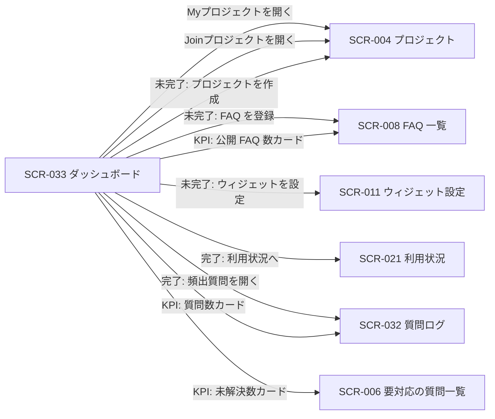
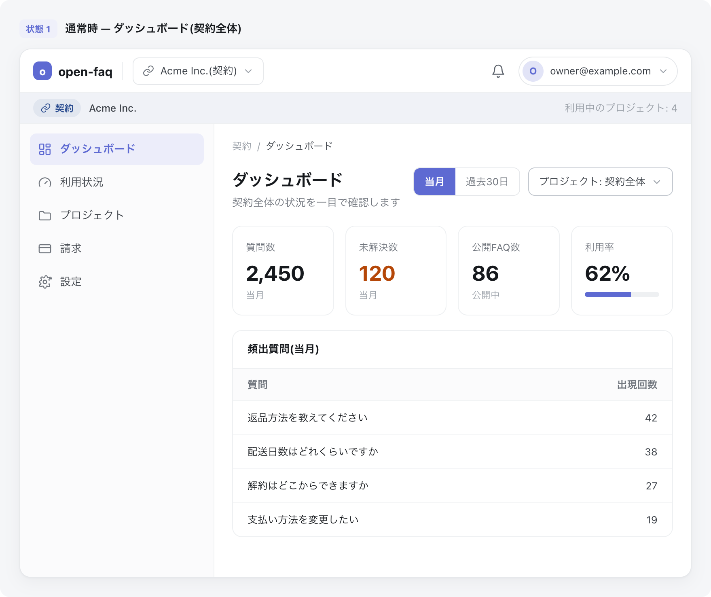
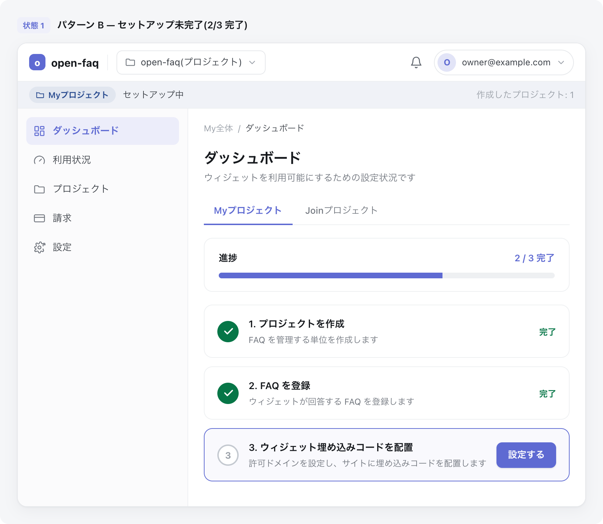

# SCR-033: ダッシュボード

| ID | 業務ユースケースID | API ID |
|----|----|----|
| SCR-033 | [UC-032](../../../01_requirements/04_business_usecases/UC-032.md#UC-032) ・ [UC-035](../../../01_requirements/04_business_usecases/UC-035.md#UC-035) ・ [UC-082](../../../01_requirements/04_business_usecases/UC-082.md#UC-082) | [API-040](../../02_backend/03_apis/API-040.md#API-040) ・ [API-062](../../02_backend/03_apis/API-062.md#API-062) ・ [API-063](../../02_backend/03_apis/API-063.md#API-063) ・ [API-041](../../02_backend/03_apis/API-041.md#API-041) ・ [API-042](../../02_backend/03_apis/API-042.md#API-042) ・ [API-016](../../02_backend/03_apis/API-016.md#API-016) |

| ステークホルダ | 対象 |
|----------------|------|
| オーナー(自分が作成したプロジェクトを Myプロジェクトで管理) | ◯ |
| メンバー(招待されて参加するプロジェクトを Joinプロジェクトで利用、対象プロジェクトを指定) | ◯ |

## 1. 画面概要

- ログイン後の着地となる「ダッシュボード」メニューの単一画面で、別メニュー・別画面を設けず同一画面内で表示パターンを切り替える。
- プロジェクト一覧は「Myプロジェクト」(自分が作成=オーナーのプロジェクト)と「Joinプロジェクト」(招待されて参加=メンバーのプロジェクト)の 2 区分で表示する。
- セットアップ進捗は Myプロジェクトを基準に判定し、未完了時はセットアップ進捗パターン(設定 3 ステップのチェックリスト)を表示する。
- 全ステップ完了後は KPI 表示パターン(質問数・未解決数・公開 FAQ 数・利用率)を表示する。
- KPI 表示パターンでは、オーナーは自分が作成したプロジェクト全体(My全体=プロジェクト未指定)も閲覧でき、メンバーは Joinプロジェクトから選んだ参加プロジェクトを指定して閲覧する。
- 利用率は当月質問数を月次上限で割った比率(0〜1)で、当月選択時のみ意味を持つ。

## 2. 画面遷移図

本画面からの画面遷移を、画面 ID・画面名とイベント(操作)で示します。

## 3. 画面レイアウト

画面上部に「Myプロジェクト」「Joinプロジェクト」の 2 区分(タブ)を配置し、Myプロジェクトには自分が作成(オーナー)したプロジェクト一覧、Joinプロジェクトには招待されて参加(メンバー)しているプロジェクト一覧を表示します。区分の下に、セットアップ完了状態に応じた 2 つの表示パターン(セットアップ進捗 / KPI 表示)を表示します。

**パターン A: セットアップ完了時(KPI 表示)**

**パターン B: セットアップ未完了時(セットアップ進捗)**

## 4. 画面項目

本画面が各表示パターンで表示する項目を定義します。

| # | 項目 | 種類 | 必須 | 最大長 | 初期値 | 表示条件 |
|----|----|----|----|----|----|----|
| 1 | 区分タブ(Myプロジェクト / Joinプロジェクト) | button | — | — | Myプロジェクト | 常時 |
| 2 | Myプロジェクト一覧(自分が作成=オーナーのプロジェクト) | table | — | — | — | 区分タブ=Myプロジェクト時 |
| 3 | Joinプロジェクト一覧(招待されて参加=メンバーのプロジェクト) | table | — | — | — | 区分タブ=Joinプロジェクト時 |
| 4 | 進捗バー(完了ステップ数 / 全ステップ数) | label | — | — | — | セットアップ未完了時 |
| 5 | ステップ 1: プロジェクトを作成 | label | — | — | — | セットアップ未完了時 |
| 6 | ステップ 2: FAQ を登録 | label | — | — | — | セットアップ未完了時 |
| 7 | ステップ 3: ウィジェット埋め込みコードを配置 | label | — | — | — | セットアップ未完了時 |
| 8 | 次アクション CTA(作成する / 登録する / 設定する) | button | — | — | — | セットアップ未完了時(該当ステップが未完了のときのみ) |
| 9 | 期間切替トグル(当月 / 過去期間) | button | — | — | 当月 | セットアップ完了時。過去期間の値は [システム仕様書 §2](../../07_system-spec.md#2-課金利用量上限) を参照 |
| 10 | プロジェクト絞り込み | select | — | — | オーナー: My全体 / メンバー: 参加プロジェクト | セットアップ完了時 |
| 11 | 質問数(KPI カード) | label | — | — | — | セットアップ完了時 |
| 12 | 未解決数(KPI カード) | label | — | — | — | セットアップ完了時 |
| 13 | 公開 FAQ 数(KPI カード) | label | — | — | — | セットアップ完了時 |
| 14 | 利用率(KPI カード・当月質問数 / 月次上限) | label | — | — | — | セットアップ完了時 |
| 15 | 頻出質問リスト(質問 / 出現回数) | table | — | — | — | セットアップ完了時(頻出質問が 1 件以上あるとき) |
| 16 | 画面目的ラベル | label | — | — | 関与プロジェクト(My/Join)の区分一覧と状況を把握する | 画面冒頭に常時表示 |

データパターン(区分タブ・期間切替トグル・プロジェクト絞り込みの値)を定義する。

| 画面項目 | 表示名 | 補足 |
|----|----|----|
| #1 | Myプロジェクト | 自分が作成したプロジェクト一覧。既定値 |
| #1 | Joinプロジェクト | 招待されて参加しているプロジェクト一覧。課金責任を負わない(参加のみ) |
| #9 | 当月 | 既定値 |
| #9 | 過去期間 | 値は [システム仕様書 §2](../../07_system-spec.md#2-課金利用量上限) |
| #10 | My全体 | オーナーのみ。自分が作成したプロジェクト全体(プロジェクト未指定)。一覧先頭に表示 |
| #10 | (各プロジェクト名) | オーナーは自分が作成したプロジェクト、メンバーは Joinプロジェクトから選んだ参加プロジェクト |

## 5. バリデーション

本画面に入力検証はありません。

## 6. イベント

本画面のイベント(初期表示・各操作)ごとに、対象の画面項目を定義します。各イベントの処理内容は [7. 画面イベント詳細](#7-画面イベント詳細) で定義します。

<table>
<colgroup>
<col style="width: 18%" />
<col style="width: 22%" />
<col style="width: 60%" />
</colgroup>
<thead>
<tr>
<th>EVT-ID</th>
<th>画面項目</th>
<th>イベント</th>
</tr>
</thead>
<tbody>
<tr>
<td>EVT-01</td>
<td>#1・#2・#3・#16</td>
<td>初期表示(区分タブ・Myプロジェクト一覧・セットアップ進捗 / KPI を表示)</td>
</tr>
<tr>
<td>EVT-02</td>
<td>#1</td>
<td>区分タブを切り替え(Myプロジェクト ⇄ Joinプロジェクト)</td>
</tr>
<tr>
<td>EVT-03</td>
<td>#2・#3</td>
<td>一覧のプロジェクト行を押下(Myプロジェクト / Joinプロジェクトを開く)</td>
</tr>
<tr>
<td>EVT-04</td>
<td>#9</td>
<td>期間を切り替え(KPI 表示)</td>
</tr>
<tr>
<td>EVT-05</td>
<td>#10</td>
<td>プロジェクトを絞り込み(KPI 表示)</td>
</tr>
<tr>
<td>EVT-06</td>
<td>#15</td>
<td>頻出質問を押下(KPI 表示)</td>
</tr>
<tr>
<td>EVT-07</td>
<td>#11</td>
<td>質問数カードを押下(KPI 表示)</td>
</tr>
<tr>
<td>EVT-08</td>
<td>#12</td>
<td>未解決数カードを押下(KPI 表示)</td>
</tr>
<tr>
<td>EVT-09</td>
<td>#13</td>
<td>公開 FAQ 数カードを押下(KPI 表示)</td>
</tr>
<tr>
<td>EVT-10</td>
<td>#8</td>
<td>ステップ 1 の CTA を押下(セットアップ進捗)</td>
</tr>
<tr>
<td>EVT-11</td>
<td>#8</td>
<td>ステップ 2 の CTA を押下(セットアップ進捗)</td>
</tr>
<tr>
<td>EVT-12</td>
<td>#8</td>
<td>ステップ 3 の CTA を押下(セットアップ進捗)</td>
</tr>
</tbody>
</table>

## 7. 画面イベント詳細

各イベントの処理内容を定義します。

<table>
<colgroup>
<col style="width: 14%" />
<col style="width: 86%" />
</colgroup>
<thead>
<tr>
<th>EVT-ID</th>
<th>処理</th>
</tr>
</thead>
<tbody>
<tr>
<td>EVT-01</td>
<td>初期表示時に画面目的ラベル(#16)を画面冒頭に表示し、区分タブ(#1)を既定の「Myプロジェクト」で表示し、Myプロジェクト一覧(#2)を表示する。あわせて <a href="../../02_backend/03_apis/API-063.md#API-063">セットアップ進捗取得(API-063)</a> でセットアップ完了状態を取得し、表示パターンを分岐する:<pre>
 ┣ 未完了: セットアップ進捗パターン(進捗バー(#4)・各ステップ(#5〜#7)・未完了ステップの次アクション CTA(#8))を表示する
 ┗ 完了: <a href="../../02_backend/03_apis/API-062.md#API-062">ダッシュボード集計取得(API-062)</a> で KPI 表示パターン(質問数(#11)・未解決数(#12)・公開 FAQ 数(#13)・利用率(#14)・頻出質問リスト(#15))を表示する。期間(#9)は当月、プロジェクト絞り込み(#10)はオーナーは「My全体」を既定とする
</pre></td>
</tr>
<tr>
<td>EVT-02</td>
<td>区分タブ(#1)押下時に表示を切り替える。「Myプロジェクト」選択時は自分が作成(オーナー)したプロジェクト一覧(#2)を、「Joinプロジェクト」選択時は招待されて参加(メンバー)しているプロジェクト一覧(#3)を表示する</td>
</tr>
<tr>
<td>EVT-03</td>
<td>Myプロジェクト一覧(#2)/ Joinプロジェクト一覧(#3)のプロジェクト行を押下時に当該プロジェクトを開き、SCR-004 プロジェクトへ遷移する</td>
</tr>
<tr>
<td>EVT-04</td>
<td>期間(#9)を切り替え時に <a href="../../02_backend/03_apis/API-062.md#API-062">ダッシュボード集計取得(API-062)</a> で各 KPI(#11〜#14)・頻出質問リスト(#15)を更新する。過去期間選択時は利用率(#14)を当月基準である旨の注記付きで表示する。過去期間の値は <a href="../../07_system-spec.md#2-課金利用量上限">システム仕様書 §2</a> を参照する</td>
</tr>
<tr>
<td>EVT-05</td>
<td>プロジェクト絞り込み(#10)を変更時に <a href="../../02_backend/03_apis/API-062.md#API-062">ダッシュボード集計取得(API-062)</a> で各 KPI(#11〜#14)・頻出質問リスト(#15)を更新する</td>
</tr>
<tr>
<td>EVT-06</td>
<td>頻出質問リスト(#15)の質問を押下時に SCR-032 質問ログへ遷移する</td>
</tr>
<tr>
<td>EVT-07</td>
<td>質問数カード(#11)押下時に <a href="SCR-032.md#SCR-032">SCR-032 質問ログ</a>へ遷移する。0 件 / 集計中 / 取得失敗のときはクリック不可(非活性)とする</td>
</tr>
<tr>
<td>EVT-08</td>
<td>未解決数カード(#12)押下時に <a href="SCR-006.md#SCR-006">SCR-006 要対応の質問一覧</a>へ遷移する。0 件 / 集計中 / 取得失敗のときはクリック不可(非活性)とする</td>
</tr>
<tr>
<td>EVT-09</td>
<td>公開 FAQ 数カード(#13)押下時に <a href="SCR-008.md#SCR-008">SCR-008 FAQ 一覧</a>へ遷移する。0 件 / 集計中 / 取得失敗のときはクリック不可(非活性)とする。利用率カード(#14)は対応する一覧を持たないためクリック不可とする</td>
</tr>
<tr>
<td>EVT-10</td>
<td>ステップ 1 の CTA(#8)押下時に SCR-004 プロジェクトへ遷移する</td>
</tr>
<tr>
<td>EVT-11</td>
<td>ステップ 2 の CTA(#8)押下時に SCR-008 FAQ 一覧へ遷移する</td>
</tr>
<tr>
<td>EVT-12</td>
<td>ステップ 3 の CTA(#8)押下時に SCR-011 ウィジェット設定へ遷移する。全ステップ完了後に本画面を再表示すると KPI 表示パターンへ切り替わる</td>
</tr>
</tbody>
</table>

## 8. エラーメッセージ

本画面はエラー・警告メッセージを表示しません。
