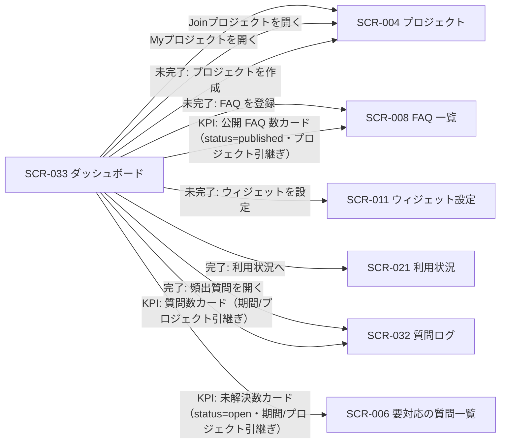

| 画面 ID | 画面名 | トレーサビリティID |
|----|----|----|
| SCR-033 | ダッシュボード | [TR-033](../../00_traceability/index.md#TR-033) ・ [TR-036](../../00_traceability/index.md#TR-036) |

| ステークホルダ | 対象 |
|----------------|------|
| オーナー(自分が作成したプロジェクトを Myプロジェクトで管理) | ◯ |
| メンバー(招待されて参加するプロジェクトを Joinプロジェクトで利用、`projectId` 指定) | ◯ |

## 1. 画面概要

ログイン後の着地となる「ダッシュボード」メニューの単一画面で、利用者が関与するプロジェクトを「Myプロジェクト」(自分が作成=オーナーのプロジェクト)と「Joinプロジェクト」(招待されて参加=メンバーのプロジェクト)の 2 区分で一覧表示します。各区分から個別プロジェクトを開けるほか、ウィジェットの利用準備状態に応じて表示パターンを切り替えます。セットアップ未完了時はセットアップ進捗パターン(設定 3 ステップのチェックリスト)を表示し、全ステップ完了後は KPI 表示パターン(質問数・未解決数・公開 FAQ 数・利用率)を表示します。

> [!NOTE]
> **補足** 本画面は「ダッシュボード」メニューの単一エントリです。プロジェクト一覧は「Myプロジェクト」(自分が作成したプロジェクト)と「Joinプロジェクト」(招待されて参加しているプロジェクト)の 2 区分で表示し、メンバーは Joinプロジェクトから参加プロジェクトを開きます。セットアップ進捗は Myプロジェクト(自分が作成したプロジェクト)を基準に判定し、未完了ならセットアップ進捗パターン、完了なら KPI 表示パターンを同一画面内で表示します(別メニュー・別画面は設けません)。KPI 表示パターンでは、オーナーは自分が作成したプロジェクト全体(My全体=プロジェクト未指定)も閲覧でき、メンバーは Joinプロジェクトから選んだ参加プロジェクトを `projectId` で指定して閲覧します。利用率は当月質問数を月次上限で割った比率(0〜1)で、当月選択時のみ意味を持ちます。

## 2. 画面遷移図

本画面からの画面遷移を、画面 ID・画面名とイベント(操作)で示します。Myプロジェクト / Joinプロジェクトの各一覧から個別プロジェクトへ、セットアップ進捗パターンの各ステップ CTA は対応する設定画面へ、KPI 表示パターンは関連画面へ遷移します。

## 3. 画面レイアウト

画面上部に「Myプロジェクト」「Joinプロジェクト」の 2 区分(タブ)を配置し、Myプロジェクトには自分が作成(オーナー)したプロジェクト一覧、Joinプロジェクトには招待されて参加(メンバー)しているプロジェクト一覧を表示します。区分の下に、セットアップ完了状態に応じた 2 つの表示パターン(セットアップ進捗 / KPI 表示)を表示します。各項目が属するパターンは §4 の `表示条件` で定義します。

**パターン A: セットアップ完了時(KPI 表示)**

**パターン B: セットアップ未完了時(セットアップ進捗)**

## 4. 画面項目

本画面が各表示パターンで表示する項目を定義します。`表示条件` は項目が表示されるパターン・状態を示します。

| # | 項目 | 種類 | 必須 | 最大長 | 初期値 | 表示条件 |
|----|----|----|----|----|----|----|
| 1 | 区分タブ(Myプロジェクト / Joinプロジェクト) | button | — | — | Myプロジェクト | 常時 |
| 2 | Myプロジェクト一覧(自分が作成=オーナーのプロジェクト) | table | — | — | — | 区分タブ=Myプロジェクト時 |
| 3 | Joinプロジェクト一覧(招待されて参加=メンバーのプロジェクト) | table | — | — | — | 区分タブ=Joinプロジェクト時 |
| 4 | 進捗バー(完了ステップ数 / 全ステップ数) | div | — | — | — | セットアップ未完了時 |
| 5 | ステップ 1: プロジェクトを作成 | div | — | — | — | セットアップ未完了時 |
| 6 | ステップ 2: FAQ を登録 | div | — | — | — | セットアップ未完了時 |
| 7 | ステップ 3: ウィジェット埋め込みコードを配置 | div | — | — | — | セットアップ未完了時 |
| 8 | 次アクション CTA(作成する / 登録する / 設定する) | button | — | — | — | セットアップ未完了時(該当ステップが未完了のときのみ) |
| 9 | 期間切替トグル(当月 / 過去 30 日) | button | — | — | 当月 | セットアップ完了時 |
| 10 | プロジェクト絞り込み | select | — | — | オーナー: My全体 / メンバー: 参加プロジェクト | セットアップ完了時 |
| 11 | 質問数(KPI カード) | div | — | — | — | セットアップ完了時 |
| 12 | 未解決数(KPI カード) | div | — | — | — | セットアップ完了時 |
| 13 | 公開 FAQ 数(KPI カード) | div | — | — | — | セットアップ完了時 |
| 14 | 利用率(KPI カード・当月質問数 / 月次上限) | div | — | — | — | セットアップ完了時 |
| 15 | 頻出質問リスト(質問 / 出現回数) | table | — | — | — | セットアップ完了時(頻出質問が 1 件以上あるとき) |

- **#1 区分タブ**: 「Myプロジェクト」(自分が作成したプロジェクト一覧)と「Joinプロジェクト」(招待されて参加しているプロジェクト一覧)を切り替える。既定は Myプロジェクト。
- **#2 Myプロジェクト一覧 / #3 Joinプロジェクト一覧**: プロジェクト名・状態などの一覧。各行を押下すると当該プロジェクトを開く。Joinプロジェクトは課金責任を負わない(参加のみ)。
- **#9 期間切替トグルの選択肢(コード値=表示名)**: `current_month`=当月 / `last_30d`=過去 30 日。
- **#10 プロジェクト絞り込みの選択肢**: プロジェクト名の一覧(オーナーは先頭に「My全体」=自分が作成したプロジェクト全体・プロジェクト未指定を含む。メンバーは Joinプロジェクトから選んだ参加プロジェクトのみ)。
- **#11〜#13 KPI カードの遷移**: 質問数(#11)は質問ログ、未解決数(#12)は要対応の質問一覧(未解決で絞り込み)、公開 FAQ 数(#13)は FAQ 一覧(公開で絞り込み)へ押下で遷移する。いずれも現在選択中の期間(#9)・プロジェクト絞り込み(#10)を引き継ぐ(引き継ぐ検索パラメータは §7 で定義)。0 件 / 集計中 / 取得失敗のときはクリック不可とする。利用率(#14)は対応する一覧を持たないためクリック不可とする。
- **セットアップ進捗の基準**: セットアップ進捗(#4〜#8)は Myプロジェクト(自分が作成したプロジェクト)を基準に判定する。

## 5. バリデーション

本画面は数値・KPI の参照表示と表示切替コントロール(期間トグル・プロジェクト絞り込み)のみで構成され、利用者が値を入力する項目はありません(本画面に入力検証はありません)。

## 6. イベント

本画面のイベント(初期表示・各操作)ごとに、対象の画面項目を定義します。各イベントの処理内容は [7. 画面イベント詳細](#7-画面イベント詳細) で定義します。EVT-213〜EVT-215・EVT-219〜EVT-221 は KPI 表示パターン、EVT-216〜EVT-218 はセットアップ進捗パターンの操作です。EVT-219〜EVT-221 は KPI カード押下による一覧遷移で、現在選択中の期間(#9)・プロジェクト絞り込み(#10)を引き継ぎます。EV-01・EV-02 は区分タブ(Myプロジェクト / Joinプロジェクト)の操作で、本ページ内でのみ一意な局所イベントです。

<table>
<colgroup>
<col style="width: 18%" />
<col style="width: 22%" />
<col style="width: 60%" />
</colgroup>
<thead>
<tr>
<th>EVT-ID</th>
<th>画面項目</th>
<th>イベント</th>
</tr>
</thead>
<tbody>
<tr>
<td>EVT-212</td>
<td>#1・#2・#3</td>
<td>初期表示(区分タブ・Myプロジェクト一覧・セットアップ進捗 / KPI を表示)</td>
</tr>
<tr>
<td>EV-01</td>
<td>#1</td>
<td>区分タブを切り替え(Myプロジェクト ⇄ Joinプロジェクト)</td>
</tr>
<tr>
<td>EV-02</td>
<td>#2・#3</td>
<td>一覧のプロジェクト行を押下(Myプロジェクト / Joinプロジェクトを開く)</td>
</tr>
<tr>
<td>EVT-213</td>
<td>#9</td>
<td>期間を切り替え(KPI 表示)</td>
</tr>
<tr>
<td>EVT-214</td>
<td>#10</td>
<td>プロジェクトを絞り込み(KPI 表示)</td>
</tr>
<tr>
<td>EVT-215</td>
<td>#15</td>
<td>頻出質問を押下(KPI 表示)</td>
</tr>
<tr>
<td>EVT-219</td>
<td>#11</td>
<td>質問数カードを押下(KPI 表示)</td>
</tr>
<tr>
<td>EVT-220</td>
<td>#12</td>
<td>未解決数カードを押下(KPI 表示)</td>
</tr>
<tr>
<td>EVT-221</td>
<td>#13</td>
<td>公開 FAQ 数カードを押下(KPI 表示)</td>
</tr>
<tr>
<td>EVT-216</td>
<td>#8</td>
<td>ステップ 1 の CTA を押下(セットアップ進捗)</td>
</tr>
<tr>
<td>EVT-217</td>
<td>#8</td>
<td>ステップ 2 の CTA を押下(セットアップ進捗)</td>
</tr>
<tr>
<td>EVT-218</td>
<td>#8</td>
<td>ステップ 3 の CTA を押下(セットアップ進捗)</td>
</tr>
</tbody>
</table>

## 7. 画面イベント詳細

各イベントの処理内容を定義します。

<table>
<colgroup>
<col style="width: 14%" />
<col style="width: 86%" />
</colgroup>
<thead>
<tr>
<th>EVT-ID</th>
<th>処理</th>
</tr>
</thead>
<tbody>
<tr>
<td>EVT-212</td>
<td>初期表示時に区分タブ(#1)を既定の「Myプロジェクト」で表示し、Myプロジェクト一覧(#2=自分が作成したプロジェクト)を表示する。あわせて <a href="../../02_backend/03_apis/API-063.md#API-063">セットアップ進捗取得</a> を Myプロジェクト基準で呼び出し、全ステップ完了フラグで表示パターンを分岐する:<pre>
 ┣ 未完了: セットアップ進捗パターンを表示する
 ┃  ┣ 進捗バー(#4)= 完了ステップ数 / 全ステップ数
 ┃  ┣ 各ステップ(#5〜#7)= 対応するステップの完了 / 未完了
 ┃  ┗ 未完了のステップにのみ次アクション CTA(#8)を表示する
 ┗ 完了: <a href="../../02_backend/03_apis/API-062.md#API-062">ダッシュボード集計取得</a> を呼び出し、KPI 表示パターンを表示する
    ┣ 質問数(#11)・未解決数(#12)・公開 FAQ 数(#13)・利用率(#14)・頻出質問リスト(#15)を表示する
    ┣ 既定の期間は当月(#9)とする
    ┣ オーナーは既定でプロジェクト絞り込み(#10)を「My全体」(自分が作成したプロジェクト全体)とする
    ┗ メンバーが projectId 未指定で URL 直アクセスした場合は参加プロジェクトを既定選択し、特定できない場合は Joinプロジェクトからの選択を促す
</pre></td>
</tr>
<tr>
<td>EV-01</td>
<td>区分タブ(#1)押下時に表示を切り替える。「Myプロジェクト」選択時は自分が作成(オーナー)したプロジェクト一覧(#2)を、「Joinプロジェクト」選択時は招待されて参加(メンバー)しているプロジェクト一覧(#3)を表示する</td>
</tr>
<tr>
<td>EV-02</td>
<td>Myプロジェクト一覧(#2)/ Joinプロジェクト一覧(#3)のプロジェクト行を押下時に当該プロジェクトを開き、SCR-004 プロジェクトへ遷移する</td>
</tr>
<tr>
<td>EVT-213</td>
<td>選択した期間(当月 / 過去 30 日)で <a href="../../02_backend/03_apis/API-062.md#API-062">ダッシュボード集計取得</a> を再呼び出しし、各 KPI(#11〜#14)・頻出質問リスト(#15)を更新する。過去 30 日選択時は利用率(#14)を当月基準である旨の注記付きで表示する</td>
</tr>
<tr>
<td>EVT-214</td>
<td>選択したプロジェクト(オーナーは「My全体」=自分が作成したプロジェクト全体を含む)で <a href="../../02_backend/03_apis/API-062.md#API-062">ダッシュボード集計取得</a> を再呼び出しし、各 KPI(#11〜#14)・頻出質問リスト(#15)を更新する</td>
</tr>
<tr>
<td>EVT-215</td>
<td>頻出質問リスト(#15)の質問を押下時に SCR-032 質問ログへ遷移し、該当質問を起点に詳細を確認できるようにする</td>
</tr>
<tr>
<td>EVT-219</td>
<td>質問数カード(#11)押下時に、現在選択中の期間(#9)・プロジェクト絞り込み(#10)を引き継いで <a href="SCR-032.md#SCR-032">SCR-032 質問ログ</a>へ遷移する。引き継ぐ検索パラメータ:<pre>
 ┣ projectId = プロジェクト絞り込み(#10)の選択プロジェクト(オーナーが「My全体」=プロジェクト未指定のときは projectId を付与しない)
 ┗ period = 期間トグル(#9)の選択値(当月: current_month / 過去 30 日: last_30d。質問ログ側の対象期間(開始 〜 終了)へ換算して付与する)
</pre>0 件 / 集計中 / 取得失敗のときはクリック不可(非活性)とする(画面設計 KPI 共通表示ルールに従う)</td>
</tr>
<tr>
<td>EVT-220</td>
<td>未解決数カード(#12)押下時に、現在選択中の期間(#9)・プロジェクト絞り込み(#10)を引き継ぎ、未解決(要対応)で絞り込んだ状態で <a href="SCR-006.md#SCR-006">SCR-006 要対応の質問一覧</a>へ遷移する。引き継ぐ検索パラメータ:<pre>
 ┣ projectId = プロジェクト絞り込み(#10)の選択プロジェクト(オーナーが「My全体」=プロジェクト未指定のときは projectId を付与しない)
 ┣ status = open(未解決=要対応で絞り込む)
 ┗ period = 期間トグル(#9)の選択値(当月: current_month / 過去 30 日: last_30d。要対応の質問一覧側の期間フィルタ(開始 〜 終了)へ換算して付与する)
</pre>0 件 / 集計中 / 取得失敗のときはクリック不可(非活性)とする(画面設計 KPI 共通表示ルールに従う)</td>
</tr>
<tr>
<td>EVT-221</td>
<td>公開 FAQ 数カード(#13)押下時に、現在選択中のプロジェクト絞り込み(#10)を引き継いで <a href="SCR-008.md#SCR-008">SCR-008 FAQ 一覧</a>へ遷移する。引き継ぐ検索パラメータ:<pre>
 ┣ projectId = プロジェクト絞り込み(#10)の選択プロジェクト(オーナーが「My全体」=プロジェクト未指定のときは projectId を付与しない)
 ┗ status = published(公開中の FAQ で絞り込む。期間トグル(#9)は FAQ 件数の集計対象外のため引き継がない)
</pre>0 件 / 集計中 / 取得失敗のときはクリック不可(非活性)とする(画面設計 KPI 共通表示ルールに従う)。利用率カード(#14)は対応する一覧を持たないためクリック不可とする</td>
</tr>
<tr>
<td>EVT-216</td>
<td>ステップ 1 の CTA(#8)押下時に SCR-004 プロジェクトへ遷移する</td>
</tr>
<tr>
<td>EVT-217</td>
<td>ステップ 2 の CTA(#8)押下時に SCR-008 FAQ 一覧へ遷移する</td>
</tr>
<tr>
<td>EVT-218</td>
<td>ステップ 3 の CTA(#8)押下時に SCR-011 ウィジェット設定へ遷移し、埋め込みコードの配置と許可ドメイン設定を行えるようにする。全ステップ完了後に本画面を再表示すると KPI 表示パターンへ切り替わる</td>
</tr>
</tbody>
</table>

> [!NOTE]
> **補足** サイドバーのグローバルナビ(「ダッシュボード」「利用状況」「プロジェクト」「請求」「設定」)はプロジェクト共通の遷移であり、各 SCR で省略します。セットアップ進捗パターンは独立メニューを持たず、本「ダッシュボード」メニュー内の一表示パターンです。

## 8. エラーメッセージ

本画面はエラー・警告メッセージを表示しません。
