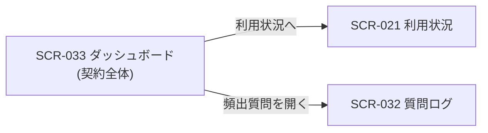

# SCR-033 ダッシュボード(契約全体)

> **このページは、オーナー / メンバーが契約全体の状況(質問数・未解決数・公開 FAQ 数・利用率)を当月固定で一目で把握する画面 SCR-033 を定義します。** 画面概要 / 画面遷移図 / 画面レイアウト / 画面項目定義 / 入出力一覧 / 画面イベント一覧 の 6 セクションで記述します。

## 1. 画面概要

契約全体(またはプロジェクト絞り込み)の主要指標を 4 枚の KPI カードに集約し、頻出質問の簡易リストを併せて表示するダッシュボードです。期間切替(当月 / 過去 30 日)とプロジェクト絞り込みで表示対象を切り替えます。

| 画面 ID | 画面名 | 機能概要 |
|----|----|----|
| `SCR-033` | ダッシュボード(契約全体) | 契約全体の質問数・未解決数・公開 FAQ 数・利用率を当月固定で一覧表示する |

| 関連 | 内容 |
|----|----|
| 関連画面 | [`SCR-021` 利用状況](SCR-021.md) / [`SCR-032` 質問ログ](SCR-032.md) |
| 対応業務UC | [UC-036](../../../01_requirements/04_business_usecases/UC-036.md#UC-036) ・ [UC-033](../../../01_requirements/04_business_usecases/UC-033.md#UC-033) |

| ステークホルダ | 対象 |
|----------------|------|
| オーナー       | ◯    |
| メンバー       | ◯(`projectId` 必須) |

> [!NOTE]
> **補足** オーナーは契約全体(プロジェクト未指定)も閲覧できます。メンバーは自身が所属するプロジェクトを `projectId` で指定して閲覧します(契約全体の集約は閲覧できません)。表示ルール(数値・色語彙・状態表現)は 画面設計 ダッシュボード / KPI 共通表示ルールに従います。利用率は当月質問数を月次上限で割った比率(0〜1)で、当月選択時のみ意味を持ちます。

## 2. 画面遷移図

本画面からの画面遷移を、画面 ID・画面名とイベント(操作)で示します。

## 3. 画面レイアウト

## 4. 画面項目定義

本画面の表示項目(KPI カード・期間切替・プロジェクト絞り込み・頻出質問リスト)を定義します。項目の正本は本表です。

| 項目 ID | 項目 | 説明 | 種類 | 表示条件 | 表示 |
|----|----|----|----|----|----|
| `IT-01` | 期間切替 | 集計期間を当月 / 過去 30 日で切り替える | トグル | — | 「当月」「過去 30 日」 |
| `IT-02` | プロジェクト絞り込み | 表示対象のプロジェクトを選ぶ(オーナーは任意・未指定で契約全体、メンバーは必須) | ドロップダウン | — | プロジェクト名の一覧(オーナーは「契約全体」を含む) |
| `IT-03` | 質問数 | 期間内の総質問数を表示する | KPI カード | — | 当月(または過去 30 日)の質問数 |
| `IT-04` | 未解決数 | 期間内の未解決質問数を表示する | KPI カード | — | 未解決の質問数 |
| `IT-05` | 公開 FAQ 数 | 公開状態の FAQ 件数を表示する | KPI カード | — | 公開 FAQ 数 |
| `IT-06` | 利用率 | 当月質問数 / 月次上限の比率を百分率で表示する | KPI カード | — | 利用率(0〜100%) |
| `IT-07` | 頻出質問リスト | 出現回数の多い質問の簡易リストを表示する | テーブル | 頻出質問が 1 件以上あるときのみ表示 | 質問内容 / 出現回数(出現回数の降順) |

## 5. 入出力一覧

本画面が読み取るテーブルと、呼び出す API の一覧です。テーブルの正本は [データベース設計](../../02_backend/04_database/index.md)、API の正本は [API設計](../../02_backend/03_apis/index.md#API-062) です。

<table>
<thead>
<tr>
<th rowspan="2">入出力名</th>
<th rowspan="2">説明</th>
<th rowspan="2">種別</th>
<th rowspan="2">I/O</th>
<th colspan="4">アクセス種別(CRUD)</th>
<th rowspan="2">備考</th>
</tr>
<tr>
<th>C</th>
<th>R</th>
<th>U</th>
<th>D</th>
</tr>
</thead>
<tbody>
<tr>
<td>質問ログ</td>
<td>期間内の質問数・頻出質問を集計する</td>
<td>テーブル</td>
<td>入力</td>
<td>—</td>
<td>◯</td>
<td>—</td>
<td>—</td>
<td><code>H_QUESTION_LOGS</code>(<a href="../../02_backend/04_database/index.md#TBL-025">TBL-025</a>)</td>
</tr>
<tr>
<td>未解決質問</td>
<td>未解決の質問数を集計する</td>
<td>テーブル</td>
<td>入力</td>
<td>—</td>
<td>◯</td>
<td>—</td>
<td>—</td>
<td><code>T_INQUIRIES</code>(<a href="../../02_backend/04_database/index.md#TBL-017">TBL-017</a>)</td>
</tr>
<tr>
<td>FAQ</td>
<td>公開状態の FAQ 件数を集計する</td>
<td>テーブル</td>
<td>入力</td>
<td>—</td>
<td>◯</td>
<td>—</td>
<td>—</td>
<td><code>M_FAQS</code>(<a href="../../02_backend/04_database/index.md#TBL-006">TBL-006</a>)</td>
</tr>
<tr>
<td>利用量計測</td>
<td>当月の質問数(利用率の分子)を取得する</td>
<td>テーブル</td>
<td>入力</td>
<td>—</td>
<td>◯</td>
<td>—</td>
<td>—</td>
<td><code>T_USAGE_METER</code>(<a href="../../02_backend/04_database/index.md#TBL-020">TBL-020</a>)</td>
</tr>
<tr>
<td>プロジェクト上限</td>
<td>月次上限(利用率の分母)を取得する</td>
<td>テーブル</td>
<td>入力</td>
<td>—</td>
<td>◯</td>
<td>—</td>
<td>—</td>
<td><code>M_PRJ_QUOTA_LIMITS</code>(<a href="../../02_backend/04_database/index.md#TBL-009">TBL-009</a>)</td>
</tr>
<tr>
<td>ダッシュボード集計取得</td>
<td>初期表示・期間切替・絞り込み時に各 KPI と頻出質問を取得する</td>
<td>API</td>
<td>入力</td>
<td>—</td>
<td>◯</td>
<td>—</td>
<td>—</td>
<td><a href="../../02_backend/03_apis/API-062.md#API-062">ダッシュボード集計取得</a></td>
</tr>
</tbody>
</table>

## 6. 画面イベント一覧

本画面のイベント(初期表示・各操作)ごとに、対象の項目 ID と処理内容を定義します。

<table>
<thead>
<tr>
<th>EVT-ID</th>
<th>イベント ID</th>
<th>項目 ID</th>
<th>イベント</th>
<th>処理</th>
</tr>
</thead>
<tbody>
<tr>
<td>EVT-235</td>
<td><code>EV-01</code></td>
<td>—</td>
<td>初期表示</td>
<td>
<a href="../../02_backend/03_apis/API-062.md#API-062">ダッシュボード集計取得</a> を呼び出し、質問数(IT-03)・未解決数(IT-04)・公開 FAQ 数(IT-05)・利用率(IT-06)・頻出質問リスト(IT-07)を取得して表示する。既定の期間は当月(IT-01)とする。メンバーが <code>projectId</code> 未指定で URL 直アクセスした場合は所属プロジェクトを既定選択し、特定できない場合は入力を促す。
</td>
</tr>
<tr>
<td>EVT-236</td>
<td><code>EV-02</code></td>
<td><a href="#IT-01">IT-01</a></td>
<td>期間を切り替え</td>
<td>
選択した期間(当月 / 過去 30 日)で <a href="../../02_backend/03_apis/API-062.md#API-062">ダッシュボード集計取得</a> を再呼び出しし、各 KPI(IT-03〜IT-06)・頻出質問リスト(IT-07)を更新する。過去 30 日選択時は利用率(IT-06)を当月基準である旨の注記付きで表示する。
</td>
</tr>
<tr>
<td>EVT-237</td>
<td><code>EV-03</code></td>
<td><a href="#IT-02">IT-02</a></td>
<td>プロジェクトを絞り込み</td>
<td>
選択したプロジェクト(オーナーは「契約全体」を含む)で <a href="../../02_backend/03_apis/API-062.md#API-062">ダッシュボード集計取得</a> を再呼び出しし、各 KPI(IT-03〜IT-06)・頻出質問リスト(IT-07)を更新する。
</td>
</tr>
<tr>
<td>EVT-238</td>
<td><code>EV-04</code></td>
<td><a href="#IT-07">IT-07</a></td>
<td>頻出質問を押下</td>
<td>
質問ログ画面(SCR-032)へ遷移し、該当質問を起点に詳細を確認できるようにする。
</td>
</tr>
</tbody>
</table>

> [!NOTE]
> **補足** サイドバーのグローバルナビ(「利用状況」「プロジェクト」等)はプロジェクト共通の遷移であり、各 SCR で省略します。本画面固有の遷移である「頻出質問を開く」(質問ログ SCR-032)への導線のみ EV-04 として定義します。
