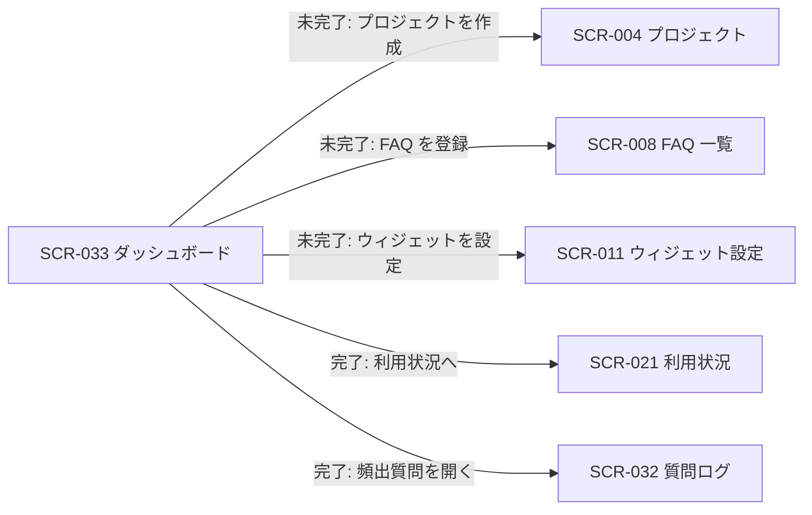

| 画面 ID | 画面名 | トレーサビリティID |
|----|----|----|
| SCR-033 | ダッシュボード | [TR-033](../../00_traceability/index.md#TR-033) ・ [TR-036](../../00_traceability/index.md#TR-036) |

| ステークホルダ | 対象 |
|----------------|------|
| オーナー       | ◯    |
| メンバー       | ◯(`projectId` 必須) |

## 1. 画面概要

「ダッシュボード」メニューの単一画面で、ウィジェットの利用準備状態に応じて表示パターンを切り替えます。セットアップ未完了時はセットアップ進捗パターン(設定 3 ステップのチェックリスト)を表示し、全ステップ完了後は KPI 表示パターン(質問数・未解決数・公開 FAQ 数・利用率)を表示します。

> [!NOTE]
> **補足** 本画面は「ダッシュボード」メニューの単一エントリです。初期表示でセットアップ進捗を確認し、未完了ならセットアップ進捗パターン、完了なら KPI 表示パターンを同一画面内で表示します(別メニュー・別画面は設けません)。KPI 表示パターンでは、オーナーは契約全体(プロジェクト未指定)も閲覧でき、メンバーは自身が所属するプロジェクトを `projectId` で指定して閲覧します。利用率は当月質問数を月次上限で割った比率(0〜1)で、当月選択時のみ意味を持ちます。

## 2. 画面遷移図

本画面からの画面遷移を、画面 ID・画面名とイベント(操作)で示します。セットアップ進捗パターンの各ステップ CTA は対応する設定画面へ、KPI 表示パターンは関連画面へ遷移します。

## 3. 画面レイアウト

セットアップ完了状態に応じた 2 つの表示パターンを示します。各項目が属するパターンは §4 の `表示条件` で定義します。

**パターン A: セットアップ完了時(KPI 表示)**

**パターン B: セットアップ未完了時(セットアップ進捗)**

## 4. 画面項目

本画面が各表示パターンで表示する項目を定義します。`表示条件` は項目が表示されるパターン・状態を示します。

| # | 項目 | 種類 | 必須 | 最大長 | 初期値 | 表示条件 |
|----|----|----|----|----|----|----|
| 1 | 進捗バー(完了ステップ数 / 全ステップ数) | div | — | — | — | セットアップ未完了時 |
| 2 | ステップ 1: プロジェクトを作成 | div | — | — | — | セットアップ未完了時 |
| 3 | ステップ 2: FAQ を登録 | div | — | — | — | セットアップ未完了時 |
| 4 | ステップ 3: ウィジェット埋め込みコードを配置 | div | — | — | — | セットアップ未完了時 |
| 5 | 次アクション CTA(作成する / 登録する / 設定する) | button | — | — | — | セットアップ未完了時(該当ステップが未完了のときのみ) |
| 6 | 期間切替トグル(当月 / 過去 30 日) | button | — | — | 当月 | セットアップ完了時 |
| 7 | プロジェクト絞り込み | select | — | — | オーナー: 契約全体 / メンバー: 所属プロジェクト | セットアップ完了時 |
| 8 | 質問数(KPI カード) | div | — | — | — | セットアップ完了時 |
| 9 | 未解決数(KPI カード) | div | — | — | — | セットアップ完了時 |
| 10 | 公開 FAQ 数(KPI カード) | div | — | — | — | セットアップ完了時 |
| 11 | 利用率(KPI カード・当月質問数 / 月次上限) | div | — | — | — | セットアップ完了時 |
| 12 | 頻出質問リスト(質問 / 出現回数) | table | — | — | — | セットアップ完了時(頻出質問が 1 件以上あるとき) |

- **#6 期間切替トグルの選択肢(コード値=表示名)**: `current_month`=当月 / `last_30d`=過去 30 日。
- **#7 プロジェクト絞り込みの選択肢**: プロジェクト名の一覧(オーナーは先頭に「契約全体」=プロジェクト未指定を含む。メンバーは自身が所属するプロジェクトのみ)。

## 5. バリデーション

本画面は数値・KPI の参照表示と表示切替コントロール(期間トグル・プロジェクト絞り込み)のみで構成され、利用者が値を入力する項目はありません(本画面に入力検証はありません)。

## 6. イベント

本画面のイベント(初期表示・各操作)ごとに、対象の画面項目を定義します。各イベントの処理内容は [7. 画面イベント詳細](#7-画面イベント詳細) で定義します。EVT-214〜EVT-216 は KPI 表示パターン、EVT-217〜EVT-219 はセットアップ進捗パターンの操作です。

<table>
<colgroup>
<col style="width: 18%" />
<col style="width: 22%" />
<col style="width: 60%" />
</colgroup>
<thead>
<tr>
<th>EVT-ID</th>
<th>画面項目</th>
<th>イベント</th>
</tr>
</thead>
<tbody>
<tr>
<td>EVT-213</td>
<td>—</td>
<td>初期表示</td>
</tr>
<tr>
<td>EVT-214</td>
<td>#6</td>
<td>期間を切り替え(KPI 表示)</td>
</tr>
<tr>
<td>EVT-215</td>
<td>#7</td>
<td>プロジェクトを絞り込み(KPI 表示)</td>
</tr>
<tr>
<td>EVT-216</td>
<td>#12</td>
<td>頻出質問を押下(KPI 表示)</td>
</tr>
<tr>
<td>EVT-217</td>
<td>#5</td>
<td>ステップ 1 の CTA を押下(セットアップ進捗)</td>
</tr>
<tr>
<td>EVT-218</td>
<td>#5</td>
<td>ステップ 2 の CTA を押下(セットアップ進捗)</td>
</tr>
<tr>
<td>EVT-219</td>
<td>#5</td>
<td>ステップ 3 の CTA を押下(セットアップ進捗)</td>
</tr>
</tbody>
</table>

## 7. 画面イベント詳細

各イベントの処理内容を定義します。

<table>
<colgroup>
<col style="width: 14%" />
<col style="width: 86%" />
</colgroup>
<thead>
<tr>
<th>EVT-ID</th>
<th>処理</th>
</tr>
</thead>
<tbody>
<tr>
<td>EVT-213</td>
<td>初期表示時に <a href="../../02_backend/03_apis/API-063.md#API-063">セットアップ進捗取得</a> を呼び出し、全ステップ完了フラグで表示パターンを分岐する:<pre>
 ┣ 未完了: セットアップ進捗パターンを表示する
 ┃  ┣ 進捗バー(#1)= 完了ステップ数 / 全ステップ数
 ┃  ┣ 各ステップ(#2〜#4)= 対応するステップの完了 / 未完了
 ┃  ┗ 未完了のステップにのみ次アクション CTA(#5)を表示する
 ┗ 完了: <a href="../../02_backend/03_apis/API-062.md#API-062">ダッシュボード集計取得</a> を呼び出し、KPI 表示パターンを表示する
    ┣ 質問数(#8)・未解決数(#9)・公開 FAQ 数(#10)・利用率(#11)・頻出質問リスト(#12)を表示する
    ┣ 既定の期間は当月(#6)とする
    ┗ メンバーが projectId 未指定で URL 直アクセスした場合は所属プロジェクトを既定選択し、特定できない場合は入力を促す
</pre></td>
</tr>
<tr>
<td>EVT-214</td>
<td>選択した期間(当月 / 過去 30 日)で <a href="../../02_backend/03_apis/API-062.md#API-062">ダッシュボード集計取得</a> を再呼び出しし、各 KPI(#8〜#11)・頻出質問リスト(#12)を更新する。過去 30 日選択時は利用率(#11)を当月基準である旨の注記付きで表示する</td>
</tr>
<tr>
<td>EVT-215</td>
<td>選択したプロジェクト(オーナーは「契約全体」を含む)で <a href="../../02_backend/03_apis/API-062.md#API-062">ダッシュボード集計取得</a> を再呼び出しし、各 KPI(#8〜#11)・頻出質問リスト(#12)を更新する</td>
</tr>
<tr>
<td>EVT-216</td>
<td>頻出質問リスト(#12)の質問を押下時に SCR-032 質問ログへ遷移し、該当質問を起点に詳細を確認できるようにする</td>
</tr>
<tr>
<td>EVT-217</td>
<td>ステップ 1 の CTA(#5)押下時に SCR-004 プロジェクトへ遷移する</td>
</tr>
<tr>
<td>EVT-218</td>
<td>ステップ 2 の CTA(#5)押下時に SCR-008 FAQ 一覧へ遷移する</td>
</tr>
<tr>
<td>EVT-219</td>
<td>ステップ 3 の CTA(#5)押下時に SCR-011 ウィジェット設定へ遷移し、埋め込みコードの配置と許可ドメイン設定を行えるようにする。全ステップ完了後に本画面を再表示すると KPI 表示パターンへ切り替わる</td>
</tr>
</tbody>
</table>

> [!NOTE]
> **補足** サイドバーのグローバルナビ(「ダッシュボード」「利用状況」「プロジェクト」「請求」「設定」)はプロジェクト共通の遷移であり、各 SCR で省略します。セットアップ進捗パターンは独立メニューを持たず、本「ダッシュボード」メニュー内の一表示パターンです。

## 8. エラーメッセージ

本画面はエラー・警告メッセージを表示しません。
