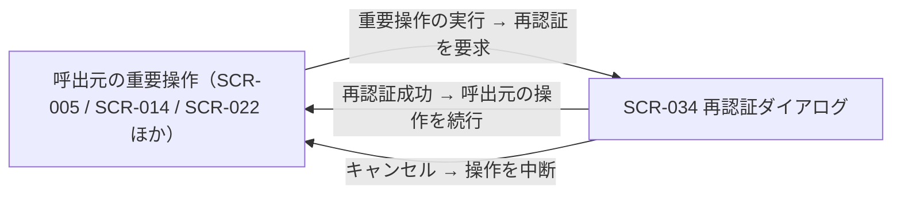

# SCR-034: 再認証ダイアログ

| ID | 業務ユースケースID | API ID |
|----|----|----|
| SCR-034 | [UC-009](../../../01_requirements/04_business_usecases/UC-009.md#UC-009) ・ [UC-010](../../../01_requirements/04_business_usecases/UC-010.md#UC-010) ・ [UC-017](../../../01_requirements/04_business_usecases/UC-017.md#UC-017) | [API-005](../../02_backend/03_apis/API-005.md#API-005) ・ [API-012](../../02_backend/03_apis/API-012.md#API-012) ・ [API-014](../../02_backend/03_apis/API-014.md#API-014) ・ [API-015](../../02_backend/03_apis/API-015.md#API-015) ・ [API-013](../../02_backend/03_apis/API-013.md#API-013) ・ [API-018](../../02_backend/03_apis/API-018.md#API-018) |

| ステークホルダ | 対象 |
|----------------|------|
| オーナー       | ◯    |
| メンバー       | ◯    |

## 1. 画面概要

- 重要操作の実行前に本人確認のためパスワードの再入力を求める共通のダイアログである。
- 呼出元(プロジェクト削除・メンバー招待・メールアドレス/パスワード変更等)から割込みで開かれ、再認証に成功すると呼出元の操作を続行する。
- 認証済みであればオーナー / メンバーいずれの立場でも利用でき、再認証の対象は常にログイン中の本人である。
- 主要な表示状態は入力待ち・認証失敗(エラー表示)である。

## 2. 画面遷移図

本ダイアログの呼出元・遷移を示す。

## 3. 画面レイアウト

本ダイアログの代表状態(入力待ち・認証失敗)を示す。

## 4. 画面項目

本ダイアログが表示する入出力項目を定義する。

| # | 項目 | 種類 | 必須 | 最大長 | 初期値 | 表示条件 |
|----|----|----|----|----|----|----|
| 1 | 見出し | label | — | — | 本人確認 | 常時 |
| 2 | 説明文 | label | — | — | — | 常時 |
| 3 | 現在のパスワード | input(password) | ◯ | 128 | — | 常時 |
| 4 | メッセージ表示エリア | alert | — | — | — | 認証失敗時 |
| 5 | 確認ボタン | button | — | — | — | 常時 |
| 6 | キャンセルボタン | button | — | — | — | 常時 |

## 5. バリデーション

入力検証を定義する。

| 画面項目 | タイミング | ルール | エラーコード |
|----|----|----|----|
| #3 | 送信時 | 未入力チェック | EM-01 |

## 6. イベント

本ダイアログのイベントごとに対象の画面項目を示す。

<table>
<colgroup>
<col style="width: 18%" />
<col style="width: 22%" />
<col style="width: 60%" />
</colgroup>
<thead>
<tr>
<th>EVT-ID</th>
<th>画面項目</th>
<th>イベント</th>
</tr>
</thead>
<tbody>
<tr>
<td>EVT-01</td>
<td>—</td>
<td>初期表示(呼出元の重要操作から起動)</td>
</tr>
<tr>
<td>EVT-02</td>
<td>#5</td>
<td>「確認」を押下</td>
</tr>
<tr>
<td>EVT-03</td>
<td>#6</td>
<td>「キャンセル」を押下</td>
</tr>
</tbody>
</table>

## 7. 画面イベント詳細

各イベントの処理内容を定義する。

<table>
<colgroup>
<col style="width: 14%" />
<col style="width: 86%" />
</colgroup>
<thead>
<tr>
<th>EVT-ID</th>
<th>処理</th>
</tr>
</thead>
<tbody>
<tr>
<td>EVT-01</td>
<td>呼出元の重要操作からの起動時に、本人確認の説明文(#2)とパスワード入力欄(#3)を表示する</td>
</tr>
<tr>
<td>EVT-02</td>
<td>「確認」(#5)押下時に、入力したパスワードで<a href="../../02_backend/03_apis/API-005.md#API-005">再認証(API-005)</a>を行う:<pre>
┣ 成功: 再認証トークンを得てダイアログを閉じ、呼出元の重要操作を続行する
┗ 失敗: メッセージ表示エリア(#4)にエラー(EM-02)を表示し、ダイアログを開いたまま再入力を促す(呼出元の操作は実行しない)
</pre></td>
</tr>
<tr>
<td>EVT-03</td>
<td>「キャンセル」(#6)押下時にダイアログを閉じ、呼出元の重要操作を中断する(呼出元の画面へ戻る)</td>
</tr>
</tbody>
</table>

## 8. エラーメッセージ

本ダイアログが表示するエラー・案内メッセージを定義する。

| エラーコード | エラーメッセージ |
|----|----|
| EM-01 | 現在のパスワードを入力してください |
| EM-02 | パスワードが正しくありません |
