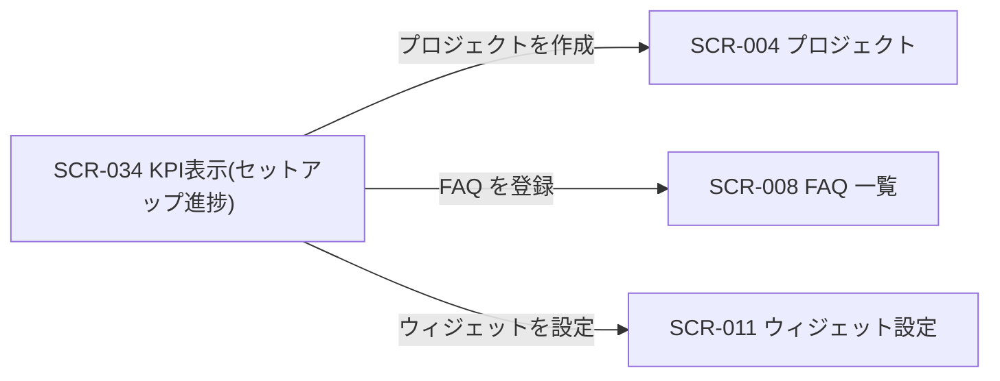
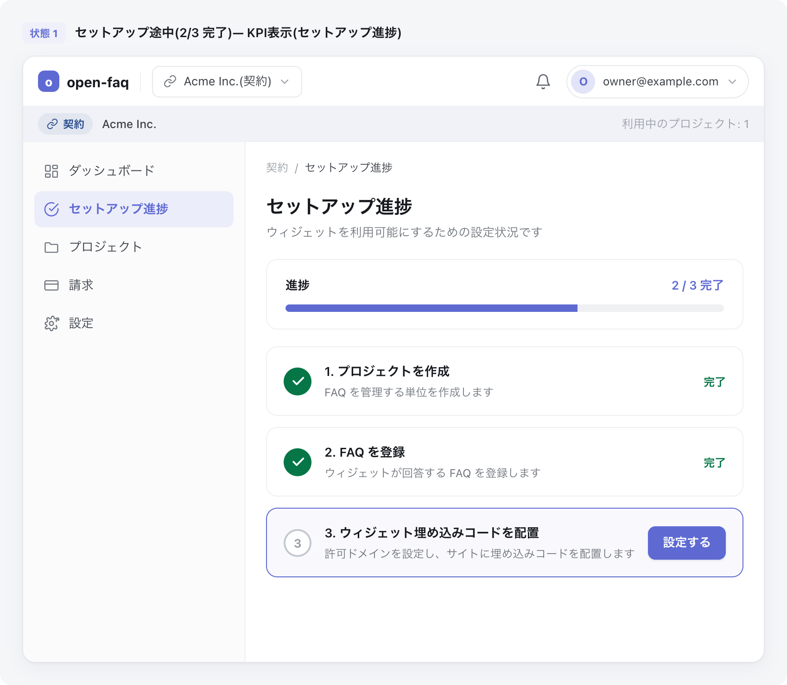

# SCR-034 KPI表示(セットアップ進捗)

> **このページは、オーナー / メンバーがウィジェットを利用可能にするための初期設定(オンボーディング)の進捗をステップで把握し、未完了ステップから該当画面へ誘導される画面 SCR-034 を定義します。** 画面概要 / 画面遷移図 / 画面レイアウト / 画面項目定義 / 入出力一覧 / 画面イベント一覧 の 6 セクションで記述します。

## 1. 画面概要

ウィジェットを利用可能にするまでの設定を 3 ステップ(プロジェクト作成 / FAQ 登録 / ウィジェット埋め込みコード配置)に分け、各ステップの完了 / 未完了と次アクションを表示するオンボーディング画面です。未完了ステップの CTA から該当画面へ遷移し、全ステップ完了時は利用可能である旨を表示します。

| 画面 ID | 画面名 | 機能概要 |
|----|----|----|
| `SCR-034` | KPI表示(セットアップ進捗) | ウィジェット利用開始までの設定進捗をステップで可視化し、未完了ステップへ誘導する |

| 関連 | 内容 |
|----|----|
| 関連画面 | [`SCR-004` プロジェクト](SCR-004.md) / [`SCR-008` FAQ 一覧](SCR-008.md) / [`SCR-011` ウィジェット設定](SCR-011.md) |
| 対応業務UC | [UC-036](../../../01_requirements/04_business_usecases/UC-036.md#UC-036) |

| ステークホルダ | 対象 |
|----------------|------|
| オーナー       | ◯    |
| メンバー       | ◯    |

> [!NOTE]
> **補足** 本画面は契約サマリーの一部として利用準備状況(オンボーディング)を可視化します。各ステップの完了判定はバックエンドが行い、未完了ステップの CTA はそれぞれプロジェクト作成(SCR-004)・FAQ 登録(SCR-008)・ウィジェット設定(SCR-011)へ遷移します。全ステップ完了時は「ウィジェット利用可能」を表示します。

## 2. 画面遷移図

本画面からの画面遷移を、画面 ID・画面名とイベント(操作)で示します。各ステップの CTA はそれぞれ対応する設定画面へ遷移します。

## 3. 画面レイアウト

## 4. 画面項目定義

本画面の表示項目(進捗バー・各ステップ・CTA・利用可能メッセージ)を定義します。項目の正本は本表です。

| 項目 ID | 項目 | 説明 | 種類 | 表示条件 | 表示 |
|----|----|----|----|----|----|
| `IT-01` | 進捗バー | 完了ステップ数 / 全ステップ数を視覚化する | プログレスバー | — | 完了割合(例: 2/3) |
| `IT-02` | ステップ 1: プロジェクトを作成 | プロジェクト作成の完了 / 未完了を表示する | ステップ項目 | — | ステップ名 + 完了 / 未完了 |
| `IT-03` | ステップ 2: FAQ を登録 | FAQ 登録の完了 / 未完了を表示する | ステップ項目 | — | ステップ名 + 完了 / 未完了 |
| `IT-04` | ステップ 3: ウィジェット埋め込みコードを配置 | 埋め込みコード配置(許可ドメイン設定)の完了 / 未完了を表示する | ステップ項目 | — | ステップ名 + 完了 / 未完了 |
| `IT-05` | 次アクション CTA | 未完了ステップの該当画面へ誘導するボタン | ボタン | 各ステップが未完了のときのみ表示 | 「作成する」「登録する」「設定する」 |
| `IT-06` | ウィジェット利用可能メッセージ | 全ステップ完了時に利用可能である旨を表示する | メッセージ | 全ステップ完了時のみ表示 | 「ウィジェット利用可能」 |

## 5. 入出力一覧

本画面が読み取るテーブルと、呼び出す API の一覧です。テーブルの正本は [データベース設計](../../02_backend/04_database/index.md)、API の正本は [API設計](../../02_backend/03_apis/index.md#API-063) です。

<table>
<thead>
<tr>
<th rowspan="2">入出力名</th>
<th rowspan="2">説明</th>
<th rowspan="2">種別</th>
<th rowspan="2">I/O</th>
<th colspan="4">アクセス種別(CRUD)</th>
<th rowspan="2">備考</th>
</tr>
<tr>
<th>C</th>
<th>R</th>
<th>U</th>
<th>D</th>
</tr>
</thead>
<tbody>
<tr>
<td>プロジェクト</td>
<td>プロジェクトが 1 件以上あるか(ステップ 1 完了判定)を取得する</td>
<td>テーブル</td>
<td>入力</td>
<td>—</td>
<td>◯</td>
<td>—</td>
<td>—</td>
<td><code>M_PROJECTS</code>(<a href="../../02_backend/04_database/index.md#TBL-004">TBL-004</a>)</td>
</tr>
<tr>
<td>FAQ</td>
<td>FAQ が 1 件以上あるか(ステップ 2 完了判定)を取得する</td>
<td>テーブル</td>
<td>入力</td>
<td>—</td>
<td>◯</td>
<td>—</td>
<td>—</td>
<td><code>M_FAQS</code>(<a href="../../02_backend/04_database/index.md#TBL-006">TBL-006</a>)</td>
</tr>
<tr>
<td>許可ドメイン</td>
<td>許可ドメインが 1 件以上あるか(ステップ 3 完了判定)を取得する</td>
<td>テーブル</td>
<td>入力</td>
<td>—</td>
<td>◯</td>
<td>—</td>
<td>—</td>
<td><code>M_ALLOWED_DOMAINS</code>(<a href="../../02_backend/04_database/index.md#TBL-005">TBL-005</a>)</td>
</tr>
<tr>
<td>セットアップ進捗取得</td>
<td>初期表示時に各ステップの完了 / 未完了と全体完了状態を取得する</td>
<td>API</td>
<td>入力</td>
<td>—</td>
<td>◯</td>
<td>—</td>
<td>—</td>
<td><a href="../../02_backend/03_apis/API-063.md#API-063">セットアップ進捗取得</a></td>
</tr>
</tbody>
</table>

## 6. 画面イベント一覧

本画面のイベント(初期表示・各操作)ごとに、対象の項目 ID と処理内容を定義します。

<table>
<thead>
<tr>
<th>EVT-ID</th>
<th>イベント ID</th>
<th>項目 ID</th>
<th>イベント</th>
<th>処理</th>
</tr>
</thead>
<tbody>
<tr>
<td>EVT-239</td>
<td><code>EV-01</code></td>
<td>—</td>
<td>初期表示</td>
<td>
<a href="../../02_backend/03_apis/API-063.md#API-063">セットアップ進捗取得</a> を呼び出し、各ステップの完了 / 未完了(IT-02〜IT-04)と進捗バー(IT-01)を表示する。未完了ステップには次アクション CTA(IT-05)を表示する。全ステップ完了時はウィジェット利用可能メッセージ(IT-06)を表示する。
</td>
</tr>
<tr>
<td>EVT-240</td>
<td><code>EV-02</code></td>
<td><a href="#IT-05">IT-05</a></td>
<td>ステップ 1 の CTA を押下</td>
<td>
プロジェクト作成画面(SCR-004)へ遷移する。
</td>
</tr>
<tr>
<td>EVT-241</td>
<td><code>EV-03</code></td>
<td><a href="#IT-05">IT-05</a></td>
<td>ステップ 2 の CTA を押下</td>
<td>
FAQ 登録画面(SCR-008)へ遷移する。
</td>
</tr>
<tr>
<td>EVT-242</td>
<td><code>EV-04</code></td>
<td><a href="#IT-05">IT-05</a></td>
<td>ステップ 3 の CTA を押下</td>
<td>
ウィジェット設定画面(SCR-011)へ遷移し、埋め込みコードの配置と許可ドメイン設定を行えるようにする。
</td>
</tr>
</tbody>
</table>

> [!NOTE]
> **補足** 各ステップの CTA(EV-02〜EV-04)は未完了ステップにのみ表示され、それぞれプロジェクト作成(SCR-004)・FAQ 登録(SCR-008)・ウィジェット設定(SCR-011)へ遷移します。サイドバーのグローバルナビは各 SCR で省略します。
