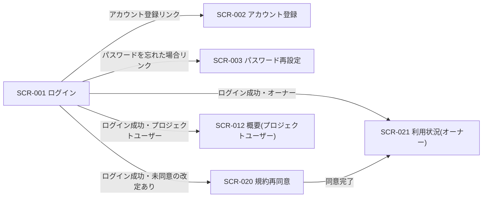

<!-- portal-top -->
[設計ポータル](../../README.md) ／ [基本設計](../index.md) ／ [画面設計](index.md) ／ **SCR-001 ログイン**
<!-- /portal-top -->

# SCR-001 ログイン

> **このページは、アカウント利用者がメールアドレスとパスワードでセッションを確立する画面 SCR-001 を定義します。** 画面概要 / 画面遷移図 / 画面レイアウト / 画面項目定義 / 入出力一覧 / 画面イベント一覧 の 6 セクションで記述します。

*版数 v1.0 ・ 更新 2026-06-17 ・ 承認済*

## 1. 画面概要

アカウント利用者がメールアドレスとパスワードを入力してセッションを確立する画面です。失敗回数制限・ロックアウトの警告表示と、アカウント登録・パスワード再設定への導線を持ちます。

| 画面 ID | 画面名 | 機能概要 |
|----|----|----|
| `SCR-001` | ログイン | メールアドレスとパスワードによる認証でセッションを確立する |

| 関連 | 内容 |
|----|----|
| FR / BR | FR-004, FR-007, FR-008 / BR-001, BR-003 |
| 関連画面 | [`SCR-002` アカウント登録](SCR-002.md) / [`SCR-003` パスワード再設定](SCR-003.md) |
| 対応業務UC | [UC-001](../../01_requirements/02_business_usecases/UC-001.md#UC-001) ・ [UC-002](../../01_requirements/02_business_usecases/UC-002.md#UC-002) ・ [UC-003](../../01_requirements/02_business_usecases/UC-003.md#UC-003) ・ [UC-004](../../01_requirements/02_business_usecases/UC-004.md#UC-004) ・ [UC-005](../../01_requirements/02_business_usecases/UC-005.md#UC-005) ・ [UC-006](../../01_requirements/02_business_usecases/UC-006.md#UC-006) |

| ステークホルダ             | 対象 |
|----------------------------|------|
| 未認証ユーザー(ログイン前) | ◯    |

> [!NOTE]
> **補足** 本画面は認証前に表示されるため権限は不要です(認証前)。認証エラーはメールアドレスの存在有無を区別しない共通文言で表示し、攻撃者にヒントを与えません。

## 2. 画面遷移図

本画面からの画面遷移を、画面 ID・画面名とイベント(操作)で示します。

## 3. 画面レイアウト

## 4. 画面項目定義

本画面の入出力項目(入力フォーム・操作ボタン・エラー表示)を定義します。項目の正本は本表です。

| 項目 ID | 項目 | 説明 | 種類 | 表示条件 | 表示 |
|----|----|----|----|----|----|
| `IT-01` | メールアドレス | ログインに用いるメールアドレスを入力する(必須・形式チェック) | テキストボックス(メールアドレス) | — | placeholder「admin@example.com」 |
| `IT-02` | パスワード | ログインに用いるパスワードを入力する(必須) | テキストボックス(パスワード) | — | マスク表示 |
| `IT-03` | ログインボタン | 入力内容で認証を実行しセッションを確立する | ボタン(Primary) | — | 「ログイン」 |
| `IT-04` | パスワードを忘れた場合 | パスワード再設定画面へ遷移する導線 | リンク | — | 「パスワードを忘れた場合」 |
| `IT-05` | アカウント登録 | アカウント登録画面へ遷移する導線 | リンク | — | 「アカウント登録」 |
| `IT-06` | 認証エラーメッセージ | 認証失敗時に共通文言のエラーを表示する(メールアドレスの存在有無を区別しない) | アラート | 認証失敗時のみ | 「認証エラー: メールアドレスまたはパスワードが正しくありません」 |
| `IT-07` | ロックアウト警告 | 連続失敗(5 回)による一時ロック(15 分)中である旨を表示する | アラート | 5 回連続失敗後のみ | 「ログインが一時的にロックされています。しばらく経ってからお試しください(15 分)」 |
| `IT-08` | Turnstile チャレンジ | 連続失敗後に表示する Turnstile ウィジェット。認証時に取得したトークンを API に送信する | Turnstile ウィジェット | 連続失敗後(API が `TURNSTILE_REQUIRED` を返した場合) | Cloudflare Turnstile 埋め込みウィジェット |

## 5. 入出力一覧

本画面が読み書きするテーブルと、呼び出す API の一覧です。テーブルの正本は [データベース設計](../04_database/index.md)、API の正本は [API設計](../03_apis/index.md#API-002) です。

<table>
<thead>
<tr>
<th rowspan="2">入出力名</th>
<th rowspan="2">説明</th>
<th rowspan="2">種別</th>
<th rowspan="2">I/O</th>
<th colspan="4">アクセス種別(CRUD)</th>
<th rowspan="2">備考</th>
</tr>
<tr>
<th>C</th>
<th>R</th>
<th>U</th>
<th>D</th>
</tr>
</thead>
<tbody>
<tr>
<td>オーナー / プロジェクトユーザー</td>
<td>認証情報を照合する(オーナーマスタとプロジェクトユーザーマスタは完全分離。両マスタを照合対象とする)</td>
<td>テーブル</td>
<td>入力</td>
<td>—</td>
<td>◯</td>
<td>—</td>
<td>—</td>
<td><code>M_CONTRACT</code>(<a href="../04_database/index.md#TBL-001">テーブル設計 3.2</a>)/ <code>M_PRJ_USERS</code>(<a href="../04_database/index.md#TBL-003">テーブル設計 3.1</a>)</td>
</tr>
<tr>
<td>ログイン</td>
<td>認証してセッションを発行する</td>
<td>API</td>
<td>入力 / 出力</td>
<td>—</td>
<td>—</td>
<td>—</td>
<td>—</td>
<td><code>POST /auth/login</code>(<a href="../03_apis/API-002.md#API-002">ログイン</a>)</td>
</tr>
<tr>
<td><code>T_SESSIONS</code></td>
<td>ログイン成功時にセッションを発行・記録する</td>
<td>テーブル</td>
<td>出力</td>
<td>◯</td>
<td>—</td>
<td>—</td>
<td>—</td>
<td>セッション発行(<a href="../04_database/index.md">データベース設計</a>)</td>
</tr>
</tbody>
</table>

## 6. 画面イベント一覧

本画面のイベント(初期表示・各操作)ごとに、対象の項目 ID と処理内容を定義します。

<table>
<colgroup>
<col style="width: 10%" />
<col style="width: 12%" />
<col style="width: 12%" />
<col style="width: 30%" />
<col style="width: 46%" />
</colgroup>
<thead>
<tr>
<th>EVT-ID</th>
<th>イベント ID</th>
<th>項目 ID</th>
<th>イベント</th>
<th>処理</th>
</tr>
</thead>
<tbody>
<tr>
<td><a href="../02_screen_events/EVT-001.md#EVT-001">EVT-001</a></td>
<td><code>EV-01</code></td>
<td>—</td>
<td>初期表示</td>
<td>ログインフォームを表示する。既認証セッションが有効な場合は管理範囲に応じた初期画面へリダイレクトする</td>
</tr>
<tr>
<td><a href="../02_screen_events/EVT-002.md#EVT-002">EVT-002</a></td>
<td><code>EV-02</code></td>
<td><a href="#IT-01">IT-01</a></td>
<td>メールアドレスを入力</td>
<td>入力値の必須・メールアドレス形式をインラインで検証し、不正な場合はフィールド直下にエラーを表示する</td>
</tr>
<tr>
<td><a href="../02_screen_events/EVT-003.md#EVT-003">EVT-003</a></td>
<td><code>EV-03</code></td>
<td><a href="#IT-02">IT-02</a></td>
<td>パスワードを入力</td>
<td>入力値の必須をインラインで検証し、未入力の場合はフィールド直下にエラーを表示する</td>
</tr>
<tr>
<td><a href="../02_screen_events/EVT-004.md#EVT-004">EVT-004</a></td>
<td><code>EV-04</code></td>
<td><a href="#IT-03">IT-03</a></td>
<td>「ログイン」を押下</td>
<td><ul>
<li>IT-01・IT-02 の必須・形式を再検証し、不正な場合はエラーを表示して送信を中止する</li>
<li>連続失敗後は Turnstile チャレンジ(<a href="#IT-08">IT-08</a>)を表示し、取得したトークンを API に含めて送信する</li>
<li><a href="../03_apis/API-002.md#API-002">ログイン</a> API(POST /auth/login)を呼び出す</li>
<li>成功・未同意の改定あり: SCR-020 規約再同意へ割込み遷移する</li>
<li>成功・オーナー: SCR-021 利用状況へ遷移する</li>
<li>成功・プロジェクトユーザー: SCR-012 概要へ遷移する</li>
<li>失敗(連続失敗 5 回未満): 共通エラー(<a href="#IT-06">IT-06</a>)を表示する(メールアドレスの存在有無を区別しない文言)</li>
<li>失敗(連続失敗 5 回以上): ロックアウト警告(<a href="#IT-07">IT-07</a>)を表示し、15 分間の試行を抑止する(<a href="../../01_requirements/01_specifications/FR-007.md#FR-007">FR-007</a>)</li>
</ul></td>
</tr>
<tr>
<td><a href="../02_screen_events/EVT-005.md#EVT-005">EVT-005</a></td>
<td><code>EV-05</code></td>
<td><a href="#IT-04">IT-04</a></td>
<td>「パスワードを忘れた場合」を押下</td>
<td>SCR-003 パスワード再設定へ遷移する</td>
</tr>
<tr>
<td><a href="../02_screen_events/EVT-006.md#EVT-006">EVT-006</a></td>
<td><code>EV-06</code></td>
<td><a href="#IT-05">IT-05</a></td>
<td>「アカウント登録」を押下</td>
<td>SCR-002 アカウント登録へ遷移する</td>
</tr>
</tbody>
</table>

---

<!-- portal-bottom -->
[← 画面設計](index.md) ・ [基本設計](../index.md) ・ [↑ 設計ポータル](../../README.md)
<!-- /portal-bottom -->
