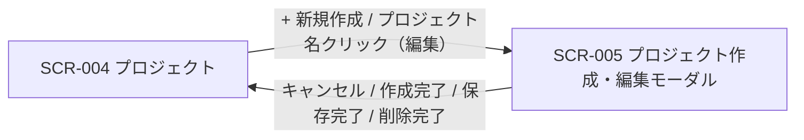

<!-- portal-top -->
[設計ポータル](../../README.md) ／ [基本設計](../index.md) ／ [画面設計](index.md) ／ **SCR-005 プロジェクト作成・編集モーダル**
<!-- /portal-top -->

# SCR-005 プロジェクト作成・編集モーダル

> **このページは、SCR-004 から開くプロジェクトの作成・編集・削除を行うモーダル SCR-005 を定義します。** 画面概要 / 画面遷移図 / 画面レイアウト / 画面項目定義 / 入出力一覧 / 画面イベント一覧 の 6 セクションで記述します。

*版数 v1.0 ・ 更新 2026-06-17 ・ 承認済*

## 1. 画面概要

SCR-004 から開く、プロジェクトの新規作成・編集・削除を全画面割込みモーダルで行う画面です(オーナー専有)。呼出元で新規作成 / 編集モードを切り替えます。

| 画面 ID | 画面名 | 機能概要 |
|----|----|----|
| `SCR-005` | プロジェクト作成・編集モーダル | プロジェクトの新規作成・編集・削除を全画面割込みモーダルで実施する |

| 関連 | 内容 |
|----|----|
| FR / BR | FR-037, FR-038, FR-039 / BR-018, BR-019 |
| 関連画面 | [`SCR-004` プロジェクト](SCR-004.md)(呼出元) / [`SCR-014` メンバー招待・編集モーダル](SCR-014.md) |
| 対応業務UC | [UC-033](../../01_requirements/02_business_usecases/UC-033.md#UC-033) ・ [UC-034](../../01_requirements/02_business_usecases/UC-034.md#UC-034) ・ [UC-035](../../01_requirements/02_business_usecases/UC-035.md#UC-035) ・ [UC-036](../../01_requirements/02_business_usecases/UC-036.md#UC-036) ・ [UC-037](../../01_requirements/02_business_usecases/UC-037.md#UC-037) ・ [UC-038](../../01_requirements/02_business_usecases/UC-038.md#UC-038) ・ [UC-039](../../01_requirements/02_business_usecases/UC-039.md#UC-039) ・ [UC-040](../../01_requirements/02_business_usecases/UC-040.md#UC-040) ・ [UC-041](../../01_requirements/02_business_usecases/UC-041.md#UC-041) ・ [UC-042](../../01_requirements/02_business_usecases/UC-042.md#UC-042) ・ [UC-043](../../01_requirements/02_business_usecases/UC-043.md#UC-043) ・ [UC-044](../../01_requirements/02_business_usecases/UC-044.md#UC-044) ・ [UC-045](../../01_requirements/02_business_usecases/UC-045.md#UC-045) |

| ステークホルダ | 対象 |
|----------------|------|
| オーナー       | ◯    |
| メンバー       | —    |

> [!IMPORTANT]
> **重要** プロジェクト作成時、作成者であるオーナーを当該プロジェクトの member として `M_PRJ_USERS` に自動登録します(オーナーの認可権威は引き続き `M_CONTRACT` の `isOwner`。メンバー行は一覧表示・担当割当・通知宛先の網羅用です)。他者を追加する場合はプロジェクト作成後に SCR-013 / SCR-014 から招待します。

## 2. 画面遷移図

本モーダルの呼出元・遷移先を、画面 ID・画面名とイベント(操作)で示します。

## 3. 画面レイアウト

## 4. 画面項目定義

本モーダルの入力項目・操作ボタン・DangerSection と各バリデーションを定義します。項目の正本は本表です。編集モードのみ表示する項目は備考に明記します。

| 項目 ID | 項目 | 説明 | 種類 | 表示条件 | 表示 |
|----|----|----|----|----|----|
| `IT-01` | 見出し | モードに応じてモーダルの見出しを表示する | 見出し | — | 新規「新規プロジェクトを作成」/ 編集「プロジェクトを編集」 |
| `IT-02` | プロジェクト ID | 編集対象プロジェクトの ID を読み取り専用で表示しコピーを提供する(クリック遷移には使わない) | ラベル + アイコンボタン | 編集モードのみ | プロジェクト ID(例「prj_01HMK4Z8Q...」)+「コピー」 |
| `IT-03` | プロジェクト名 | プロジェクトの名称を入力する(必須・1〜100 文字) | テキストボックス | — | placeholder「例: サポートサイト」+ 文字数カウンタ「N / 100」 |
| `IT-04` | 許可ドメイン | ウィジェット埋め込みを許可するドメインを複数入力する(必須・Enter またはカンマで追加・即時検証。完全一致 + `*.example.com` 形式可、IP アドレス・プロトコル指定は不可) | テキストボックス(タグ入力) | — | 入力済みドメインのタグ(例「https://example.com」「\*.example.com」) |
| `IT-05` | 許可ドメイン補足ヘルプ | 許可ドメインの入力形式を補足説明する | ラベル | — | 「ウィジェット埋め込みを許可するドメイン。サブドメインを許可するには `*.example.com` のように記載します」 |
| `IT-06` | プロジェクト連絡先メール | プロジェクトの連絡先メールアドレスを入力する(任意・確認完了後にウィジェットの「お問い合わせ先」表示にのみ利用) | テキストボックス(メールアドレス) | — | placeholder「例: support@example.com」 |
| `IT-07` | 連絡先メール確認状態 | 連絡先メールの確認状態を表示し再送導線を提供する | バッジ + ボタン | 編集モードのみ | 「確認済み」/「確認待ち」/「未設定」+ 確認待ち時「確認メールを再送」 |
| `IT-08` | キャンセル | 変更を破棄してモーダルを閉じる | ボタン(Secondary) | — | 「キャンセル」 |
| `IT-09` | プロジェクトを作成 | 入力内容で新規プロジェクトを作成する | ボタン(Primary) | 新規モードのみ | 「プロジェクトを作成」 |
| `IT-10` | 保存 | 編集内容でプロジェクトを更新する | ボタン(Primary) | 編集モードのみ | 「保存」 |
| `IT-11` | プロジェクトを削除 | 名称タイプ確認と再認証(L3)を経てプロジェクトを論理削除する(削除導線は本 DangerSection のみに集約) | ボタン(Danger) | 編集モードのみ | 「プロジェクトを削除」 |
| `IT-12` | 閉じる(× ボタン) | モーダルヘッダー右上の × ボタンでモーダルを閉じる(「キャンセル」IT-08 と同動作) | ボタン(アイコン) | — | × アイコン |
| `IT-13` | 削除確認名称入力欄 | プロジェクト削除前にプロジェクト名を入力させて削除ボタンを有効化するための確認入力欄 | テキストボックス | 編集モードのみ | placeholder にプロジェクト名 |

> [!WARNING]
> **注意** バリデーション: プロジェクト名は必須 1〜100 文字、許可ドメインは必須(URL またはワイルドカード形式、IP / プロトコル指定不可)、連絡先メールは任意(メール形式)。削除はプロジェクト名の完全一致タイプ確認(IT-13) + 再認証(L3)を必須とします。

## 5. 入出力一覧

本モーダルが読み書きするテーブルと、呼び出す API の一覧です。テーブルの正本は [データベース設計](../04_database/index.md)、API の正本は [API設計](../03_apis/index.md) です。

<table>
<thead>
<tr>
<th rowspan="2">入出力名</th>
<th rowspan="2">説明</th>
<th rowspan="2">種別</th>
<th rowspan="2">I/O</th>
<th colspan="4">アクセス種別(CRUD)</th>
<th rowspan="2">備考</th>
</tr>
<tr>
<th>C</th>
<th>R</th>
<th>U</th>
<th>D</th>
</tr>
</thead>
<tbody>
<tr>
<td>プロジェクト</td>
<td>新規作成・現値ロード・更新・論理削除を行う</td>
<td>テーブル</td>
<td>入力 / 出力</td>
<td>◯</td>
<td>◯</td>
<td>◯</td>
<td>◯</td>
<td>論理削除は <code>valid=0</code>。<code>M_PROJECTS</code>(<a href="../04_database/index.md#TBL-004">テーブル設計 3.6</a>)</td>
</tr>
<tr>
<td>許可ドメイン</td>
<td>許可ドメインの登録・更新・削除を行う</td>
<td>テーブル</td>
<td>入力 / 出力</td>
<td>◯</td>
<td>◯</td>
<td>◯</td>
<td>◯</td>
<td><code>M_ALLOWED_DOMAINS</code>(<a href="../04_database/index.md#TBL-005">テーブル設計 3.8</a>)</td>
</tr>
<tr>
<td>プロジェクト割当</td>
<td>作成時にオーナーのメンバー行を作成し、削除時に当該プロジェクトの割当を論理削除する</td>
<td>テーブル</td>
<td>出力</td>
<td>◯</td>
<td>—</td>
<td>◯</td>
<td>—</td>
<td>削除時 <code>valid=0</code>。<code>M_PRJ_USERS</code>(<a href="../04_database/index.md#TBL-003">テーブル設計 3.3</a>)</td>
</tr>
<tr>
<td>プロジェクト作成</td>
<td>新規プロジェクトを作成する API を呼び出す</td>
<td>API</td>
<td>入力 / 出力</td>
<td>◯</td>
<td>—</td>
<td>—</td>
<td>—</td>
<td><a href="../03_apis/API-017.md#API-017">プロジェクト新規作成</a></td>
</tr>
<tr>
<td>プロジェクト更新・削除</td>
<td>編集での現値ロード・更新・削除 API を呼び出す</td>
<td>API</td>
<td>入力 / 出力</td>
<td>—</td>
<td>◯</td>
<td>◯</td>
<td>◯</td>
<td>編集 <code>PATCH /projects/{id}</code> / 削除 <code>DELETE /projects/{id}</code> / 現値ロード <code>GET /projects/{id}</code>(<a href="../03_apis/API-018.md#API-018">プロジェクト更新・削除</a>)</td>
</tr>
<tr>
<td>連絡先メール確認</td>
<td>連絡先メールの確認トークンを検証する API を呼び出す(メールリンクからの自動遷移)</td>
<td>API</td>
<td>入力 / 出力</td>
<td>—</td>
<td>—</td>
<td>◯</td>
<td>—</td>
<td><a href="../03_apis/API-009.md#API-009">プロジェクト連絡先メール確認</a></td>
</tr>
<tr>
<td>連絡先確認メール再送</td>
<td>連絡先確認メールを再送する API を呼び出す</td>
<td>API</td>
<td>入力 / 出力</td>
<td>◯</td>
<td>◯</td>
<td>◯</td>
<td>—</td>
<td><a href="../03_apis/API-011.md#API-011">連絡先確認メール再送</a></td>
</tr>
</tbody>
</table>

## 6. 画面イベント一覧

本モーダルのイベント(初期表示・各操作)ごとに、対象の項目 ID と処理内容を定義します。

<table>
<colgroup>
<col style="width: 10%" />
<col style="width: 12%" />
<col style="width: 12%" />
<col style="width: 30%" />
<col style="width: 46%" />
</colgroup>
<thead>
<tr>
<th>EVT-ID</th>
<th>イベント ID</th>
<th>項目 ID</th>
<th>イベント</th>
<th>処理</th>
</tr>
</thead>
<tbody>
<tr>
<td><a href="../02_screen_events/EVT-033.md#EVT-033">EVT-033</a></td>
<td><code>EV-01</code></td>
<td>—</td>
<td>初期表示(新規モード)</td>
<td>空の入力フォームを表示する。見出し(IT-01)を「新規プロジェクトを作成」に設定し、「プロジェクトを作成」ボタン(IT-09)のみ表示する。編集モード専用項目(IT-02 / IT-07 / IT-10 / IT-11)は非表示とする</td>
</tr>
<tr>
<td><a href="../02_screen_events/EVT-034.md#EVT-034">EVT-034</a></td>
<td><code>EV-02</code></td>
<td>—</td>
<td>初期表示(編集モード)</td>
<td><ul>
<li>成功時: <a href="../03_apis/API-018.md#API-018">プロジェクト更新・削除</a> API(GET)で現値を取得し各入力欄に設定する。見出し(IT-01)を「プロジェクトを編集」に設定し、編集モード専用項目(IT-02 / IT-07 / IT-10 / IT-11)を表示する</li>
<li>失敗時: 取得エラーをトーストで表示しモーダルを閉じる</li>
</ul></td>
</tr>
<tr>
<td><a href="../02_screen_events/EVT-035.md#EVT-035">EVT-035</a></td>
<td><code>EV-03</code></td>
<td><a href="#IT-03">IT-03</a></td>
<td>プロジェクト名を入力</td>
<td>入力のたびに必須・文字数(1〜100 文字)を検証しインラインエラーを表示する。文字数カウンタを更新する</td>
</tr>
<tr>
<td><a href="../02_screen_events/EVT-036.md#EVT-036">EVT-036</a></td>
<td><code>EV-04</code></td>
<td><a href="#IT-04">IT-04</a></td>
<td>許可ドメインを入力</td>
<td>Enter またはカンマでタグを追加する。追加時にドメイン形式(完全一致または <code>*.example.com</code> 形式・IP アドレス・プロトコル指定不可)を検証し、不正な場合はインラインエラーを表示してタグを追加しない</td>
</tr>
<tr>
<td><a href="../02_screen_events/EVT-037.md#EVT-037">EVT-037</a></td>
<td><code>EV-05</code></td>
<td><a href="#IT-06">IT-06</a></td>
<td>プロジェクト連絡先メールを入力</td>
<td>フォーカスアウト時にメール形式を検証しインラインエラーを表示する</td>
</tr>
<tr>
<td><a href="../02_screen_events/EVT-038.md#EVT-038">EVT-038</a></td>
<td><code>EV-06</code></td>
<td><a href="#IT-09">IT-09</a></td>
<td>「プロジェクトを作成」を押下</td>
<td><ul>
<li>全項目のバリデーションを実行し、エラーがある場合は対象欄にインラインエラーを表示して送信を中断する</li>
<li>成功時: <a href="../03_apis/API-017.md#API-017">プロジェクト新規作成</a> API を呼び出しプロジェクトを作成する。オーナーを当該プロジェクトのメンバーとして自動登録し、ウィジェット公開キーを発行する。モーダルを閉じ SCR-004 の一覧を更新する</li>
<li>失敗時(重複名): プロジェクト名欄にインラインエラー「このプロジェクト名は既に使用されています」を表示する</li>
<li>失敗時(その他): トーストでエラーを表示する</li>
</ul></td>
</tr>
<tr>
<td><a href="../02_screen_events/EVT-039.md#EVT-039">EVT-039</a></td>
<td><code>EV-07</code></td>
<td><a href="#IT-10">IT-10</a></td>
<td>「保存」を押下</td>
<td><ul>
<li>全項目のバリデーションを実行し、エラーがある場合は対象欄にインラインエラーを表示して送信を中断する</li>
<li>成功時: <a href="../03_apis/API-018.md#API-018">プロジェクト更新・削除</a> API(PATCH)でプロジェクトを更新する。連絡先メール(IT-06)を変更した場合は確認メールを自動送信し、IT-07 の確認状態を「確認待ち」に更新する。モーダルを閉じ SCR-004 の一覧を更新する</li>
<li>失敗時: トーストでエラーを表示する</li>
</ul></td>
</tr>
<tr>
<td><a href="../02_screen_events/EVT-040.md#EVT-040">EVT-040</a></td>
<td><code>EV-08</code></td>
<td><a href="#IT-07">IT-07</a></td>
<td>「確認メールを再送」を押下</td>
<td><ul>
<li>成功時: <a href="../03_apis/API-011.md#API-011">連絡先確認メール再送</a> API を呼び出し、連絡先メール確認メールを再送信する</li>
<li>失敗時(レート制限): 「再送は X 分後に再試行できます」をトーストで表示する</li>
<li>失敗時(その他): トーストでエラーを表示する</li>
</ul></td>
</tr>
<tr>
<td><a href="../02_screen_events/EVT-041.md#EVT-041">EVT-041</a></td>
<td><code>EV-09</code></td>
<td><a href="#IT-13">IT-13</a></td>
<td>削除確認名称を入力</td>
<td>入力のたびに入力値と現プロジェクト名を照合し、完全一致する場合のみ「プロジェクトを削除」ボタン(IT-11)を有効化する。不一致の場合はボタンを無効化したままにする</td>
</tr>
<tr>
<td><a href="../02_screen_events/EVT-042.md#EVT-042">EVT-042</a></td>
<td><code>EV-10</code></td>
<td><a href="#IT-11">IT-11</a></td>
<td>「プロジェクトを削除」を押下</td>
<td><ul>
<li>削除確認名称(IT-13)が現プロジェクト名と完全一致していない場合は処理を中断する(ボタンは無効状態のため通常到達しない)</li>
<li>再認証(L3 パスワード再認証)を要求する</li>
<li>成功時: <a href="../03_apis/API-018.md#API-018">プロジェクト更新・削除</a> API(DELETE)でプロジェクトを論理削除する。メンバー割当を解除し、他に有効割当を持たないメンバーのアカウントを無効化する。モーダルを閉じ SCR-004 の一覧を更新する</li>
<li>失敗時(再認証エラー): 「パスワードが正しくありません」をインラインで表示する</li>
<li>失敗時(その他): トーストでエラーを表示する</li>
</ul></td>
</tr>
<tr>
<td><a href="../02_screen_events/EVT-043.md#EVT-043">EVT-043</a></td>
<td><code>EV-11</code></td>
<td><a href="#IT-08">IT-08</a></td>
<td>「キャンセル」を押下</td>
<td><ul>
<li>未保存の変更がない場合: 変更を破棄してモーダルを閉じる</li>
<li>未保存の変更がある場合: UnsavedChangesGuard で離脱確認を表示し、「破棄する」を選択した場合のみモーダルを閉じる</li>
</ul></td>
</tr>
<tr>
<td><a href="../02_screen_events/EVT-044.md#EVT-044">EVT-044</a></td>
<td><code>EV-12</code></td>
<td><a href="#IT-02">IT-02</a></td>
<td>「コピー」を押下(プロジェクト ID)</td>
<td>プロジェクト ID をクリップボードにコピーする。コピー完了をアイコン変化またはトーストで通知する</td>
</tr>
<tr>
<td><a href="../02_screen_events/EVT-045.md#EVT-045">EVT-045</a></td>
<td><code>EV-13</code></td>
<td><a href="#IT-12">IT-12</a></td>
<td>× を押下</td>
<td><ul>
<li>未保存の変更がない場合: 変更を破棄してモーダルを閉じる</li>
<li>未保存の変更がある場合: UnsavedChangesGuard で離脱確認を表示し、「破棄する」を選択した場合のみモーダルを閉じる</li>
</ul></td>
</tr>
</tbody>
</table>

---

<!-- portal-bottom -->
[← 画面設計](index.md) ・ [基本設計](../index.md) ・ [↑ 設計ポータル](../../README.md)
<!-- /portal-bottom -->
