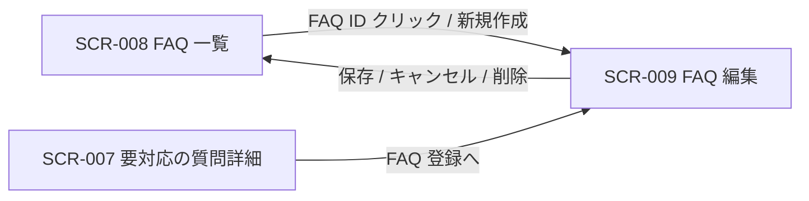

<!-- portal-top -->
[設計ポータル](../../README.md) ／ [基本設計](../index.md) ／ [画面設計](index.md) ／ **SCR-009 FAQ 編集**
<!-- /portal-top -->

# SCR-009 FAQ 編集

> **このページは、FAQ の質問・回答・カテゴリ・状態を 1 ペインで作成・編集し、自動保存・論理削除を提供する画面 SCR-009 を定義します。** 画面概要 / 画面遷移図 / 画面レイアウト / 画面項目定義 / 入出力一覧 / 画面イベント一覧 の 6 セクションで記述します。

*版数 v1.0 ・ 更新 2026-06-17 ・ 承認済*

## 1. 画面概要

FAQ の質問・回答・カテゴリ・状態を 1 ペインで作成・編集し、保存・削除を行う画面です。新規作成と既存編集の双方を扱います。

| 画面 ID | 画面名 | 機能概要 |
|----|----|----|
| `SCR-009` | FAQ 編集 | FAQ の質問・回答・カテゴリ・状態を編集し保存・削除する |

| 関連 | 内容 |
|----|----|
| FR / BR | FR-047〜FR-056, FR-076〜FR-079, FR-080, FR-081 / BR-028 |
| 関連画面 | [`SCR-008` FAQ 一覧](SCR-008.md) / [`SCR-007` 要対応の質問詳細](SCR-007.md) |
| 対応業務UC | [UC-076](../../01_requirements/02_business_usecases/UC-076.md#UC-076) ・ [UC-077](../../01_requirements/02_business_usecases/UC-077.md#UC-077) ・ [UC-078](../../01_requirements/02_business_usecases/UC-078.md#UC-078) ・ [UC-079](../../01_requirements/02_business_usecases/UC-079.md#UC-079) ・ [UC-080](../../01_requirements/02_business_usecases/UC-080.md#UC-080) ・ [UC-081](../../01_requirements/02_business_usecases/UC-081.md#UC-081) ・ [UC-082](../../01_requirements/02_business_usecases/UC-082.md#UC-082) ・ [UC-083](../../01_requirements/02_business_usecases/UC-083.md#UC-083) ・ [UC-084](../../01_requirements/02_business_usecases/UC-084.md#UC-084) ・ [UC-085](../../01_requirements/02_business_usecases/UC-085.md#UC-085) ・ [UC-086](../../01_requirements/02_business_usecases/UC-086.md#UC-086) ・ [UC-087](../../01_requirements/02_business_usecases/UC-087.md#UC-087) ・ [UC-088](../../01_requirements/02_business_usecases/UC-088.md#UC-088) ・ [UC-089](../../01_requirements/02_business_usecases/UC-089.md#UC-089) |

| ステークホルダ | 対象 |
|----------------|------|
| オーナー       | ◯    |
| メンバー       | ◯    |

> [!NOTE]
> **補足** 各ステークホルダとも当該プロジェクトへの割当(FAQ 管理権限)が前提です。割当のないプロジェクトの FAQ は編集不可(URL 直アクセスは権限不足表示)。状態(下書き / 公開中 / 非公開)の切替は独立ボタンを設けず「状態」ラジオの選択 + 「保存」で一元化します(専用の公開 API・状態遷移ガードなし)。`published` を選択して保存する操作が「公開前のメンバー確認」(FR-053)を兼ねます。

## 2. 画面遷移図

本画面への流入と本画面からの遷移を、画面 ID・画面名とイベント(操作)で示します。

## 3. 画面レイアウト

## 4. 画面項目定義

本画面の入出力項目(入力フォーム・バリデーション・操作ボタン・状態表示)を定義します。項目の正本は本表です。

| 項目 ID | 項目 | 説明 | 種類 | 表示条件 | 表示 |
|----|----|----|----|----|----|
| `IT-01` | ページタイトル | 編集対象の FAQ ID を見出しに表示する | 見出し | — | 「{FAQ番号} 編集」。新規時は「新規」 |
| `IT-02` | 自動保存インジケータ | 自動保存の状態(保存済み / 保存中 / 失敗)を表示する | ラベル | — | 「30 秒前に保存しました」/「保存中…」/「保存できませんでした」 |
| `IT-03` | 質問 | FAQ の質問文を入力する。必須・1〜500 文字 | テキストエリア | — | 入力値 + 文字数カウンタ「142 / 500」形式 |
| `IT-04` | 回答 | FAQ の回答文を入力する(簡易ツールバー付き)。必須・1〜5,000 文字 | テキストエリア | — | 入力値 + 文字数カウンタ「482 / 5,000」形式 |
| `IT-05` | カテゴリ | FAQ のカテゴリを選択または新規入力する。任意・100 文字以内 | テキストボックス | — | 既存カテゴリのサジェスト + 入力値 |
| `IT-06` | 状態 | FAQ の公開状態を選択する(相互に自由遷移・状態遷移ガードなし) | ラジオ | — | 選択肢「下書き」「公開中」「非公開」 |
| `IT-07` | 登録元未解決質問 | 当該 FAQ の登録元となった未解決質問へのリンクを表示する | リンク | 登録元未解決質問が存在する場合のみ表示 | 登録元の未解決質問名へのリンク |
| `IT-08` | キャンセル | 編集を破棄して一覧へ戻る | ボタン | — | 「キャンセル」 |
| `IT-09` | 保存 | 入力内容を選択中の状態で保存する | ボタン | — | 「保存」 |
| `IT-10` | 削除 | 確認ダイアログ後に当該 FAQ を論理削除する | ボタン | 既存 FAQ 編集時のみ表示(新規時非表示) | 「削除」 |
| `IT-11` | 楽観ロック衝突 | 他者の更新と版が一致しない場合に衝突エラーを表示する | アラート | FAQ のバージョンが他者の更新と一致しない場合のみ表示(楽観ロック衝突時) | 衝突エラーメッセージ |
| `IT-12` | 削除確認 OK | 削除確認ダイアログで削除を実行するボタン | ボタン | 削除確認ダイアログ表示中のみ | 「OK」 |
| `IT-13` | 削除確認キャンセル | 削除確認ダイアログで削除をキャンセルするボタン | ボタン | 削除確認ダイアログ表示中のみ | 「キャンセル」 |
| `IT-14` | キャンセル確認 OK | キャンセル確認ダイアログで編集を破棄するボタン | ボタン | キャンセル確認ダイアログ表示中のみ | 「OK」 |
| `IT-15` | キャンセル確認キャンセル | キャンセル確認ダイアログで編集を継続するボタン | ボタン | キャンセル確認ダイアログ表示中のみ | 「キャンセル」 |

## 5. 入出力一覧

本画面が読み書きするテーブルと、呼び出す API の一覧です。テーブルの正本は [データベース設計](../04_database/index.md)、API の正本は [API設計](../03_apis/index.md) です。

<table>
<thead>
<tr>
<th rowspan="2">入出力名</th>
<th rowspan="2">説明</th>
<th rowspan="2">種別</th>
<th rowspan="2">I/O</th>
<th colspan="4">アクセス種別(CRUD)</th>
<th rowspan="2">備考</th>
</tr>
<tr>
<th>C</th>
<th>R</th>
<th>U</th>
<th>D</th>
</tr>
</thead>
<tbody>
<tr>
<td>FAQ</td>
<td>FAQ を取得・新規作成・更新・論理削除する</td>
<td>テーブル</td>
<td>入力 / 出力</td>
<td>◯</td>
<td>◯</td>
<td>◯</td>
<td>◯</td>
<td><code>M_FAQS</code>(<a href="../04_database/index.md#TBL-006">テーブル設計 3.9</a>)</td>
</tr>
<tr>
<td>未解決質問</td>
<td>登録元の未解決質問を参照する</td>
<td>テーブル</td>
<td>入力</td>
<td>—</td>
<td>◯</td>
<td>—</td>
<td>—</td>
<td><code>T_INQUIRIES</code>(<a href="../04_database/index.md#TBL-017">テーブル設計 3.14</a>)</td>
</tr>
<tr>
<td>FAQ 作成</td>
<td>新規 FAQ を作成する</td>
<td>API</td>
<td>出力</td>
<td>◯</td>
<td>—</td>
<td>—</td>
<td>—</td>
<td><code>POST /faqs</code>(<a href="../03_apis/API-026.md#API-026">FAQ 作成・更新・削除</a>)</td>
</tr>
<tr>
<td>FAQ 取得</td>
<td>編集対象 FAQ の現値をロードする</td>
<td>API</td>
<td>入力</td>
<td>—</td>
<td>◯</td>
<td>—</td>
<td>—</td>
<td><code>GET /faqs/{id}</code>(<a href="../03_apis/API-033.md#API-033">FAQ 個別取得</a>)</td>
</tr>
<tr>
<td>FAQ 更新</td>
<td>FAQ を更新する(状態保存・自動保存を含む)</td>
<td>API</td>
<td>出力</td>
<td>—</td>
<td>—</td>
<td>◯</td>
<td>—</td>
<td><code>PATCH /faqs/{id}</code>(<a href="../03_apis/API-026.md#API-026">FAQ 作成・更新・削除</a>)</td>
</tr>
<tr>
<td>FAQ 削除</td>
<td>FAQ を論理削除する</td>
<td>API</td>
<td>出力</td>
<td>—</td>
<td>—</td>
<td>—</td>
<td>◯</td>
<td><code>DELETE /faqs/{id}</code>(<a href="../03_apis/API-026.md#API-026">FAQ 作成・更新・削除</a>)</td>
</tr>
</tbody>
</table>

## 6. 画面イベント一覧

本画面のイベント(初期表示・各操作)ごとに、対象の項目 ID と処理内容を定義します。

<table>
<colgroup>
<col style="width: 10%" />
<col style="width: 12%" />
<col style="width: 12%" />
<col style="width: 30%" />
<col style="width: 46%" />
</colgroup>
<thead>
<tr>
<th>EVT-ID</th>
<th>イベント ID</th>
<th>項目 ID</th>
<th>イベント</th>
<th>処理</th>
</tr>
</thead>
<tbody>
<tr>
<td><a href="../02_screen_events/EVT-076.md#EVT-076">EVT-076</a></td>
<td><code>EV-01</code></td>
<td>—</td>
<td>初期表示</td>
<td><ul>
<li>既存編集: <a href="../03_apis/API-033.md#API-033">FAQ 個別取得</a> で現値をロードし各欄へ展開。登録元未解決質問が存在する場合は IT-07 を表示</li>
<li>新規作成(未解決質問起点): 未解決質問の質問文を IT-03 へ初期反映し、その他の欄は空</li>
<li>新規作成(手動): 全欄空フォームを表示</li>
<li>権限なし(URL 直アクセス): 権限不足メッセージを表示して操作不可</li>
</ul></td>
</tr>
<tr>
<td><a href="../02_screen_events/EVT-077.md#EVT-077">EVT-077</a></td>
<td><code>EV-02</code></td>
<td><a href="#IT-03">IT-03</a></td>
<td>質問を入力</td>
<td><ul>
<li>成功: 文字数カウンタをリアルタイム更新</li>
<li>500 文字超過: エラーを表示し保存ボタンを無効化</li>
</ul></td>
</tr>
<tr>
<td><a href="../02_screen_events/EVT-078.md#EVT-078">EVT-078</a></td>
<td><code>EV-03</code></td>
<td><a href="#IT-04">IT-04</a></td>
<td>回答を入力</td>
<td><ul>
<li>成功: 文字数カウンタをリアルタイム更新</li>
<li>5,000 文字超過: エラーを表示し保存ボタンを無効化</li>
</ul></td>
</tr>
<tr>
<td><a href="../02_screen_events/EVT-079.md#EVT-079">EVT-079</a></td>
<td><code>EV-04</code></td>
<td><a href="#IT-05">IT-05</a></td>
<td>カテゴリを入力</td>
<td><ul>
<li>成功: 既存カテゴリのサジェストを表示</li>
<li>100 文字超過: エラーを表示し保存ボタンを無効化</li>
</ul></td>
</tr>
<tr>
<td><a href="../02_screen_events/EVT-080.md#EVT-080">EVT-080</a></td>
<td><code>EV-05</code></td>
<td><a href="#IT-06">IT-06</a></td>
<td>「状態」を選択</td>
<td>選択値(下書き / 公開中 / 非公開)を保持し、次回「保存」押下時に反映する</td>
</tr>
<tr>
<td><a href="../02_screen_events/EVT-081.md#EVT-081">EVT-081</a></td>
<td><code>EV-06</code></td>
<td><a href="#IT-02">IT-02</a></td>
<td>自動保存タイマー発火(30 秒間隔)</td>
<td><ul>
<li>成功: <a href="../03_apis/API-026.md#API-026">FAQ 作成・更新・削除</a> で現在の入力内容を下書き保存し、IT-02 を「保存済み」に更新</li>
<li>失敗: IT-02 を「保存できませんでした」に更新</li>
</ul></td>
</tr>
<tr>
<td><a href="../02_screen_events/EVT-082.md#EVT-082">EVT-082</a></td>
<td><code>EV-07</code></td>
<td><a href="#IT-09">IT-09</a></td>
<td>「保存」を押下</td>
<td><ul>
<li>バリデーションエラーあり: エラー箇所を表示し保存しない</li>
<li>新規・成功: <a href="../03_apis/API-026.md#API-026">FAQ 作成・更新・削除</a> で FAQ を新規作成し一覧へ遷移</li>
<li>既存・成功: <a href="../03_apis/API-026.md#API-026">FAQ 作成・更新・削除</a> で FAQ を更新し一覧へ遷移</li>
<li>版衝突(楽観ロック): IT-11 を表示し再読み込みを促す</li>
<li>件数上限超過: エラーを表示し保存しない</li>
</ul></td>
</tr>
<tr>
<td><a href="../02_screen_events/EVT-083.md#EVT-083">EVT-083</a></td>
<td><code>EV-08</code></td>
<td><a href="#IT-10">IT-10</a></td>
<td>「削除」を押下</td>
<td>確認ダイアログを表示する(実際の削除は EV-09 で実行)</td>
</tr>
<tr>
<td><a href="../02_screen_events/EVT-084.md#EVT-084">EVT-084</a></td>
<td><code>EV-09</code></td>
<td><a href="#IT-12">IT-12</a></td>
<td>削除確認ダイアログの「OK」を押下</td>
<td><ul>
<li>成功: <a href="../03_apis/API-026.md#API-026">FAQ 作成・更新・削除</a> で論理削除し一覧へ遷移</li>
<li>失敗: エラーメッセージを表示しダイアログを閉じる</li>
</ul></td>
</tr>
<tr>
<td><a href="../02_screen_events/EVT-085.md#EVT-085">EVT-085</a></td>
<td><code>EV-10</code></td>
<td><a href="#IT-08">IT-08</a></td>
<td>「キャンセル」を押下</td>
<td><ul>
<li>未保存変更なし: 編集を破棄して一覧へ遷移</li>
<li>未保存変更あり: キャンセル確認ダイアログを表示する(破棄実行は EV-13)</li>
</ul></td>
</tr>
<tr>
<td><a href="../02_screen_events/EVT-086.md#EVT-086">EVT-086</a></td>
<td><code>EV-11</code></td>
<td><a href="#IT-07">IT-07</a></td>
<td>「登録元未解決質問」リンクを押下</td>
<td>登録元の未解決質問詳細画面(<a href="SCR-007.md">SCR-007</a>)へ遷移する</td>
</tr>
<tr>
<td><a href="../02_screen_events/EVT-087.md#EVT-087">EVT-087</a></td>
<td><code>EV-12</code></td>
<td><a href="#IT-13">IT-13</a></td>
<td>削除確認ダイアログの「キャンセル」を押下</td>
<td>削除確認ダイアログを閉じ、削除を中断して編集画面に戻る</td>
</tr>
<tr>
<td><a href="../02_screen_events/EVT-088.md#EVT-088">EVT-088</a></td>
<td><code>EV-13</code></td>
<td><a href="#IT-14">IT-14</a></td>
<td>キャンセル確認ダイアログの「OK」を押下</td>
<td>編集内容を破棄して FAQ 一覧(<a href="SCR-008.md">SCR-008</a>)へ遷移する</td>
</tr>
<tr>
<td><a href="../02_screen_events/EVT-089.md#EVT-089">EVT-089</a></td>
<td><code>EV-14</code></td>
<td><a href="#IT-15">IT-15</a></td>
<td>キャンセル確認ダイアログの「キャンセル」を押下</td>
<td>キャンセル確認ダイアログを閉じ、編集を継続する</td>
</tr>
</tbody>
</table>

---

<!-- portal-bottom -->
[← 画面設計](index.md) ・ [基本設計](../index.md) ・ [↑ 設計ポータル](../../README.md)
<!-- /portal-bottom -->
