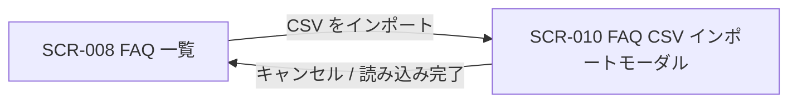

<!-- portal-top -->
[設計ポータル](../../README.md) ／ [基本設計](../index.md) ／ [画面設計](index.md) ／ **SCR-010 FAQ CSV インポートモーダル**
<!-- /portal-top -->

# SCR-010 FAQ CSV インポートモーダル

> **このページは、SCR-008 から開き、CSV ファイルで FAQ を一括取り込みする(FAQ ID 判定による新規 / 上書き・部分失敗確認・進捗表示)モーダル画面 SCR-010 を定義します。** 画面概要 / 画面遷移図 / 画面レイアウト / 画面項目定義 / 入出力一覧 / 画面イベント一覧 の 6 セクションで記述します。

*版数 v1.0 ・ 更新 2026-06-17 ・ 承認済*

## 1. 画面概要

FAQ を CSV ファイルから一括インポートする全画面割込みモーダルです。FAQ ID 列で新規 / 上書きを判定し、部分失敗を画面上で確認します。

| 画面 ID | 画面名 | 機能概要 |
|----|----|----|
| `SCR-010` | FAQ CSV インポートモーダル | CSV ファイルで FAQ を一括取り込みする(新規 / 上書き・部分失敗確認・進捗表示) |

| 関連     | 内容                                       |
|----------|--------------------------------------------|
| FR / BR  | FR-169 / BR-120                            |
| 関連画面 | [`SCR-008` FAQ 一覧](SCR-008.md)(呼出元) |
| 対応業務UC | [UC-090](../../01_requirements/02_business_usecases/UC-090.md#UC-090) ・ [UC-091](../../01_requirements/02_business_usecases/UC-091.md#UC-091) ・ [UC-092](../../01_requirements/02_business_usecases/UC-092.md#UC-092) ・ [UC-093](../../01_requirements/02_business_usecases/UC-093.md#UC-093) ・ [UC-094](../../01_requirements/02_business_usecases/UC-094.md#UC-094) ・ [UC-095](../../01_requirements/02_business_usecases/UC-095.md#UC-095) |

| ステークホルダ | 対象 |
|----------------|------|
| オーナー       | ◯    |
| メンバー       | ◯    |

> [!NOTE]
> **補足** 各ステークホルダとも当該プロジェクトへの割当(FAQ 管理権限)が前提です。FAQ 一覧の「CSV をインポート」ボタンから開きます。`status`(状態)列は持たず、新規行は一律 `draft`、上書き行は既存状態を維持します。

## 2. 画面遷移図

本モーダルの開閉(呼出元との関係)を、画面 ID・画面名とイベント(操作)で示します。

## 3. 画面レイアウト

## 4. 画面項目定義

本モーダルの入出力項目(ファイル選択・CSV 列構成・進捗結果・操作ボタン・バリデーション)を定義します。項目の正本は本表です。

| 項目 ID | 項目 | 説明 | 種類 | 表示条件 | 表示 |
|----|----|----|----|----|----|
| `IT-01` | テンプレートをダウンロード | ヘッダ行のみのテンプレート CSV をダウンロードする | リンク | — | 「テンプレートをダウンロード」 |
| `IT-02` | ファイル選択 | 取り込む CSV をドラッグ&ドロップまたは選択する。必須・`.csv` のみ・1 ファイル最大 1000 件(1 行 = 1 FAQ)・ヘッダ行必須 | ドロップゾーン | — | 「CSV ファイルをここにドラッグ&ドロップ」/「クリックして選択」 |
| `IT-03` | CSV 列構成 / FAQ ID 判定 | CSV の列構成と FAQ ID による新規 / 上書き / 失敗の判定規則を案内する | ラベル | — | 列「FAQ ID, 質問, 回答, カテゴリ」。FAQ ID 空欄=新規(下書き)/ 既存 ID 一致=上書き(状態維持)/ 無効 ID=当該行を失敗 |
| `IT-04` | 文字コードエラー | UTF-8 以外のファイル選択時にアップロードせず即エラーを表示する(検出文字コード名を併記) | アラート | UTF-8(BOM 許容)以外を選択時のみ表示 | 「このファイルは UTF-8 ではありません(検出: {文字コード名})。UTF-8 で保存し直してください」 |
| `IT-05` | 進捗バー | 取り込みの進捗(処理済み / 全件)を表示する。100 件超は非同期ジョブ化・24h タイムアウト | プログレスバー | 取込処理中 | 「処理中…({完了件数} / {総件数} 件)」 |
| `IT-06` | エラー一覧 | 取り込みに失敗した行を行番号とエラー理由で一覧表示する(CSV ダウンロードは行わない) | テーブル | 失敗行が 1 件以上ある時のみ表示 | 「失敗した行: {件数} 件」見出し +「行番号 / エラー理由」の 2 列 |
| `IT-07` | キャンセル | モーダルを閉じる(処理中は中断確認) | ボタン | — | 「キャンセル」 |
| `IT-08` | 読み込みを開始 | 取り込み処理を開始する | ボタン | バリデーション通過時のみ活性 | 「読み込みを開始」 |
| `IT-09` | 閉じる(×) | モーダルヘッダ右上の × アイコンボタン。押下でモーダルを閉じる(処理中は中断確認) | ボタン | — | 「×」 |

## 5. 入出力一覧

本モーダルが読み書きするテーブル・ファイルと、呼び出す API の一覧です。テーブルの正本は [データベース設計](../04_database/index.md)、API の正本は [API設計](../03_apis/index.md) です。

<table>
<thead>
<tr>
<th rowspan="2">入出力名</th>
<th rowspan="2">説明</th>
<th rowspan="2">種別</th>
<th rowspan="2">I/O</th>
<th colspan="4">アクセス種別(CRUD)</th>
<th rowspan="2">備考</th>
</tr>
<tr>
<th>C</th>
<th>R</th>
<th>U</th>
<th>D</th>
</tr>
</thead>
<tbody>
<tr>
<td>FAQ</td>
<td>FAQ ID の存在確認、新規登録(<code>draft</code>)・上書き更新を行う</td>
<td>テーブル</td>
<td>入力 / 出力</td>
<td>◯</td>
<td>◯</td>
<td>◯</td>
<td>—</td>
<td><code>M_FAQS</code>(<a href="../04_database/index.md#TBL-006">テーブル設計 3.9</a>)</td>
</tr>
<tr>
<td>FAQ CSV インポート</td>
<td>CSV を一括取り込みする(202 + jobId)</td>
<td>API</td>
<td>入力 / 出力</td>
<td>—</td>
<td>—</td>
<td>—</td>
<td>—</td>
<td><code>POST /faqs/import</code>(<a href="../03_apis/API-028.md#API-028">FAQ CSV インポート</a>)</td>
</tr>
<tr>
<td>FAQ インポートテンプレート取得</td>
<td>ヘッダ行のみのテンプレート CSV を取得する</td>
<td>API</td>
<td>入力</td>
<td>—</td>
<td>—</td>
<td>—</td>
<td>—</td>
<td><code>GET /faqs/import/template</code>(<a href="../03_apis/API-029.md#API-029">FAQ インポートテンプレート取得</a>)</td>
</tr>
<tr>
<td>インポート CSV</td>
<td>取り込み対象としてアップロードする CSV</td>
<td>ファイル</td>
<td>入力</td>
<td>—</td>
<td>—</td>
<td>—</td>
<td>—</td>
<td>UTF-8 / BOM 許容、最大 1000 行</td>
</tr>
<tr>
<td>テンプレート CSV</td>
<td>ダウンロードされるテンプレート CSV</td>
<td>ファイル</td>
<td>出力</td>
<td>—</td>
<td>—</td>
<td>—</td>
<td>—</td>
<td>ヘッダ行のみ</td>
</tr>
</tbody>
</table>

## 6. 画面イベント一覧

本モーダルのイベント(初期表示・各操作)ごとに、対象の項目 ID と処理内容を定義します。

<table>
<colgroup>
<col style="width: 10%" />
<col style="width: 12%" />
<col style="width: 12%" />
<col style="width: 30%" />
<col style="width: 46%" />
</colgroup>
<thead>
<tr>
<th>EVT-ID</th>
<th>イベント ID</th>
<th>項目 ID</th>
<th>イベント</th>
<th>処理</th>
</tr>
</thead>
<tbody>
<tr>
<td><a href="../02_screen_events/EVT-090.md#EVT-090">EVT-090</a></td>
<td><code>EV-01</code></td>
<td>—</td>
<td>初期表示</td>
<td>SCR-008 の「CSV をインポート」ボタン押下でモーダルを開く。ファイル未選択・「読み込みを開始」非活性の初期状態でレンダリングする</td>
</tr>
<tr>
<td><a href="../02_screen_events/EVT-091.md#EVT-091">EVT-091</a></td>
<td><code>EV-02</code></td>
<td><a href="#IT-01">IT-01</a></td>
<td>「テンプレートをダウンロード」を押下</td>
<td><a href="../03_apis/API-029.md#API-029">FAQ インポートテンプレート取得</a> API を呼び出し、ヘッダ行のみのテンプレート CSV をダウンロードする</td>
</tr>
<tr>
<td><a href="../02_screen_events/EVT-092.md#EVT-092">EVT-092</a></td>
<td><code>EV-03</code></td>
<td><a href="#IT-02">IT-02</a></td>
<td>ファイル選択にファイルを投入</td>
<td><ul>
<li>ドラッグ&amp;ドロップまたはクリックによるファイル選択を受け付ける</li>
<li>拡張子・文字コードをクライアント側で即時判定する</li>
<li>成功: ファイル名を表示し「読み込みを開始」を活性化する</li>
<li>失敗(UTF-8 以外): 文字コードエラー(<a href="#IT-04">IT-04</a>)を表示し「読み込みを開始」は非活性のままとする</li>
</ul></td>
</tr>
<tr>
<td><a href="../02_screen_events/EVT-093.md#EVT-093">EVT-093</a></td>
<td><code>EV-04</code></td>
<td><a href="#IT-08">IT-08</a></td>
<td>「読み込みを開始」を押下</td>
<td><ul>
<li><a href="../03_apis/API-028.md#API-028">FAQ CSV インポート</a> API(202 + jobId)を呼び出し、取り込みを非同期で開始する</li>
<li>処理中: 進捗バー(<a href="#IT-05">IT-05</a>)で処理済み件数 / 総件数を逐次更新する</li>
<li>完了(全件成功): 成功メッセージを表示してモーダルを閉じ、SCR-008 の FAQ 一覧を再読み込みする</li>
<li>完了(部分失敗): 成功分を反映し、エラー一覧(<a href="#IT-06">IT-06</a>)に失敗行番号と理由を表示する(FAQ ID 判定: 識別子なし=新規、既存一致=上書き、無効識別子=失敗)</li>
</ul></td>
</tr>
<tr>
<td><a href="../02_screen_events/EVT-094.md#EVT-094">EVT-094</a></td>
<td><code>EV-05</code></td>
<td><a href="#IT-07">IT-07</a></td>
<td>「キャンセル」を押下</td>
<td><ul>
<li>処理中でない場合: モーダルを閉じて SCR-008 へ戻る</li>
<li>処理中の場合: 中断確認ダイアログを表示し、OK でジョブを中断してモーダルを閉じる</li>
</ul></td>
</tr>
<tr>
<td><a href="../02_screen_events/EVT-095.md#EVT-095">EVT-095</a></td>
<td><code>EV-06</code></td>
<td><a href="#IT-09">IT-09</a></td>
<td>「×」を押下</td>
<td><ul>
<li>処理中でない場合: モーダルを閉じて SCR-008 へ戻る</li>
<li>処理中の場合: 中断確認ダイアログを表示し、OK でジョブを中断してモーダルを閉じる</li>
</ul></td>
</tr>
</tbody>
</table>

---

<!-- portal-bottom -->
[← 画面設計](index.md) ・ [基本設計](../index.md) ・ [↑ 設計ポータル](../../README.md)
<!-- /portal-bottom -->
