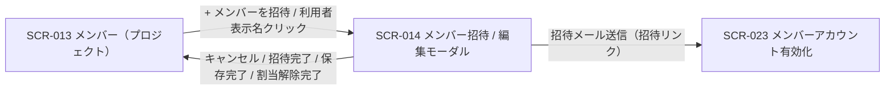

<!-- portal-top -->
[設計ポータル](../../README.md) ／ [基本設計](../index.md) ／ [画面設計](index.md) ／ **SCR-014 メンバー招待 / 編集モーダル(プロジェクト単位)**
<!-- /portal-top -->

# SCR-014 メンバー招待 / 編集モーダル(プロジェクト単位)

> **このページは、SCR-013 から開くメンバーの招待・編集・割当解除を行うモーダル SCR-014 を定義します。** 画面概要 / 画面遷移図 / 画面レイアウト / 画面項目定義 / 入出力一覧 / 画面イベント一覧 の 6 セクションで記述します。

*版数 v1.0 ・ 更新 2026-06-17 ・ 承認済*

## 1. 画面概要

SCR-013 から開く、メンバー招待(新規)と編集・招待再送・割当解除(既存)を全画面割込みモーダルで行う画面です。現在開いているプロジェクトの 1 件の割当のみを操作対象とします。

| 画面 ID | 画面名 | 機能概要 |
|----|----|----|
| `SCR-014` | メンバー招待 / 編集モーダル(プロジェクト単位) | 当該プロジェクトのメンバー招待・編集・招待再送・割当解除を全画面割込みモーダルで実施する |

| 関連 | 内容 |
|----|----|
| FR / BR | FR-012, FR-014, FR-018〜FR-023, FR-025, FR-026〜FR-028, FR-030, FR-036, FR-183〜FR-189 / BR-011, BR-012 |
| 関連画面 | [`SCR-013` メンバー(プロジェクト)](SCR-013.md)(呼出元) / [`SCR-023` メンバーアカウント有効化](SCR-023.md)(招待リンク着地点) |
| 対応業務UC | [UC-019](../../01_requirements/04_business_usecases/UC-019.md#UC-019) ・ [UC-020](../../01_requirements/04_business_usecases/UC-020.md#UC-020) ・ [UC-019](../../01_requirements/04_business_usecases/UC-019.md#UC-019) ・ [UC-020](../../01_requirements/04_business_usecases/UC-020.md#UC-020) ・ [UC-021](../../01_requirements/04_business_usecases/UC-021.md#UC-021) ・ [UC-020](../../01_requirements/04_business_usecases/UC-020.md#UC-020) |

| ステークホルダ | 対象 |
|----------------|------|
| オーナー       | ◯    |
| メンバー       | ◯    |

> [!IMPORTANT]
> **重要** 操作できるのは当該プロジェクトのメンバー(オーナーを含む)です。招待モードでは氏名フィールドを表示しません(他人の氏名を事前入力できない。氏名は招待された本人が [SCR-023](SCR-023.md) で入力。FR-022 個人情報原則)。最後の有効割当を解除した場合のみアカウントを自動論理削除(`users.valid=0`)します。

## 2. 画面遷移図

本モーダルの呼出元・遷移先を、画面 ID・画面名とイベント(操作)で示します。

## 3. 画面レイアウト

## 4. 画面項目定義

本モーダルの表示・入力項目・操作ボタンと各バリデーション・ガードを定義します。項目の正本は本表です。招待モード / 編集モードでのみ表示する項目は備考に明記します。

| 項目 ID | 項目 | 説明 | 種類 | 表示条件 | 表示 |
|----|----|----|----|----|----|
| `IT-01` | モード見出し | 招待 / 編集のモードと対象を示すモーダル見出しを表示する | 見出し | — | 招待「{プロジェクト名} へメンバーを招待」/ 編集「{プロジェクト名} のメンバー編集 — {表示名}」 |
| `IT-02` | モーダル閉じる(×) | 変更を破棄してモーダルを閉じる | アイコンボタン | — | 「×」 |
| `IT-03` | 自己編集警告帯 | 自分自身を編集する際の操作制限を警告帯で知らせる | アラート | 編集モードかつ自分自身編集時のみ | 「自分のアカウントはこのプロジェクトから外せません」 |
| `IT-04` | メールアドレス | 招待先メールアドレスを入力する(招待モードは必須、編集モードはメンバーのメールアドレスを編集する) | テキストボックス | — | プレースホルダ「member@example.com」 |
| `IT-05` | 表示名(氏名) | 対象メンバーの氏名を読み取り専用で表示する | ラベル | 編集モードのみ表示(招待モードでは表示しない / 個人情報原則) | 対象メンバーの氏名。未入力時は「未設定」 |
| `IT-06` | 招待モード氏名注記 | 氏名は本人が有効化時に入力する旨を案内する | ラベル | 招待モードのみ | 「氏名(表示名)は招待されたご本人がメンバーアカウント有効化ページで入力します」 |
| `IT-07` | 招待状態 | 対象者が招待中(本人未有効化)であることをバッジで示す(残日数併記なし) | バッジ | 編集モードで、かつ対象者が招待中(本人未有効化)の場合のみ(有効化済みでは非表示) | 「招待中」 |
| `IT-08` | 招待メールを再送 | 招待メールを再送し、旧リンク失効・新リンクを発行する | ボタン | 編集モードで、かつ対象者が招待中(本人未有効化)の場合のみ | 「招待メールを再送する」 |
| `IT-09` | プロジェクトから外す | 当該 PJ の割当を解除する(最後の有効割当時はアカウントも論理削除。L1 確認) | ボタン | 編集モードのみ(自分・オーナーには非表示) | 「プロジェクトから外す」 |
| `IT-10` | 招待メールを送信 | 招待先へ招待メールを送信し有効化トークンを発行する(再認証) | ボタン | 招待モードのみ | 「招待メールを送信する」 |
| `IT-11` | 変更を保存 | 当該メンバーのメールアドレス変更を保存する(再認証) | ボタン | 編集モードのみ | 「変更を保存する」 |
| `IT-12` | キャンセル | 変更を破棄してモーダルを閉じる(フッターのキャンセルボタン。招待モード・編集モード共通) | ボタン | — | 「キャンセル」 |
| `IT-13` | 割当解除確認「外す」 | L1 確認ダイアログの割当解除実行ボタン | ボタン | L1 確認ダイアログ表示中のみ | 「外す」 |

> [!WARNING]
> **注意** バリデーション: メールアドレスは必須(招待モード・編集モードとも入力可)。「プロジェクトから外す」は L1 確認、最後の有効割当解除時は確認ダイアログに「このメンバーのアカウントも利用停止になります」を追記します。プロジェクトに割り当てたメンバーは全員同一権限(プロジェクト内の役割差は持ちません)で、メンバーの操作範囲は 認証・認可設計 を正本とします(FAQ 管理 / 要対応質問の状況管理 / ログ参照に加え、メンバー招待・割当解除)。

## 5. 入出力一覧

本モーダルが読み書きするテーブルと、呼び出す API の一覧です。テーブルの正本は [データベース設計](../04_database/index.md)、API の正本は [API設計](../03_apis/index.md) です。

<table>
<thead>
<tr>
<th rowspan="2">入出力名</th>
<th rowspan="2">説明</th>
<th rowspan="2">種別</th>
<th rowspan="2">I/O</th>
<th colspan="4">アクセス種別(CRUD)</th>
<th rowspan="2">備考</th>
</tr>
<tr>
<th>C</th>
<th>R</th>
<th>U</th>
<th>D</th>
</tr>
</thead>
<tbody>
<tr>
<td>プロジェクト割当</td>
<td>招待時の予約割当作成・割当解除(論理削除 <code>valid=0</code>)を行う</td>
<td>テーブル</td>
<td>入力 / 出力</td>
<td>◯</td>
<td>◯</td>
<td>◯</td>
<td>—</td>
<td><code>M_PRJ_USERS</code>(<a href="../04_database/index.md#TBL-003">テーブル設計 3.3</a>)</td>
</tr>
<tr>
<td>プロジェクトユーザー</td>
<td>招待時の予約ユーザー作成・現値読込・最後の割当解除時の論理削除(<code>valid=0</code>)を行う</td>
<td>テーブル</td>
<td>入力 / 出力</td>
<td>◯</td>
<td>◯</td>
<td>◯</td>
<td>—</td>
<td><code>M_PRJ_USERS</code>(<a href="../04_database/index.md#TBL-003">テーブル設計 3.3</a>)</td>
</tr>
<tr>
<td>アクセストークン</td>
<td>招待・再送時に有効化トークンを発行し旧リンクを失効する</td>
<td>テーブル</td>
<td>出力</td>
<td>◯</td>
<td>—</td>
<td>◯</td>
<td>—</td>
<td><code>purpose='activation'</code>(7 日)。<code>T_ACCESS_TOKENS</code>(<a href="../04_database/index.md#TBL-014">テーブル設計 3.5</a>)</td>
</tr>
<tr>
<td>メンバー一覧</td>
<td>編集モード初期表示時に対象メンバーの表示名・メールアドレス・招待状態を取得する</td>
<td>API</td>
<td>出力</td>
<td>—</td>
<td>◯</td>
<td>—</td>
<td>—</td>
<td><code>GET /projects/{id}/members</code>(<a href="../03_apis/API-020.md#API-020">メンバー一覧</a>)</td>
</tr>
<tr>
<td>メンバー招待</td>
<td>当該プロジェクトへメンバーを招待する</td>
<td>API</td>
<td>入力 / 出力</td>
<td>—</td>
<td>—</td>
<td>—</td>
<td>—</td>
<td><code>POST /projects/{id}/members</code>(<a href="../03_apis/API-021.md#API-021">メンバー招待</a>)</td>
</tr>
<tr>
<td>メンバー情報変更・割当解除</td>
<td>当該 PJ のメンバー情報変更(メールアドレス)・割当解除を行う</td>
<td>API</td>
<td>入力 / 出力</td>
<td>—</td>
<td>—</td>
<td>—</td>
<td>—</td>
<td>情報変更 <code>PATCH /projects/{id}/members/{userId}</code> / 割当解除 <code>DELETE /projects/{id}/members/{userId}</code>(<a href="../03_apis/API-022.md#API-022">メンバー情報更新</a> / <a href="../03_apis/API-023.md#API-023">プロジェクト割当解除</a>)</td>
</tr>
<tr>
<td>招待メール再送</td>
<td>招待中メンバーへ招待メールを再送する</td>
<td>API</td>
<td>入力 / 出力</td>
<td>—</td>
<td>—</td>
<td>—</td>
<td>—</td>
<td><code>POST /members/{id}/resend-invitation</code>(<a href="../03_apis/API-024.md#API-024">招待メール再送</a>)</td>
</tr>
</tbody>
</table>

## 6. 画面イベント一覧

本モーダルのイベント(初期表示・各操作)ごとに、対象の項目 ID と処理内容を定義します。

> [!NOTE]
> **初期表示の行分割について** 招待モードと編集モードは呼出元操作・表示内容・API 呼出がいずれも異なり排他的であるため、初期表示を 2 行に分割して定義します。

<table>
<colgroup>
<col style="width: 10%" />
<col style="width: 12%" />
<col style="width: 12%" />
<col style="width: 30%" />
<col style="width: 46%" />
</colgroup>
<thead>
<tr>
<th>EVT-ID</th>
<th>イベント ID</th>
<th>項目 ID</th>
<th>イベント</th>
<th>処理</th>
</tr>
</thead>
<tbody>
<tr>
<td><a href="../02_screen_events/EVT-123.md#EVT-123">EVT-123</a></td>
<td><code>EV-01</code></td>
<td>—</td>
<td>初期表示 — 招待モード</td>
<td><ul>
<li>モーダルを招待モードで開く(「+ メンバーを招待」押下時)</li>
<li>モード見出しをプロジェクト名付きで表示(<a href="#IT-01">IT-01</a>)、氏名注記(<a href="#IT-06">IT-06</a>)を表示し、氏名フィールドは非表示とする</li>
<li>メールアドレス欄(<a href="#IT-04">IT-04</a>)を空欄で表示する</li>
</ul></td>
</tr>
<tr>
<td><a href="../02_screen_events/EVT-124.md#EVT-124">EVT-124</a></td>
<td><code>EV-02</code></td>
<td>—</td>
<td>初期表示 — 編集モード</td>
<td><ul>
<li>モーダルを編集モードで開く(メンバー表示名クリック時)</li>
<li><a href="../03_apis/API-020.md#API-020">メンバー一覧</a> API から対象メンバーの表示名・メールアドレス・招待状態を取得し各項目に初期値をセットする</li>
<li>自分自身を編集する場合: 自己編集警告帯(<a href="#IT-03">IT-03</a>)を表示し、「プロジェクトから外す」ボタン(<a href="#IT-09">IT-09</a>)を非表示にする</li>
<li>対象者が招待中(未有効化)の場合: 招待状態バッジ(<a href="#IT-07">IT-07</a>)と「招待メールを再送する」ボタン(<a href="#IT-08">IT-08</a>)を表示する</li>
</ul></td>
</tr>
<tr>
<td><a href="../02_screen_events/EVT-125.md#EVT-125">EVT-125</a></td>
<td><code>EV-03</code></td>
<td><a href="#IT-04">IT-04</a></td>
<td>メールアドレスを入力</td>
<td><ul>
<li>入力のたびにクライアント側バリデーションを実行する(必須・メールアドレス形式)</li>
<li>失敗時: 入力欄下にインラインエラーを表示し、送信・保存ボタンを無効化する</li>
</ul></td>
</tr>
<tr>
<td><a href="../02_screen_events/EVT-126.md#EVT-126">EVT-126</a></td>
<td><code>EV-04</code></td>
<td><a href="#IT-10">IT-10</a></td>
<td>「招待メールを送信する」を押下</td>
<td><ul>
<li>入力バリデーションを実行し、エラーがあればインラインエラーを表示して処理を中止する</li>
<li>成功時: <a href="../03_apis/API-021.md#API-021">メンバー招待</a> API で予約割当行とユーザーを作成し、有効化トークン(<code>T_ACCESS_TOKENS.purpose='activation'</code>、有効期限 7 日)を発行して招待メールを送信する。モーダルを閉じ SCR-013 の一覧を更新する</li>
<li>失敗時(重複): 同一メールアドレスが既存の有効・招待中アカウントと重複する旨のエラーを表示する(FR-036)</li>
<li>失敗時(その他): エラートーストを表示し、入力内容を保持する</li>
</ul></td>
</tr>
<tr>
<td><a href="../02_screen_events/EVT-127.md#EVT-127">EVT-127</a></td>
<td><code>EV-05</code></td>
<td><a href="#IT-08">IT-08</a></td>
<td>「招待メールを再送する」を押下</td>
<td><ul>
<li>成功時: <a href="../03_apis/API-024.md#API-024">招待メール再送</a> API で旧リンクを失効させ新トークン(有効期限 7 日)を発行し、招待メールを再送する。完了トーストを表示する</li>
<li>失敗時: エラートーストを表示する</li>
</ul></td>
</tr>
<tr>
<td><a href="../02_screen_events/EVT-128.md#EVT-128">EVT-128</a></td>
<td><code>EV-06</code></td>
<td><a href="#IT-11">IT-11</a></td>
<td>「変更を保存する」を押下</td>
<td><ul>
<li>入力バリデーションを実行し、エラーがあればインラインエラーを表示して処理を中止する</li>
<li>成功時: <a href="../03_apis/API-022.md#API-022">メンバー情報更新</a> API で対象メンバーのメールアドレスを更新する。変更を監査記録し、当該メンバーへ通知する(FR-027)。モーダルを閉じ SCR-013 の一覧を更新する</li>
<li>失敗時: エラートーストを表示し、入力内容を保持する</li>
</ul></td>
</tr>
<tr>
<td><a href="../02_screen_events/EVT-129.md#EVT-129">EVT-129</a></td>
<td><code>EV-07</code></td>
<td><a href="#IT-09">IT-09</a></td>
<td>「プロジェクトから外す」を押下</td>
<td><ul>
<li>L1 確認ダイアログを表示する</li>
<li>対象が他プロジェクトに有効な割当を持たない場合: 「このメンバーのアカウントも利用停止になります」を確認ダイアログに追記する(FR-030)</li>
</ul></td>
</tr>
<tr>
<td><a href="../02_screen_events/EVT-130.md#EVT-130">EVT-130</a></td>
<td><code>EV-08</code></td>
<td><a href="#IT-13">IT-13</a></td>
<td>割当解除の確認ダイアログで「外す」を押下</td>
<td><ul>
<li>成功時: <a href="../03_apis/API-023.md#API-023">プロジェクト割当解除</a> API で当該 PJ の割当を解除する(<code>valid=0</code>)。変更を監査記録し、当該メンバーへ通知する(FR-027)</li>
<li>最後の有効割当の場合: アカウントを論理削除し、全ログインセッションと未使用招待を無効化する(FR-031)</li>
<li>モーダルを閉じ SCR-013 の一覧を更新する</li>
<li>失敗時: エラートーストを表示し、モーダルを開いたままにする</li>
</ul></td>
</tr>
<tr>
<td><a href="../02_screen_events/EVT-131.md#EVT-131">EVT-131</a></td>
<td><code>EV-09</code></td>
<td><a href="#IT-02">IT-02</a></td>
<td>「×」を押下してモーダルを閉じる</td>
<td>変更を破棄してモーダルを閉じ、SCR-013 へ戻る(未保存の入力があれば破棄確認を行う)</td>
</tr>
<tr>
<td><a href="../02_screen_events/EVT-132.md#EVT-132">EVT-132</a></td>
<td><code>EV-10</code></td>
<td><a href="#IT-12">IT-12</a></td>
<td>「キャンセル」を押下</td>
<td>変更を破棄してモーダルを閉じ、SCR-013 へ戻る(未保存の入力があれば破棄確認を行う)</td>
</tr>
</tbody>
</table>

---

<!-- portal-bottom -->
[← 画面設計](index.md) ・ [基本設計](../index.md) ・ [↑ 設計ポータル](../../README.md)
<!-- /portal-bottom -->
