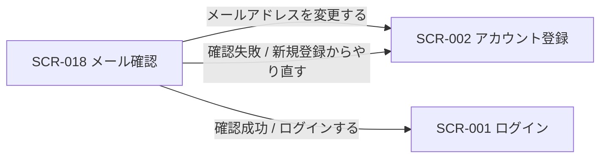
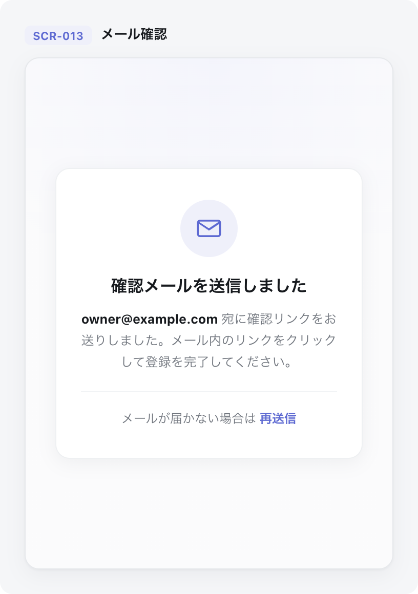

<!-- portal-top -->
[設計ポータル](../../README.md) ／ [基本設計](../index.md) ／ [画面設計](index.md) ／ **SCR-018 メール確認**
<!-- /portal-top -->

# SCR-018 メール確認

> **このページは、新規登録後にメール内リンクから本人確認を完了する画面 SCR-018 を定義します。** 画面概要 / 画面遷移図 / 画面レイアウト / 画面項目定義 / 入出力一覧 / 画面イベント一覧 の 6 セクションで記述します。

*版数 v1.0 ・ 更新 2026-06-17 ・ 承認済*

## 1. 画面概要

新規登録後にメール内の確認リンクから本人確認を完了する画面です。送信済み・確認成功・確認失敗の 3 状態を持ち、メール再送とログインへの導線を提供します。

| 画面 ID | 画面名 | 機能概要 |
|----|----|----|
| `SCR-018` | メール確認 | 新規登録後にメール内リンクで本人確認を完了し、送信済み / 成功 / 失敗の各状態を表示する |

| 関連 | 内容 |
|----|----|
| FR / BR | FR-003 / — |
| 関連画面 | [`SCR-002` アカウント登録](SCR-002.md) / [`SCR-001` ログイン](SCR-001.md) |
| 対応業務UC | [UC-151](../../01_requirements/02_business_usecases/UC-151.md#UC-151) ・ [UC-152](../../01_requirements/02_business_usecases/UC-152.md#UC-152) ・ [UC-153](../../01_requirements/02_business_usecases/UC-153.md#UC-153) ・ [UC-154](../../01_requirements/02_business_usecases/UC-154.md#UC-154) ・ [UC-155](../../01_requirements/02_business_usecases/UC-155.md#UC-155) |

| ステークホルダ                  | 対象 |
|---------------------------------|------|
| 対象ユーザー(認証前 / トークン) | ◯    |

> [!NOTE]
> **補足** 本画面は認証前(メール確認トークンによる本人確認)に表示されるため権限は不要です。確認リンクの有効期限は 24 時間で、期限切れ・使用済みの場合は確認失敗状態を表示し新規登録への復旧導線を出します。

## 2. 画面遷移図

本画面からの画面遷移を、画面 ID・画面名とイベント(操作)で示します。

## 3. 画面レイアウト

## 4. 画面項目定義

本画面の入出力項目(送信済み・確認成功・確認失敗の各状態の表示・操作)を定義します。項目の正本は本表です。

| 項目 ID | 項目 | 説明 | 種類 | 表示条件 | 表示 |
|----|----|----|----|----|----|
| `IT-01` | 状態タイムライン | 登録〜ログインの進捗をステップ表示する | タイムライン | 送信済み状態 | 「① 新規登録 → ② 確認メールのリンクをクリック → ③ ログイン」 |
| `IT-02` | 送信先メールアドレス | 確認メールの送信先アドレスを表示する | ラベル | 送信済み状態 | 確認メールの送信先アドレス |
| `IT-03` | 案内文 | 有効期限と迷惑メール確認の案内を表示する | アラート | 送信済み状態 | 「確認リンクは 24 時間有効です。メールが届かない場合は迷惑メールフォルダもご確認ください。」 |
| `IT-04` | メールを再送する | 確認メールを再送する(レート制限 5 分以内 1 回・カウントダウン併記) | ボタン | 送信済み状態 | 「メールを再送する」(制限中は「メールを再送する(あと N 分 N 秒)」で非活性) |
| `IT-05` | メールアドレスを変更する | アカウント登録(SCR-002)へ戻り入力をやり直す | リンク | 送信済み状態 | 「メールアドレスを変更する」 |
| `IT-06` | 確認成功 | 本人確認完了を伝えログインへ誘導する | アラート | 確認成功状態 | 「メールアドレスの確認が完了しました」+「ログインしてサービスをご利用ください」+「ログインする」 |
| `IT-07` | 確認失敗 | リンク期限切れ・使用済みを伝え復旧導線を出す | アラート | 確認失敗状態(リンク期限切れ・使用済み) | 「確認リンクが期限切れ、または使用済みです(有効期限 24 時間)」+「新規登録からやり直す」 |
| `IT-08` | ログインする | ログイン画面(SCR-001)へ遷移する | ボタン | 確認成功状態 | 「ログインする」 |
| `IT-09` | 新規登録からやり直す | 確認失敗時にアカウント登録(SCR-002)へ戻るボタン | ボタン | 確認失敗状態 | 「新規登録からやり直す」 |

## 5. 入出力一覧

本画面が読み書きするテーブルと、呼び出す API の一覧です。テーブルの正本は [データベース設計](../04_database/index.md)、API の正本は [API設計](../03_apis/index.md) です。

<table>
<thead>
<tr>
<th rowspan="2">入出力名</th>
<th rowspan="2">説明</th>
<th rowspan="2">種別</th>
<th rowspan="2">I/O</th>
<th colspan="4">アクセス種別(CRUD)</th>
<th rowspan="2">備考</th>
</tr>
<tr>
<th>C</th>
<th>R</th>
<th>U</th>
<th>D</th>
</tr>
</thead>
<tbody>
<tr>
<td>オーナー</td>
<td>メール確認状態を照合・更新する(新規登録は SCR-002 のオーナー登録フロー)</td>
<td>テーブル</td>
<td>入力 / 出力</td>
<td>—</td>
<td>◯</td>
<td>◯</td>
<td>—</td>
<td><code>M_CONTRACT</code>(<a href="../04_database/index.md#TBL-001">テーブル設計 3.2</a>)</td>
</tr>
<tr>
<td>メール確認</td>
<td>確認トークンを検証し本人確認を完了する</td>
<td>API</td>
<td>入力 / 出力</td>
<td>—</td>
<td>—</td>
<td>—</td>
<td>—</td>
<td><code>POST /auth/email-verifications/{token}</code>(<a href="../03_apis/index.md">API 設計 5.1.6</a>)</td>
</tr>
<tr>
<td>確認メール再送</td>
<td>確認メールを再送する(レート制限あり)</td>
<td>API</td>
<td>入力 / 出力</td>
<td>—</td>
<td>—</td>
<td>—</td>
<td>—</td>
<td><a href="../03_apis/API-001.md#API-001">新規登録(確認メール再送)</a></td>
</tr>
</tbody>
</table>

## 6. 画面イベント一覧

本画面のイベント(初期表示・各操作)ごとに、対象の項目 ID と処理内容を定義します。

<table>
<colgroup>
<col style="width: 10%" />
<col style="width: 12%" />
<col style="width: 12%" />
<col style="width: 30%" />
<col style="width: 46%" />
</colgroup>
<thead>
<tr>
<th>EVT-ID</th>
<th>イベント ID</th>
<th>項目 ID</th>
<th>イベント</th>
<th>処理</th>
</tr>
</thead>
<tbody>
<tr>
<td><a href="../02_screen_events/EVT-151.md#EVT-151">EVT-151</a></td>
<td><code>EV-01</code></td>
<td>—</td>
<td>初期表示</td>
<td>URL パラメータを確認し状態に応じて表示を切り替える。<ul>
<li>SCR-002 完了後(トークンなし): 状態タイムライン(<a href="#IT-01">IT-01</a>)・送信先メールアドレス(<a href="#IT-02">IT-02</a>)・案内文(<a href="#IT-03">IT-03</a>)を表示する。「メールを再送する」(<a href="#IT-04">IT-04</a>)・「メールアドレスを変更する」(<a href="#IT-05">IT-05</a>)を活性表示する</li>
<li>確認リンクからのアクセス(トークンあり): <a href="../03_apis/API-006.md#API-006">メール確認</a> API でトークンを検証する。成功時は確認成功アラート(<a href="#IT-06">IT-06</a>)と「ログインする」(<a href="#IT-08">IT-08</a>)を表示する。失敗時(期限切れ・使用済み)は確認失敗アラート(<a href="#IT-07">IT-07</a>)と「新規登録からやり直す」(<a href="#IT-09">IT-09</a>)を表示する</li>
</ul></td>
</tr>
<tr>
<td><a href="../02_screen_events/EVT-152.md#EVT-152">EVT-152</a></td>
<td><code>EV-02</code></td>
<td><a href="#IT-04">IT-04</a></td>
<td>「メールを再送する」を押下</td>
<td><a href="../03_apis/API-001.md#API-001">新規登録(確認メール再送)</a> API を呼び出し確認メールを再送する。<ul>
<li>成功時: ボタンを非活性化してカウントダウン(レート制限 5 分)を表示する</li>
<li>レート制限中: ボタンは非活性のまま(カウントダウン終了で再活性)</li>
<li>失敗時: エラーメッセージを表示する</li>
</ul></td>
</tr>
<tr>
<td><a href="../02_screen_events/EVT-153.md#EVT-153">EVT-153</a></td>
<td><code>EV-03</code></td>
<td><a href="#IT-05">IT-05</a></td>
<td>「メールアドレスを変更する」を押下</td>
<td>SCR-002 アカウント登録へ遷移し、メールアドレスをやり直す</td>
</tr>
<tr>
<td><a href="../02_screen_events/EVT-154.md#EVT-154">EVT-154</a></td>
<td><code>EV-04</code></td>
<td><a href="#IT-09">IT-09</a></td>
<td>「新規登録からやり直す」を押下</td>
<td>確認失敗状態から SCR-002 アカウント登録へ遷移し、登録を最初からやり直す</td>
</tr>
<tr>
<td><a href="../02_screen_events/EVT-155.md#EVT-155">EVT-155</a></td>
<td><code>EV-05</code></td>
<td><a href="#IT-08">IT-08</a></td>
<td>「ログインする」を押下</td>
<td>確認成功状態から SCR-001 ログインへ遷移する</td>
</tr>
</tbody>
</table>

---

<!-- portal-bottom -->
[← 画面設計](index.md) ・ [基本設計](../index.md) ・ [↑ 設計ポータル](../../README.md)
<!-- /portal-bottom -->
