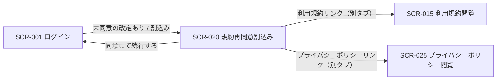
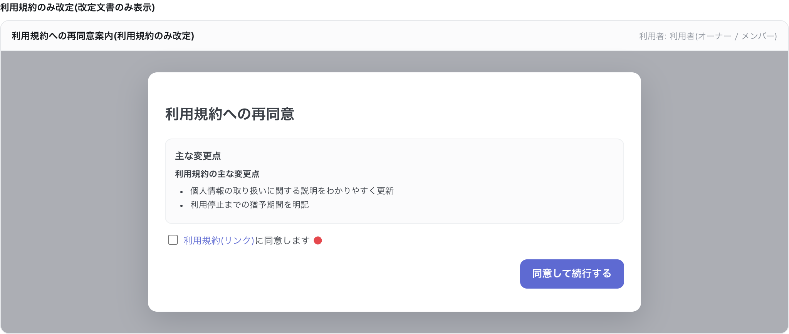
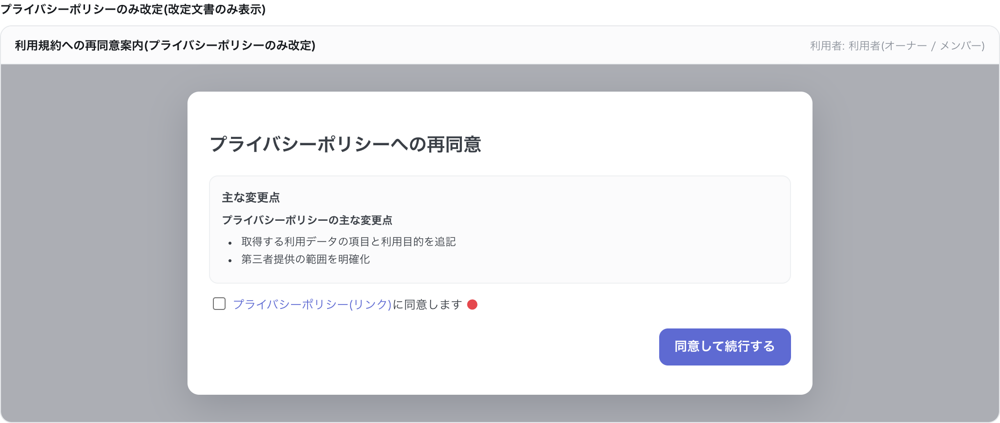

<!-- portal-top -->
[設計ポータル](../../README.md) ／ [基本設計](../index.md) ／ [画面設計](index.md) ／ **SCR-020 規約再同意割込み**
<!-- /portal-top -->

# SCR-020 規約再同意割込み

> **このページは、規約・ポリシー改定時にログイン後へ割り込み、再同意を求める画面 SCR-020 を定義します。** 画面概要 / 画面遷移図 / 画面レイアウト / 画面項目定義 / 入出力一覧 / 画面イベント一覧 の 6 セクションで記述します。

*版数 v1.0 ・ 更新 2026-06-17 ・ 承認済*

## 1. 画面概要

利用規約・プライバシーポリシーの改定時に、ログイン後の操作へ全画面モーダルで割り込み、改定文書の主な変更点を提示して再同意を求める画面です。

| 画面 ID | 画面名 | 機能概要 |
|----|----|----|
| `SCR-020` | 規約再同意割込み | 改定された利用規約・プライバシーポリシーの主な変更点を提示し、最新版への再同意を求める全画面モーダル |

| 関連 | 内容 |
|----|----|
| FR / BR | FR-010, FR-139 / — |
| 関連画面 | [`SCR-001` ログイン](SCR-001.md) / [`SCR-015` 利用規約閲覧](SCR-015.md) / [`SCR-025` プライバシーポリシー閲覧](SCR-025.md) |
| 対応業務UC | [UC-164](../../01_requirements/04_business_usecases/UC-164.md#UC-164) ・ [UC-165](../../01_requirements/04_business_usecases/UC-165.md#UC-165) ・ [UC-166](../../01_requirements/04_business_usecases/UC-166.md#UC-166) ・ [UC-167](../../01_requirements/04_business_usecases/UC-167.md#UC-167) ・ [UC-168](../../01_requirements/04_business_usecases/UC-168.md#UC-168) ・ [UC-169](../../01_requirements/04_business_usecases/UC-169.md#UC-169) |

| ステークホルダ | 対象 |
|----------------|------|
| オーナー       | ◯    |
| メンバー       | ◯    |

> [!NOTE]
> **補足** ログイン済みの全ロール利用者に対し、未同意の改定がある場合にログイン後の操作へ割り込んで表示します(SP / PC ともフルスクリーン)。改定された文書のみが対象の場合は、当該文書の変更点と同意チェックのみを表示します。

## 2. 画面遷移図

本画面からの画面遷移を、画面 ID・画面名とイベント(操作)で示します。

## 3. 画面レイアウト

## 4. 画面項目定義

本画面の入出力項目(変更点表示・同意チェック・操作ボタン)を定義します。項目の正本は本表です。

| 項目 ID | 項目 | 説明 | 種類 | 表示条件 | 表示 |
|----|----|----|----|----|----|
| `IT-01` | 主な変更点 | 改定された利用規約 / プライバシーポリシーの主な変更点を見出しで区別して表示する | カード | 改定された文書のみ表示(利用規約 / プライバシーポリシーの該当文書) | 各文書の主な変更点(差分サマリー) |
| `IT-02` | 利用規約同意 | 利用規約最新版への同意をチェックする(必須。リンクで SCR-015 を参照) | チェックボックス | 利用規約が改定対象の場合に表示 | 「利用規約の最新版に同意します」 |
| `IT-03` | プライバシーポリシー同意 | プライバシーポリシー最新版への同意をチェックする(必須。リンクで SCR-025 を参照) | チェックボックス | プライバシーポリシーが改定対象の場合に表示 | 「プライバシーポリシーの最新版に同意します」 |
| `IT-04` | 同意して続行する | 同意を確定して元の操作へ戻る | ボタン | 両チェック充足時のみ活性化 | 「同意して続行する」 |

## 5. 入出力一覧

本画面が読み書きするテーブルと、呼び出す API の一覧です。テーブルの正本は [データベース設計](../04_database/index.md)、API の正本は [API設計](../03_apis/index.md) です。

<table>
<thead>
<tr>
<th rowspan="2">入出力名</th>
<th rowspan="2">説明</th>
<th rowspan="2">種別</th>
<th rowspan="2">I/O</th>
<th colspan="4">アクセス種別(CRUD)</th>
<th rowspan="2">備考</th>
</tr>
<tr>
<th>C</th>
<th>R</th>
<th>U</th>
<th>D</th>
</tr>
</thead>
<tbody>
<tr>
<td>規約バージョン</td>
<td>差分サマリ・最新版を取得する</td>
<td>テーブル</td>
<td>入力</td>
<td>—</td>
<td>◯</td>
<td>—</td>
<td>—</td>
<td><code>M_TERMS_VER</code>(<a href="../04_database/index.md#TBL-012">テーブル設計 3.30</a>)</td>
</tr>
<tr>
<td>規約同意</td>
<td><code>doc_type</code> 別で同意を記録する</td>
<td>テーブル</td>
<td>出力</td>
<td>◯</td>
<td>—</td>
<td>—</td>
<td>—</td>
<td><code>T_TERMS_AGREE</code>(<a href="../04_database/index.md#TBL-024">テーブル設計 3.31</a>)</td>
</tr>
<tr>
<td>利用規約 最新版取得</td>
<td>利用規約の最新版・差分サマリを取得する</td>
<td>API</td>
<td>入力</td>
<td>—</td>
<td>—</td>
<td>—</td>
<td>—</td>
<td><a href="../03_apis/API-052.md#API-052">利用規約 最新版取得</a></td>
</tr>
<tr>
<td>プライバシーポリシー 最新版取得</td>
<td>プライバシーポリシーの最新版・差分サマリを取得する</td>
<td>API</td>
<td>入力</td>
<td>—</td>
<td>—</td>
<td>—</td>
<td>—</td>
<td><a href="../03_apis/API-053.md#API-053">プライバシーポリシー 最新版取得</a></td>
</tr>
<tr>
<td>利用規約 同意</td>
<td>利用規約最新版への同意を送信する</td>
<td>API</td>
<td>出力</td>
<td>—</td>
<td>—</td>
<td>—</td>
<td>—</td>
<td><a href="../03_apis/API-054.md#API-054">利用規約 同意</a></td>
</tr>
<tr>
<td>プライバシーポリシー 同意</td>
<td>プライバシーポリシー最新版への同意を送信する</td>
<td>API</td>
<td>出力</td>
<td>—</td>
<td>—</td>
<td>—</td>
<td>—</td>
<td><a href="../03_apis/API-055.md#API-055">プライバシーポリシー 同意</a></td>
</tr>
</tbody>
</table>

## 6. 画面イベント一覧

本画面のイベント(初期表示・各操作)ごとに、対象の項目 ID と処理内容を定義します。

<table>
<colgroup>
<col style="width: 10%" />
<col style="width: 12%" />
<col style="width: 12%" />
<col style="width: 30%" />
<col style="width: 46%" />
</colgroup>
<thead>
<tr>
<th>EVT-ID</th>
<th>イベント ID</th>
<th>項目 ID</th>
<th>イベント</th>
<th>処理</th>
</tr>
</thead>
<tbody>
<tr>
<td><a href="../02_screen_events/EVT-164.md#EVT-164">EVT-164</a></td>
<td><code>EV-01</code></td>
<td>—</td>
<td>初期表示</td>
<td><ul>
<li><a href="../03_apis/API-052.md#API-052">利用規約 最新版取得</a> API と <a href="../03_apis/API-053.md#API-053">プライバシーポリシー 最新版取得</a> API で改定文書の差分サマリを取得</li>
<li>改定対象の文書(利用規約 / プライバシーポリシー、または両方)の主な変更点を全画面モーダルで表示</li>
<li>改定対象外の文書のチェックボックスは非表示とする</li>
</ul></td>
</tr>
<tr>
<td><a href="../02_screen_events/EVT-165.md#EVT-165">EVT-165</a></td>
<td><code>EV-02</code></td>
<td>—</td>
<td>「利用規約」リンクを押下</td>
<td><a href="SCR-015.md">SCR-015 利用規約閲覧</a>を別タブで開く</td>
</tr>
<tr>
<td><a href="../02_screen_events/EVT-166.md#EVT-166">EVT-166</a></td>
<td><code>EV-03</code></td>
<td>—</td>
<td>「プライバシーポリシー」リンクを押下</td>
<td><a href="SCR-025.md">SCR-025 プライバシーポリシー閲覧</a>を別タブで開く</td>
</tr>
<tr>
<td><a href="../02_screen_events/EVT-167.md#EVT-167">EVT-167</a></td>
<td><code>EV-04</code></td>
<td><a href="#IT-02">IT-02</a></td>
<td>利用規約同意をチェック</td>
<td><ul>
<li>チェックをオン / オフする</li>
<li>両チェックの充足状態を判定し「同意して続行する」(IT-04)の活性 / 非活性を更新する</li>
</ul></td>
</tr>
<tr>
<td><a href="../02_screen_events/EVT-168.md#EVT-168">EVT-168</a></td>
<td><code>EV-05</code></td>
<td><a href="#IT-03">IT-03</a></td>
<td>プライバシーポリシー同意をチェック</td>
<td><ul>
<li>チェックをオン / オフする</li>
<li>両チェックの充足状態を判定し「同意して続行する」(IT-04)の活性 / 非活性を更新する</li>
</ul></td>
</tr>
<tr>
<td><a href="../02_screen_events/EVT-169.md#EVT-169">EVT-169</a></td>
<td><code>EV-06</code></td>
<td><a href="#IT-04">IT-04</a></td>
<td>「同意して続行する」を押下</td>
<td><ul>
<li>成功時: 改定対象の文書のみを対象に API を呼び出し <code>T_TERMS_AGREE</code> に記録(利用規約が改定対象の場合は <a href="../03_apis/API-054.md#API-054">利用規約 同意</a> API を、プライバシーポリシーが改定対象の場合は <a href="../03_apis/API-055.md#API-055">プライバシーポリシー 同意</a> API を呼び出す。両文書が改定対象の場合は両 API を呼び出す)。完了後は割込み前の操作へ戻る</li>
<li>失敗時: エラーメッセージを表示し、モーダルはそのまま維持する</li>
</ul></td>
</tr>
</tbody>
</table>

---

<!-- portal-bottom -->
[← 画面設計](index.md) ・ [基本設計](../index.md) ・ [↑ 設計ポータル](../../README.md)
<!-- /portal-bottom -->
