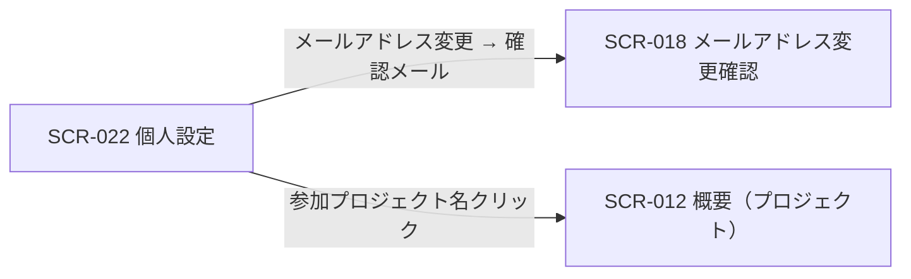

<!-- portal-top -->
[設計ポータル](../../README.md) ／ [基本設計](../index.md) ／ [画面設計](index.md) ／ **SCR-022 個人設定**
<!-- /portal-top -->

# SCR-022 個人設定

> **このページは、認証済みの利用者が自身のプロフィール・セキュリティ・参加プロジェクトを編集する画面 SCR-022 を定義します。** 画面概要 / 画面遷移図 / 画面レイアウト / 画面項目定義 / 入出力一覧 / 画面イベント一覧 の 6 セクションで記述します。

*版数 v1.0 ・ 更新 2026-06-17 ・ 承認済*

## 1. 画面概要

ヘッダ右上のアカウントメニュー「個人設定」から開く全画面で、自分のプロフィール・セキュリティ・参加プロジェクトをタブで扱う画面です。契約連絡先と退会は SCR-029 設定へ分離します。

| 画面 ID | 画面名 | 機能概要 |
|----|----|----|
| `SCR-022` | 個人設定 | 自分のプロフィール・セキュリティ・参加プロジェクトを編集する |

| 関連 | 内容 |
|----|----|
| FR / BR | FR-001, FR-005, FR-006, FR-190 / — |
| 関連画面 | [`SCR-018` メールアドレス変更確認](SCR-018.md)(確認メール再利用) / [`SCR-029` 設定](SCR-029.md) |
| 対応業務UC | [UC-008](../../01_requirements/04_business_usecases/UC-008.md#UC-008) ・ [UC-009](../../01_requirements/04_business_usecases/UC-009.md#UC-009) ・ [UC-010](../../01_requirements/04_business_usecases/UC-010.md#UC-010) ・ [UC-009](../../01_requirements/04_business_usecases/UC-009.md#UC-009) ・ [UC-008](../../01_requirements/04_business_usecases/UC-008.md#UC-008) |

| ステークホルダ | 対象 |
|----------------|------|
| オーナー       | ◯    |
| メンバー       | ◯    |

> [!NOTE]
> **補足** 認証済みであれば全ロールが利用でき、自分の情報のみ編集可能です。誤操作防止としてパスワード変更は再認証(現パスワード再入力)を要し、メールアドレス変更は再認証 + 新メールアドレスの確認メールを要します(再認証の正本は 認証・認可設計)。個人ごとの通知受信オプトアウトは本画面では扱わず、プロジェクト関連通知は常時 ON 固定です。

## 2. 画面遷移図

本画面からの画面遷移を、画面 ID・画面名とイベント(操作)で示します。

## 3. 画面レイアウト

## 4. 画面項目定義

本画面の入出力項目を、プロフィール・セキュリティ・参加プロジェクトの 3 タブに分けて定義します。項目の正本は本表です。

| 項目 ID | 項目 | 説明 | 種類 | 表示条件 | 表示 |
|----|----|----|----|----|----|
| `IT-01` | 表示名 | 自分の表示名を編集する(必須。1〜100 文字) | テキストボックス | プロフィールタブ | — |
| `IT-02` | メールアドレス | 自分のメールアドレスを編集する(必須。変更時は確認メールを送信) | テキストボックス(メールアドレス) | プロフィールタブ | — |
| `IT-03` | パスワードを変更する | 再認証(現パスワード再入力)を経てパスワード(旧 + 新 + 確認)を変更する | ボタン | セキュリティタブ | 「パスワードを変更する」 |
| `IT-04` | 参加プロジェクト一覧 | 自分が参加するプロジェクト名を一覧表示する(プロジェクト名はプロジェクトホームへのリンク) | テーブル | 参加プロジェクトタブ | プロジェクト名 |
| `IT-05` | タブ | 画面上部のタブグループ(プロフィール / セキュリティ / 参加プロジェクト)を切り替えるタブコントロール | タブグループ | 常時 | プロフィール / セキュリティ / 参加プロジェクト |
| `IT-06` | 保存する | プロフィールタブの入力内容(IT-01・IT-02)をサーバーへ送信して保存するボタン | ボタン | プロフィールタブ | 「保存する」 |
| `IT-07` | 言語 | 表示言語を選択するドロップダウン(MVP 対象外) | ドロップダウン | プロフィールタブ — MVP 対象外 | — |
| `IT-08` | 画像を変更 | プロフィール画像を変更するボタン(MVP 対象外) | ボタン | プロフィールタブ — MVP 対象外 | 「画像を変更」 |
| `IT-09` | 変更を破棄 | プロフィールタブの入力内容を初期値に戻すボタン | ボタン | プロフィールタブ | 「変更を破棄」 |

> [!NOTE]
> **補足** アクティブセッション一覧の表示と自己セッション終了は MVP 対象外です(将来対応、FR-182 改訂)。複数デバイス同時ログインは可能です。IT-07(言語)・IT-08(画像を変更)はモックに描画されていますが MVP 対象外とし、MVP フェーズでは操作を受け付けません。

## 5. 入出力一覧

本画面が読み書きするテーブルと、呼び出す API の一覧です。テーブルの正本は [データベース設計](../04_database/index.md)、API の正本は [API設計](../03_apis/index.md) です。

<table>
<thead>
<tr>
<th rowspan="2">入出力名</th>
<th rowspan="2">説明</th>
<th rowspan="2">種別</th>
<th rowspan="2">I/O</th>
<th colspan="4">アクセス種別(CRUD)</th>
<th rowspan="2">備考</th>
</tr>
<tr>
<th>C</th>
<th>R</th>
<th>U</th>
<th>D</th>
</tr>
</thead>
<tbody>
<tr>
<td>オーナー / プロジェクトユーザー</td>
<td>自身の表示名・メールアドレス・パスワードを参照・更新する(対象マスタはログイン中の actor 種別で特定。両マスタは完全分離)</td>
<td>テーブル</td>
<td>入力 / 出力</td>
<td>—</td>
<td>◯</td>
<td>◯</td>
<td>—</td>
<td><code>M_CONTRACT</code>(<a href="../04_database/index.md#TBL-001">テーブル設計 3.2</a>)/ <code>M_PRJ_USERS</code>(<a href="../04_database/index.md#TBL-003">テーブル設計 3.1</a>)</td>
</tr>
<tr>
<td>プロジェクト割当</td>
<td>参加プロジェクト一覧を取得する</td>
<td>テーブル</td>
<td>入力</td>
<td>—</td>
<td>◯</td>
<td>—</td>
<td>—</td>
<td><code>M_PRJ_USERS</code>(<a href="../04_database/index.md#TBL-003">テーブル設計 3.3</a>)</td>
</tr>
<tr>
<td>自己プロフィール更新</td>
<td>表示名・メールアドレスを更新し、メールアドレス変更時は確認メールを送信する(EV-05)</td>
<td>API</td>
<td>出力</td>
<td>—</td>
<td>◯</td>
<td>◯</td>
<td>—</td>
<td><a href="../03_apis/API-012.md#API-012">自己プロフィール更新(API-012)</a></td>
</tr>
<tr>
<td>自己パスワード変更</td>
<td>再認証トークンを使って自身のパスワードを更新する(EV-06)</td>
<td>API</td>
<td>出力</td>
<td>—</td>
<td>—</td>
<td>◯</td>
<td>—</td>
<td><a href="../03_apis/API-013.md#API-013">自己パスワード変更(API-013)</a></td>
</tr>
<tr>
<td>再認証</td>
<td>機微操作(プロフィール保存・パスワード変更)の前に現パスワードを再確認し再認証トークンを取得する</td>
<td>API</td>
<td>出力</td>
<td>—</td>
<td>—</td>
<td>—</td>
<td>—</td>
<td><a href="../03_apis/API-005.md#API-005">再認証(API-005)</a></td>
</tr>
</tbody>
</table>

## 6. 画面イベント一覧

本画面のイベント(初期表示・各操作)ごとに、対象の項目 ID と処理内容を定義します。

<table>
<colgroup>
<col style="width: 10%" />
<col style="width: 12%" />
<col style="width: 12%" />
<col style="width: 30%" />
<col style="width: 46%" />
</colgroup>
<thead>
<tr>
<th>EVT-ID</th>
<th>イベント ID</th>
<th>項目 ID</th>
<th>イベント</th>
<th>処理</th>
</tr>
</thead>
<tbody>
<tr>
<td><a href="../02_screen_events/EVT-173.md#EVT-173">EVT-173</a></td>
<td><code>EV-01</code></td>
<td>—</td>
<td>初期表示</td>
<td>認証済みユーザー自身のプロフィール情報(表示名・メールアドレス)および参加プロジェクト一覧を取得し、プロフィールタブを初期選択状態で表示する</td>
</tr>
<tr>
<td><a href="../02_screen_events/EVT-174.md#EVT-174">EVT-174</a></td>
<td><code>EV-02</code></td>
<td><a href="#IT-05">IT-05</a></td>
<td>タブを押下(プロフィール / セキュリティ / 参加プロジェクト)</td>
<td>選択したタブ(プロフィール / セキュリティ / 参加プロジェクト)のコンテンツ領域を表示し、他タブのコンテンツを非表示にする。タブ切替によるデータ取得は行わない(EV-01 で取得済み)</td>
</tr>
<tr>
<td><a href="../02_screen_events/EVT-175.md#EVT-175">EVT-175</a></td>
<td><code>EV-03</code></td>
<td><a href="#IT-01">IT-01</a></td>
<td>表示名を入力</td>
<td><ul>
<li>成功時: 1〜100 文字の範囲内であればバリデーションエラーを表示しない</li>
<li>失敗時: 空欄または 101 文字以上の場合、入力欄下部にバリデーションエラーを表示する</li>
</ul></td>
</tr>
<tr>
<td><a href="../02_screen_events/EVT-176.md#EVT-176">EVT-176</a></td>
<td><code>EV-04</code></td>
<td><a href="#IT-02">IT-02</a></td>
<td>メールアドレスを入力</td>
<td><ul>
<li>成功時: メールアドレス形式として正当であればバリデーションエラーを表示しない</li>
<li>失敗時: 空欄またはメールアドレス形式でない場合、入力欄下部にバリデーションエラーを表示する</li>
</ul></td>
</tr>
<tr>
<td><a href="../02_screen_events/EVT-177.md#EVT-177">EVT-177</a></td>
<td><code>EV-05</code></td>
<td><a href="#IT-06">IT-06</a></td>
<td>「保存する」を押下(プロフィール)</td>
<td><ul>
<li>IT-01・IT-02 の値をサーバー側で検証し、<a href="../03_apis/API-012.md#API-012">自己プロフィール更新(API-012)</a> を呼び出して自身のプロフィールを更新する</li>
<li>成功時(メールアドレス未変更): 保存完了メッセージを表示する</li>
<li>成功時(メールアドレス変更): <a href="../03_apis/API-005.md#API-005">再認証(API-005)</a> で現パスワード再入力を求め、通過後に新メールアドレスへ確認メールを送信し、<a href="SCR-018.md">SCR-018 メールアドレス変更確認</a>フローへ引き渡す(<a href="../../01_requirements/02_FunctionalRequirement/01_account-fr.md#FR-005">FR-005</a>)</li>
<li>失敗時(バリデーションエラー): エラー内容を入力欄付近に表示し保存しない</li>
<li>失敗時(再認証失敗): 再認証モーダルにエラーを表示し保存しない</li>
</ul></td>
</tr>
<tr>
<td><a href="../02_screen_events/EVT-178.md#EVT-178">EVT-178</a></td>
<td><code>EV-06</code></td>
<td><a href="#IT-03">IT-03</a></td>
<td>「パスワードを変更する」を押下</td>
<td><ul>
<li><a href="../03_apis/API-005.md#API-005">再認証(API-005)</a> モーダルを表示し、現パスワードの入力を求める(<a href="../../01_requirements/02_FunctionalRequirement/01_account-fr.md#FR-005">FR-005</a>)</li>
<li>再認証成功後: 新パスワード・確認パスワードの入力フォームを表示し、送信で <a href="../03_apis/API-013.md#API-013">自己パスワード変更(API-013)</a> を呼び出して新パスワードへ更新する(<a href="../../01_requirements/02_FunctionalRequirement/01_account-fr.md#FR-006">FR-006</a> — 12 文字以上・3 種以上)</li>
<li>失敗時(再認証失敗): モーダルにエラーを表示し変更しない</li>
<li>失敗時(パスワード複雑性不足): 新パスワード欄下部にエラーを表示し変更しない</li>
</ul></td>
</tr>
<tr>
<td><a href="../02_screen_events/EVT-179.md#EVT-179">EVT-179</a></td>
<td><code>EV-07</code></td>
<td><a href="#IT-09">IT-09</a></td>
<td>「変更を破棄」を押下</td>
<td>プロフィールタブの入力欄(IT-01・IT-02)の値を初期表示時の値へ戻し、編集中の変更を破棄する</td>
</tr>
<tr>
<td><a href="../02_screen_events/EVT-180.md#EVT-180">EVT-180</a></td>
<td><code>EV-08</code></td>
<td><a href="#IT-04">IT-04</a></td>
<td>参加プロジェクト名リンクを押下</td>
<td>該当プロジェクトの <a href="SCR-012.md">SCR-012 概要(プロジェクト)</a>へ遷移する</td>
</tr>
</tbody>
</table>

---

<!-- portal-bottom -->
[← 画面設計](index.md) ・ [基本設計](../index.md) ・ [↑ 設計ポータル](../../README.md)
<!-- /portal-bottom -->
