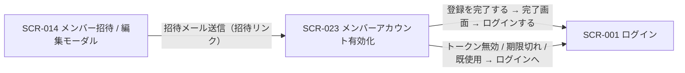

<!-- portal-top -->
[設計ポータル](../../README.md) ／ [基本設計](../index.md) ／ [画面設計](index.md) ／ **SCR-023 メンバーアカウント有効化**
<!-- /portal-top -->

# SCR-023 メンバーアカウント有効化

> **このページは、招待されたメンバーが招待リンクから氏名・初回パスワード・規約同意を入力してアカウントを有効化する未認証画面 SCR-023 を定義します。** 画面概要 / 画面遷移図 / 画面レイアウト / 画面項目定義 / 入出力一覧 / 画面イベント一覧 の 6 セクションで記述します。

*版数 v1.0 ・ 更新 2026-06-17 ・ 承認済*

## 1. 画面概要

招待メール内リンクのトークン認証で到達する未認証画面(共通領域)です。招待された本人が氏名(表示名)・初回パスワード・利用規約同意・プライバシーポリシー同意を入力し、アカウントを有効化します。完了時に `M_USER.name` 設定・`M_USER.status='active'` 化・`T_TERMS_AGREE` 記録・`M_PRJ_USERS.valid=1` 化・トークン消費を同一トランザクションで実行します。

| 画面 ID | 画面名 | 機能概要 |
|----|----|----|
| `SCR-023` | メンバーアカウント有効化 | 招待トークンを検証し、本人が氏名・初回パスワード・規約同意を入力してアカウントを有効化する未認証画面 |

| 関連 | 内容 |
|----|----|
| FR / BR | FR-018, FR-019, FR-022, FR-023, FR-006(パスワード強度), FR-137(規約同意), FR-139, FR-149(Turnstile) / BR-011, BR-012 |
| 関連画面 | [`SCR-014` メンバー招待 / 編集モーダル](SCR-014.md)(招待元) / [`SCR-001` ログイン](SCR-001.md)(完了後・エラー復旧) / [`SCR-015` 利用規約閲覧](SCR-015.md) / [`SCR-025` プライバシーポリシー閲覧](SCR-025.md) |
| 対応業務UC | [UC-181](../../01_requirements/02_business_usecases/UC-181.md#UC-181) ・ [UC-182](../../01_requirements/02_business_usecases/UC-182.md#UC-182) ・ [UC-183](../../01_requirements/02_business_usecases/UC-183.md#UC-183) ・ [UC-184](../../01_requirements/02_business_usecases/UC-184.md#UC-184) ・ [UC-185](../../01_requirements/02_business_usecases/UC-185.md#UC-185) ・ [UC-186](../../01_requirements/02_business_usecases/UC-186.md#UC-186) ・ [UC-187](../../01_requirements/02_business_usecases/UC-187.md#UC-187) ・ [UC-188](../../01_requirements/02_business_usecases/UC-188.md#UC-188) ・ [UC-189](../../01_requirements/02_business_usecases/UC-189.md#UC-189) ・ [UC-190](../../01_requirements/02_business_usecases/UC-190.md#UC-190) ・ [UC-191](../../01_requirements/02_business_usecases/UC-191.md#UC-191) ・ [UC-192](../../01_requirements/02_business_usecases/UC-192.md#UC-192) ・ [UC-193](../../01_requirements/02_business_usecases/UC-193.md#UC-193) |

| ステークホルダ         | 対象 |
|------------------------|------|
| 招待メンバー(トークン) | ◯    |

> [!NOTE]
> **補足** 本画面は**未認証画面**です。唯一の認可条件は `T_ACCESS_TOKENS.purpose='activation'` の有効トークン保持で、オーナー / メンバーのログインロールでは到達しません(サイドメニュー除外)。氏名(表示名)は招待された本人のみが入力でき、招待者(オーナー / メンバー)は事前入力できません(FR-022 個人情報原則)。本画面は TPL-ADMIN_USER_REGISTER / メンバー招待テンプレートの着地点です(11_メール設計)。

## 2. 画面遷移図

本画面の到達元・遷移先を、画面 ID・画面名とイベント(操作)で示します。

## 3. 画面レイアウト

## 4. 画面項目定義

本画面の表示・入力・操作項目と各バリデーションを定義します。項目の正本は本表です。トークン検証結果によって表示する状態画面(エラー / 完了)は備考に明記します。

| 項目 ID | 項目 | 説明 | 種類 | 表示条件 | 表示 |
|----|----|----|----|----|----|
| `IT-01` | ステップタイムライン | 有効化の進行ステップを表示する(現在ステップを強調) | タイムライン | — | 「① メールリンクをクリック」「② 氏名・パスワード・規約同意を入力」「③ ログイン」(② を現在ステップとして強調) |
| `IT-02` | 招待情報パネル | 招待内容(プロジェクト名 / 招待元)を表示する | カード | トークン検証成功時のみ表示 | 「プロジェクト: {プロジェクト名} / 招待元: {招待元}」 |
| `IT-03` | メールアドレス | 招待先メールアドレスを編集不可で表示する | ラベル | — | 招待先メールアドレス |
| `IT-04` | 氏名(表示名) | 本人が氏名(表示名)を入力する(必須。1〜100 文字) | テキストボックス | — | placeholder「例: 山田 太郎」、文字数カウンタ |
| `IT-05` | 初回パスワード | 初回パスワードを入力する(必須。12 文字以上、英大文字 / 小文字 / 数字 / 記号のうち 3 種類以上)。強度をリアルタイム 5 段階で表示する | テキストボックス(パスワード) + プログレスバー | — | パスワード強度メーター(5 段階) |
| `IT-06` | パスワード(確認) | 初回パスワードと一致するか確認入力する(必須。本体と一致) | テキストボックス(パスワード) | — | — |
| `IT-07` | 利用規約同意 | 利用規約への同意をチェックする(必須。「全文を見る」リンクで SCR-015 を参照) | チェックボックス | — | 「利用規約に同意します」+「全文を見る」リンク |
| `IT-08` | プライバシーポリシー同意 | プライバシーポリシーへの同意をチェックする(必須。「全文を見る」リンクで SCR-025 を参照) | チェックボックス | — | 「プライバシーポリシーに同意します」+「全文を見る」リンク |
| `IT-09` | Turnstile(CAPTCHA) | ボット対策の Turnstile 検証を行う(SCR-001 / 002 / 003 と同等) | 検証ウィジェット | — | — |
| `IT-10` | 登録を完了する | 入力内容を送信してアカウントを有効化する | ボタン | — | 「登録を完了する」 |
| `IT-11` | トークン無効 / 期限切れエラー画面 | トークンが無効・期限切れの旨と復旧導線を表示する | 空状態表示 | 招待トークンが無効または期限切れの場合に表示 | 「招待リンクが期限切れ、または無効です(有効期限 7 日)。招待元に再送を依頼してください」+ ログインへのリンク |
| `IT-12` | 既使用エラー画面 | トークンが使用済みの旨と復旧導線を表示する | 空状態表示 | 招待トークンが使用済みの場合に表示 | 「このリンクは既に使用済みです」+ ログインへのリンク |
| `IT-13` | 完了画面 | 有効化完了の旨とログイン導線を表示する | 空状態表示 | アクティベーション成功時に表示 | 「アカウントを有効化しました」+「ログインする」CTA |
| `IT-14` | ログインへのリンク(トークン無効 / 期限切れ) | IT-11 エラー画面内の SCR-001 への復旧リンク | リンク | IT-11 表示時 | 「ログインへ」リンク |
| `IT-15` | ログインへのリンク(既使用エラー) | IT-12 エラー画面内の SCR-001 への復旧リンク | リンク | IT-12 表示時 | 「ログインへ」リンク |

> [!WARNING]
> **注意** バリデーション(エラーメッセージ ID は [メール設計書](../06_mail-design.md)が正本): 氏名は必須・1〜100 文字・前後空白トリム(MSG-SCR-018-ERROR-001 / 002)、パスワードは FR-006 強度(MSG-SCR-018-ERROR-003)、確認は一致(MSG-SCR-018-ERROR-004)、利用規約 / プライバシーポリシーはチェック必須(MSG-SCR-018-ERROR-005 / 006)、Turnstile は検証成功(MSG-COMMON-TURNSTILE)。API 410 はエラー画面、400 はフィールド単位エラー表示(入力可能のまま)。

## 5. 入出力一覧

本画面が読み書きするテーブルと、呼び出す API の一覧です。テーブルの正本は [データベース設計](../04_database/index.md)、API の正本は [API設計](../03_apis/index.md) です。

<table>
<thead>
<tr>
<th rowspan="2">入出力名</th>
<th rowspan="2">説明</th>
<th rowspan="2">種別</th>
<th rowspan="2">I/O</th>
<th colspan="4">アクセス種別(CRUD)</th>
<th rowspan="2">備考</th>
</tr>
<tr>
<th>C</th>
<th>R</th>
<th>U</th>
<th>D</th>
</tr>
</thead>
<tbody>
<tr>
<td>アクセストークン</td>
<td>招待トークンを検証・消費し、<code>meta</code> から招待プロジェクトを取得する(<code>used_at</code> セット、<code>invitedProjectId</code> 取得)</td>
<td>テーブル</td>
<td>入力 / 出力</td>
<td>—</td>
<td>◯</td>
<td>◯</td>
<td>—</td>
<td><code>T_ACCESS_TOKENS</code>(<a href="../04_database/index.md#TBL-T-002">テーブル設計 3.5</a>)</td>
</tr>
<tr>
<td>利用者</td>
<td>招待時に作成された予約 <code>M_USER</code> 行に氏名・パスワードハッシュを設定し <code>status='active'</code> 化する(1 メール = 1 アカウント)</td>
<td>テーブル</td>
<td>出力</td>
<td>—</td>
<td>◯</td>
<td>◯</td>
<td>—</td>
<td><code>M_USER</code>(<a href="../04_database/TBL-M-001.md">テーブル設計</a>)</td>
</tr>
<tr>
<td>プロジェクト割当</td>
<td>招待時の予約割当を <code>valid=1</code> 化する</td>
<td>テーブル</td>
<td>出力</td>
<td>—</td>
<td>—</td>
<td>◯</td>
<td>—</td>
<td><code>M_PRJ_USERS</code>(<a href="../04_database/index.md#TBL-M-003">テーブル設計 3.3</a>)</td>
</tr>
<tr>
<td>規約同意記録</td>
<td>利用規約・プライバシーポリシーの各最新版に対し <code>doc_type</code> 別の 2 行を記録する</td>
<td>テーブル</td>
<td>出力</td>
<td>◯</td>
<td>—</td>
<td>—</td>
<td>—</td>
<td><code>T_TERMS_AGREE</code>(<a href="../04_database/index.md#TBL-T-012">テーブル設計 3.31</a>)</td>
</tr>
<tr>
<td>招待トークン検証</td>
<td>招待トークンを検証し招待情報をプレビューする</td>
<td>API</td>
<td>入力 / 出力</td>
<td>—</td>
<td>—</td>
<td>—</td>
<td>—</td>
<td><code>POST /auth/invitations/{token}/preview</code>(<a href="../03_apis/API-007.md#API-007">招待トークン検証・プレビュー</a>)</td>
</tr>
<tr>
<td>アカウント有効化</td>
<td>入力内容を送信してアカウントを有効化する(同一トランザクション)</td>
<td>API</td>
<td>入力 / 出力</td>
<td>—</td>
<td>—</td>
<td>—</td>
<td>—</td>
<td><code>POST /auth/invitations/{token}/activate</code>(<a href="../03_apis/API-008.md#API-008">メンバーアカウント有効化</a>)</td>
</tr>
</tbody>
</table>

## 6. 画面イベント一覧

本画面のイベント(初期表示・各操作)ごとに、対象の項目 ID と処理内容を定義します。

<table>
<colgroup>
<col style="width: 10%" />
<col style="width: 12%" />
<col style="width: 12%" />
<col style="width: 30%" />
<col style="width: 46%" />
</colgroup>
<thead>
<tr>
<th>EVT-ID</th>
<th>イベント ID</th>
<th>項目 ID</th>
<th>イベント</th>
<th>処理</th>
</tr>
</thead>
<tbody>
<tr>
<td><a href="../02_screen_events/EVT-181.md#EVT-181">EVT-181</a></td>
<td><code>EV-01</code></td>
<td>—</td>
<td>初期表示</td>
<td><ul>
<li><a href="../03_apis/API-007.md#API-007">招待トークン検証・プレビュー</a> API を実行</li>
<li>成功時: 招待情報パネル(IT-02)・メールアドレス(IT-03)・入力フォームを表示</li>
<li>トークン無効 / 期限切れ(HTTP 410): IT-11 トークン無効 / 期限切れエラー画面を表示</li>
<li>トークン使用済み: IT-12 既使用エラー画面を表示</li>
</ul></td>
</tr>
<tr>
<td><a href="../02_screen_events/EVT-182.md#EVT-182">EVT-182</a></td>
<td><code>EV-02</code></td>
<td><a href="#IT-04">IT-04</a></td>
<td>氏名(表示名)を入力</td>
<td>必須・1〜100 文字・前後空白トリムをリアルタイム検証し、エラーメッセージを表示する</td>
</tr>
<tr>
<td><a href="../02_screen_events/EVT-183.md#EVT-183">EVT-183</a></td>
<td><code>EV-03</code></td>
<td><a href="#IT-05">IT-05</a></td>
<td>初回パスワードを入力</td>
<td>FR-006 強度要件(12 文字以上・3 種類以上)を検証しパスワード強度メーターを更新する。要件未達の場合はエラーを表示する</td>
</tr>
<tr>
<td><a href="../02_screen_events/EVT-184.md#EVT-184">EVT-184</a></td>
<td><code>EV-04</code></td>
<td><a href="#IT-06">IT-06</a></td>
<td>パスワード(確認)を入力</td>
<td>初回パスワード(IT-05)との一致をリアルタイム検証し、不一致の場合はエラーを表示する</td>
</tr>
<tr>
<td><a href="../02_screen_events/EVT-185.md#EVT-185">EVT-185</a></td>
<td><code>EV-05</code></td>
<td><a href="#IT-07">IT-07</a></td>
<td>「利用規約に同意します」をチェック</td>
<td>チェック状態を保持する。未チェックのまま有効化を試みた場合は必須エラーを表示する</td>
</tr>
<tr>
<td><a href="../02_screen_events/EVT-186.md#EVT-186">EVT-186</a></td>
<td><code>EV-06</code></td>
<td><a href="#IT-07">IT-07</a></td>
<td>利用規約の「全文を見る」を押下</td>
<td><a href="SCR-015.md">SCR-015 利用規約閲覧</a>へ遷移する(別タブまたは別画面)</td>
</tr>
<tr>
<td><a href="../02_screen_events/EVT-187.md#EVT-187">EVT-187</a></td>
<td><code>EV-07</code></td>
<td><a href="#IT-08">IT-08</a></td>
<td>「プライバシーポリシーに同意します」をチェック</td>
<td>チェック状態を保持する。未チェックのまま有効化を試みた場合は必須エラーを表示する</td>
</tr>
<tr>
<td><a href="../02_screen_events/EVT-188.md#EVT-188">EVT-188</a></td>
<td><code>EV-08</code></td>
<td><a href="#IT-08">IT-08</a></td>
<td>プライバシーポリシーの「全文を見る」を押下</td>
<td><a href="SCR-025.md">SCR-025 プライバシーポリシー閲覧</a>へ遷移する(別タブまたは別画面)</td>
</tr>
<tr>
<td><a href="../02_screen_events/EVT-189.md#EVT-189">EVT-189</a></td>
<td><code>EV-09</code></td>
<td><a href="#IT-09">IT-09</a></td>
<td>Turnstile を実行</td>
<td>CAPTCHA トークンを取得する。検証失敗時はエラーを表示し「登録を完了する」ボタンを無効化する</td>
</tr>
<tr>
<td><a href="../02_screen_events/EVT-190.md#EVT-190">EVT-190</a></td>
<td><code>EV-10</code></td>
<td><a href="#IT-10">IT-10</a></td>
<td>「登録を完了する」を押下</td>
<td><ul>
<li>全項目のクライアント側バリデーション(EV-02〜EV-09 の各検証)を実行し、エラーがある場合は送信せずエラーを表示する</li>
<li>バリデーション通過後、<a href="../03_apis/API-008.md#API-008">メンバーアカウント有効化</a> API を実行(同一トランザクション: 予約 <code>M_USER</code> への氏名・パスワードハッシュ設定・<code>status='active'</code> 化 / <code>M_PRJ_USERS</code> の <code>valid=1</code> 化 / <code>T_TERMS_AGREE</code> 2 件登録 / トークン消費)</li>
<li>成功時: IT-13 完了画面を表示する</li>
<li>HTTP 400(フィールドエラー)時: フィールド単位のエラーメッセージを表示し、入力フォームを操作可能なまま維持する</li>
<li>HTTP 410(トークン期限切れ / 無効)時: IT-11 トークン無効 / 期限切れエラー画面を表示する</li>
</ul></td>
</tr>
<tr>
<td><a href="../02_screen_events/EVT-191.md#EVT-191">EVT-191</a></td>
<td><code>EV-11</code></td>
<td><a href="#IT-13">IT-13</a></td>
<td>「ログインする」を押下(完了画面)</td>
<td><a href="SCR-001.md">SCR-001 ログイン</a>へ遷移する(IT-13 完了画面の「ログインする」CTA を押下)</td>
</tr>
<tr>
<td><a href="../02_screen_events/EVT-192.md#EVT-192">EVT-192</a></td>
<td><code>EV-12</code></td>
<td><a href="#IT-14">IT-14</a></td>
<td>「ログインへ」を押下(トークン無効 / 期限切れエラー画面)</td>
<td><a href="SCR-001.md">SCR-001 ログイン</a>へ遷移する(IT-11 トークン無効 / 期限切れエラー画面の復旧リンクを押下)</td>
</tr>
<tr>
<td><a href="../02_screen_events/EVT-193.md#EVT-193">EVT-193</a></td>
<td><code>EV-13</code></td>
<td><a href="#IT-15">IT-15</a></td>
<td>「ログインへ」を押下(既使用エラー画面)</td>
<td><a href="SCR-001.md">SCR-001 ログイン</a>へ遷移する(IT-12 既使用エラー画面の復旧リンクを押下)</td>
</tr>
</tbody>
</table>

---

<!-- portal-bottom -->
[← 画面設計](index.md) ・ [基本設計](../index.md) ・ [↑ 設計ポータル](../../README.md)
<!-- /portal-bottom -->
