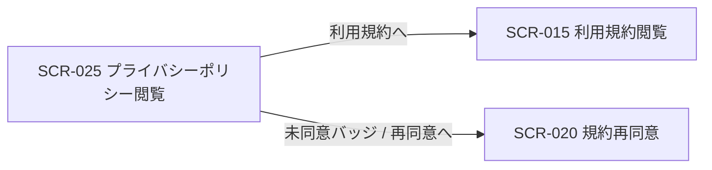
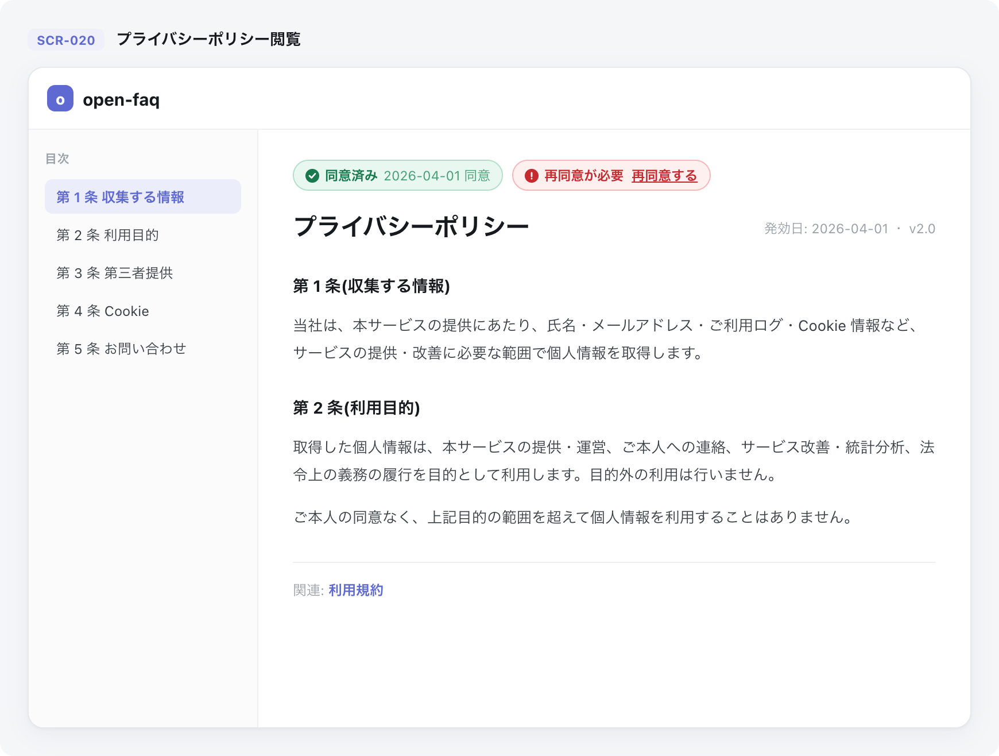

<!-- portal-top -->
[設計ポータル](../../README.md) ／ [基本設計](../index.md) ／ [画面設計](index.md) ／ **SCR-025 プライバシーポリシー閲覧**
<!-- /portal-top -->

# SCR-025 プライバシーポリシー閲覧

> **このページは、プライバシーポリシーの最新版を 1 枚のページとして閲覧する静的閲覧画面 SCR-025 を定義します。** 画面概要 / 画面遷移図 / 画面レイアウト / 画面項目定義 / 入出力一覧 / 画面イベント一覧 の 6 セクションで記述します。

*版数 v1.0 ・ 更新 2026-06-17 ・ 承認済*

## 1. 画面概要

プライバシーポリシーの最新版のみを 1 枚のページとして表示する閲覧専用画面です。上部に同意状態バッジを置き、その下に全文を連続表示します。目次・章ナビ・過去バージョン履歴・差分表示は設けません。利用規約は SCR-015 に分離します。

| 画面 ID | 画面名 | 機能概要 |
|----|----|----|
| `SCR-025` | プライバシーポリシー閲覧 | プライバシーポリシーの最新版の全文表示と同意状態バッジ表示を行う |

| 関連 | 内容 |
|----|----|
| FR / BR | FR-137, FR-139, FR-142 / — |
| 関連画面 | [`SCR-015` 利用規約閲覧](SCR-015.md) / [`SCR-020` 規約再同意](SCR-020.md) |
| 対応業務UC | [UC-196](../../01_requirements/02_business_usecases/UC-196.md#UC-196) ・ [UC-197](../../01_requirements/02_business_usecases/UC-197.md#UC-197) ・ [UC-198](../../01_requirements/02_business_usecases/UC-198.md#UC-198) |

| ステークホルダ     | 対象 |
|--------------------|------|
| 全利用者(認証前可) | ◯    |

> [!NOTE]
> **補足** 本画面は認証不要 URL を提供し、認証前でも閲覧できます(権限は不要)。同意状態バッジはログイン済みの場合のみ表示します。ウィジェット内には表示せず、ウィジェット利用者向けの画面図・導線には含めません。

## 2. 画面遷移図

本画面からの画面遷移を、画面 ID・画面名とイベント(操作)で示します。

## 3. 画面レイアウト

## 4. 画面項目定義

本画面の表示項目を定義します。項目の正本は本表です。閲覧専用画面のため入力項目はありません。

| 項目 ID | 項目 | 説明 | 種類 | 表示条件 | 表示 |
|----|----|----|----|----|----|
| `IT-01` | 同意状態バッジ | 最新版プライバシーポリシーへの同意状態を上部に表示する | バッジ | ログイン済み時のみ表示 | 同意済み(同意日付き・緑)/ 未同意(赤・SCR-020 へのリンク併記) |
| `IT-02` | 最新版の全文 | プライバシーポリシー最新版の全文を 1 枚のページに連続表示する。目次・章ナビ・セクション分け・過去バージョン履歴・差分表示は設けない | ラベル | — | プライバシーポリシー本文 |
| `IT-03` | 利用規約リンク | SCR-015 利用規約閲覧へ遷移するテキストリンク | リンク | 常時 | 「利用規約」 |

## 5. 入出力一覧

本画面が読み取るテーブルと、呼び出す API の一覧です。テーブルの正本は [データベース設計](../04_database/index.md)、API の正本は [API設計a](../03_apis/index.md) です。

<table>
<thead>
<tr>
<th rowspan="2">入出力名</th>
<th rowspan="2">説明</th>
<th rowspan="2">種別</th>
<th rowspan="2">I/O</th>
<th colspan="4">アクセス種別(CRUD)</th>
<th rowspan="2">備考</th>
</tr>
<tr>
<th>C</th>
<th>R</th>
<th>U</th>
<th>D</th>
</tr>
</thead>
<tbody>
<tr>
<td>規約バージョン</td>
<td>プライバシーポリシー最新版(<code>doc_type='privacy_policy'</code>)を取得する</td>
<td>テーブル</td>
<td>入力</td>
<td>—</td>
<td>◯</td>
<td>—</td>
<td>—</td>
<td><code>M_TERMS_VER</code>(<a href="../04_database/index.md#TBL-M-012">テーブル設計 3.30</a>)</td>
</tr>
<tr>
<td>規約同意</td>
<td>同意状態バッジ用に同意有無を照合する(ログイン時のみ)</td>
<td>テーブル</td>
<td>入力</td>
<td>—</td>
<td>◯</td>
<td>—</td>
<td>—</td>
<td><code>T_TERMS_AGREE</code>(<a href="../04_database/index.md#TBL-T-012">テーブル設計 3.31</a>)。サーバーサイドで照合。認証済みユーザーのみ取得</td>
</tr>
<tr>
<td>プライバシーポリシー最新版取得</td>
<td>最新版の全文を取得する</td>
<td>API</td>
<td>入力</td>
<td>—</td>
<td>◯</td>
<td>—</td>
<td>—</td>
<td><a href="../03_apis/API-053.md#API-053">API-053 プライバシーポリシー 最新版取得</a></td>
</tr>
</tbody>
</table>

## 6. 画面イベント一覧

本画面のイベント(初期表示・各操作)ごとに、対象の項目 ID と処理内容を定義します。

<table>
<colgroup>
<col style="width: 10%" />
<col style="width: 12%" />
<col style="width: 12%" />
<col style="width: 30%" />
<col style="width: 46%" />
</colgroup>
<thead>
<tr>
<th>EVT-ID</th>
<th>イベント ID</th>
<th>項目 ID</th>
<th>イベント</th>
<th>処理</th>
</tr>
</thead>
<tbody>
<tr>
<td><a href="../02_screen_events/EVT-196.md#EVT-196">EVT-196</a></td>
<td><code>EV-01</code></td>
<td>—</td>
<td>初期表示</td>
<td><ul>
<li><a href="../03_apis/API-053.md#API-053">プライバシーポリシー 最新版取得</a> API で最新版全文を取得し <a href="#IT-02">IT-02</a> に表示</li>
<li>ログイン済みの場合: 同意状態バッジ(<a href="#IT-01">IT-01</a>)を取得・表示する。同意済みは緑バッジ(同意日付き)、未同意は赤バッジ(SCR-020 へのリンク付き)で表示</li>
<li>未ログインの場合: 同意状態バッジを非表示とし、全文のみ表示</li>
</ul></td>
</tr>
<tr>
<td><a href="../02_screen_events/EVT-197.md#EVT-197">EVT-197</a></td>
<td><code>EV-02</code></td>
<td><a href="#IT-01">IT-01</a></td>
<td>「再同意する」を押下(未同意バッジのリンク)</td>
<td>SCR-020 規約再同意へ遷移する</td>
</tr>
<tr>
<td><a href="../02_screen_events/EVT-198.md#EVT-198">EVT-198</a></td>
<td><code>EV-03</code></td>
<td><a href="#IT-03">IT-03</a></td>
<td>「利用規約」を押下</td>
<td>SCR-015 利用規約閲覧へ遷移する</td>
</tr>
</tbody>
</table>

---

<!-- portal-bottom -->
[← 画面設計](index.md) ・ [基本設計](../index.md) ・ [↑ 設計ポータル](../../README.md)
<!-- /portal-bottom -->
