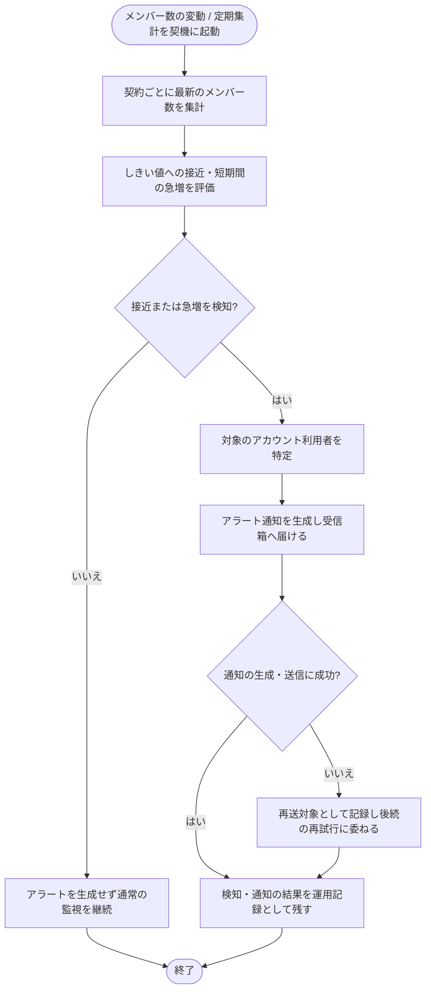

<!-- portal-top -->
[設計ポータル](../../../README.md) ／ [基本設計](../../index.md) ／ [バックエンド設計](../index.md) ／ [システム設計](index.md) ／ **SYS-001: メンバー数の上限接近・急増の検知と通知**
<!-- /portal-top -->

# SYS-001: メンバー数の上限接近・急増の検知と通知

> **このページは、契約内のメンバー数を集計し上限への接近・急増を検知してアカウント利用者へアラート通知を生成するシステム処理 SYS-001 を定義します。** 処理概要 / 処理フロー図 / 入出力 / 処理項目定義 / 入出力一覧 / システムイベント一覧 の 6 セクションで記述します。

*種別 システム設計 ・ 優先度 P0 ・ ステータス ドラフト*

## 1. 処理概要

契約ごとに最新のメンバー数を集計し、設定済みのしきい値への接近と短期間での急増を評価する監視処理である。検知した契約についてアカウント利用者(オーナーおよび関係するメンバー)を特定し、受信箱へのアラート通知を生成するとともに、検知・通知の結果を運用記録として残す。しきい値の具体値は機能要件・業務ルールに委ねる。

| システム ID | 処理名 | 種別 | トリガー / スケジュール | 機能概要 |
|---|---|---|---|---|
| `SYS-001` | メンバー数の上限接近・急増の検知と通知 | monitor | メンバー数の変動時 + 定期集計(日次) | 契約ごとにメンバー数を集計し、しきい値接近・急増を検知してアカウント利用者へアラート通知を生成し、検知・通知結果を記録する |

| 関連 | 内容 |
|---|---|
| 機能要件 (FR) | [FR-033](../../../01_requirements/02_FunctionalRequirement/01_account-fr.md#FR-033) |
| 業務要件 (BR) | [BR-015](../../../01_requirements/01_BusinessRequirement/01_account-br.md#BR-015) |
| 業務ルール (RULE) | — |
| 関連システム | — |
| 対応業務UC | [UC-049](../../../01_requirements/04_business_usecases/UC-049.md#UC-049) |

## 2. 処理フロー図

## 3. 入出力

| 区分 | 内容 |
|---|---|
| 入力ソース | メンバー数の変動契機 / 定期集計スケジュール(日次)、契約ごとのメンバー数 |
| 出力先 | アカウント利用者向けの受信箱アラート通知、検知・通知の運用記録 |

## 4. 処理項目定義

| 項目 ID | ステップ | 説明 | 種別 | 実行条件 |
|---|---|---|---|---|
| `PR-01` | メンバー数集計 | メンバー数の変動または定期集計を契機に、契約ごとの最新のメンバー数を把握する | 集計 | 変動契機 / 定期集計タイミング |
| `PR-02` | 接近・急増の評価 | 設定済みのしきい値に対する接近の有無と、短期間での急増の有無を評価する | 判定 | PR-01 完了後 |
| `PR-03` | 通常監視の継続 | しきい値に達しておらず急増も認められない場合、アラートを生成せず通常の監視を継続する | 例外 | 接近・急増を検知しない場合 |
| `PR-04` | 通知対象の特定 | 検知した契約について、通知すべきアカウント利用者(オーナー・関係するメンバー)を特定する | 判定 | 接近または急増を検知した場合 |
| `PR-05` | アラート通知の生成 | 検知内容を知らせるアラート通知を生成し、対象の受信箱へ届ける | 通知 | PR-04 完了後 |
| `PR-06` | 検知・通知の記録 | 検知と通知の結果を運用記録として残す。通知の生成・送信に失敗した場合は再送対象として記録する | 記録 | PR-05 後 |

## 5. 入出力一覧

本処理が参照・生成する主なテーブルとメッセージを示す。

| 入出力 | 説明 | 種別 | I/O | CRUD | 参照 |
|---|---|---|---|---|---|
| 契約マスタ | 集計・通知の対象となる契約の範囲を参照する | テーブル | 入力 | `- R - -` | [TBL-002](../04_database/TBL-002.md#TBL-002) |
| プロジェクトメンバー(割当) | 契約内のメンバー数を集計し、通知先を特定する | テーブル | 入力 | `- R - -` | [TBL-003](../04_database/TBL-003.md#TBL-003) |
| 受信箱 | 検知内容を知らせるアラート通知を生成する | テーブル | 出力 | `C - - -` | [TBL-022](../04_database/TBL-022.md#TBL-022) |
| 通知ログ | 検知・通知の結果(再送対象を含む)を運用記録として残す | テーブル | 出力 | `C - - -` | [TBL-026](../04_database/TBL-026.md#TBL-026) |
| システム通知メッセージ | アラート通知の本文テンプレート | メッセージ | 出力 | — | [MSG-013](../../06_messages/MSG-013.md#MSG-013) |

## 6. システムイベント一覧

| SEV-ID | イベント ID | 項目 ID | イベント | 処理 |
|---|---|---|---|---|
| [SEV-001](../02_system_events/SEV-001.md#SEV-001) | `SE-01` | [PR-01](#PR-01) ・ [PR-02](#PR-02) | メンバー数集計・しきい値評価 | メンバー数の変動または定期集計を契機に契約ごとのメンバー数を集計し、しきい値への接近・短期間の急増を評価する |
| [SEV-002](../02_system_events/SEV-002.md#SEV-002) | `SE-02` | [PR-04](#PR-04) ・ [PR-05](#PR-05) ・ [PR-06](#PR-06) | アラート通知生成・記録 | 検知した契約のアカウント利用者を特定して受信箱アラートを生成し、検知・通知の結果(再送対象を含む)を記録する |

---

<!-- portal-bottom -->
[← システム設計](index.md) ・ [基本設計](../../index.md) ・ [↑ 設計ポータル](../../../README.md)
<!-- /portal-bottom -->
