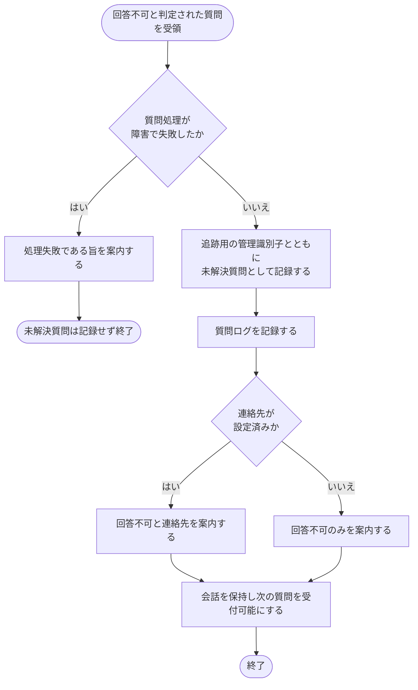

# SYS-002: 回答不可時の未解決質問登録・案内処理

> **このページは、登録済み FAQ で回答できないと判定された質問を未解決質問として記録し、ウィジェット利用者へ回答不可と連絡先を案内するシステム処理 SYS-002 を定義します。**

*種別 システム設計 ・ 優先度 P0 ・ ステータス ドラフト*

| ID | 業務ユースケースID | API ID | テーブルID |
|----|----|----|----|
| SYS-002 | [UC-049](../../../01_requirements/04_business_usecases/UC-049.md#UC-049) | [API-039](../03_apis/API-039.md#API-039) | [TBL-017](../04_database/TBL-017.md#TBL-017) ・ [TBL-025](../04_database/TBL-025.md#TBL-025) |

| 処理名 | 種別 | トリガー / スケジュール |
|----|----|----|
| 回答不可時の未解決質問登録・案内処理 | async | FAQ ベースで回答不可と判定された時 |

## 1. 処理概要

- ウィジェット利用者の質問が登録済み FAQ では回答できないと判定された際に、その質問を追跡用の管理識別子とともに未解決質問として記録し、回答できなかった旨と連絡先(設定済みの場合)をウィジェット利用者へ案内する。
- 質問処理そのものが障害で失敗した場合は、未解決質問として記録せず処理失敗である旨のみを案内し、回答不可の未解決質問とは区別して扱う。

## 2. 処理フロー図

## 3. 入出力

| 区分 | 内容 |
|---|---|
| 入力ソース | ウィジェットからの未解決質問登録要求(回答不可と判定された質問・追跡用の管理識別子・連絡先設定状況) |
| 出力先 | 未解決質問の記録 ・ 質問ログの記録 ・ ウィジェット利用者への回答不可案内(連絡先併記は設定時) |

## 4. 処理項目定義

| 項目 ID | ステップ | 説明 | 種別 | 実行条件 |
|---|---|---|---|---|
| `PR-01` | 障害判定 | 質問処理そのものが障害で失敗したかを判定し、未解決質問の記録対象か処理失敗案内対象かを振り分ける | 判定 | — |
| `PR-02` | 未解決質問記録 | 回答できなかった質問を追跡用の管理識別子とともに未解決質問として記録する | 記録 | 障害でない |
| `PR-03` | 質問ログ記録 | 当該質問のやり取りを質問ログとして記録する | 記録 | 障害でない |
| `PR-04` | 連絡先判定 | 案内に併記する連絡先が設定済みかを判定する | 判定 | 障害でない |
| `PR-05` | 回答不可案内 | ウィジェット利用者へ回答できなかった旨を案内し、連絡先設定時は連絡先を併記する(追跡用の管理識別子は提示しない) | 通知 | 障害でない |
| `PR-06` | 会話継続 | 会話のやり取りを保持し、別の質問を引き続き受け付けられる状態にする | 更新 | 障害でない |
| `PR-07` | 処理失敗案内 | 未解決質問を記録せず、処理に失敗した旨をウィジェット利用者へ案内する | 例外 | 障害である |

## 5. 入出力一覧

回答不可の質問は未解決質問と質問ログへ記録し、ウィジェットからの登録要求 API を入力として受ける。

| 入出力 | 説明 | 種別 | I/O | CRUD | 参照 |
|---|---|---|---|---|---|
| ウィジェット未解決質問登録 | ウィジェットから回答不可の質問を登録する要求を受け付ける | API | 入力 | — | [API-039](../03_apis/API-039.md#API-039) |
| 未解決質問 | 回答できなかった質問を追跡用の管理識別子とともに記録する | テーブル | 出力 | `C R - -` | [TBL-017](../04_database/TBL-017.md#TBL-017) |
| 質問ログ | 当該質問のやり取りを記録する | テーブル | 出力 | `C R - -` | [TBL-025](../04_database/TBL-025.md#TBL-025) |

## 6. システムイベント一覧

| SEV-ID | イベント ID | 項目 ID | イベント | 処理 |
|---|---|---|---|---|
| SEV-003 | `SE-01` | [PR-02](#PR-02) | 未解決質問登録 | 回答できなかった質問を追跡用の管理識別子とともに未解決質問・質問ログへ記録する |
| SEV-004 | `SE-02` | [PR-05](#PR-05) | 回答不可案内 | ウィジェット利用者へ回答できなかった旨を案内し、連絡先設定時は連絡先を併記する |
