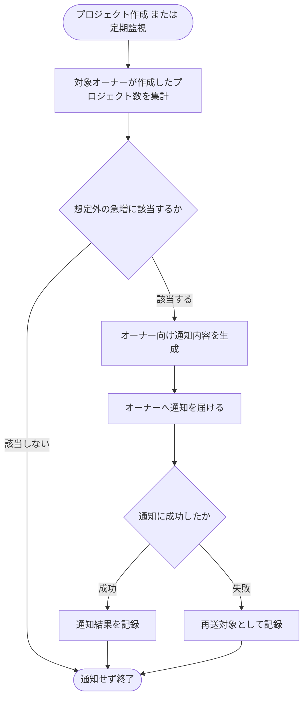

# SYS-002: プロジェクト数急増検知通知

> **このページは、オーナーごとの作成プロジェクト数を監視し、想定外の急増を検知してオーナーへ通知するシステム処理 SYS-002 を定義します。**

*種別 システム設計 ・ 優先度 P0 ・ ステータス ドラフト*

| ID | 処理名 | 種別 | トリガー / スケジュール |
|----|----|----|----| 
| SYS-002 | プロジェクト数急増検知通知 | monitor | プロジェクト作成時 + 定期監視 |

| 関連項目 | 内容 |
|----|----| 
| 業務ユースケース | [UC-049](../../../01_requirements/04_business_usecases/UC-049.md#UC-049) |
| 関連システム | — |
| API | — |
| テーブル | [TBL-004](../04_database/TBL-004.md#TBL-004) / [TBL-022](../04_database/TBL-022.md#TBL-022) / [TBL-026](../04_database/TBL-026.md#TBL-026) / [TBL-028](../04_database/TBL-028.md#TBL-028) |

## 1. 処理概要

- プロジェクト数に固定上限を設けず、オーナーごとに作成したプロジェクト数を監視する処理である。
- プロジェクトの新規作成や定期的な監視を契機に対象オーナーが作成したプロジェクト数を集計する。
- 想定外の急激な増加に該当するかを急増判定のしきい値 [RULE-024](../../../01_requirements/01_business_requirement/08_rule.md#RULE-024) に従って評価して、該当時にオーナーへ通知する。

## 2. 処理フロー図

## 3. 入出力

| 区分 | 内容 |
|---|---|
| 入力ソース | プロジェクトの新規作成イベント / 定期監視スケジュール / 対象オーナーが作成したプロジェクト数 |
| 出力先 | オーナーへの受信箱通知 / 通知ログ / 再送対象記録(例外時) |

## 4. 処理項目定義

| 項目 ID | ステップ | 説明 | 種別 | 実行条件 |
|---|---|---|---|---|
| `PR-01` | プロジェクト数集計 | 対象オーナーが作成したプロジェクト数を集計する | 集計 | プロジェクト作成 または 定期監視 |
| `PR-02` | 急増判定 | 集計結果をもとに想定外の急激な増加に該当するかを判定する | 判定 | 集計完了後 |
| `PR-03` | 通知内容生成 | 急増に該当するオーナー向け通知内容を生成する | 通知 | 急増に該当する場合 |
| `PR-04` | オーナー通知 | 生成した通知をオーナーへ届け、通知結果を記録する | 通知 | 通知内容生成後 |
| `PR-05` | 再送対象記録 | 通知の生成または送信に失敗した場合、再送対象として記録する | 例外 | 通知の生成または送信に失敗した場合 |

## 5. 入出力一覧

集計入力はプロジェクトのマスタ、出力は受信箱通知・通知ログ・例外記録である。本処理は無人監視のため画面 API を経由せず、外部 API も呼び出さない。

| 入出力 | 説明 | 種別 | I/O | CRUD | 参照 |
|---|---|---|---|---|---|
| プロジェクト | 対象オーナーが作成したプロジェクト数を集計する読み取り元 | テーブル | 入力 | `- R - -` | [TBL-004](../04_database/TBL-004.md#TBL-004) |
| 受信箱通知 | オーナーへ届ける通知を登録する | テーブル | 出力 | `C - - -` | [TBL-022](../04_database/TBL-022.md#TBL-022) |
| 通知ログ | 通知の送信結果を記録する | テーブル | 出力 | `C - - -` | [TBL-026](../04_database/TBL-026.md#TBL-026) |
| 例外記録 | 通知の生成または送信失敗を記録し再送対象とする | テーブル | 出力 | `C - - -` | [TBL-028](../04_database/TBL-028.md#TBL-028) |
| システム通知メッセージ | オーナーへ届ける通知文面の定義 | 横断 | 出力 | — | [MSG-013](../../06_messages/MSG-013.md#MSG-013) |

## 6. システムイベント一覧

| SEV-ID | イベント ID | 項目 ID | イベント | 処理 |
|---|---|---|---|---|
| SEV-003 | `SE-01` | [PR-01](#PR-01) | プロジェクト数集計・急増判定 | 対象オーナーが作成したプロジェクト数を集計し、想定外の急増に該当するかを判定する |
| SEV-004 | `SE-02` | [PR-04](#PR-04) | オーナー通知 | 急増に該当するオーナーへ通知を届け、通知結果を記録する(失敗時は再送対象として記録) |
