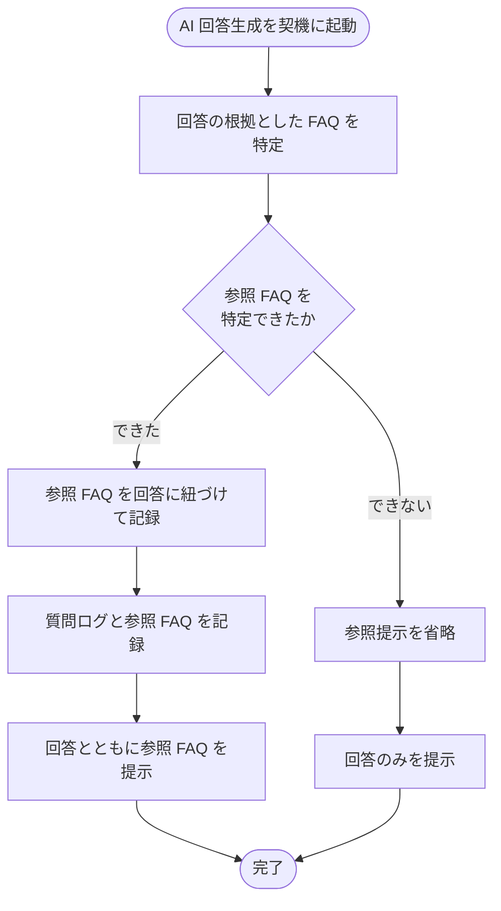

# SYS-003: 参照FAQ記録・提示

> **このページは、AI 回答の根拠とした FAQ を記録し回答とともに参照 FAQ をウィジェット利用者へ提示するシステム処理 SYS-003 を定義します。** 処理概要 / 処理フロー図 / 入出力 / 処理項目定義 / 入出力一覧 / システムイベント一覧 の 6 セクションで記述します。

*種別 システム設計 ・ 優先度 P0 ・ ステータス ドラフト*

## 1. 処理概要

ウィジェット利用者の質問に対する AI 回答生成に付随し、回答の根拠とした参照 FAQ を回答に紐づけて記録し、回答とともに参照 FAQ を提示する。参照 FAQ を特定できない場合は提示を省略し回答のみを返す。

| システム ID | 処理名 | 種別 | トリガー / スケジュール | 機能概要 |
|---|---|---|---|---|
| `SYS-003` | 参照FAQ記録・提示 | async | ウィジェット質問への AI 回答生成時 | 回答の根拠 FAQ を特定・記録し、回答とともに参照 FAQ を提示する |

| 関連 | 内容 |
|---|---|
| 機能要件 (FR) | [FR-060](../../../01_requirements/02_functional_requirement/02_faq-ai-fr.md#FR-060) |
| 業務要件 (BR) | [BR-037](../../../01_requirements/01_business_requirement/02_faq-ai-br.md#BR-037) |
| 業務ルール (RULE) | — |
| 関連システム | — |
| 対応業務UC | [UC-053](../../../01_requirements/04_business_usecases/UC-053.md#UC-053) |

## 2. 処理フロー図

## 3. 入出力

| 区分 | 内容 |
|---|---|
| 入力ソース | ウィジェット質問送信に伴う AI 回答生成(質問内容・生成された回答・根拠 FAQ 候補) |
| 出力先 | 質問ログ・参照 FAQ の記録、ウィジェット利用者への回答および参照 FAQ 提示 |

## 4. 処理項目定義

| 項目 ID | ステップ | 説明 | 種別 | 実行条件 |
|---|---|---|---|---|
| `PR-01` | 根拠 FAQ 特定 | 生成された回答の根拠として利用した FAQ を特定する | 判定 | — |
| `PR-02` | 質問ログ記録 | 質問内容と回答の応答内容を質問ログとして記録する | 記録 | — |
| `PR-03` | 参照 FAQ 記録 | 特定した参照 FAQ を回答(質問ログ)に紐づけて記録する | 記録 | 参照 FAQ を特定できたとき |
| `PR-04` | 参照 FAQ 提示 | 回答とともに参照 FAQ をウィジェット利用者へ提示する | 通知 | 参照 FAQ を特定できたとき |
| `PR-05` | 参照提示省略 | 参照 FAQ を特定できない場合は提示を省略し回答のみを提示する | 例外 | 参照 FAQ を特定できないとき |

## 5. 入出力一覧

本処理が参照・記録する FAQ・質問ログ・参照 FAQ と、付随契機となる API を示す。

| 入出力 | 説明 | 種別 | I/O | CRUD | 参照 |
|---|---|---|---|---|---|
| ウィジェット質問送信 | AI 回答生成の付随契機となる質問応答 API | API | 入力 | — | [API-038](../03_apis/API-038.md#API-038) |
| FAQ | 回答の根拠 FAQ を特定するため参照する | テーブル | 入力 | `- R - -` | [TBL-006](../04_database/TBL-006.md#TBL-006) |
| 質問ログ | 質問と回答を質問ログとして記録する | テーブル | 出力 | `C - - -` | [TBL-025](../04_database/TBL-025.md#TBL-025) |
| 参照 FAQ | 回答に紐づく参照 FAQ(M:N)を記録する | テーブル | 出力 | `C - - -` | [TBL-016](../04_database/TBL-016.md#TBL-016) |

## 6. システムイベント一覧

| SEV-ID | イベント ID | 項目 ID | イベント | 処理 |
|---|---|---|---|---|
| [SEV-005](../02_system_events/SEV-005.md#SEV-005) | `SE-01` | [PR-03](#PR-03) | 参照 FAQ 記録 | 回答の根拠とした参照 FAQ を質問ログに紐づけて記録する |
| [SEV-006](../02_system_events/SEV-006.md#SEV-006) | `SE-02` | [PR-04](#PR-04) | 参照 FAQ 提示 | 回答とともに参照 FAQ をウィジェット利用者へ提示する |
