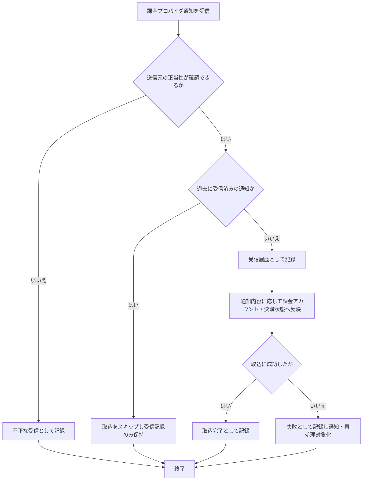

# SYS-004: 課金プロバイダ通知の受信・検証・取込

> **このページは、課金プロバイダから届く決済・課金アカウント状態の通知を、なりすましや重複を防ぎながら受信して取り込み、失敗時に再処理できるよう記録・通知するシステム処理 SYS-004 を定義します。**

*種別 システム設計 ・ 優先度 P0 ・ ステータス ドラフト*

| ID | 業務ユースケースID | API ID | テーブルID |
|----|----|----|----|
| SYS-004 | [UC-056](../../../01_requirements/04_business_usecases/UC-056.md#UC-056) | [API-060](../03_apis/API-060.md#API-060) | [TBL-002](../04_database/TBL-002.md#TBL-002) ・ [TBL-018](../04_database/TBL-018.md#TBL-018) ・ [TBL-019](../04_database/TBL-019.md#TBL-019) ・ [TBL-027](../04_database/TBL-027.md#TBL-027) ・ [TBL-032](../04_database/TBL-032.md#TBL-032) |

| 処理名 | 種別 | トリガー / スケジュール |
|----|----|----|
| 課金プロバイダ通知の受信・検証・取込 | webhook | 課金プロバイダからの HTTP 通知受信時 |

## 1. 処理概要

- 課金プロバイダから送られる決済・課金アカウント状態の通知を受信し、送信元の正当性を検証したうえで取り込む。
- 検証を通過した通知のみを受信履歴として記録し、課金アカウント状態・サブスクリプション・請求書へ反映する。
- 重複した通知は二重処理を防いで受信記録のみ残し、取込に失敗した通知は失敗として記録・通知し再処理の対象とする。
- 重複受信の判定には冪等性キー `(provider, event_id)` を用いる。これは受信ログ [TBL-032](../04_database/TBL-032.md#TBL-032) `T_BILLING_WEBHOOK_LOG` の一意制約 `uq_billing_wh_event` を正本とする。
- 既に同一キーで受信済みの通知は課金アカウント・決済状態への反映を行わず、受信記録のみを残して取込をスキップする(`status = 'skipped'`)。
- 冪等性の照合有効期間は受信ログの保持期間(`received_at` 起点。保持期間経過分は物理削除)に準拠する。

## 2. 処理フロー図

## 3. 入出力

| 区分 | 内容 |
|---|---|
| 入力ソース | 課金プロバイダからの決済・課金アカウント状態通知(外部 HTTP 通知) |
| 出力先 | 受信履歴の記録、課金アカウント状態・サブスクリプション・請求書への反映、失敗時の運用通知 |

## 4. 処理項目定義

| 項目 ID | ステップ | 説明 | 種別 | 実行条件 |
|---|---|---|---|---|
| `PR-01` | 受信・署名検証 | 課金プロバイダからの通知を受信し、送信元の正当性を検証する。検証に失敗した通知は不正な受信として記録し取り込まない | 判定 | 通知受信時 |
| `PR-02` | 重複排除 | 過去に受信済みの通知でないかを冪等性キー `(provider, event_id)`([TBL-032](../04_database/TBL-032.md#TBL-032) の一意制約 `uq_billing_wh_event` を正本)で照合し、重複した通知は取込をスキップして受信記録のみ残す(二重処理を防ぐ)。照合の有効期間は受信ログの保持期間に準拠する | 判定 | 署名検証を通過 |
| `PR-03` | 受信履歴の記録 | 受信した通知を一定期間の受信履歴として記録する | 記録 | 重複でない通知 |
| `PR-04` | 課金アカウント・決済状態への反映 | 通知内容に応じて決済状態・課金アカウント状態を取り込み、サービス内の課金アカウント・サブスクリプション・請求書へ反映する | 更新 | 受信履歴の記録後 |
| `PR-05` | 取込完了の記録 | 反映に成功した通知を取込完了として記録する | 記録 | 反映に成功 |
| `PR-06` | 失敗記録・通知・再処理対象化 | 反映に失敗した通知を失敗として記録・通知し、後から再処理できる状態にする | 例外 | 反映に失敗 |

## 5. 入出力一覧

各処理項目が読み書きする外部 IF・テーブルの対応を示す。

| 入出力 | 説明 | 種別 | I/O | CRUD | 参照 |
|---|---|---|---|---|---|
| 課金プロバイダ通知 | 課金プロバイダからの決済・課金アカウント状態通知を受信する受信エンドポイント | API | 入力 | — | [API-060](../03_apis/API-060.md#API-060) |
| 受信ログ | 受信した通知の検証結果・取込状態を一定期間の履歴として記録する | テーブル | 出力 | `C R U -` | [TBL-032](../04_database/TBL-032.md#TBL-032) |
| 課金アカウント | 決済・課金アカウント状態の変化を課金アカウントへ反映する | テーブル | 出力 | `- R U -` | [TBL-002](../04_database/TBL-002.md#TBL-002) |
| サブスクリプション | サブスクリプションの状態を反映する | テーブル | 出力 | `- R U -` | [TBL-018](../04_database/TBL-018.md#TBL-018) |
| 請求書 | 請求書の発行・支払状態を反映する | テーブル | 出力 | `C R U -` | [TBL-019](../04_database/TBL-019.md#TBL-019) |
| 取込失敗の運用通知 | 取込に失敗した通知を運用者へ知らせる | 横断 | 出力 | — | [MSG-013](../../06_messages/MSG-013.md#MSG-013) |

## 6. システムイベント一覧

| SEV-ID | イベント ID | 項目 ID | イベント | 処理 |
|---|---|---|---|---|
| SEV-006 | `SE-01` | [PR-01](#PR-01) | 受信検証 | 通知を受信し送信元の正当性を検証する。検証に失敗した通知は不正な受信として記録し取り込まない |
| SEV-007 | `SE-02` | [PR-05](#PR-05) | 取込完了 | 重複排除・受信記録を経て課金アカウント・決済状態への反映に成功した通知を取込完了として記録する |
| SEV-008 | `SE-03` | [PR-06](#PR-06) | 取込失敗 | 反映に失敗した通知を失敗として記録・通知し、再処理の対象とする |
