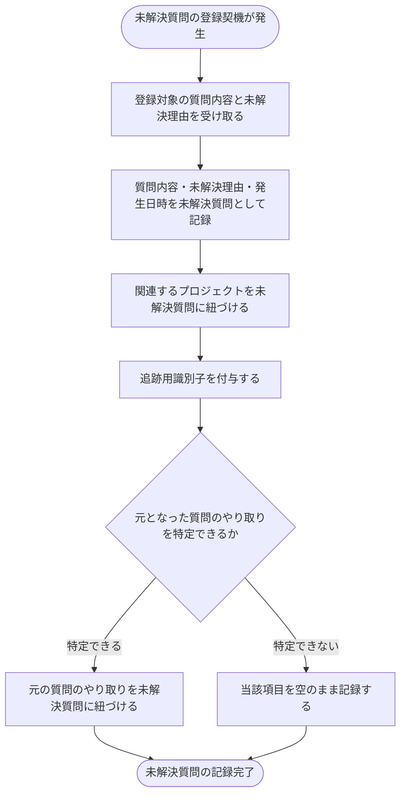

# SYS-005: 未解決質問の記録

> **このページは、未解決質問の登録契機が発生したときに、後の調査と FAQ 改善・サポート対応に必要な項目と追跡用識別子を未解決質問へ記録するシステム処理 SYS-005 を定義します。** 処理概要 / 処理フロー図 / 入出力 / 処理項目定義 / 入出力一覧 / システムイベント一覧 の 6 セクションで記述します。

*種別 システム設計 ・ 優先度 P0 ・ ステータス ドラフト*

## 1. 処理概要

未解決質問の登録契機が発生すると、システムは質問内容・未解決理由・発生日時を未解決質問として記録し、関連プロジェクトと元となった質問のやり取りを紐づけ、追跡用識別子を付与する。記録された未解決質問は、後続の調査・FAQ 改善・サポート対応の対象となる。

| システム ID | 処理名 | 種別 | トリガー / スケジュール | 機能概要 |
|---|---|---|---|---|
| `SYS-005` | 未解決質問の記録 | async | 未解決質問の登録時 | 質問内容・未解決理由・発生日時・関連プロジェクト・関連する質問のやり取り・追跡用識別子を未解決質問へ記録する |

| 関連 | 内容 |
|---|---|
| 機能要件 (FR) | [FR-070](../../../01_requirements/02_functional_requirement/02_faq-ai-fr.md#FR-070) |
| 業務要件 (BR) | [BR-045](../../../01_requirements/01_business_requirement/02_faq-ai-br.md#BR-045) |
| 業務ルール (RULE) | — |
| 関連システム | — |
| 対応業務UC | [UC-055](../../../01_requirements/04_business_usecases/UC-055.md#UC-055) |

## 2. 処理フロー図

## 3. 入出力

| 区分 | 内容 |
|---|---|
| 入力ソース | 未解決質問の登録契機(システムが回答できなかった、または利用者が未解決と申告した等)と、その質問内容・未解決理由 |
| 出力先 | 未解決質問の記録(関連プロジェクト・関連する質問のやり取り・追跡用識別子を含む)、および FAQ 化履歴での後続追跡の起点 |

## 4. 処理項目定義

| 項目 ID | ステップ | 説明 | 種別 | 実行条件 |
|---|---|---|---|---|
| `PR-01` | 登録契機の受領 | 未解決質問の登録契機を受け取り、登録対象の質問内容と未解決理由を取得する | 判定 | 登録契機の発生時 |
| `PR-02` | 質問内容の記録 | 質問内容・未解決理由・発生日時を未解決質問として記録する | 記録 | — |
| `PR-03` | プロジェクト紐づけ | 関連するプロジェクトを未解決質問に紐づける | 更新 | — |
| `PR-04` | 追跡用識別子付与 | 後の調査・改善・サポート対応をたどるための追跡用識別子を付与する | 記録 | — |
| `PR-05` | 質問のやり取り紐づけ | 元となった質問のやり取りを未解決質問に紐づける | 更新 | 元のやり取りを特定できる場合 |
| `PR-06` | やり取り欠落時の記録 | 元の質問のやり取りを特定できない場合、当該項目を空のまま記録する | 例外 | 元のやり取りを特定できない場合 |

## 5. 入出力一覧

本処理が読み書きする主なテーブルです。

| 入出力 | 説明 | 種別 | I/O | CRUD | 参照 |
|---|---|---|---|---|---|
| 未解決質問 | 質問内容・未解決理由・発生日時・関連プロジェクト・関連する質問のやり取り・追跡用識別子を記録する | テーブル | 出力 | `C - U -` | [TBL-017](../04_database/TBL-017.md#TBL-017) |
| 未解決質問 FAQ 化履歴 | 後続の FAQ 改善追跡の起点として履歴を保持する | テーブル | 出力 | `C R - -` | [TBL-029](../04_database/TBL-029.md#TBL-029) |
| ウィジェット未解決質問登録 | ウィジェット利用者の申告による登録契機を受け付ける | API | 入力 | — | [API-039](../03_apis/API-039.md#API-039) |

## 6. システムイベント一覧

| SEV-ID | イベント ID | 項目 ID | イベント | 処理 |
|---|---|---|---|---|
| SEV-009 | `SE-01` | [PR-02](#PR-02) | 未解決質問の記録 | 質問内容・未解決理由・発生日時・関連プロジェクト・関連する質問のやり取り・追跡用識別子を未解決質問へ記録し、FAQ 化履歴の追跡起点とする |
