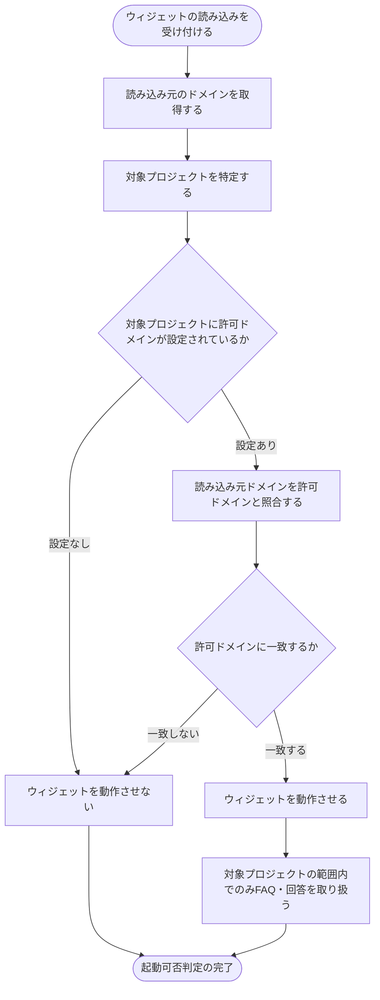

# SYS-007: 許可ドメイン照合によるウィジェット起動可否判定

> **このページは、設置サイトでウィジェットが読み込まれたときに、読み込み元ドメインを対象プロジェクトの許可ドメインと照合し、許可された場合のみウィジェットを動作させるシステム処理 SYS-007 を定義します。**

*種別 システム設計 ・ 優先度 P0 ・ ステータス ドラフト*

| ID | 処理名 | 種別 | トリガー / スケジュール |
|----|----|----|----| 
| SYS-007 | 許可ドメイン照合によるウィジェット起動可否判定 | guard | ウィジェットのロード・起動時 |

| 関連項目 | 内容 |
|----|----| 
| 業務ユースケース | [UC-061](../../../01_requirements/04_business_usecases/UC-061.md#UC-061) |
| 関連システム | — |
| API | [API-037](../03_apis/API-037.md#API-037) |
| テーブル | [TBL-002](../04_database/TBL-002.md#TBL-002) / [TBL-004](../04_database/TBL-004.md#TBL-004) / [TBL-005](../04_database/TBL-005.md#TBL-005) |

## 1. 処理概要

- ウィジェットが設置サイトで読み込まれると、システムは読み込み元のドメインを取得し、対象プロジェクトにあらかじめ登録された許可ドメインと照合する。
- 読み込み元が許可ドメインに一致する場合のみウィジェットを動作させ、対象プロジェクトの範囲内でのみ FAQ・回答を取り扱う。
- 許可ドメインに一致しない場合、および対象プロジェクトに許可ドメインが設定されていない場合は、ウィジェットを動作させず、不正設置や他プロジェクトのデータ参照を防ぐ。

## 2. 処理フロー図

## 3. 入出力

| 区分 | 内容 |
|---|---|
| 入力ソース | 設置サイト上でのウィジェット読み込み(読み込み元ドメインを含む)と、対象プロジェクトに登録された許可ドメイン |
| 出力先 | ウィジェットの起動可否(許可ドメイン上のみ動作)、および対象プロジェクト範囲に限定したFAQ対応の提供 |

## 4. 処理項目定義

| 項目 ID | ステップ | 説明 | 種別 | 実行条件 |
|---|---|---|---|---|
| `PR-01` | 読み込み受付 | 設置サイト上でのウィジェット読み込みを受け付け、読み込み元のドメインと対象プロジェクトを取得する | 判定 | ウィジェット読み込みの発生時 |
| `PR-02` | 許可ドメイン設定確認 | 対象プロジェクトに許可ドメインが設定されているかを確認する | 判定 | — |
| `PR-03` | 許可ドメイン照合 | 読み込み元ドメインを対象プロジェクトの許可ドメインと照合する | 判定 | 許可ドメインが設定されている場合 |
| `PR-04` | 起動許可 | 読み込み元が許可ドメインに一致する場合、ウィジェットを動作させ、対象プロジェクトの範囲内でFAQ対応を提供する | 更新 | 許可ドメインに一致する場合 |
| `PR-05` | 起動拒否 | 読み込み元が許可ドメインに一致しない、または許可ドメインが設定されていない場合、ウィジェットを動作させない | 例外 | 許可ドメイン不一致または未設定の場合 |

## 5. 入出力一覧

本処理が参照する主なテーブルと、起動契機となる API です。

| 入出力 | 説明 | 種別 | I/O | CRUD | 参照 |
|---|---|---|---|---|---|
| ウィジェット起動 | 設置サイトでの読み込みを受け付け、起動可否判定の契機となる | API | 入力 | — | [API-037](../03_apis/API-037.md#API-037) |
| プロジェクト | 対象プロジェクトを特定し、データ範囲の隔離単位を確定する | テーブル | 入力 | `- R - -` | [TBL-004](../04_database/TBL-004.md#TBL-004) |
| 許可ドメイン | 対象プロジェクトに登録された許可ドメインを照合対象として参照する | テーブル | 入力 | `- R - -` | [TBL-005](../04_database/TBL-005.md#TBL-005) |

## 6. システムイベント一覧

| SEV-ID | イベント ID | 項目 ID | イベント | 処理 |
|---|---|---|---|---|
| SEV-013 | `SE-01` | [PR-03](#PR-03) | 許可ドメイン照合 | 読み込み元ドメインを対象プロジェクトの許可ドメインと照合し、起動可否を判定する |
| SEV-014 | `SE-02` | [PR-04](#PR-04) | 許可ドメイン上での起動 | 読み込み元が許可ドメインに一致する場合のみウィジェットを動作させ、対象プロジェクトの範囲内でFAQ・回答を取り扱う |
