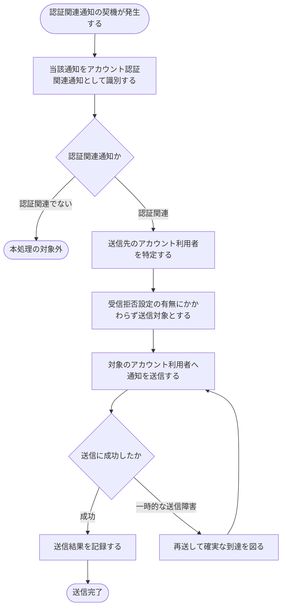

# SYS-008: アカウント認証関連通知のオプトアウト不可送信

> **このページは、パスワード再設定などアカウント認証に関わる重要通知を、利用者の受信拒否設定を無視して対象本人へ確実に届けるシステム処理 SYS-008 を定義します。**

*種別 システム設計 ・ 優先度 P0 ・ ステータス ドラフト*

| ID | 処理名 | 種別 | トリガー / スケジュール |
|----|----|----|----| 
| SYS-008 | アカウント認証関連通知のオプトアウト不可送信 | notify | 認証関連イベント(メール確認・パスワード再設定・ロックアウト等)の発生時 |

| 関連項目 | 内容 |
|----|----| 
| 業務ユースケース | [UC-068](../../../01_requirements/04_business_usecases/UC-068.md#UC-068) |
| 関連システム | — |
| API | [API-058](../03_apis/API-058.md#API-058) |
| テーブル | [TBL-022](../04_database/TBL-022.md#TBL-022) / [TBL-026](../04_database/TBL-026.md#TBL-026) |

## 1. 処理概要

- アカウント認証に関わる通知(メールアドレス確認・パスワード再設定・ロックアウト通知など)は、本人のアカウント保護に不可欠なため、システムはこれらを受信拒否(オプトアウト)の対象外として扱う。
- 認証関連の通知契機が発生すると、システムは当該通知を認証関連通知として識別し、利用者が受信拒否を設定していても送信対象から外さず、対象のアカウント利用者へ確実に送信する。
- 送信は配信用の連携先を介して行い、送信の結果(成否)を記録する。
- 一時的な送信障害で届かなかった場合は再送して確実な到達を図り、なりすましや乗っ取りのリスクから利用者を守る。

## 2. 処理フロー図

## 3. 入出力

| 区分 | 内容 |
|---|---|
| 入力ソース | 認証関連通知の契機(メールアドレス確認・パスワード再設定・ロックアウト等)と、対象のアカウント利用者・送信先 |
| 出力先 | 対象本人への通知送信、受信箱への配置、送信結果(成否)の記録 |

## 4. 処理項目定義

| 項目 ID | ステップ | 説明 | 種別 | 実行条件 |
|---|---|---|---|---|
| `PR-01` | 通知契機受付 | 認証関連通知の契機を受け付け、対象のアカウント利用者と送信先を特定する | 判定 | 認証関連通知の契機の発生時 |
| `PR-02` | 認証関連識別 | 当該通知をアカウント認証関連通知として識別する | 判定 | — |
| `PR-03` | オプトアウト不可判定 | 認証関連通知を受信拒否(オプトアウト)の対象外と判定し、利用者の受信拒否設定にかかわらず送信対象とする | 判定 | 認証関連通知と識別された場合 |
| `PR-04` | 通知送信 | 配信用の連携先を介して、対象のアカウント利用者へ通知を送信し、本人の受信箱にも配置する | 通知 | 送信対象とされた場合 |
| `PR-05` | 結果記録 | 送信の結果(成否)を記録する | 記録 | 送信を試みた場合 |
| `PR-06` | 再送 | 一時的な送信障害で届かなかった場合、再送して確実な到達を図る | 例外 | 一時的な送信障害が発生した場合 |

## 5. 入出力一覧

本処理が利用する配信用の連携先と、送信結果・受信箱の記録先です。

| 入出力 | 説明 | 種別 | I/O | CRUD | 参照 |
|---|---|---|---|---|---|
| メール配信 IF | 配信用の連携先を介して認証関連通知を対象本人へ送信する | API | 出力 | — | [API-058](../03_apis/API-058.md#API-058) |
| 受信箱 | 対象のアカウント利用者の受信箱へ認証関連通知を配置する | テーブル | 出力 | `C - - -` | [TBL-022](../04_database/TBL-022.md#TBL-022) |
| 通知ログ | 認証関連通知の送信結果(成否)を記録する | テーブル | 出力 | `C - U -` | [TBL-026](../04_database/TBL-026.md#TBL-026) |

## 6. システムイベント一覧

| SEV-ID | イベント ID | 項目 ID | イベント | 処理 |
|---|---|---|---|---|
| SEV-015 | `SE-01` | [PR-03](#PR-03) | オプトアウト不可判定 | 認証関連通知を受信拒否の対象外と判定し、利用者の受信拒否設定にかかわらず送信対象とする |
| SEV-016 | `SE-02` | [PR-04](#PR-04) | 認証関連通知の送信 | 配信用の連携先を介して対象本人へ通知を送信し、受信箱に配置して送信結果を記録する |
