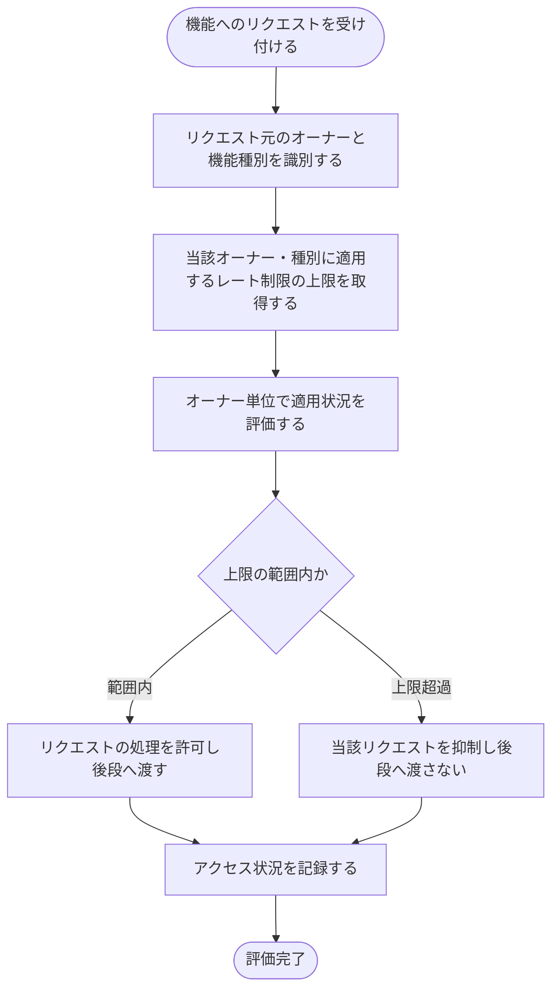

# SYS-008: オーナー単位レート制限の適用

> **このページは、各機能へのリクエストにオーナー・機能種別ごとのレート制限をオーナー単位で適用し、DDoS・Bot・暴走による過負荷から防御するシステム処理 SYS-008 を定義します。**

*種別 システム設計 ・ 優先度 P0 ・ ステータス ドラフト*

| ID | 業務ユースケースID | API ID | テーブルID |
|----|----|----|----|
| SYS-008 | [UC-071](../../../01_requirements/04_business_usecases/UC-071.md#UC-071) | — | [TBL-008](../04_database/TBL-008.md#TBL-008) ・ [TBL-009](../04_database/TBL-009.md#TBL-009) ・ [TBL-027](../04_database/TBL-027.md#TBL-027) ・ [TBL-028](../04_database/TBL-028.md#TBL-028) |

| 処理名 | 種別 | トリガー / スケジュール |
|----|----|----|
| オーナー単位レート制限の適用 | guard | 機能リクエスト受信時(全 API 横断・ゲートウェイ層) |

## 1. 処理概要

- サービスの可用性とオーナー間の公平な利用を守るため、システムは各機能へのリクエストが発生するたびに、オーナー・機能種別ごとに定めたレート制限をオーナー単位で評価する。
- リクエストを受け付けると、システムはリクエスト元のオーナーと機能種別を識別し、当該オーナー・種別に適用される上限を評価する。
- 上限の範囲内であればリクエストの処理を許可し、上限を超過していれば当該リクエストを抑制して後段の業務処理へ渡さない。
- 評価の都度アクセス状況を記録し、超過の抑制は記録として残して濫用の検知につなげる。
- 本処理はゲートウェイ層で全 API 横断に作用し、特定の機能 API に結線しない。
- レート制限はオーナー単位での適用とし、プロジェクト単位化(月次の上限件数・無料枠を除く)の対象外とする。

## 2. 処理フロー図

## 3. 入出力

| 区分 | 内容 |
|---|---|
| 入力ソース | 各機能へのリクエスト(リクエスト元のオーナー・機能種別)、オーナー・種別別に定めたレート制限の上限 |
| 出力先 | リクエスト処理の許可 / 抑制、アクセス状況(評価結果・超過抑制)の記録 |

## 4. 処理項目定義

| 項目 ID | ステップ | 説明 | 種別 | 実行条件 |
|---|---|---|---|---|
| `PR-01` | リクエスト識別 | 機能リクエストを受け付け、リクエスト元のオーナーと機能種別を識別する | 判定 | 機能リクエストの受信時 |
| `PR-02` | 上限取得 | 当該オーナー・種別に適用するレート制限の上限を取得する | 集計 | オーナー・機能種別を識別できた場合 |
| `PR-03` | 制限評価 | 取得した上限に対し、オーナー単位で適用状況を評価して上限の範囲内か超過かを判定する | 判定 | 上限を取得できた場合 |
| `PR-04` | リクエスト許可 | 上限の範囲内であればリクエストの処理を許可し、後段の業務処理へ渡す | 更新 | 上限の範囲内と判定された場合 |
| `PR-05` | リクエスト抑制 | 上限を超過していれば当該リクエストを抑制し、後段へ渡さない | 例外 | 上限を超過したと判定された場合 |
| `PR-06` | アクセス記録 | 評価結果に応じてアクセス状況を記録し、超過の抑制を濫用検知につなげる | 記録 | 評価を行った場合 |

## 5. 入出力一覧

本処理はゲートウェイ層で全 API 横断に作用するため、特定の機能 API には結線しない。レート制限の上限はマスタを参照し、超過抑制とアクセス状況は記録先へ残す。

| 入出力 | 説明 | 種別 | I/O | CRUD | 参照 |
|---|---|---|---|---|---|
| 機能リクエスト | 各機能へのリクエストを受け付けて評価対象とする(全 API 横断のため特定 API に結線しない) | 横断 | 入力 | — | — |
| オーナー別レート上書き | オーナー・種別ごとに適用する上限の上書き設定を参照する | テーブル | 入力 | `- R - -` | [TBL-008](../04_database/TBL-008.md#TBL-008) |
| プロジェクト別利用設定 | 種別ごとに定めた上限値の基礎設定を参照する | テーブル | 入力 | `- R - -` | [TBL-009](../04_database/TBL-009.md#TBL-009) |
| 監査ログ | オーナー単位レート制限の評価結果(アクセス状況)を記録する | テーブル | 出力 | `C - - -` | [TBL-027](../04_database/TBL-027.md#TBL-027) |
| エラーログ | 上限超過によるリクエスト抑制を記録し濫用検知につなげる | テーブル | 出力 | `C - - -` | [TBL-028](../04_database/TBL-028.md#TBL-028) |
| レート制限超過エラー | 上限超過時に後段へ渡さず HTTP 429 を返す | 横断 | 出力 | — | [ERR-009](../../05_errors/ERR-009.md#ERR-009) |

## 6. システムイベント一覧

| SEV-ID | イベント ID | 項目 ID | イベント | 処理 |
|---|---|---|---|---|
| SEV-015 | `SE-01` | [PR-03](#PR-03) | オーナー単位レート制限の評価 | 当該オーナー・種別の上限を取得し、オーナー単位で適用状況を評価して上限の範囲内か超過かを判定する |
| SEV-016 | `SE-02` | [PR-05](#PR-05) | 上限超過リクエストの抑制 | 上限を超過したリクエストを抑制して後段へ渡さず、超過抑制をアクセス状況として記録する |
