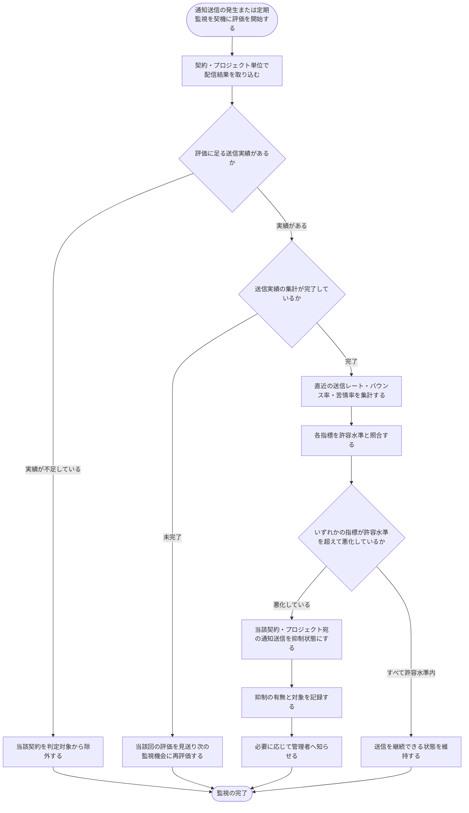

# SYS-009: 送信品質監視による通知送信抑制

> **このページは、契約・プロジェクト単位の送信品質指標を継続的に監視し、許容水準を超えて悪化した場合に通知送信を自動で抑制して送信元ドメインの評判を守るシステム処理 SYS-009 を定義します。** 処理概要 / 処理フロー図 / 入出力 / 処理項目定義 / 入出力一覧 / システムイベント一覧 の 6 セクションで記述します。

*種別 システム設計 ・ 優先度 P0 ・ ステータス ドラフト*

## 1. 処理概要

システムは、通知送信の発生、および定期的な品質監視のタイミングを契機として、契約・プロジェクト単位の送信品質を評価する。配信事業者からの配信結果通知をもとに直近の送信レート・バウンス率・苦情率を集計し、あらかじめ定めた許容水準と照合する。いずれかの指標が許容水準を超えて悪化している場合、当該契約・プロジェクト宛の通知送信を抑制状態にし、抑制の有無と対象を記録したうえで、必要に応じて管理者へ知らせる。すべての指標が許容水準内であれば送信を継続できる状態を維持する。評価に足る送信実績が無い契約は判定対象から除外し、集計が完了していない場合は当該回の評価を見送って次の監視機会に再評価する。これにより、配信事業者からの送信停止や送信元ドメイン全体の評判悪化を未然に防ぐ。

| システム ID | 処理名 | 種別 | トリガー / スケジュール | 機能概要 |
|---|---|---|---|---|
| `SYS-009` | 送信品質監視による通知送信抑制 | monitor | 通知送信時 + 定期の品質監視 | 契約・プロジェクト単位の送信品質指標を監視し、許容水準を超えて悪化した契約の通知送信を自動で抑制する |

| 関連 | 内容 |
|---|---|
| 関連システム | — |
| トレーサビリティID | [TR-069](../../00_traceability/index.md#TR-069) |

## 2. 処理フロー図

## 3. 入出力

| 区分 | 内容 |
|---|---|
| 入力ソース | 通知送信の発生または定期監視のスケジュール、配信事業者からの配信結果通知、契約・プロジェクト単位の送信実績(送信件数・バウンス・苦情) |
| 出力先 | 通知送信の抑制状態への更新、抑制の有無と対象の記録、管理者への通知 |

## 4. 処理項目定義

| 項目 ID | ステップ | 説明 | 種別 | 実行条件 |
|---|---|---|---|---|
| `PR-01` | 配信結果取り込み | 配信事業者からの配信結果通知を取り込み、契約・プロジェクト単位の送信実績へ反映する | 記録 | 配信結果通知の受領時 |
| `PR-02` | 評価対象判定 | 評価に足る送信実績があるかを確認し、実績が不足する契約を判定対象から除外する | 判定 | 評価開始時 |
| `PR-03` | 集計完了確認 | 送信実績の集計が完了しているかを確認し、未完了の場合は当該回の評価を見送る | 判定 | 評価対象の契約に対して |
| `PR-04` | 指標集計 | 契約・プロジェクト単位で直近の送信レート・バウンス率・苦情率を集計する | 集計 | 集計が完了している場合 |
| `PR-05` | 許容水準照合 | 集計した各指標を許容水準と照合し、品質の悪化を判定する | 判定 | 指標集計の完了後 |
| `PR-06` | 送信抑制 | いずれかの指標が許容水準を超えて悪化している場合、当該契約・プロジェクト宛の通知送信を抑制状態にする | 更新 | 指標が許容水準を超えて悪化した場合 |
| `PR-07` | 抑制記録 | 抑制の有無と対象を記録し、後から経緯を追跡できるようにする | 記録 | 送信抑制の実施時 |
| `PR-08` | 管理者通知 | 抑制を行った旨と対象を、必要に応じて管理者へ知らせる | 通知 | 送信抑制の実施時 |

## 5. 入出力一覧

本処理が参照・更新する主なテーブルと、配信結果の取り込み・管理者通知に用いる外部 IF・メッセージです。

| 入出力 | 説明 | 種別 | I/O | CRUD | 参照 |
|---|---|---|---|---|---|
| 外部Webhook(配信結果通知) | 配信事業者からの配信結果通知を受け取り、送信実績へ反映する契機とする | API | 入力 | — | [API-059](../03_apis/API-059.md#API-059) |
| メール配信IF | 配信事業者への通知送信の窓口で、抑制状態に応じて送信を継続・抑制する | API | 出力 | — | [API-058](../03_apis/API-058.md#API-058) |
| 通知ログ | 契約・プロジェクト単位の送信実績(送信件数・バウンス・苦情)を集計対象として参照する | テーブル | 入力 | `- R - -` | [TBL-026](../04_database/TBL-026.md#TBL-026) |
| 契約 | 評価単位となる契約を特定し、送信可否の状態を反映する | テーブル | 入出力 | `- R U -` | [TBL-002](../04_database/TBL-002.md#TBL-002) |
| メールサプレスリスト | 抑制対象を登録し、以後の通知送信を抑制状態にする | テーブル | 出力 | `C R U -` | [TBL-007](../04_database/TBL-007.md#TBL-007) |
| システム通知メール | 抑制を行った旨と対象を管理者へ知らせるメールテンプレート | メッセージ | 出力 | — | [MSG-013](../../06_messages/MSG-013.md#MSG-013) |

## 6. システムイベント一覧

| SEV-ID | イベント ID | 項目 ID | イベント | 処理 |
|---|---|---|---|---|
| SEV-017 | `SE-01` | [PR-05](#PR-05) | 送信品質の評価 | 契約・プロジェクト単位で直近の送信レート・バウンス率・苦情率を集計し、各指標を許容水準と照合して品質の悪化を判定する |
| SEV-018 | `SE-02` | [PR-06](#PR-06) | 通知送信の抑制 | 許容水準を超えて悪化した契約・プロジェクト宛の通知送信を抑制状態にし、抑制の有無と対象を記録して必要に応じて管理者へ知らせる |
